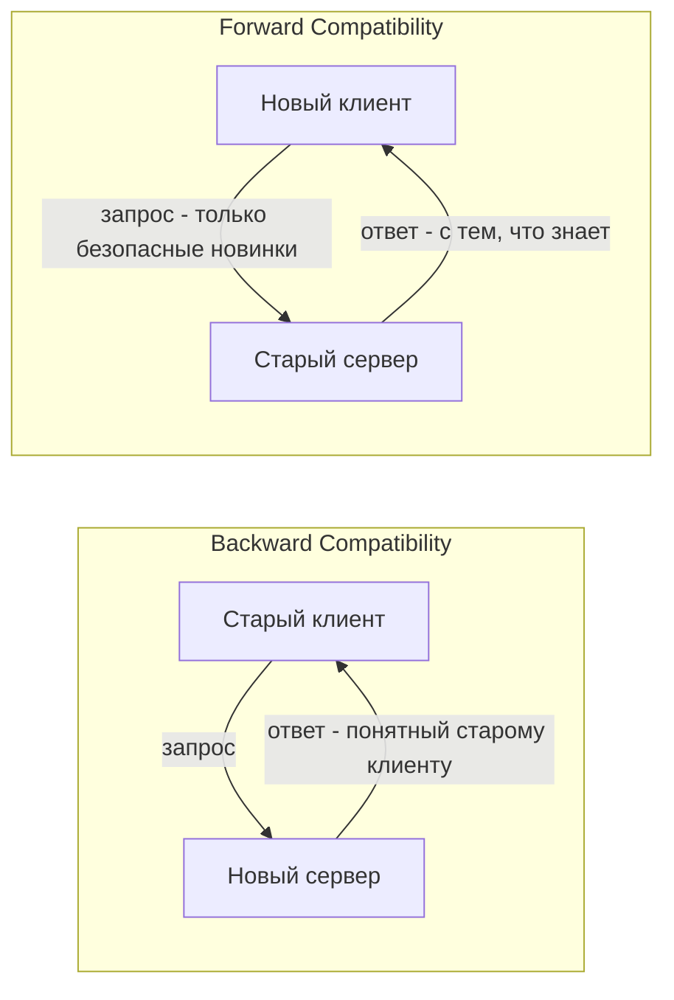

## Backward / Forward Compatibility: как менять API, не ломая клиентов

В мире API нет понятия "закончил разработку". API — это живой контракт, который эволюционирует вместе с бизнесом. Добавляются новые поля, меняются правила валидации, появляются новые эндпоинты. Но каждый раз, когда вы меняете API, вы рискуете сломать клиентов, которые на него полагаются.

**Совместимость API** — это способность новой версии API работать со старыми клиентами (обратная совместимость) и способность старых клиентов работать с новой версией API (прямая совместимость). Это две стороны одной медали, и их часто путают.

**Backward Compatibility (обратная совместимость).** Новая версия сервера должна корректно обрабатывать запросы от старых клиентов. Клиент, написанный под версию 1.0, продолжает работать с сервером версии 2.0 без изменений. Это минимальное требование для любого API, у которого есть потребители.

**Forward Compatibility (прямая совместимость).** Старый сервер должен корректно обрабатывать запросы от новых клиентов. Клиент, написанный под версию 2.0 (и использующий новые возможности), при работе со старым сервером версии 1.0 не должен падать. Это более сложное требование, которое часто упускают из виду.



## Backward Compatibility (обратная совместимость)

Новая версия сервера не должна ломать старых клиентов. Это требование возникает всегда, когда у API есть потребители, которые не обновляются одновременно с сервером. А таких потребителей большинство — мобильные приложения пользователей не обновляются мгновенно, другие команды могут не успеть переписать свой код.

### Безопасные изменения (не ломают обратную совместимость)

**1. Добавление нового поля в ответ.** Старый клиент игнорирует незнакомые поля. Это золотое правило REST и JSON: клиенты должны быть устойчивы к появлению новых полей.

```json
// Старый ответ
{ "id": 123, "name": "Иван" }

// Новый ответ (клиент продолжает работать)
{ "id": 123, "name": "Иван", "email": "ivan@example.com", "createdAt": "2024-01-01" }
```

**2. Добавление нового эндпоинта.** Старые клиенты его не вызывают, новые — могут. Безопасно.

**3. Добавление нового необязательного параметра в запрос.** Старый клиент не передает параметр — сервер обрабатывает запрос как обычно. Новый клиент передает — сервер использует новое значение.

```json
// Старый запрос
{ "userId": 123 }

// Новый запрос (сервер, не понимающий includeHistory, игнорирует поле)
{ "userId": 123, "includeHistory": true }
```

**4. Расширение диапазона допустимых значений.** Если раньше поле `status` принимало значения `active` и `inactive`, добавление `suspended` не ломает старых клиентов — они по-прежнему работают с `active` и `inactive`, а новое значение могут игнорировать.

**5. Ослабление валидации.** Если раньше поле `name` требовало минимум 3 символов, а теперь требует 1 символ — старый клиент с именем из 2 символов, который раньше получал ошибку, теперь пройдет валидацию. Это изменение безопасности, но обратную совместимость не нарушает (клиент не ломается).

**6. Изменение порядка полей в JSON.** JSON объекты неупорядочены по спецификации. Клиенты не должны полагаться на порядок полей.

### Разрушающие изменения (ломают обратную совместимость)

**1. Удаление поля из ответа.** Старый клиент ожидает поле, а его нет. Клиент может упасть с ошибкой.

**2. Изменение типа поля.** Если `id` был числом, а стал строкой, старый клиент, ожидающий число, сломается при парсинге.

**3. Добавление обязательного параметра в запрос.** Старый клиент не знает о новом параметре. Его запросы начнут падать с ошибкой валидации.

**4. Сужение диапазона допустимых значений.** Если раньше `status` принимал `active`, `inactive`, `pending`, а теперь только `active` и `inactive` — старые клиенты, отправляющие `pending`, перестанут работать.

**5. Ужесточение валидации.** Если раньше `name` требовал 1 символ, а теперь 3 символа — старый клиент с именем из 2 символов, который раньше работал, начнет получать ошибки.

**6. Изменение семантики (поведения).** Поле не изменилось, но его смысл изменился. Например, `GET /users?active=true` раньше возвращал пользователей с `status = active`, а теперь возвращает пользователей с `last_active > now() - 30 days`. Это самое коварное изменение: API формально не менялся, но клиенты ломаются.

### Техники обеспечения обратной совместимости

**Техника 1: Полевое расширение — принцип "не удаляй, не переименовывай, не меняй тип".** Вместо удаления поля — deprecate (объяви устаревшим) и перестань документировать, но продолжай отдавать некоторое разумное значение. Через год, когда все клиенты перестанут его использовать, можно удалить в мажорной версии.

**Техника 2: Версионирование через URL или заголовки.** Если изменение неизбежно ломает обратную совместимость — выпускайте новую версию API (`/v1/orders` vs `/v2/orders`). Старая версия продолжает работать для старых клиентов.

**Техника 3: Adapter layer (адаптер).** Старый клиент вызывает старый эндпоинт, который внутри преобразует запрос в новый формат, вызывает новую логику, преобразует ответ обратно. Это позволяет мигрировать клиентов постепенно.

**Техника 4: Поле "спросили — получили".** Вместо того чтобы всегда возвращать все поля, клиент запрашивает нужные поля (GraphQL) или использует параметр `fields` в REST. Тогда добавление нового поля не влияет на клиента — он его просто не запрашивает.

## Forward Compatibility (прямая совместимость)

Прямая совместимость — это способность старого сервера работать с новыми клиентами. Это требование возникает, когда клиенты обновляются быстрее сервера (например, веб-приложение, которое деплоится мгновенно) или когда серверов много и они обновляются постепенно (canary deployment, rolling update).

На практике прямая совместимость достигается требованием, чтобы **клиенты были устойчивы к отсутствию новых возможностей**.

### Требования к новым клиентам для прямой совместимости

**1. Клиент не должен требовать новые поля в ответе.** Новый клиент, запрашивая данные со старого сервера, может не получить поля, которые он ожидает. Он должен уметь работать с их отсутствием (использовать значение по умолчанию, игнорировать).

**2. Клиент не должен использовать новые эндпоинты, если работает со старым сервером.** При rollout новой версии клиент должен определять возможности сервера (через version discovery, OPTIONS запрос, заголовок `API-Version`) и использовать только те возможности, которые сервер поддерживает.

**3. Клиент должен передавать только те параметры, которые точно есть в старой версии API.** Добавление нового необязательного параметра безопасно с точки зрения обратной совместимости (старый сервер его игнорирует), но с точки зрения прямой совместимости — старый сервер должен уметь игнорировать неизвестные параметры. К сожалению, не все фреймворки это делают.

**4. Клиент должен быть устойчив к новым полям в ответе.** То же правило, что и для старого клиента: игнорируй незнакомое.

### Пример прямой совместимости в HTTP

Сервер версии 1.0 возвращает:

```json
{ "id": 123, "name": "Иван" }
```

Клиент версии 2.0, разработанный для сервера 2.0, ожидает:

```json
{ "id": 123, "name": "Иван", "email": "ivan@example.com", "avatarUrl": "https://..." }
```

Если этот клиент обращается к старому серверу 1.0, он получает ответ без `email` и `avatarUrl`. Хорошо спроектированный клиент:

- Показывает `email` как "не указан" или скрывает блок с email.
- Не падает с ошибкой при отсутствии поля.
- Логирует предупреждение, что сервер старше ожидаемого.

## Backward и Forward в разных протоколах

### JSON/HTTP (REST)

- **Backward:** легко — клиенты игнорируют новые поля. Основная опасность — удаление полей и изменение типов.
- **Forward:** сложнее — клиенты должны быть терпимы к отсутствию полей. Требует дисциплины от разработчиков клиента.

### gRPC (Protocol Buffers)

- **Backward:** гарантируется правилами Protobuf. Новые поля должны иметь `optional` или `repeated` модификаторы. Удаление поля требует резервирования номера тега.
- **Forward:** также гарантируется. Старый сервер игнорирует новые поля, которые не описаны в его версии `.proto`. Клиент, получив ответ без нового поля, использует значение по умолчанию.

Protobuf здесь выигрывает: правила совместимости жестко закодированы в спецификацию, и компилятор не даст сгенерировать код, нарушающий совместимость.

### GraphQL

- **Backward:** добавление нового поля в тип — совместимо. Удаление поля — несовместимо (клиенты, запрашивающие его, упадут). GraphQL схемы эволюционируют правилами, похожими на Protobuf.
- **Forward:** частично обеспечивается. Клиент может запрашивать поле, которого нет в схеме старого сервера — запрос упадет. Клиент должен использовать динамические фрагменты или запрашивать только базовый набор полей.

## Стратегии управления совместимостью на уровне процесса

**Стратегия 1: Добавляй, но не удаляй (Additive changes only).** Самое простое правило. Любое изменение — только добавление: новые поля, новые эндпоинты, новые необязательные параметры. Безопасно и для backward, и для forward (если клиенты терпимы к отсутствию новых полей). Однако рано или поздно накапливается технический долг в виде устаревших полей.

**Стратегия 2: Версионирование (Versioning).** Каждое breaking change выпускается в новой версии API (`/v1/`, `/v2/`). Старые версии поддерживаются, пока есть клиенты. Это чисто, но создает проблему: версий может накопиться много, и поддержка нескольких версий требует ресурсов.

**Стратегия 3: Deprecation + Sunset policy.** Поле объявляется устаревшим (deprecated) с указанием даты удаления. Клиенты предупреждаются через заголовок `Deprecation` или документацию. Через N месяцев поле удаляется в новой мажорной версии. Это дает клиентам время на миграцию.

**Стратегия 4: Adapter layer внутри сервера.** Сервер поддерживает несколько форматов запросов/ответов одновременно. Старый клиент получает старый формат, новый — новый. Со временем adapter для старого формата можно отключить.

**Стратегия 5: Content negotiation через заголовки.** Клиент указывает ожидаемую версию API в заголовке `Accept: application/vnd.myapi.v2+json`. Сервер возвращает соответствующий формат. Это чище версионирования в URL, но сложнее для отладки.

## Что делать аналитику при проектировании API

При проектировании нового API или изменении существующего аналитик должен зафиксировать правила совместимости в контракте.

**Вопросы, которые нужно задать себе и команде:**

- Какие изменения считаются совместимыми? (Обычно: добавление поля в ответ, добавление необязательного поля в запрос, добавление эндпоинта)
- Какие изменения требуют увеличения минорной версии? (Обычно: добавление функциональности)
- Какие изменения требуют увеличения мажорной версии? (Обычно: удаление поля, изменение типа, изменение семантики, изменение обязательности параметра)
- Как долго поддерживаются старые версии API?
- Как клиенты узнают о депрекейшене? (заголовок `Deprecation`, документация, email-рассылка)
- Что делает клиент при получении незнакомого поля? (игнорирует, логирует, падает?)

**Документирование политики совместимости в контракте:**

```yaml
# В OpenAPI можно указать депрекейшн поля
components:
  schemas:
    User:
      type: object
      properties:
        id:
          type: integer
        name:
          type: string
        old_field:
          type: string
          deprecated: true
          description: "Устарело с версии 2.0. Будет удалено в версии 3.0. Используйте new_field"
        new_field:
          type: string
```

**Для gRPC/Protobuf правила зашиты в синтаксисе:**

```protobuf
message User {
  int32 id = 1;
  string name = 2;
  string old_field = 3 [deprecated = true];
  string new_field = 4;
}
```

## Резюме

Обратная и прямая совместимость — два требования, которые позволяют API эволюционировать без хаоса.

**Backward Compatibility (обратная совместимость).** Новый сервер работает со старыми клиентами.
- Обеспечивается через добавление, а не удаление; через необязательные параметры; через версионирование.
- Нарушается при удалении полей, изменении типов, ужесточении валидации.

**Forward Compatibility (прямая совместимость).** Старый сервер работает с новыми клиентами.
- Обеспечивается через устойчивость клиента к отсутствию новых полей, через discovery возможностей сервера.
- Нарушается, когда клиент требует новые поля или использует новые эндпоинты без проверки.

**Для аналитика ключевое — задокументировать правила совместимости и научить команду их соблюдать.** Лучшее API — то, которое меняется, не заставляя клиентов меняться. Когда это невозможно — версионируйте с уважением к старым клиентам. Худшее, что можно сделать, — изменить API молча, без предупреждения и без версии, оставив клиентов разбираться, почему их код перестал работать.