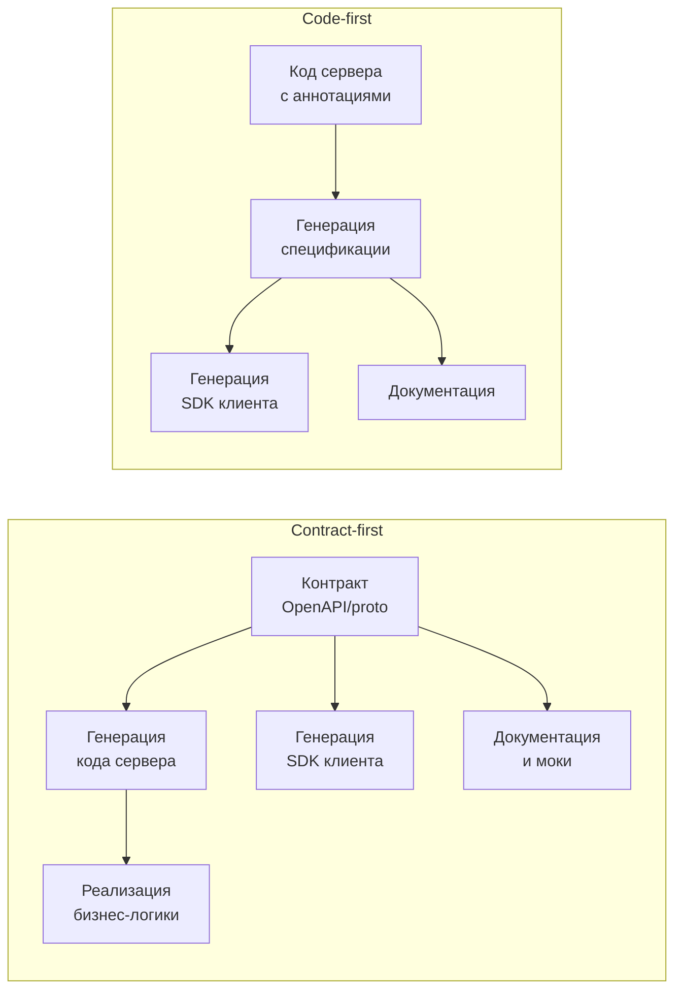

## Contract-first vs Code-first API: две философии проектирования

В разработке API есть два принципиально разных подхода. Первый — сначала создать контракт (спецификацию), затем по нему реализовать код. Второй — сначала написать код, а спецификацию сгенерировать из кода (или вообще не создавать). Выбор между этими подходами определяет не только технический процесс, но и то, кто принимает ключевые решения, как строится коммуникация между командами и как API эволюционирует со временем.

**Contract-first (сначала контракт).** Сначала создается человеко-читаемая спецификация API (обычно OpenAPI, gRPC proto, AsyncAPI, GraphQL schema). Спецификация согласовывается со всеми заинтересованными сторонами — потребителями API, аналитиками, разработчиками, тестировщиками, командой безопасности. Только после того как контракт утвержден, начинается реализация сервера и клиентов. Сервер генерирует скелет кода из контракта, клиенты — SDK.

**Code-first (сначала код).** Разработчик пишет код сервера (контроллеры, роутинг, валидацию), используя аннотации или reflection, спецификация генерируется автоматически из кода. Потребители либо читают сгенерированную документацию, либо подключают SDK, сгенерированный из кода. Изменения в API вносятся изменением кода.

## Contract-first: когда контракт становится артефактом совместной работы

Contract-first выбирают, когда API проектируется как продукт, который будет жить долго, иметь много потребителей и меняться по предсказуемым правилам.

**Ключевые признаки ситуации, когда подходит contract-first:**

- **API будут использовать несколько независимых команд или внешних партнеров.** Каждый потребитель должен иметь стабильную спецификацию, по которой он может начать разработку, даже когда сервер еще не реализован.
- **API критичен для бизнеса и должен быть спроектирован с учетом всех требований до начала разработки.** Ошибка, допущенная на этапе кода, может стоить переписывания нескольких клиентов.
- **Безопасность и валидация должны быть спроектированы явно.** Контракт позволяет заранее определить схемы запросов и ответов, требования к аутентификации, лимиты.
- **Команда следует дисциплине "API as a product".** Контракт — это публичное обещание. Изменения в контракте проходят review, версионируются, депрекейтятся по расписанию.

**Преимущества contract-first:**

- **Параллельная разработка.** Клиент и сервер могут разрабатываться одновременно. Клиент пишется по контракту, используя моки или заглушки. Сервер реализует тот же контракт. Интеграция происходит без сюрпризов.
- **Единый источник истины.** Спецификация — единственное место, где описано API. Нет расхождений между документацией, кодом сервера и кодом клиента. Любое изменение начинается с изменения спецификации.
- **Валидация на границе.** Контракт автоматически генерирует валидаторы входных данных. Ошибка "неприятного типа" отлавливается на уровне фреймворка, а не в бизнес-логике.
- **Дисциплина обратной совместимости.** Когда контракт существует явно, легче отследить, какие изменения совместимы, а какие — нет. Добавление поля — обычно совместимо. Удаление поля — нет. Изменение типа — нет.
- **Упрощение онбординга новых разработчиков.** Новичок читает спецификацию и понимает API, не погружаясь в код сервера.

**Недостатки contract-first:**

- **Дополнительный шаг в разработке.** Изменение API требует сначала изменить спецификацию, сгенерировать код, потом реализовать логику. Это кажется медленнее, чем просто написать код.
- **Сложность для быстрых прототипов.** На ранних стадиях, когда требования еще не стабилизировались, контракт постоянно меняется. Дисциплина версионирования может тормозить.
- **Проблемы с генерацией кода.** Некоторые фреймворки не отлично интегрируются со сгенерированным кодом. Приходится писать адаптеры или обходить ограничения генерации.

**Примеры успешного contract-first:** Публичные API Stripe, Twilio, GitHub — все они имеют строгие спецификации OpenAPI, по которым генерируются официальные SDK на десятках языков. Изменения в этих API анонсируются за месяцы.

## Code-first: когда скорость важнее формальностей

Code-first выбирают, когда API — это внутренний инструмент для ограниченного круга потребителей, требования часто меняются, прототипирование важнее стабильности.

**Ключевые признаки ситуации, когда подходит code-first:**

- **Единственный потребитель API — тот же разработчик или одна команда.** Если клиент и сервер пишут одни и те же люди, overhead контрактного подхода не оправдан.
- **API меняется очень часто.** В процессе разработки требования уточняются, прототип перерабатывается. Каждое изменение контракта в отдельном файле — лишнее движение.
- **API тесно связано с внутренними моделями данных.** Если API почти зеркалирует таблицы базы данных, поддержание отдельной спецификации означает дублирование схемы в двух местах.
- **Проект на стадии MVP.** Гипотеза не проверена, бизнес-модель не сформирована. Инвестиции в строгий контракт могут оказаться напрасными.

**Преимущества code-first:**

- **Скорость.** Изменил модель в коде — аннотации обновили спецификацию автоматически. Никакого синхронизации спецификации и кода.
- **Единообразие с внутренним языком.** Кодовая база определяет и логику, и API. Нет риска рассинхрона между тем, что написано в контракте, и тем, что на самом деле делает сервер.
- **Меньше boilerplate.** Фреймворки (Spring, ASP.NET Core, FastAPI) сами генерируют документацию, валидацию и сериализацию из кода. Разработчику не нужно писать спецификацию вручную.
- **Легко следовать рефакторингам.** Переименовали поле в модели — IDE автоматически обновит аннотации и сгенерированную документацию.

**Недостатки code-first:**

- **Спецификация — вторичный артефакт.** Ее качество зависит от качества аннотаций в коде. Разработчики могут забыть добавить описание поля или указать допустимый диапазон. В результате документация бедная.
- **Сложно согласовывать API до реализации.** Потребитель не может начать разработку, пока сервер не будет хотя бы частично реализован. Моки для API придется делать вручную.
- **Риск "утечки" внутренней модели наружу.** Довольно просто случайно выставить в API поле, которое должно быть внутренним (id базы данных, версия записи и т.д.).
- **Версионирование — боль.** Поскольку спецификация генерируется из кода, любое изменение кода меняет API. Отслеживание обратно совместимых изменений требует дисциплины, которую сложно навязывать через инструменты.

**Примеры code-first:** Большинство внутренних микросервисов в одной компании, где потребители — другие команды, но с возможностью быстро синхронизироваться, часто используют code-first. Также любой прототип, написанный за выходные — code-first.

## Сравнительная таблица

| Аспект | Contract-first | Code-first |
| :--- | :--- | :--- |
| **Когда создается спецификация** | До начала реализации | В процессе или после реализации (генерируется из кода) |
| **Кто принимает решения о структуре API** | Аналитики, архитекторы, потребители API | Разработчик, пишущий сервер |
| **Возможность параллельной разработки клиента и сервера** | Да, по контракту можно делать моки | Нет, клиент ждет реализации сервера (хотя можно сделать мок вручную) |
| **Сложность поддержки обратной совместимости** | Низкая (спецификация явная, изменения контролируются) | Высокая (изменение кода меняет API, легко сломать случайно) |
| **Скорость прототипирования** | Низкая (нужно составить спецификацию) | Высокая (пишется код) |
| **Качество документации** | Высокое (спецификация пишется как документ) | Зависит от культуры (аннотации могут быть скудными) |
| **Риск рассинхрона спецификации и реализации** | Низкий (спецификация — источник истины, код генерируется) | Высокий (спецификация генерируется из кода, но никто не проверяет правильность аннотаций) |
| **Типичные примеры** | Публичные API, API для внешних партнеров, долгоживущие платформы | Внутренние микросервисы, MVP, быстрые прототипы |

## Инструменты для каждого подхода

**Contract-first инструменты:**

- **OpenAPI (Swagger).** OpenAPI Specification + Swagger Editor + Swagger Codegen. Позволяет создавать спецификацию в YAML/JSON, генерировать код сервера (Java, Python, Go, Node.js), SDK клиента, документацию.
- **AsyncAPI.** Аналог OpenAPI для асинхронных API (Kafka, MQTT, WebSocket).
- **Protocol Buffers (gRPC).** Спецификация в `.proto` файлах, из которых генерируется код на многих языках для сервера и клиента.
- **GraphQL Schema Definition Language (SDL).** Схема GraphQL, из которой можно генерировать типы и резолверы.

**Code-first инструменты:**

- **Spring (Java/Kotlin).** Аннотации `@RestController`, `@RequestMapping`, `@RequestBody`. OpenAPI спецификация генерируется с помощью SpringDoc или Springfox.
- **ASP.NET Core (C#).** Аннотации `[ApiController]`, `[HttpGet]`. Swashbuckle или NSwag генерируют OpenAPI.
- **FastAPI (Python).** Аннотации типов Python задают схему запросов и ответов. FastAPI автоматически генерирует OpenAPI и Swagger UI.
- **NestJS (TypeScript).** Декораторы `@Controller`, `@Post`, `@Body`. OpenAPI генерируется через `@nestjs/swagger`.
- **go-swagger (Go).** Аннотации в комментариях, спецификация генерируется из кода.

## Гибридный подход: best of both worlds

На практике многие команды используют гибридный подход. Спецификация существует, но не как первичный артефакт, а как контракт, который проверяется при сборке.

**Схема гибрида:**

1. Разработчики пишут код с аннотациями (code-first style).
2. На CI (Continuous Integration) запускается генератор спецификации из кода.
3. Сгенерированная спецификация сравнивается с эталонной (хранящейся в репозитории). Если есть расхождения — сборка падает.
4. При осознанном изменении API разработчик обновляет эталонную спецификацию в том же пулл-реквесте.

Такой подход дает скорость code-first, но требует утверждения спецификации как артефакта. Это компромисс, подходящий для команд, которые уже прошли стадию прототипа, но еще не готовы к полному contract-first.

Второй вариант гибрида — **spec-first, но spec как код**. Спецификация пишется вручную, но в репозитории рядом с кодом. Из нее генерируется не только сервер, но и тесты, которые проверяют, что реальный сервер соответствует спецификации. Это contract-first, но с сохранением "спецификация как единственный источник истины" и минимальным ручным кодированием.

## Как выбирать подряд: практические критерии

При проектировании нового API задайте себе следующие вопросы:

- **Сколько потребителей будет у API?** Если один (только ваша команда) — code-first. Если много (5+ команд или внешние партнеры) — contract-first.
- **Меняется ли API часто на старте?** Если да — прототип лучше делать code-first, а после стабилизации переходить на contract-first.
- **Каковы требования к стабильности и обратной совместимости?** Если изменения API требуют уведомления потребителей за месяц — contract-first. Если можно перевыпустить клиент одновременно с сервером — code-first.
- **Кто будет разрабатывать клиентов?** Если клиенты разрабатываются независимо (другая команда, которая не может пересобраться в любой момент) — contract-first, чтобы дать им контракт заранее.
- **Влияет ли API на безопасность или финансы?** Если API работает с платежами, персональными данными, критической инфраструктурой — contract-first. Явный контракт позволяет провести security review до написания кода.
- **Каков бюджет времени?** Если API нужно сделать "вчера" — code-first. Contract-first требует времени на проектирование и согласование.

## Резюме

Contract-first и code-first — это не борьба добра со злом, а выбор инструмента под ситуацию.

**Contract-first** — это дисциплина. Сначала контракт, потом код. Подходит для публичных API, API для внешних партнеров, крупных платформ, где стабильность и предсказуемость критичны. Требует времени на начальное проектирование, но окупается на длинной дистанции.

**Code-first** — это скорость. Сначала код, спецификация генерируется. Подходит для прототипов, внутренних API с одним потребителем, быстрых итераций. Дешевле на старте, но может привести к техническому долгу в виде несогласованных изменений и бедной документации.

Для аналитика знание обоих подходов важно не для того, чтобы писать спецификации или код, а чтобы обоснованно выбирать подход для конкретного проекта:

- В проектах с высокими требованиями к стабильности и множеством потребителей — аргументировать необходимость contract-first.
- В проектах на стадии MVP или внутренних интеграциях — предлагать code-first для ускорения.
- В гибридных случаях — проектировать процесс, где спецификация и код эволюционируют вместе, но спецификация остается контролируемым артефактом.

Контракт API — это обещание. Contract-first делает это обещание явным, измеряемым и обязательным. Code-first делает его неявным, следуя за кодом. Выбор определяет, насколько удобно и безопасно с вашим API будут работать те, кто придет после.