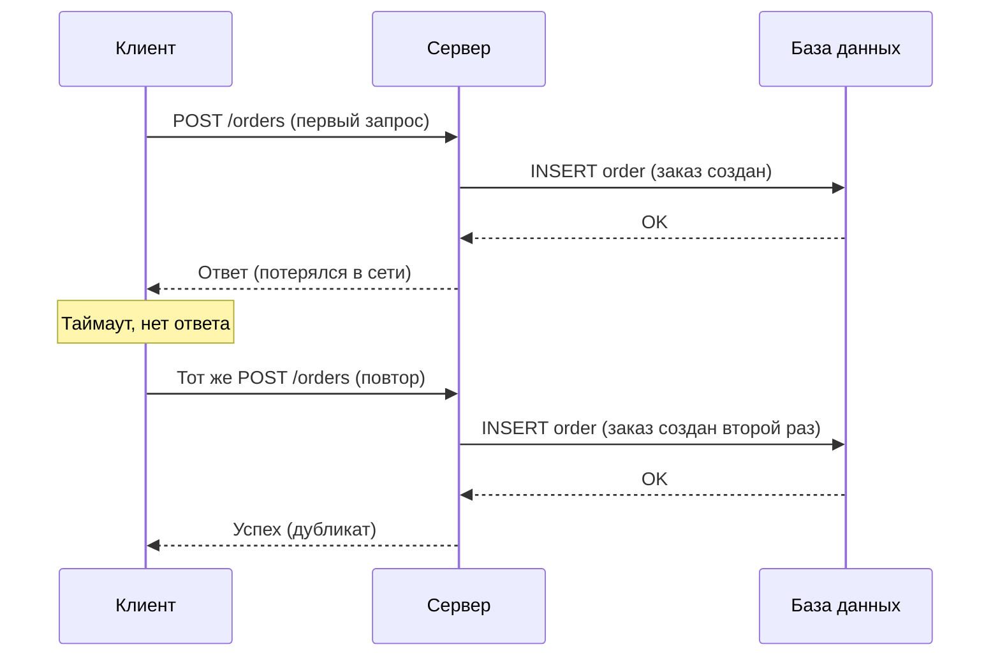
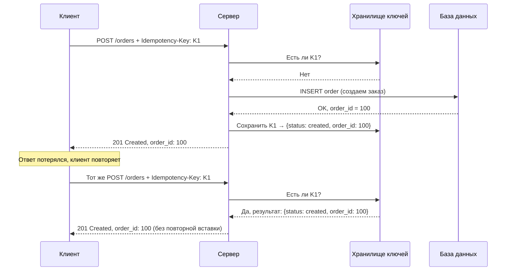

## Идемпотентность в интеграциях: как строить API, устойчивые к повторным запросам

В распределенных системах сбои неизбежны. Сеть может потерять пакет, сервер может упать в момент отправки ответа, балансировщик может разорвать соединение. В таких условиях клиент не может отличить ситуацию "запрос не дошел до сервера" от ситуации "запрос дошел, но ответ потерялся". Единственное надежное поведение для клиента — повторить запрос.

Но повтор запроса опасен. Если операция не является идемпотентной, повтор может привести к двойному списанию денег, созданию дубликатов заказов, повторной отправке уведомлений. **Идемпотентность** — это свойство операции, при котором повторный вызов с теми же параметрами дает тот же результат и не создает дополнительных побочных эффектов.

## Что такое идемпотентность простыми словами

Операция идемпотентна, если ее можно выполнить один раз или много раз — результат будет одинаковым.

**Идемпотентные операции:**

- `GET /users/123` — сколько ни вызывай, вернешь того же пользователя.
- `DELETE /users/123` — после первого удаления пользователь исчез, повторные удаления либо вернут ошибку 404, либо тихо проигнорируются. Главное — повторное удаление не удалит кого-то другого.
- `PUT /users/123` с полным объектом — сколько раз ни отправляй те же данные, результат один.

**Неидемпотентные операции:**

- `POST /orders` — каждый вызов создает новый заказ. Если повторить, будет два заказа.
- `POST /payments` — повтор приведет к двойному списанию денег.
- `PATCH /users/123` с операцией "добавить 10 баллов" — повтор добавит еще 10.

Проблема в том, что критически важные бизнес-операции (создание заказа, списание денег, регистрация пользователя) часто являются неидемпотентными `POST`. Но именно их клиент будет повторять при сбоях.

## Природа проблемы: как возникают дубликаты

Типичный сценарий:

1. Клиент отправляет `POST /orders` с заказом.
2. Сервер получает запрос, создает заказ в базе данных, готовит ответ.
3. В момент отправки ответа (или чуть раньше) происходит сетевой сбой, балансировщик перезагружается, соединение рвется.
4. Клиент не получает ответ и инициирует retry (повтор).
5. Клиент отправляет тот же запрос снова.
6. Сервер получает второй запрос и создает второй заказ — дубликат.



Клиент считает, что отправил запрос дважды, но на самом деле сервер создал два разных заказа. Бизнес-последствия: клиенту придут два счета, со склада спишут дважды, пользователь получит две посылки.

## Idempotency Key: стандартное решение

**Idempotency Key** — это уникальный идентификатор, который клиент генерирует для каждой операции и передает серверу в заголовке запроса. Сервер запоминает этот ключ вместе с результатом операции. Если тот же ключ приходит снова, сервер не выполняет операцию повторно, а возвращает сохраненный результат.

**Как это работает:**

1. Клиент генерирует уникальный ключ (обычно UUID). Ключ должен быть уникальным для каждой логической операции. Для создания заказа — один ключ, для оплаты этого заказа — другой.
2. Клиент отправляет запрос с заголовком `Idempotency-Key: 550e8400-e29b-41d4-a716-446655440000`.
3. Сервер проверяет, есть ли уже такой ключ в хранилище.
   - Если ключа нет: выполняет операцию, сохраняет ключ и результат (статус, ID созданного ресурса, код ответа).
   - Если ключ есть: возвращает сохраненный результат, не выполняя операцию повторно.
4. Клиент получает ответ. Если операция была идемпотентна, клиент может безопасно повторять запрос с тем же ключом.



**Ключевые требования к реализации:**

- **Клиент генерирует ключ.** Сервер не может полагаться на детали запроса (тело, параметры), потому что дубликаты могут быть идентичными. Клиент должен сам вносить entropy.
- **Ключ должен быть уникальным в пространстве и времени.** Обычно используют UUID версии 4 или ULID.
- **Сервер хранит ключ и результат.** Хранилище должно быть долговечным (не кэш в памяти). Если сервер упадет и потеряет таблицу ключей, при повторе операция выполнится второй раз.
- **Хранение должно быть ограничено по времени.** Нельзя хранить ключи вечно — их будет бесконечно много. Типичный TTL — 24 часа, 7 дней, 30 дней. По истечении TTL клиент должен считать, что операция не состоялась, и генерировать новый ключ.
- **Обработка конфликта ключей.** Если два одинаковых запроса с одним ключем приходят почти одновременно (конкурентно), сервер должен гарантировать, что операция выполнится только один раз. Это требует блокировок или атомарных операций в хранилище.

## Хранение Idempotency Key: стратегии

Выбор хранилища для ключей зависит от требований к надежности, производительности и времени жизни.

| Стратегия | Плюсы | Минусы | Когда использовать |
| :--- | :--- | :--- | :--- |
| **В той же транзакции БД** | Атомарность, строгая консистентность | Нагрузка на основную БД, рост таблицы | Критичные финансовые операции |
| **Отдельная таблица в той же БД** | Изоляция от основных данных, легче чистить | Дополнительные запросы к БД | Средняя нагрузка |
| **Redis** | Очень быстро, встроенный TTL | Потеря данных при перезапуске | Некритичные операции, кэшируемые ключи |
| **DynamoDB / Cassandra** | Быстро, масштабируемо, долговечно | Дополнительная инфраструктура | Высокая нагрузка, распределенные системы |

**Самый надежный способ:** хранить Idempotency Key в той же транзакции, что и бизнес-данные. Например, в PostgreSQL сделать таблицу `idempotency_keys` с колонками `key` (UNIQUE), `created_at`, `response_status`, `response_body`. При создании заказа вставить запись в `idempotency_keys` и в `orders` в одной транзакции. Это гарантирует, что ключ не будет сохранен без заказа, а заказ — без ключа.

```sql
BEGIN;
-- Сначала проверяем, нет ли ключа
SELECT * FROM idempotency_keys WHERE key = @key FOR UPDATE;
-- Если нет, вставляем ключ
INSERT INTO idempotency_keys (key, created_at, response_status) VALUES (@key, NOW(), 'processing');
-- Создаем заказ
INSERT INTO orders (user_id, amount) VALUES (@user_id, @amount);
COMMIT;
```

## Дедупликация: разные уровни защиты

Идемпотентность через Idempotency Key — это защита на уровне прикладного API. Но дубликаты могут возникать и на других уровнях.

**Дедупликация на уровне сообщений (брокер).** Если вы используете Kafka или RabbitMQ, сообщения могут дублироваться при перебалансировке партиций или сетевых сбоях. Брокеры обычно гарантируют "at-least-once" доставку. Получатель сообщений должен быть идемпотентным. Здесь тоже можно использовать Idempotency Key, но уже в теле сообщения.

**Дедупликация на уровне базы данных.** Уникальные ограничения (UNIQUE constraint) — это форма идемпотентности на уровне БД. Если вы поставите уникальное ограничение на `(order_id, transaction_type)`, второй INSERT с теми же значениями упадет с ошибкой дубликата. Это надежно, но требует, чтобы бизнес-ключ был известен заранее.

**Дедупликация на уровне потребителя (consumer).** Самый гибкий уровень. Сервис-получатель хранит ID обработанных сообщений и игнорирует повторные. Это позволяет обрабатывать дубликаты вне зависимости от их источника.

## Retry-safe API: что нужно спроектировать

API считается **safe for retry** (безопасным для повторных вызовов), если клиент может безопасно повторять запросы при сбоях. Для этого необходимо:

**1. Все неидемпотентные операции должны поддерживать Idempotency Key.** Это минимальное требование. `POST /orders` без Idempotency Key — это бомба замедленного действия.

**2. API должен возвращать результат в формате, позволяющем клиенту понять, что произошло.** Клиент после повтора должен получить тот же ответ, что и при первом успешном вызове. Даже если операция уже была выполнена, ответ должен содержать ID созданного ресурса.

**3. Сервер должен четко различать идемпотентные и неидемпотентные методы.** По спецификации HTTP:
   - `GET`, `PUT`, `DELETE` — должны быть идемпотентными.
   - `POST` — не обязан, но может быть с Idempotency Key.
   - `PATCH` — может быть идемпотентным или нет в зависимости от реализации (depends).

**4. Ответы на повторные запросы должны быть консистентными.** Если первый запрос вернул `201 Created`, а второй (с тем же ключом) по какой-то причине вернет `500 Internal Server Error` — это сломает логику клиента. Сервер должен хранить не только факт выполнения, но и код ответа, и тело ответа.

**5. Время жизни Idempotency Key должно быть документировано и предсказуемо.** Клиент должен знать, сколько времени сервер помнит ключ (обычно 24 часа). По истечении этого срока сервер может не помнить операцию, и повтор с тем же ключом создаст второй ресурс.

## Ограничения и подводные камни идемпотентности

**Idempotency Key не решает проблему "частичного выполнения".** Если сервер начал выполнять операцию, сохранил ключ, но упал до сохранения бизнес-данных — после восстановления ключ может существовать, а данных нет. Лучший способ избежать этого — использовать транзакционное сохранение ключа и данных. Если это невозможно, нужен механизм восстановления или ручного разрешения.

**Ключ должен генерироваться клиентом, но клиент может ошибиться.** Если клиент по ошибке использует один и тот же ключ для двух разных заказов, второй заказ никогда не будет создан. Сервер должен вернуть ошибку "idempotency key already used", но не может сам решить, что делать. Это требует от клиентов строгой дисциплины.

**Не все операции можно сделать идемпотентными даже с ключом.** Например, операция "отправить email" — как сервер может сохранить факт отправки? Он может сохранить ключ и статус "отправлено", но если первый запрос отправил email, а второй нет — пользователь не получит письмо. Решение: считать операцию идемпотентной на уровне бизнеса (даже если технически отправка происходит один раз). Или принимать, что email может быть отправлен дважды.

**Хранилище ключей может стать узким местом.** При высоких нагрузках (тысячи запросов в секунду) проверка и запись Idempotency Key добавляют задержку. Нужно выбирать быстрое хранилище (Redis) и оптимизировать индексы.

## Пример проектирования Idempotent API (спецификации)

Для аналитика важно уметь описать требования к идемпотентному API в контракте. Пример для OpenAPI:

```yaml
openapi: 3.0.0
info:
  title: Payment API
  version: 1.0.0
paths:
  /v1/payments:
    post:
      summary: Создание платежа
      description: |
        Операция идемпотентна с использованием заголовка Idempotency-Key.
        При повторной отправке того же ключа возвращается результат первого вызова.
        Ключ сохраняется в течение 24 часов.
      parameters:
        - in: header
          name: Idempotency-Key
          required: true
          schema:
            type: string
            format: uuid
          description: |
            Уникальный ключ операции (UUID v4).
            Один ключ не может быть использован для разных платежей.
      requestBody:
        required: true
        content:
          application/json:
            schema:
              type: object
              properties:
                amount:
                  type: integer
                  description: Сумма в копейках
                currency:
                  type: string
                  enum: [RUB, USD, EUR]
      responses:
        '201':
          description: Платеж создан
          headers:
            Idempotency-Key:
              schema:
                type: string
              description: Ключ, который был использован
        '409':
          description: Конфликт — ключ уже использован для другой операции
        '422':
          description: Ошибка валидации
```

## Резюме

Идемпотентность — не опция, а необходимость для надежных распределенных систем. Клиенты будут повторять запросы при сбоях, и API должен быть готов к этому.

Основные понятия:

- **Идемпотентность** — свойство операции, при котором повторный вызов не создает дополнительных эффектов.
- **Idempotency Key** — уникальный идентификатор, который клиент передает серверу для дедупликации операций.
- **Дедупликация** — процесс обнаружения и отбрасывания повторных запросов на разных уровнях (API, брокер сообщений, БД).
- **Retry-safe API** — API, спроектированный так, что клиент может безопасно повторять запросы без риска двойного выполнения.

Для аналитика при проектировании интеграции важно:

- Определить, какие операции неидемпотентны и требуют Idempotency Key.
- Согласовать с командой разработки формат заголовка (`Idempotency-Key` или `X-Idempotency-Key`).
- Указать в контракте API правила генерации, хранения и TTL ключей.
- Продумать, как обрабатывать конфликты ключей и частичные выполнения.
- Документировать поведение API при повторных вызовах, чтобы клиенты могли правильно реализовать retry-логику.

Idempotency Key — это не серебряная пуля, но стандарт де-факто для платежных и заказных API (Stripe, PayPal, Shopify). Внедрение этой практики сразу снимает целый класс проблем с дубликатами и делает интеграции предсказуемыми.