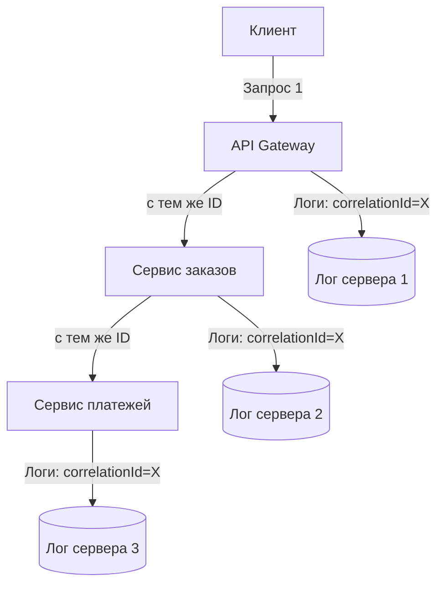
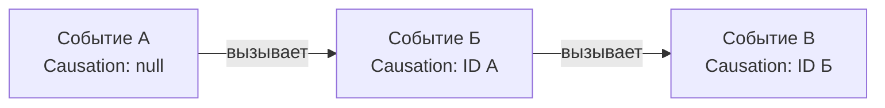

## Корреляция запросов: как отследить путешествие одного запроса по распределенной системе

В современной распределенной архитектуре один запрос пользователя может пройти через десяток сервисов. Клиент вызвал API Gateway, который сходил в сервис заказов, тот — в сервис платежей, а платежный сервис — во внешний банковский шлюз. Когда в одном из этих сервисов возникает ошибка, инженер смотрит в логи и видит разрозненные записи на разных серверах. Логи сервиса заказов, логи платежного сервиса, логи банковского шлюза — как понять, что все эти записи относятся к одному и тому же исходному запросу?

**Корреляция запросов (request correlation)** — это механизм связывания разрозненных событий (логов, метрик, трейсов) в единую цепочку, принадлежащую одному и тому же бизнес-запросу. Каждый сервис, участвующий в обработке, добавляет в свои логи специальный идентификатор — Correlation ID, который передается от сервиса к сервису. Этот идентификатор позволяет в любой момент времени собрать полную картину пути запроса через систему.

## Проблема: почему одного requestId недостаточно

В простом монолите проблема корреляции решается тривиально. Сервер генерирует уникальный идентификатор при входящем запросе, все внутренние вызовы методов в рамках одного процесса используют этот же идентификатор. Логи одного запроса собраны в одном файле, и фильтр по requestId дает полную картину.

В распределенной системе все сложнее. Сервис А вызывает сервис Б по сети. Логи сервиса А хранятся на одном сервере, а логи сервиса Б — на другом. Чтобы связать эти логи, нужен идентификатор, который:

1. Генерируется в точке входа (например, API Gateway).
2. Передается в каждый последующий вызов.
3. Не меняется при трансформациях (авторизация, обогащение).
4. Позволяет отличать один запрос пользователя от другого.



## Correlation ID: определение и назначение

**Correlation ID** (иногда просто `correlationId`) — это уникальный идентификатор, который привязывает все события, относящиеся к одному логическому потоку выполнения, независимо от количества задействованных сервисов или инфраструктурных компонентов.

**Ключевые характеристики Correlation ID:**

- **Сквозной (end-to-end).** Он создается на границе системы (при первом входящем запросе) и передается во все последующие вызовы — синхронные (HTTP/gRPC) и асинхронные (Kafka, RabbitMQ, SQS).
- **Не меняется в процессе обработки.** В отличие от Trace ID (который может порождать вложенные идентификаторы), Correlation ID остается неизменным на всех этапах обработки.
- **Не обязан быть глобально уникальным в масштабах всей системы.** Достаточно, чтобы он был уникальным в пределах временного интервала, когда логи могут быть востребованы для отладки (обычно 7-30 дней).

**Пример из жизни:** Интернет-магазин. Пользователь оформил заказ. Correlation ID `order-650e8400-e29b-41d4-a716-446655440000` проставляется в API Gateway и передается в сервис заказов, сервис платежей, сервис уведомлений, сервис логистики. Все логи этих сервисов будут содержать один и тот же Correlation ID. Когда через неделю возникнет проблема с доставкой этого заказа, инженер сможет найти все логи по этому ID и восстановить полную картину.

## Request ID: принадлежит одному сервису

**Request ID** — это идентификатор, который генерируется внутри одного сервиса для каждого входящего запроса. В отличие от Correlation ID, Request ID не обязан передаваться в другие сервисы.

**Отличия Request ID от Correlation ID:**

| Аспект | Correlation ID | Request ID |
| :--- | :--- | :--- |
| **Зона действия** | Сквозной, через все сервисы | Внутри одного сервиса |
| **Где устанавливается** | На входе в систему (API Gateway) | На входе в каждый сервис |
| **Изменяется ли при вызове другого сервиса** | Нет, передается как есть | Да, каллируемый сервис может сгенерировать свой Request ID |
| **Главное назначение** | Связывать разрозненные логи разных сервисов | Отслеживать обработку внутри одного сервиса |

На практике часто используют только Correlation ID, покрывающий все вызовы, и пренебрегают Request ID внутри сервисов, потому что Correlation ID достаточно для большинства сценариев отладки. Однако если сервис сложный и сам по себе является распределенным (внутренние вызовы между модулями), Request ID может быть полезен.

## Trace ID: наследие распределенной трассировки

**Trace ID** — это понятие из мира распределенной трассировки (distributed tracing) в стандарте OpenTelemetry. Trace ID идентифицирует полную трассировку (trace) — дерево всех операций, выполненных в рамках одного запроса.

**В чем разница между Correlation ID и Trace ID:**

- **Correlation ID** — плоский идентификатор. Он не отражает иерархию вызовов.
- **Trace ID + Span ID** — иерархический подход. Trace ID идентифицирует всю трассировку, а каждый отдельный вызов (сервис, запрос к БД, вызов внешнего API) имеет свой Span ID. Вместе они образуют дерево, позволяющее видеть, сколько времени занял каждый шаг.

На практике в заголовках часто передают только Trace ID, используя его как Correlation ID. Это допустимое упрощение, при котором мы теряем иерархию, но сохраняем возможность связывать логи.

```
Пример иерархии с Trace ID и Span ID:

Trace ID: 4bf92f3577b34da6a3ce929d0e0e4736
├─ Span ID: 1 (API Gateway) — 10 ms
│  ├─ Span ID: 2 (Сервис заказов) — 45 ms
│  │  ├─ Span ID: 3 (запрос к БД) — 30 ms
│  │  └─ Span ID: 4 (вызов платежного сервиса) — 12 ms
│  └─ Span ID: 5 (Сервис уведомлений) — 5 ms (параллельно)
```

## Causation ID: для асинхронных цепочек

**Causation ID** — менее распространенный, но важный идентификатор для асинхронных событийных систем. Он указывает на причину возникновения события.

В асинхронной архитектуре (событийно-ориентированной, EDA) события генерируются другими событиями. Causation ID позволяет отследить, какое событие породило текущее.

**Пример:** Заказ создан (событие `OrderCreated` с Causation ID = null, потому что это корневое событие). Обработка этого события порождает событие `PaymentProcessed` (Causation ID = ID события `OrderCreated`). Обработка платежа порождает событие `ShipmentCreated` (Causation ID = ID события `PaymentProcessed`).

В корреляции запросов Causation ID используется реже, потому что Correlation ID обычно передается в сообщениях явно и выполняет ту же функцию связывания. Но Causation ID дает дополнительную информацию о причинно-следственных связях, которая не очевидна из одного Correlation ID.



## Стандартные заголовки HTTP для корреляции

В мире HTTP нет единого стандарта для передачи идентификаторов корреляции, но сложились де-факто соглашения.

| Заголовок | Назначение | Кем используется |
| :--- | :--- | :--- |
| `X-Request-Id` | Request ID (внутри сервиса) | Nginx, Heroku, многие фреймворки |
| `X-Correlation-Id` | Correlation ID (сквозной) | AWS, IBM, широкое распространение |
| `X-Trace-Id` | Trace ID (для трассировки) | OpenTelemetry, Jaeger, Zipkin |
| `traceparent` | Стандартный заголовок W3C для трассировки | OpenTelemetry (рекомендуемый стандарт) |

**Рекомендация W3C Trace Context:** Использовать заголовок `traceparent` с форматом `00-{trace-id}-{span-id}-{trace-flags}`. Например: `traceparent: 00-4bf92f3577b34da6a3ce929d0e0e4736-00f067aa0ba902b7-01`. Это современный стандарт, поддерживаемый всеми major-системами трассировки.

## Как проектировать корреляцию в API: инструкция для аналитика

При проектировании API и документировании требований к интеграции важно явно описать правила корреляции.

**1. Определите, какой идентификатор обязателен, а какой опционален.**

В большинстве случаев клиент (вызывающая система) не обязан генерировать Correlation ID. Это может делать API Gateway. Но если в системе уже есть собственный сквозной идентификатор, его можно передавать.

```yaml
# Пример в OpenAPI
parameters:
  - in: header
    name: X-Correlation-Id
    required: false
    schema:
      type: string
      format: uuid
    description: |
      Сквозной идентификатор запроса. Если не передан, API Gateway генерирует его автоматически.
      Рекомендуется передавать для связывания логов при интеграции.
```

**2. Опишите правила распространения на асинхронные вызовы.**

Если API принимает запрос и порождает асинхронную задачу (например, отправляет сообщение в очередь), Correlation ID должен сохраняться в сообщении. Требование выглядит так:

> Correlation ID, полученный в HTTP-заголовке `X-Correlation-Id`, должен быть передан в тело сообщения Kafka (или в заголовок сообщения) при отправке фоновой задачи.

**3. Документируйте, как корреляция работает в вашей системе для потребителей API.**

Потребители API должны знать, какой идентификатор нужно передавать для отладки.

**4. Для событийной архитектуры определите, как передается Causation ID.**

Если события публикуются в брокер, в схеме события должны быть поля `correlationId` и опционально `causationId`.

```json
{
  "eventId": "evt_123",
  "eventType": "OrderCreated",
  "correlationId": "corr_456",
  "causationId": null,
  "data": { "orderId": "ord_789" }
}
```

## Пример сквозной корреляции с заголовками

**Сценарий:** Клиент вызывает API интернет-магазина. Запрос проходит через Gateway, сервис заказов, сервис платежей, сервис уведомлений.

**Шаг 1:** Клиент (или API Gateway) генерирует Correlation ID. Если клиент передал свой — используется он, если нет — генерируется новый. Значение: `550e8400-e29b-41d4-a716-446655440000`.

**Шаг 2:** Корреляция записывается в лог API Gateway: `[INFO] [corr=550e8400-e29b-41d4-a716-446655440000] POST /orders received`.

**Шаг 3:** API Gateway вызывает сервис заказов, передавая `X-Correlation-Id: 550e8400-e29b-41d4-a716-446655440000` в HTTP-заголовке.

**Шаг 4:** Сервис заказов принимает заголовок, записывает в свой лог: `[INFO] [corr=550e8400-e29b-41d4-a716-446655440000] Creating order for user=123`.

**Шаг 5:** Сервис заказов вызывает сервис платежей, снова передавая тот же Correlation ID.

**Шаг 6:** Сервис платежей пишет в лог: `[INFO] [corr=550e8400-e29b-41d4-a716-446655440000] Processing payment for order=789`.

**Шаг 7:** При возникновении ошибки сервис платежей возвращает ответ с тем же Correlation ID в заголовке (для клиента), а также в теле ответа (для удобства поиска в логах по ID).

**Шаг 8:** Инженер, увидев ошибку у клиента, берет Correlation ID из ответа и ищет его в агрегированных логах (ELK, Loki). Одно значение — и все логи Gateway, заказов, платежей, уведомлений оказываются в одном результате поиска.

```bash
$ grep "550e8400-e29b-41d4-a716-446655440000" /var/log/gateway/* /var/log/orders/* /var/log/payments/*
gateway.log:[INFO] [corr=550e8400-e29b-41d4-a716-446655440000] POST /orders received
orders.log:[INFO] [corr=550e8400-e29b-41d4-a716-446655440000] Creating order for user=123
payments.log:[ERROR] [corr=550e8400-e29b-41d4-a716-446655440000] Payment declined by bank
```

## Распространенные ошибки при проектировании корреляции

**Ошибка 1: Не передавать Correlation ID в асинхронные вызовы.** HTTP-запросы могут иметь корреляцию, но сообщения, отправленные в очередь, теряют связь. Результат: невозможно связать фоновую обработку с исходным запросом.

**Ошибка 2: Генерировать новый Correlation ID внутри каждого сервиса.** Если каждый сервис перезаписывает идентификатор, связь теряется. Правило: принимай заголовок от вызывающего — не меняй, если его нет — сгенерируй, но не перезаписывай существующий.

**Ошибка 3: Не включать Correlation ID в ответ API.** Клиент не может передать ID в поддержку, потому что не знает его. Всегда возвращайте Correlation ID в ответе (в заголовке `X-Correlation-Id` и/или в теле ответа в поле `correlationId`).

**Ошибка 4: Использовать идентификатор из бизнес-данных вместо сквозного Correlation ID.** Номер заказа — это бизнес-идентификатор. Он подходит для поиска по заказу, но не подходит для корреляции, потому что:
- Момент до создания заказа коррелировать нечем.
- Один заказ может порождать множество технических событий, не связанных напрямую с заказом (например, внутренняя ретрассировка платежа).

**Ошибка 5: Не документировать политику TTL для идентификаторов.** Если логи с корреляцией хранятся 7 дней, а идентификатор считается "уникальным" бесконечно — это не проблема. Но если ожидается, что Correlation ID будет глобально уникальным годами, это нереалистично. У UUID версии 4 коллизии маловероятны, но не невозможны. Для большинства систем достаточно уникальности в пределах временного окна хранения логов.

## Резюме

Корреляция запросов — фундаментальный механизм наблюдаемости (observability) в распределенных системах. Без него поиск причин ошибок превращается в гадание.

**Основные идентификаторы корреляции:**

- **Correlation ID** — сквозной идентификатор, связывающий все события одного логического запроса через все сервисы. Передается в заголовках HTTP и в метаданных сообщений.
- **Request ID** — идентификатор в рамках одного сервиса. Может быть перезаписан при входе в сервис. Часто избыточен при наличии Correlation ID.
- **Trace ID** — идентификатор из распределенной трассировки (OpenTelemetry). Образует иерархию со Span ID. Может использоваться как Correlation ID.
- **Causation ID** — идентификатор события-причины в асинхронных системах. Указывает, какое событие породило текущее.

**Для аналитика при проектировании API важно:**

- Определить обязательность и формат Correlation ID в заголовках.
- Описать правила распространения на асинхронные вызовы (очереди, брокеры).
- Закрепить в контракте, что Correlation ID возвращается в ответе.
- Документировать для потребителей API, как использовать корреляцию для отладки.

Корреляция запросов не добавляет бизнес-функциональность, но многократно ускоряет инцидент-менеджмент и упрощает анализ распределенных транзакций. Система без корреляции — это черный ящик, в который заглядывают наугад. Система с корреляцией — это прозрачный поток, где каждый шаг документирован и связан с исходным запросом.