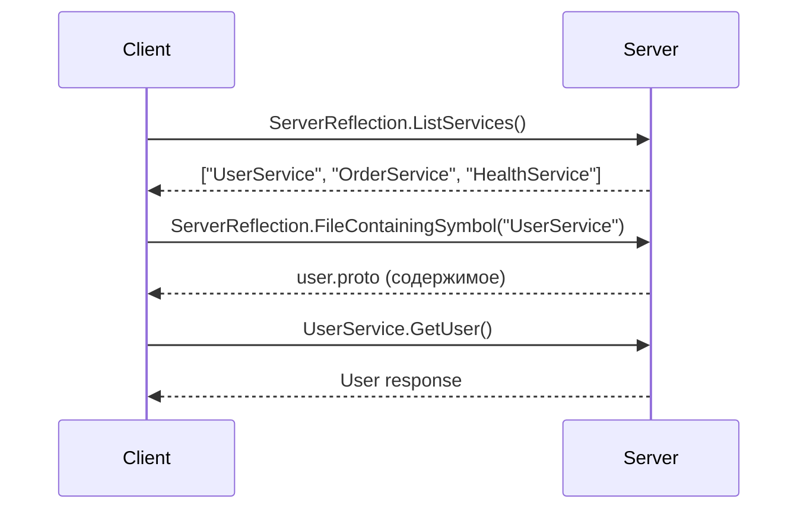

## Введение: Самоописывающийся протокол

Представьте, что вы пришли в библиотеку, где нет каталога. Книги стоят на полках, но вы не знаете, какие есть, где что искать. Пришлось бы перебирать все книги подряд.

В мире REST API есть OpenAPI — "каталог", который описывает все эндпоинты. В мире gRPC эту роль выполняет **gRPC Reflection**. Это механизм, позволяющий клиенту "спросить" у сервера: "Какие у тебя есть сервисы? Какие методы? Какие типы данных?"

gRPC Reflection — это встроенный механизм интроспекции (самоанализа). Сервер предоставляет специальный сервис, через который клиент может получить всю информацию о доступных сервисах, методах и сообщениях. Не нужны отдельные файлы `.proto`, не нужна документация. Сервер сам себя описывает.

Для системного аналитика gRPC Reflection — это инструмент для изучения, тестирования и документирования gRPC API. С его помощью можно "пощупать" API, понять его структуру, вызвать методы, даже не имея `.proto` файлов.

## Зачем нужна интроспекция в gRPC

### Проблемы без Reflection

| Проблема | Проявление |
| :--- | :--- |
| **Нужны .proto файлы** | Клиент не может вызвать сервер без proto файлов |
| **Документация устаревает** | .proto и документация расходятся |
| **Трудно исследовать API** | Нет инструмента, аналогичного Swagger UI |
| **Ручная работа** | Каждый новый метод требует обновления клиента |

### Что даёт Reflection

| Преимущество | Объяснение |
| :--- | :--- |
| **Динамическое исследование** | Клиент может "узнать" API во время выполнения |
| **Единый источник истины** | Сервер сам описывает себя |
| **Автоматическая документация** | Можно сгенерировать документацию из Reflection |
| **Инструменты отладки** | grpcurl, Evans — работа без .proto |
| **Адаптивные клиенты** | Клиенты, которые подстраиваются под API |

## Как работает gRPC Reflection

### Принцип

Сервер реализует специальный сервис `grpc.reflection.v1.ServerReflection`. Клиент подключается к этому сервису и задаёт вопросы:

- `list_services` — какие сервисы есть на сервере?
- `file_containing_symbol` — найти .proto файл по имени символа
- `file_by_filename` — получить .proto файл по имени



### Схема сервиса Reflection

```protobuf
service ServerReflection {
    rpc ServerReflectionInfo(stream ServerReflectionRequest)
        returns (stream ServerReflectionResponse);
}

message ServerReflectionRequest {
    oneof message_request {
        string file_by_filename = 3;
        string file_containing_symbol = 4;
        string list_services = 6;
    }
}
```

## Включение Reflection на сервере

### Go

```go
import "google.golang.org/grpc/reflection"

grpcServer := grpc.NewServer()
pb.RegisterUserServiceServer(grpcServer, &userServer{})

// Включение Reflection
reflection.Register(grpcServer)

grpcServer.Serve(lis)
```

### Java

```java
import io.grpc.protobuf.services.ProtoReflectionService;

Server server = ServerBuilder.forPort(50051)
    .addService(new UserService())
    .addService(ProtoReflectionService.newInstance())
    .build();
```

### Python

```python
from grpc_reflection.v1alpha import reflection

service_names = (
    user_pb2.DESCRIPTOR.services_by_name['UserService'].full_name,
    reflection.SERVICE_NAME,
)

server.add_insecure_port('[::]:50051')
server.add_registered_servicer(user_service)
server.add_generic_rpc_handlers((reflection.ServiceHandler(service_names),))
```

### Node.js

```javascript
const grpc = require('@grpc/grpc-js');
const reflection = require('@grpc/reflection');

const server = new grpc.Server();
server.addService(userService, {...});

const ref = new reflection.ReflectionService(packageDefinition);
server.addService(ref.getDefinition());

server.bindAsync(...);
```

## Инструменты для работы с Reflection

### grpcurl

Консольная утилита, аналог curl для gRPC.

```bash
# Установка
go install github.com/fullstorydev/grpcurl/cmd/grpcurl@latest

# Список сервисов
grpcurl localhost:50051 list

# Список методов сервиса
grpcurl localhost:50051 list UserService

# Описание метода
grpcurl localhost:50051 describe UserService.GetUser

# Вызов метода
grpcurl -d '{"user_id": 123}' localhost:50051 UserService/GetUser

# С получением файлов .proto
grpcurl -reflect localhost:50051 list
```

### Evans (gRPC клиент)

Интерактивный gRPC клиент с поддержкой Reflection.

```bash
# Установка
brew install evans

# Запуск с Reflection
evans -r localhost:50051

# Внутри Evans
> show service
> call GetUser
> user_id: 123
```

### Postman (с gRPC поддержкой)

Postman поддерживает gRPC с Reflection (бета). Достаточно указать адрес сервера, Postman сам получит схему.

### Insomnia (с gRPC поддержкой)

Insomnia также поддерживает gRPC с Reflection.

## Информация, которую можно получить через Reflection

### Список сервисов

```bash
$ grpcurl localhost:50051 list

grpc.reflection.v1.ServerReflection
UserService
OrderService
HealthService
```

### Список методов сервиса

```bash
$ grpcurl localhost:50051 list UserService

UserService.GetUser
UserService.CreateUser
UserService.UpdateUser
UserService.DeleteUser
```

### Детальное описание метода

```bash
$ grpcurl localhost:50051 describe UserService.GetUser

UserService.GetUser is a method:
rpc GetUser ( .GetUserRequest ) returns ( .User );
```

### Описание типа

```bash
$ grpcurl localhost:50051 describe .User

User is a message:
message User {
  int32 id = 1;
  string name = 2;
  string email = 3;
  int32 age = 4;
}
```

### Получение .proto файла

```bash
$ grpcurl localhost:50051 describe UserService > user.proto
```

## Использование в сценариях аналитика

### Сценарий 1: Изучение незнакомого gRPC сервиса

**Ситуация:** Вам нужно протестировать gRPC API, но нет документации и .proto файлов.

**Действия:**

1. Убедиться, что Reflection включён (спросить у разработчиков или проверить самому)
2. Подключиться через grpcurl или Evans
3. Получить список сервисов: `grpcurl localhost:50051 list`
4. Получить список методов: `grpcurl localhost:50051 list UserService`
5. Изучить структуру сообщений: `grpcurl localhost:50051 describe .User`
6. Вызвать метод с тестовыми данными

**Результат:** Вы понимаете API, даже без документации.

### Сценарий 2: Воспроизведение ошибки

**Ситуация:** Разработчик говорит "у меня всё работает", но интеграция падает.

**Действия:**

1. Используя grpcurl, выполнить точный запрос, который падает
2. Сохранить команду: `grpcurl -d '{"user_id": 999}' localhost:50051 UserService/GetUser`
3. Отправить разработчику: "Вот точный запрос, который возвращает ошибку"

**Результат:** Разработчик может воспроизвести ошибку локально.

### Сценарий 3: Автоматическая документация

**Ситуация:** Нужно создать документацию для gRPC API.

**Действия:**

1. Использовать инструмент, который через Reflection получает схему
2. Сгенерировать документацию в Markdown/HTML
3. Автоматизировать процесс в CI/CD

**Результат:** Документация всегда актуальна.

### Сценарий 4: Проверка согласованности

**Ситуация:** Есть два окружения (dev и prod). Нужно убедиться, что API на них одинаковы.

**Действия:**

1. Получить список сервисов и методов через Reflection на обоих окружениях
2. Сравнить списки
3. Обнаружить расхождения

**Результат:** Вы видите, где API разошлись.

## Безопасность Reflection

### Риски

| Риск | Описание |
| :--- | :--- |
| **Раскрытие API** | Злоумышленник получает полную информацию о сервисе |
| **Атаки на основе знания** | Зная структуру, легче найти уязвимости |
| **Вызов методов** | Reflection не даёт вызывать методы, но раскрывает их существование |

### Рекомендации

| Рекомендация | Почему |
| :--- | :--- |
| **Отключать Reflection в production** | Злоумышленник не должен видеть структуру API |
| **Включать только в dev/staging** | Для разработки и тестирования |
| **Использовать аутентификацию для Reflection** | Только авторизованные клиенты могут получить схему |
| **Мониторить доступ к Reflection** | Логировать, кто и когда запрашивает схему |

### Настройка безопасности

```go
// Go: Reflection только для определённых клиентов
interceptor := func(ctx context.Context, req interface{}, info *grpc.UnaryServerInfo, handler grpc.UnaryHandler) (interface{}, error) {
    if strings.Contains(info.FullMethod, "ServerReflection") {
        // Проверка авторизации для Reflection
        if !isAuthorized(ctx) {
            return nil, status.Error(codes.PermissionDenied, "reflection not allowed")
        }
    }
    return handler(ctx, req)
}
```

## Reflection в экосистеме gRPC

### grpcurl (CLI)

Самый популярный инструмент. Работает с Reflection и с .proto файлами.

### Evans (интерактивный клиент)

Удобный интерактивный режим. Автодополнение, подсветка синтаксиса.

### Postman / Insomnia

Поддержка gRPC с Reflection в бета-версиях.

### gRPCurl (Go библиотека)

Программный доступ к Reflection из Go кода.

```go
import "google.golang.org/grpc/reflection/grpc_reflection_v1alpha"

client := grpc_reflection_v1alpha.NewServerReflectionClient(conn)
stream, err := client.ServerReflectionInfo(ctx)
// ...
```

### gRPC Server Reflection Protocol

Стандартный протокол, поддерживаемый всеми gRPC реализациями.

## Reflection vs .proto файлы

| Характеристика | .proto файлы | Reflection |
| :--- | :--- | :--- |
| **Требуются заранее** | Да | Нет |
| **Актуальность** | Может устареть | Всегда актуальна |
| **Доступность** | Нужно распространять файлы | Сервер сам отвечает |
| **Безопасность** | Нет риска | Риск раскрытия API |
| **Использование в продакшене** | Да | Нет (обычно) |
| **Генерация кода** | Да | Нет |
| **Динамические клиенты** | Нет | Да |

## Ограничения Reflection

| Ограничение | Объяснение |
| :--- | :--- |
| **Требует включения на сервере** | Если отключено, Reflection не работает |
| **Не даёт вызывать методы напрямую** | Только получение информации о сервисе |
| **Не работает с некоторыми языками** | Реализация есть не везде |
| **Проблемы с вложенными сообщениями** | Некоторые реализации не раскрывают полностью |
| **Не стандартизирован для streaming** | Стриминговые методы могут быть не полностью описаны |

## Альтернативы Reflection

| Подход | Как работает | Когда использовать |
| :--- | :--- | :--- |
| **.proto файлы** | Клиент компилирует proto файлы | Продакшен, статические клиенты |
| **gRPC Gateway** | REST API поверх gRPC | Документация через OpenAPI |
| **protoc-gen-doc** | Генерация документации из .proto | Статическая документация |
| **Buf** | Инструмент для управления .proto | Линтинг, форматирование, разбивка на модули |

## Распространённые ошибки

### Ошибка 1: Reflection включён в production

**Риск:** Злоумышленник может узнать структуру API.

**Решение:** Включать только в dev/staging. Использовать разные конфигурации.

### Ошибка 2: Полагаться только на Reflection

**Риск:** Reflection может быть отключён, документация не сгенерируется.

**Решение:** Использовать .proto как источник истины, Reflection — как инструмент отладки.

### Ошибка 3: Не проверять версию Reflection

**Риск:** Разные версии gRPC имеют разные реализации Reflection.

**Решение:** Использовать стабильную версию `grpc.reflection.v1`.

### Ошибка 4: Reflection без аутентификации

**Риск:** Любой может получить схему API.

**Решение:** Добавить проверку авторизации для Reflection сервиса.

## Резюме

1. **gRPC Reflection** — механизм интроспекции для gRPC. Позволяет клиенту получить информацию о сервисах, методах, типах данных прямо от сервера.

2. **Как работает:** Сервер реализует специальный сервис `ServerReflection`. Клиент задаёт вопросы: "какие сервисы есть?", "опиши метод", "дай .proto файл".

3. **Инструменты:** grpcurl (консоль), Evans (интерактивный), Postman/Insomnia (GUI).

4. **Что даёт:**
   - Изучение API без .proto файлов
   - Отладка и воспроизведение ошибок
   - Автоматическая документация
   - Проверка согласованности окружений

5. **Безопасность:** Reflection раскрывает структуру API. В production обычно отключается. Включается только в dev/staging или с аутентификацией.

6. **gRPC Reflection vs .proto:** Reflection — для динамического исследования и отладки. .proto — для продакшена, статических клиентов, генерации кода.

7. **Ограничения:** Требует включения на сервере, не даёт вызывать методы (только описывать), есть не во всех реализациях.