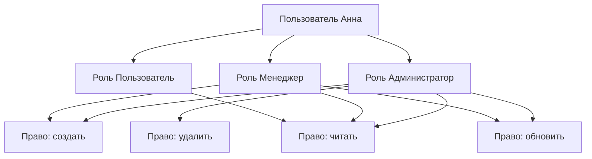
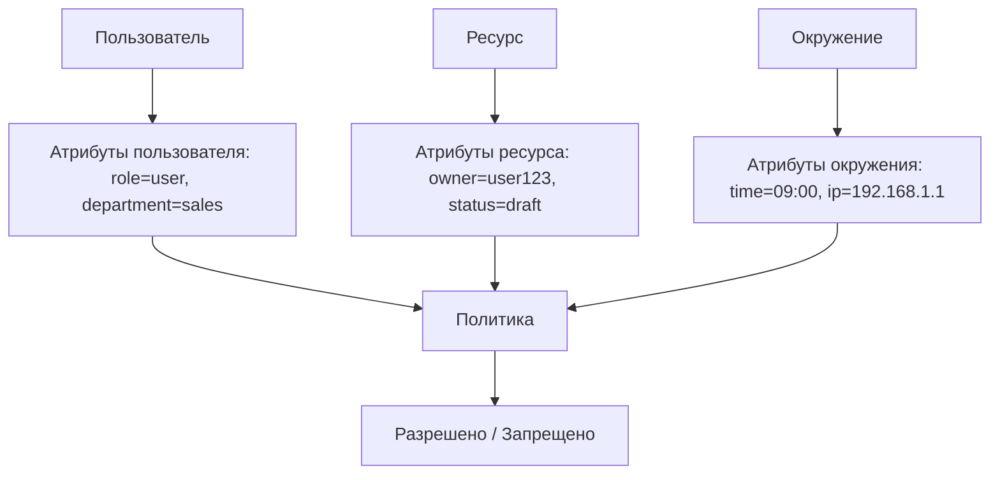

## Введение: Что вам разрешено делать

Представьте, что вы пришли в офисную библиотеку. Охранник проверил ваш паспорт и пропустил внутрь — это **аутентификация**. Теперь вы внутри. Но это не значит, что вы можете взять любую книгу. Какие-то книги можно читать только в читальном зале, какие-то — брать домой, а в какие-то комнаты вас вообще не пустят. Это **авторизация**.

**Авторизация (Authorization)** — это процесс проверки, имеет ли пользователь право выполнить определённое действие или получить доступ к определённому ресурсу. Это ответ на вопрос "Что тебе можно?".

Аутентификация отвечает на вопрос "Кто ты?". Авторизация — на вопрос "Что тебе разрешено делать?". Сначала нужно узнать личность, потом проверять права.

В мире API авторизация решает проблему: "Может ли пользователь (или система) читать этот заказ? Может ли он его редактировать? Может ли он его удалить?". Один пользователь может только читать, другой — редактировать свои заказы, третий — все заказы в системе.

## Аутентификация vs Авторизация

| Аспект | Аутентификация | Авторизация |
| :--- | :--- | :--- |
| **Вопрос** | "Кто ты?" | "Что тебе можно?" |
| **Что проверяет** | Личность | Права |
| **Когда происходит** | Сначала | После аутентификации |
| **Как передаётся** | Обычно через токен, пароль | Обычно через токен (роли, права) |
| **Пример** | "Я Иван" | "Иван может читать заказы, но не может их удалять" |
| **Результат** | Установлена личность | Доступ разрешён или запрещён |

**Пример из жизни банка:**

1. **Аутентификация:** Вы вставили карту и ввели PIN-код. Банк узнал, что вы — Иван Петров.
2. **Авторизация:** Банк проверяет, можете ли вы снять 100 000 рублей. У вас есть лимит 50 000 рублей в день. Доступ запрещён.

## Основные модели авторизации

| Модель | Что проверяет | Сложность | Гибкость | Примеры |
| :--- | :--- | :--- | :--- | :--- |
| **RBAC (Role-Based)** | Роль пользователя | Низкая | Средняя | Админ, менеджер, пользователь |
| **ABAC (Attribute-Based)** | Атрибуты пользователя, ресурса, окружения | Высокая | Высокая | "Свои заказы может редактировать только автор" |
| **ACL (Access Control List)** | Список прав для каждого ресурса | Средняя | Средняя | Файловая система (Unix chmod) |
| **PBAC (Policy-Based)** | Политики (правила) | Очень высокая | Очень высокая | AWS IAM, Azure RBAC |

## RBAC (Role-Based Access Control)

### Что это

**RBAC** — модель, в которой права назначаются ролям, а роли — пользователям. Вместо того чтобы назначать права каждому пользователю отдельно, вы создаёте роли ("Администратор", "Менеджер", "Пользователь") и назначаете права ролям. Пользователь получает права через свою роль.

### Структура



### Пример

```yaml
# Роли
roles:
  admin:
    permissions:
      - user:create
      - user:read
      - user:update
      - user:delete
      - order:read
      - order:update
      - order:delete
  
  manager:
    permissions:
      - user:read
      - order:read
      - order:update
  
  user:
    permissions:
      - order:read
      - order:create
      - order:update:own  # только свои заказы

# Пользователи
users:
  - name: Иван
    role: admin
  - name: Петр
    role: manager
  - name: Анна
    role: user
```

### Преимущества RBAC

| Преимущество | Объяснение |
| :--- | :--- |
| **Простота** | Легко понять и реализовать |
| **Масштабируемость** | Добавляем роль — все пользователи с этой ролью получают права |
| **Аудит** | Легко понять, кто что может |
| **Разделение обязанностей** | Администратор и обычный пользователь — разные роли |

### Недостатки RBAC

| Недостаток | Объяснение |
| :--- | :--- |
| **Громоздкость при большом количестве ролей** | 1000 ролей трудно управлять |
| **Нет учёта контекста** | Нельзя сказать "только свои заказы" |
| **Нет учёта времени** | Нельзя сказать "только в рабочее время" |

### Когда использовать

- Админки, CRM, ERP
- Внутренние системы с чёткой иерархией
- Большинство бизнес-приложений

## ABAC (Attribute-Based Access Control)

### Что это

**ABAC** — модель, в которой доступ разрешается или запрещается на основе атрибутов:

- **Атрибуты пользователя:** роль, отдел, должность, возраст, локация
- **Атрибуты ресурса:** тип, владелец, статус, уровень секретности
- **Атрибуты окружения:** время, IP-адрес, тип устройства

### Структура



### Пример политики

```json
{
    "policy": {
        "effect": "allow",
        "conditions": {
            "and": [
                {"user.role": "manager"},
                {"resource.type": "order"},
                {"resource.status": "draft"},
                {"environment.time": {"between": ["09:00", "18:00"]}}
            ]
        }
    }
}
```

**Что это значит:** Менеджер может редактировать черновики заказов, но только в рабочее время.

### Пример API (AWS IAM)

```json
{
    "Version": "2012-10-17",
    "Statement": [
        {
            "Effect": "Allow",
            "Action": "s3:GetObject",
            "Resource": "arn:aws:s3:::my-bucket/*",
            "Condition": {
                "IpAddress": {"aws:SourceIp": "192.0.2.0/24"},
                "StringEquals": {"s3:prefix": "public/"}
            }
        }
    ]
}
```

### Преимущества ABAC

| Преимущество | Объяснение |
| :--- | :--- |
| **Гибкость** | Учитывает контекст (время, место, устройство) |
| **Тонкая гранулярность** | Можно управлять доступом на уровне отдельных записей |
| **Динамичность** | Правила применяются в реальном времени |

### Недостатки ABAC

| Недостаток | Объяснение |
| :--- | :--- |
| **Сложность** | Трудно проектировать и отлаживать |
| **Производительность** | Проверка многих атрибутов медленнее |
| **Требует метаданных** | Нужно хранить и передавать атрибуты |

### Когда использовать

- Облачные платформы (AWS IAM, Azure RBAC)
- Крупные корпоративные системы
- Системы с требованиями комплаенс (например, медицинские данные)

## ACL (Access Control List)

### Что это

**ACL** — модель, в которой для каждого ресурса (файла, папки, документа) хранится список прав для пользователей и групп.

### Пример (Unix файловая система)

```bash
-rw-r--r--  1 ivan  staff  1024  user.txt
drwxr-xr-x  2 ivan  staff   512  folder/
```

- `rwx` — read, write, execute
- `r--` — только чтение

### Пример ACL для документа

```json
{
    "resource": "/documents/123",
    "acls": [
        {"user": "ivan", "permissions": ["read", "write", "delete"]},
        {"user": "petr", "permissions": ["read"]},
        {"group": "managers", "permissions": ["read", "write"]},
        {"group": "users", "permissions": ["read"]}
    ]
}
```

### Преимущества ACL

| Преимущество | Объяснение |
| :--- | :--- |
| **Простота** | Легко понять, кто что может делать с конкретным ресурсом |
| **Точность** | Можно настроить доступ для каждого ресурса |

### Недостатки ACL

| Недостаток | Объяснение |
| :--- | :--- |
| **Масштабируемость** | При миллионе ресурсов — миллион ACL |
| **Администрирование** | Трудно управлять, если много ресурсов |

### Когда использовать

- Файловые системы
- Проекты с небольшим количеством ресурсов
- Системы, где права наследуются от родительских ресурсов (папки)

## PBAC (Policy-Based Access Control)

### Что это

**PBAC** — модель, в которой доступ определяется декларативными политиками (правилами), которые могут комбинировать RBAC, ABAC и другие модели.

### Пример политики (Rego язык для Open Policy Agent)

```rego
package policy

default allow = false

allow {
    input.method == "GET"
    input.path = ["users", user_id]
    user_id == input.user.id
}

allow {
    input.method == "GET"
    input.path = ["users"]
    input.user.role == "admin"
}

allow {
    input.method == "POST"
    input.path = ["orders"]
    now := time.now_ns()
    input.time < now + 3600
}
```

### Преимущества PBAC

| Преимущество | Объяснение |
| :--- | :--- |
| **Максимальная гибкость** | Можно выразить любую логику |
| **Централизованное управление** | Политики хранятся отдельно от кода |
| **Аудит** | Легко понять, почему доступ разрешён или запрещён |

### Недостатки PBAC

| Недостаток | Объяснение |
| :--- | :--- |
| **Сложность** | Нужно изучать язык политик (Rego, XACML) |
| **Производительность** | Проверка политик медленнее простой проверки роли |

### Когда использовать

- Микросервисные архитектуры (OPA, Istio)
- Крупные платформы с множеством правил
- Системы, где правила часто меняются

## Сравнение моделей авторизации

| Характеристика | RBAC | ABAC | ACL | PBAC |
| :--- | :--- | :--- | :--- | :--- |
| **Сложность** | Низкая | Высокая | Средняя | Очень высокая |
| **Гибкость** | Средняя | Высокая | Средняя | Очень высокая |
| **Производительность** | Высокая | Средняя | Высокая | Низкая |
| **Учёт контекста** | Нет | Да | Нет | Да |
| **Учёт времени** | Нет | Да | Нет | Да |
| **Масштабируемость** | Высокая | Высокая | Низкая | Высокая |
| **Аудит** | Простой | Сложный | Простой | Сложный |
| **Пример** | Админка | AWS IAM | Unix файлы | OPA, Istio |

## Авторизация в REST API

### Как передавать права в API

**Вариант 1: Роли в JWT**

```json
{
    "sub": "123",
    "name": "Иван",
    "roles": ["admin", "manager"],
    "permissions": ["user:read", "user:write", "order:read"]
}
```

**Вариант 2: Scopes в OAuth 2.0**

```json
{
    "scope": "profile email read:orders write:orders"
}
```

**Вариант 3: ABAC атрибуты**

```json
{
    "sub": "123",
    "name": "Иван",
    "department": "sales",
    "region": "RU-MOW",
    "clearance": "confidential"
}
```

### Проверка прав на сервере

```python
# Псевдокод
def get_order(order_id, user):
    order = db.orders.find(order_id)
    
    # RBAC проверка
    if 'admin' in user.roles:
        return order  # админ может всё
    
    # Владелец
    if order.user_id == user.id:
        return order
    
    # Менеджер отдела
    if 'manager' in user.roles and order.department == user.department:
        return order
    
    # Иначе — запрещено
    raise HTTPException(403, "Forbidden")
```

### HTTP статусы для авторизации

| Статус | Значение | Когда использовать |
| :--- | :--- | :--- |
| **401 Unauthorized** | Не аутентифицирован | Нет токена, токен истёк, токен невалидный |
| **403 Forbidden** | Аутентифицирован, но нет прав | Токен есть, но пользователь не может выполнить операцию |

**Важно:** 401 — "кто ты?", 403 — "что тебе можно?"

## Примеры реализации

### Пример 1: Блог (RBAC)

```yaml
Роли:
  reader:
    - article:read
  author:
    - article:read
    - article:create
    - article:update:own
    - article:delete:own
  editor:
    - article:read
    - article:update
    - article:delete
    - user:read
  admin:
    - *
```

### Пример 2: Интернет-магазин (RBAC + владелец)

```python
def can_update_order(user, order):
    # Админ может всё
    if user.role == 'admin':
        return True
    
    # Менеджер может обновлять заказы своего отдела
    if user.role == 'manager' and order.department == user.department:
        return True
    
    # Пользователь может обновлять свои заказы (только до отправки)
    if order.user_id == user.id and order.status == 'draft':
        return True
    
    return False
```

### Пример 3: ABAC с атрибутами

```python
def can_access_document(user, document):
    # Проверка атрибутов
    conditions = [
        user.clearance >= document.classification,  # Допуск
        user.department == document.department,      # Свой отдел
        user.region in document.allowed_regions,     # Регион
        datetime.now() < document.expiration         # Не просрочен
    ]
    return all(conditions)
```

## Инструменты для авторизации

| Инструмент | Модель | Описание |
| :--- | :--- | :--- |
| **Casbin** | RBAC, ABAC, ACL | Библиотека для Go, Java, Python, PHP |
| **Open Policy Agent (OPA)** | PBAC | Декларативные политики (Rego) |
| **AWS IAM** | ABAC, RBAC | Облачная авторизация |
| **Keycloak** | RBAC | Open Source SSO с авторизацией |
| **Auth0** | RBAC, ABAC | Платформа аутентификации/авторизации |
| **Permify** | RBAC, ABAC, ReBAC | Современная система авторизации |

## ReBAC (Relationship-Based Access Control)

### Что это

**ReBAC** — модель, где права определяются отношениями между объектами. Популяризирована Google Zanzibar (используется в Google Drive, Calendar, YouTube).

### Пример

```yaml
# Отношения
user:123 owns document:456
user:456 is_member_of group:team
group:team has_permission view on folder:789
document:456 is_in folder:789

# Проверка: может ли user:123 видеть document:456?
# user:123 owns document:456 → Да
```

### Когда использовать

- Социальные сети (друзья, подписчики)
- Google Drive (общие файлы)
- Системы с иерархическими данными

## Распространённые ошибки

### Ошибка 1: Проверка авторизации только на клиенте

```javascript
// Плохо (только на клиенте)
if (user.role === 'admin') {
    showDeleteButton();  // на сервере проверки нет!
}
```

**Исправление:** Всегда проверяйте права на сервере. Клиентская проверка — только для UX.

### Ошибка 2: 401 вместо 403

```python
# Плохо
if not user.can_delete(order):
    return HTTP_401_UNAUTHORIZED

# Хорошо
if not user.can_delete(order):
    return HTTP_403_FORBIDDEN
```

### Ошибка 3: Жёстко зашитые роли в коде

```python
# Плохо
if user.role == 'admin':
    ...

# Хорошо (гибкие права)
if user.has_permission('order:delete'):
    ...
```

### Ошибка 4: Игнорирование владельца ресурса

```python
# Плохо (пользователь может редактировать чужие заказы)
def update_order(order_id, user):
    order = db.find(order_id)
    order.update(data)
    return order

# Хорошо
def update_order(order_id, user):
    order = db.find(order_id)
    if order.user_id != user.id and user.role != 'admin':
        raise Forbidden()
    order.update(data)
    return order
```

### Ошибка 5: Хранение прав в JWT для сложных ABAC

```json
// Плохо (JWT становится огромным)
{
    "permissions": ["order:1:read", "order:2:read", "order:3:write", ...]
}
```

**Исправление:** Хранить в JWT только роль или базовые права. Контекстную информацию проверять в БД.

## Резюме для системного аналитика

1. **Авторизация** — проверка прав на выполнение действия. Отвечает на вопрос "Что тебе можно?". Всегда идёт после аутентификации.

2. **Основные модели:**
   - **RBAC:** роль → права. Просто, масштабируемо. Для большинства бизнес-приложений.
   - **ABAC:** атрибуты (пользователь, ресурс, окружение). Гибко, сложно. Для облачных платформ, комплаенс.
   - **ACL:** список прав для каждого ресурса. Для файловых систем.
   - **PBAC:** декларативные политики. Для микросервисов, сложных систем.
   - **ReBAC:** отношения между объектами. Для Google-подобных систем.

3. **HTTP статусы:** 401 (не аутентифицирован), 403 (аутентифицирован, но нет прав).

4. **Где проверять:** Всегда на сервере. Клиентская проверка — только для интерфейса.

5. **Где хранить права:** RBAC — в JWT (роль). ABAC — в БД или внешнем сервисе (OPA).