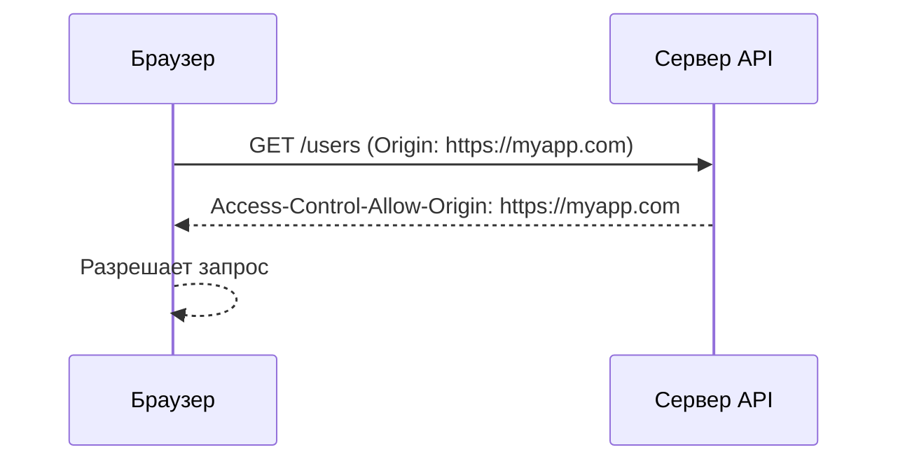
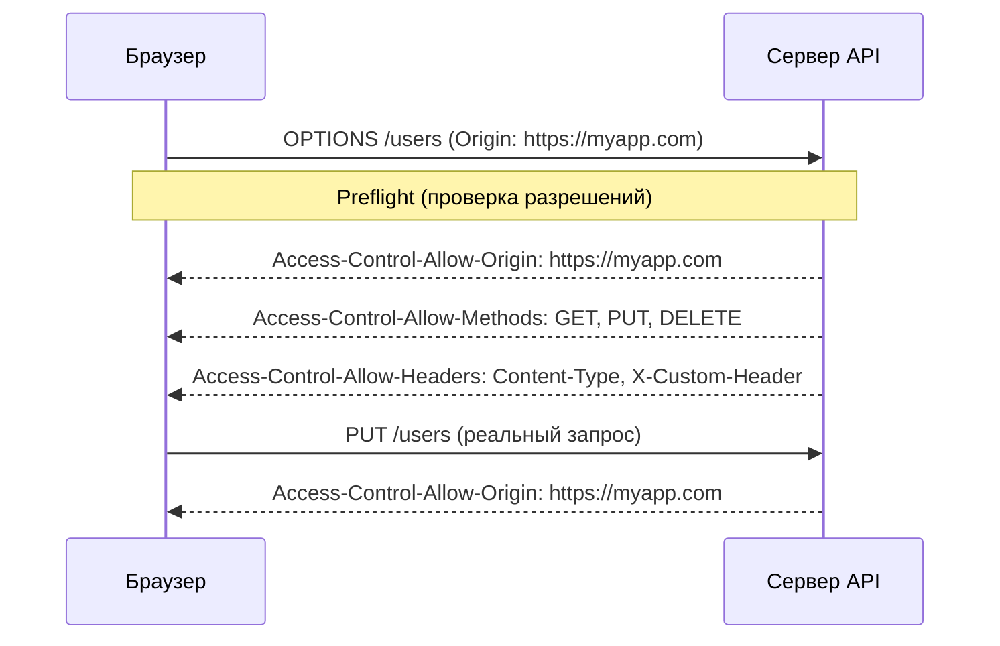

## Введение: Политика безопасности браузера

Представьте, что вы входите в банк через главную дверь. Охранник проверяет паспорт и пропускает вас. Но если вы попытаетесь зайти в банк через окно, охранник вас остановит — это подозрительно.

В веб-браузерах есть похожий "охранник" — **Same-Origin Policy** (политика одного источника). Она запрещает веб-странице делать запросы к другому домену, протоколу или порту.

**CORS (Cross-Origin Resource Sharing)** — это механизм, который позволяет серверу "разрешить" браузеру делать запросы с других источников. Это как охранник, который пропускает вас через окно, если у вас есть специальный пропуск.

Same-Origin Policy — это защита. CORS — это способ ослабить эту защиту контролируемым образом.

## Same-Origin Policy (Политика одного источника)

### Что считается одним источником (origin)

Два URL считаются одним источником, если совпадают:

| Компонент | Пример 1 | Пример 2 | Совпадают? |
| :--- | :--- | :--- | :--- |
| **Протокол** | `https://` | `http://` | ❌ Нет |
| **Домен** | `example.com` | `api.example.com` | ❌ Нет |
| **Порт** | `:443` | `:8080` | ❌ Нет |

**Примеры разных источников:**

```
https://example.com/page.html
http://example.com/page.html    (разный протокол)

https://example.com/page.html
https://api.example.com/data    (разный домен)

https://example.com/page.html
https://example.com:8080/data   (разный порт)
```

### Что запрещает Same-Origin Policy

Браузер запрещает JavaScript с одного источника читать ответы от другого источника.

```javascript
// Код на https://myapp.com
fetch('https://api.another.com/users')
    .then(response => response.json())
    .catch(error => console.log('Ошибка CORS!'));
```

Браузер заблокирует этот запрос, потому что `myapp.com` и `api.another.com` — разные источники.

## Зачем нужен CORS

### Проблема

Вы разрабатываете SPA (Single Page Application) на `https://myapp.com`. Ваш API находится на `https://api.myapp.com` (разные источники). Браузер блокирует запросы.

### Решение

Сервер API добавляет специальные заголовки, которые говорят браузеру: "Этому источнику можно".

```http
Access-Control-Allow-Origin: https://myapp.com
```

## Как работает CORS

### Простой запрос (Simple Request)

Запрос считается простым, если:

- Метод: `GET`, `POST`, `HEAD`
- Заголовки: только `Accept`, `Accept-Language`, `Content-Language`, `Content-Type` (только `application/x-www-form-urlencoded`, `multipart/form-data`, `text/plain`)

**Пример простого запроса:**

```javascript
fetch('https://api.example.com/users', {
    method: 'GET',
    headers: {
        'Content-Type': 'application/x-www-form-urlencoded'
    }
});
```

**Что происходит:**



### Preflight запрос (предварительный)

Запрос с нестандартным методом или заголовком сначала отправляет `OPTIONS` запрос.

```javascript
fetch('https://api.example.com/users', {
    method: 'PUT',  // не простой метод
    headers: {
        'Content-Type': 'application/json',  // не простой Content-Type
        'X-Custom-Header': 'value'           // не стандартный заголовок
    }
});
```

**Что происходит:**



## Основные CORS заголовки

| Заголовок (ответ сервера) | Значение | Пример |
| :--- | :--- | :--- |
| `Access-Control-Allow-Origin` | Разрешённые источники | `https://myapp.com`, `*` |
| `Access-Control-Allow-Methods` | Разрешённые HTTP методы | `GET, POST, PUT, DELETE` |
| `Access-Control-Allow-Headers` | Разрешённые заголовки | `Content-Type, X-Custom` |
| `Access-Control-Allow-Credentials` | Разрешены ли куки | `true` |
| `Access-Control-Max-Age` | Кеширование preflight (сек) | `3600` |
| `Access-Control-Expose-Headers` | Какие заголовки видны клиенту | `X-Total-Count` |

### Заголовки запроса (от браузера)

| Заголовок | Значение | Пример |
| :--- | :--- | :--- |
| `Origin` | Источник, откуда идёт запрос | `https://myapp.com` |
| `Access-Control-Request-Method` | Какой метод будет в основном запросе | `PUT` |
| `Access-Control-Request-Headers` | Какие заголовки будут | `X-Custom-Header` |

## Примеры настройки CORS

### Разрешить всё (не безопасно)

```http
Access-Control-Allow-Origin: *
```

**Когда использовать:** Публичные API без аутентификации (погода, курсы валют).

**Предупреждение:** Не работает с `credentials: 'include'` (куки, авторизация).

### Разрешить конкретный источник

```http
Access-Control-Allow-Origin: https://myapp.com
```

**Когда использовать:** Продакшен, где известен домен клиента.

### Разрешить несколько источников (динамически)

Сервер проверяет заголовок `Origin` и возвращает его, если он в белом списке.

```python
# Python (Flask)
ALLOWED_ORIGINS = ['https://myapp.com', 'https://admin.myapp.com']

@app.after_request
def add_cors_headers(response):
    origin = request.headers.get('Origin')
    if origin in ALLOWED_ORIGINS:
        response.headers['Access-Control-Allow-Origin'] = origin
        response.headers['Access-Control-Allow-Methods'] = 'GET, POST, PUT, DELETE'
        response.headers['Access-Control-Allow-Headers'] = 'Content-Type, Authorization'
    return response
```

### Разрешить куки и авторизацию

```http
Access-Control-Allow-Origin: https://myapp.com
Access-Control-Allow-Credentials: true
```

**Клиент должен указать `credentials: 'include'`:**

```javascript
fetch('https://api.example.com/users', {
    credentials: 'include'  // отправлять куки
});
```

**Важно:** При `Allow-Credentials: true` нельзя использовать `*` в `Allow-Origin`. Нужно указывать конкретный источник.

## CORS в разных фреймворках

### Express.js (Node.js)

```javascript
const cors = require('cors');

// Разрешить всё (не безопасно)
app.use(cors());

// Разрешить конкретный источник
app.use(cors({
    origin: 'https://myapp.com'
}));

// Динамически
app.use(cors({
    origin: function (origin, callback) {
        const allowed = ['https://myapp.com', 'https://admin.myapp.com'];
        if (!origin || allowed.includes(origin)) {
            callback(null, true);
        } else {
            callback(new Error('Not allowed by CORS'));
        }
    },
    methods: ['GET', 'POST', 'PUT', 'DELETE'],
    allowedHeaders: ['Content-Type', 'Authorization'],
    credentials: true,
    maxAge: 3600
}));
```

### Django

```python
# Установка: pip install django-cors-headers

# settings.py
INSTALLED_APPS = [
    'corsheaders',
]

MIDDLEWARE = [
    'corsheaders.middleware.CorsMiddleware',
]

CORS_ALLOWED_ORIGINS = [
    'https://myapp.com',
    'https://admin.myapp.com',
]

CORS_ALLOW_METHODS = [
    'GET', 'POST', 'PUT', 'DELETE', 'OPTIONS'
]

CORS_ALLOW_HEADERS = [
    'content-type',
    'authorization',
]

CORS_ALLOW_CREDENTIALS = True
```

### Spring Boot (Java)

```java
@Configuration
public class CorsConfig implements WebMvcConfigurer {
    
    @Override
    public void addCorsMappings(CorsRegistry registry) {
        registry.addMapping("/api/**")
            .allowedOrigins("https://myapp.com", "https://admin.myapp.com")
            .allowedMethods("GET", "POST", "PUT", "DELETE")
            .allowedHeaders("Content-Type", "Authorization")
            .allowCredentials(true)
            .maxAge(3600);
    }
}
```

### Nginx

```nginx
location /api/ {
    add_header 'Access-Control-Allow-Origin' 'https://myapp.com';
    add_header 'Access-Control-Allow-Methods' 'GET, POST, PUT, DELETE, OPTIONS';
    add_header 'Access-Control-Allow-Headers' 'Content-Type, Authorization';
    
    if ($request_method = 'OPTIONS') {
        add_header 'Access-Control-Allow-Origin' 'https://myapp.com';
        add_header 'Access-Control-Allow-Methods' 'GET, POST, PUT, DELETE';
        add_header 'Access-Control-Allow-Headers' 'Content-Type, Authorization';
        add_header 'Content-Length' 0;
        return 204;
    }
    
    proxy_pass http://backend;
}
```

## CORS ошибки и их решение

### Ошибка 1: No 'Access-Control-Allow-Origin'

```
Access to fetch at 'https://api.example.com/users' from origin 'https://myapp.com' has been blocked by CORS policy: No 'Access-Control-Allow-Origin' header is present.
```

**Решение:** Добавить заголовок на сервере.

### Ошибка 2: Credentials + Wildcard

```
The value of the 'Access-Control-Allow-Origin' header in the response must not be the wildcard '*' when the request's credentials mode is 'include'.
```

**Решение:** Указать конкретный источник, не `*`.

### Ошибка 3: Preflight 405 Method Not Allowed

```
Method OPTIONS is not allowed by Access-Control-Allow-Methods
```

**Решение:** Разрешить метод `OPTIONS` на сервере.

### Ошибка 4: Missing CORS header on redirect

Запрос отправлен на `https://api.example.com`, но сервер вернул редирект на `https://api.example.com/auth`. CORS заголовки потерялись.

**Решение:** Настроить CORS на всех возможных ответах (включая ошибки и редиректы).

### Ошибка 5: Private Network Access

Запрос с HTTPS страницы на HTTP локальный сервер (localhost) может блокироваться.

**Решение:** Использовать HTTPS везде или настроить CORS для локальной разработки.

## Безопасность и CORS

### Что CORS НЕ защищает

CORS не защищает сервер от прямых запросов (curl, Postman, скрипты). Он работает только в браузере.

```bash
# Это всегда работает, даже без CORS
curl https://api.example.com/users
```

### CORS как защита пользователя

CORS защищает пользователя от вредоносных сайтов, которые пытаются украсть его данные с другого сайта (где он авторизован).

**Пример атаки (без CORS):**

1. Вы авторизованы на `bank.com`
2. Вы заходите на `evil.com`
3. `evil.com` пытается сделать `fetch('https://bank.com/transfer?to=evil&amount=1000')`
4. Без CORS — браузер заблокирует запрос (защита)

### Рекомендации по безопасности

| Рекомендация | Почему |
| :--- | :--- |
| **Не используйте `*` с credentials** | Уязвимость для атак |
| **Ограничивайте список источников** | Чем меньше, тем безопаснее |
| **Ограничивайте методы** | `GET, POST, PUT, DELETE`, не `*` |
| **Ограничивайте заголовки** | Только необходимые |
| **Используйте `Access-Control-Max-Age`** | Уменьшает количество preflight запросов |
| **Не полагайтесь только на CORS** | Сервер должен проверять авторизацию |

## CORS vs CSP vs CSRF

| Механизм | Назначение | Что защищает |
| :--- | :--- | :--- |
| **CORS** | Разрешает кросс-доменные запросы | Браузерные запросы |
| **CSP (Content Security Policy)** | Запрещает загрузку ресурсов с недоверенных источников | XSS, инъекции |
| **CSRF токен** | Защищает от подделки межсайтовых запросов | Формы, не-GET запросы |

**Кратко:**
- **CORS** — "кому можно делать запросы к моему API"
- **CSP** — "откуда можно загружать скрипты, стили, картинки"
- **CSRF** — "защита от злых сайтов, которые используют твою сессию"

## Распространённые ошибки

### Ошибка 1: CORS включён только для успешных ответов

При ошибке (500, 404) сервер не добавляет CORS заголовки, браузер блокирует ответ, клиент не видит ошибку.

**Исправление:** Добавлять CORS заголовки на все ответы (включая ошибки).

### Ошибка 2: `*` с `credentials: 'include'`

```javascript
fetch('https://api.example.com/users', {
    credentials: 'include'
});
```

Сервер с `Access-Control-Allow-Origin: *` вызовет ошибку.

**Исправление:** Указать конкретный источник.

### Ошибка 3: Нет OPTIONS обработчика

Preflight запрос (OPTIONS) падает с 404.

**Исправление:** Обрабатывать OPTIONS на сервере.

### Ошибка 4: Разрешать все заголовки

```http
Access-Control-Allow-Headers: *
```

**Исправление:** Указывать конкретные заголовки.

### Ошибка 5: Большой `Access-Control-Max-Age`

Клиент кеширует preflight на день, а вы за это время поменяли настройки CORS.

**Исправление:** Начинать с небольшого `Max-Age` (например, 600), потом увеличивать.

## Резюме для системного аналитика

1. **CORS (Cross-Origin Resource Sharing)** — механизм, позволяющий браузеру делать запросы к другому источнику. Без CORS браузер блокирует кросс-доменные запросы (Same-Origin Policy).

2. **Same-Origin Policy** — защита браузера. Запрещает странице с одного источника читать данные с другого. Протокол, домен, порт — должны совпадать.

3. **Как работает CORS:** Сервер добавляет заголовок `Access-Control-Allow-Origin`. Браузер проверяет его и разрешает или блокирует запрос.

4. **Preflight (OPTIONS):** Для нестандартных запросов (PUT, DELETE, JSON) браузер сначала отправляет `OPTIONS` запрос, чтобы проверить разрешения.

5. **Основные заголовки:**
   - `Access-Control-Allow-Origin` — разрешённые источники
   - `Access-Control-Allow-Methods` — разрешённые методы
   - `Access-Control-Allow-Headers` — разрешённые заголовки
   - `Access-Control-Allow-Credentials` — разрешены ли куки
   - `Access-Control-Max-Age` — кеширование preflight

1. **Безопасность:** CORS не защищает сервер от прямых запросов (curl). Он защищает пользователя от вредоносных сайтов. Не используйте `*` с credentials.