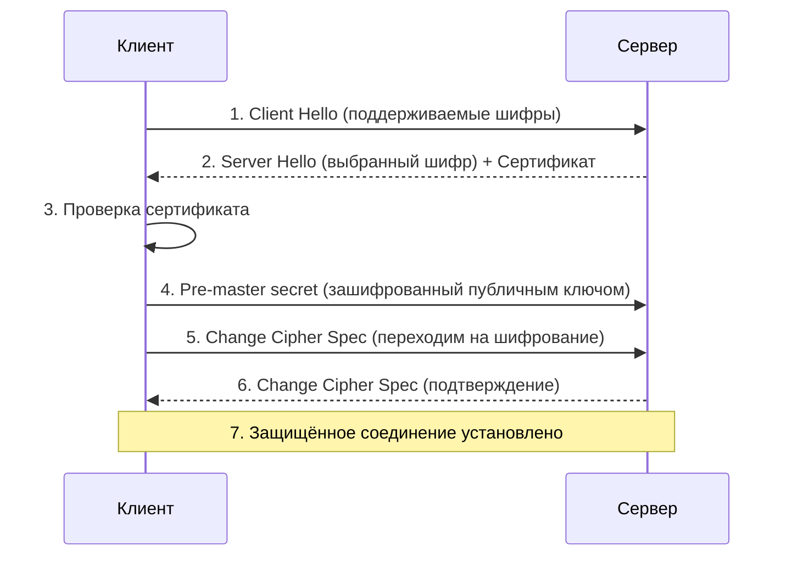
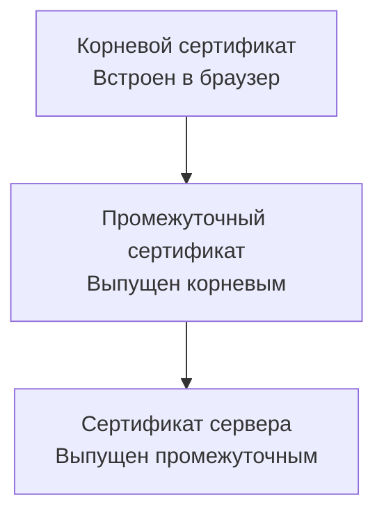
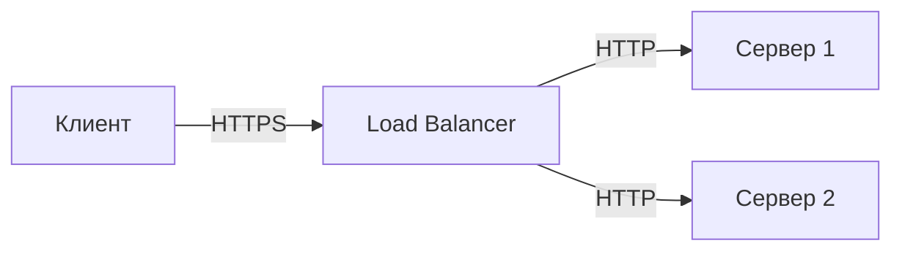
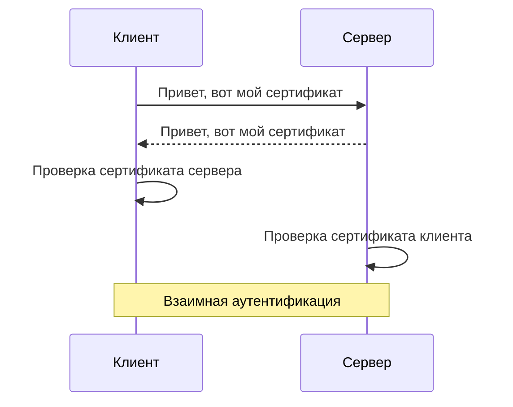

## Введение: Безопасная доставка

Представьте, что вы отправляете письмо по почте. Вы кладёте его в конверт, заклеиваете, пишете адрес. Но почтальон может открыть конверт и прочитать письмо. Может изменить текст. Может отправить письмо не тому адресату.

В интернете данные передаются через множество серверов, маршрутизаторов, провайдеров. Без защиты любой, кто находится на пути, может перехватить и прочитать ваши данные, изменить их или подделать.

**HTTPS (Hypertext Transfer Protocol Secure)** — это защищённая версия HTTP. Она шифрует все данные между браузером и сервером, проверяет, что сервер — это тот, за кого себя выдаёт, и гарантирует, что данные не были изменены в пути.

В основе HTTPS лежит **TLS (Transport Layer Security)** — протокол шифрования, который обеспечивает три вещи:

| Свойство | Что значит | Аналогия |
| :--- | :--- | :--- |
| **Конфиденциальность** | Никто не может прочитать данные | Письмо в запечатанном конверте |
| **Целостность** | Данные не были изменены | Пломба на конверте |
| **Аутентификация** | Сервер — тот, за кого себя выдаёт | Паспорт курьера |

Без HTTPS ваш API — открытая книга. Пароли, токены, личные данные — всё передаётся открытым текстом. Использовать Basic Auth без HTTPS? Пароль передаётся в Base64 — любой может его декодировать. Использовать JWT без HTTPS? Токен могут украсть и использовать.

## HTTP vs HTTPS

| Аспект | HTTP | HTTPS |
| :--- | :--- | :--- |
| **Порт** | 80 | 443 |
| **Шифрование** | Нет | Да (TLS/SSL) |
| **Аутентификация сервера** | Нет | Да (сертификат) |
| **Целостность данных** | Нет | Да |
| **Скорость** | Быстрее | Медленнее (handshake) |
| **SEO** | Плохо | Хорошо (Google ранжирует выше) |
| **Современные API** | Не рекомендуется | Обязательно |

## Как работает TLS

### TLS Handshake (рукопожатие)



### Шаги handshake (упрощённо)

1. **Client Hello:** Клиент говорит: "Я поддерживаю шифры: AES-256, ChaCha20, ..."
2. **Server Hello + Сертификат:** Сервер выбирает шифр и отправляет свой сертификат.
3. **Проверка сертификата:** Клиент проверяет, что сертификат подписан доверенным центром.
4. **Обмен ключами:** Клиент генерирует секрет, шифрует его публичным ключом сервера.
5. **Защищённое соединение:** Обе стороны переходят на шифрование.

### Что такое TLS 1.2, 1.3

| Версия | Год | Особенности | Безопасность |
| :--- | :--- | :--- | :--- |
| **SSL 2.0, 3.0** | 1995 | Устаревшие, небезопасные | ❌ Не использовать |
| **TLS 1.0** | 1999 | Устаревший | ❌ Не использовать |
| **TLS 1.1** | 2006 | Устаревший | ❌ Не использовать |
| **TLS 1.2** | 2008 | Современный, широко используется | ✅ |
| **TLS 1.3** | 2018 | Самый быстрый и безопасный | ✅✅ |

**TLS 1.3 преимущества:**
- 1-RTT вместо 2-RTT (быстрее)
- Удалены старые небезопасные шифры
- Обязательное шифрование сертификата

## TLS Сертификаты

### Что такое сертификат

Сертификат — это цифровой документ, который удостоверяет, что сервер — это тот, за кого себя выдаёт.

**Содержимое сертификата:**

| Поле | Пример |
| :--- | :--- |
| **Common Name (CN)** | `api.example.com` |
| **Subject Alternative Name (SAN)** | `api.example.com`, `example.com`, `*.example.com` |
| **Issuer (кто выпустил)** | `Let's Encrypt`, `DigiCert`, `AWS` |
| **Valid From** | `2024-01-01` |
| **Valid To** | `2025-01-01` |
| **Public Key** | `-----BEGIN PUBLIC KEY-----...` |
| **Signature** | Подпись центра сертификации |

### Цепочка доверия (Chain of Trust)



- **Корневой сертификат (Root CA):** Встроен в браузеры и ОС. Абсолютное доверие.
- **Промежуточный сертификат (Intermediate CA):** Выпущен корневым. Для подписи серверных сертификатов.
- **Сертификат сервера (Leaf Certificate):** Выпущен промежуточным. Принадлежит вашему серверу.

### Типы сертификатов

| Тип | Описание | Кому подходит |
| :--- | :--- | :--- |
| **Domain Validation (DV)** | Только подтверждение владения доменом | Личные сайты, блоги |
| **Organization Validation (OV)** | + проверка организации | Бизнес-сайты |
| **Extended Validation (EV)** | + юридическая проверка | Банки, e-commerce |
| **Wildcard** | `*.example.com` — все субдомены | API с субдоменами |
| **Multi-domain (SAN)** | Несколько доменов в одном сертификате | Несколько сервисов |

### Где взять сертификат

| Провайдер                   | Стоимость     | Особенность                              |
| :-------------------------- | :------------ | :--------------------------------------- |
| **Let's Encrypt**           | Бесплатно     | Автоматическое обновление каждые 90 дней |
| **AWS Certificate Manager** | Бесплатно     | Только для AWS сервисов                  |
| **Cloudflare**              | Бесплатно     | Для доменов через Cloudflare             |
| **DigiCert**                | $200-1000/год | Enterprise, EV сертификаты               |
| **Sectigo (Comodo)**        | $50-300/год   | Популярный                               |

## HSTS (HTTP Strict Transport Security)

HSTS — заголовок, который говорит браузеру: "Всегда используй HTTPS для этого сайта, даже если пользователь ввёл HTTP".

```http
Strict-Transport-Security: max-age=31536000; includeSubDomains; preload
```

| Директива | Значение |
| :--- | :--- |
| `max-age=31536000` | Действует 1 год (в секундах) |
| `includeSubDomains` | Применяется ко всем субдоменам |
| `preload` | Добавить в список предзагрузки браузеров |

**Что даёт HSTS:**
- Защита от downgrade атак (когда злоумышленник заставляет использовать HTTP)
- Браузер никогда не отправит HTTP запрос

**Риск:** Если HTTPS сломается, пользователи не смогут зайти даже через HTTP.

## TLS в API Gateway и Load Balancer

В современных архитектурах TLS часто заканчивается на балансировщике, а внутри сети используется HTTP.



**Преимущества:**
- Управление сертификатами в одном месте
- Меньше нагрузки на серверы (TLS handshake тяжёлый)
- Гибкость (можно менять серверы, не меняя сертификаты)

**Пример AWS ALB:**

```yaml
# AWS Application Load Balancer
Listeners:
  - Protocol: HTTPS
    Port: 443
    Certificate: arn:aws:acm:us-east-1:123:certificate/abc123
    DefaultAction:
      Type: forward
      TargetGroupName: my-api

TargetGroup:
  - Protocol: HTTP
    Port: 8080
    HealthCheckPath: /health
```

## TLS для мобильных приложений

### Особенности

- Мобильные приложения не показывают ошибки сертификатов (в отличие от браузеров)
- Нужна дополнительная проверка (Certificate Pinning)

### Certificate Pinning

Приложение запоминает сертификат (или публичный ключ) сервера и проверяет его при каждом соединении.

**Пример (Android, OkHttp):**

```kotlin
val pinner = CertificatePinner.Builder()
    .add("api.example.com", "sha256/AAAAAAAAAAAAAAAAAAAAAAAAAAAAAAAAAAAAAAAAAAA=")
    .build()

val client = OkHttpClient.Builder()
    .certificatePinner(pinner)
    .build()
```

**Когда использовать:** Банковские приложения, приложения с высокими требованиями безопасности.

## mTLS (Mutual TLS)

В обычном TLS клиент проверяет сервер. В **mTLS** сервер тоже проверяет клиента.



**Когда использовать:**
- B2B интеграции (высокая безопасность)
- Микросервисы внутри кластера (например, Istio)
- Банковские API

## Общие ошибки при настройке HTTPS

### Ошибка 1: Использование HTTP для API

```javascript
fetch('http://api.example.com/users')
```

**Исправление:** Всегда HTTPS.

### Ошибка 2: Неправильное имя в сертификате

Сертификат для `example.com`, а API на `api.example.com`.

**Исправление:** Wildcard сертификат (`*.example.com`) или SAN.

### Ошибка 3: Истёкший сертификат

Сертификат действителен год, потом истекает.

**Исправление:** Автоматическое обновление (Let's Encrypt), мониторинг срока действия.

### Ошибка 4: Mixed content

HTML через HTTPS, а картинки, скрипты, стили через HTTP.

**Исправление:** Все ресурсы через HTTPS.

### Ошибка 5: Слабые шифры

```nginx
# Плохо (TLS 1.0, слабые шифры)
ssl_protocols TLSv1 TLSv1.1 TLSv1.2;
ssl_ciphers '3DES:RC4:MD5';

# Хорошо
ssl_protocols TLSv1.2 TLSv1.3;
ssl_ciphers 'ECDHE-ECDSA-AES128-GCM-SHA256:ECDHE-RSA-AES128-GCM-SHA256';
```

## Проверка безопасности HTTPS

### Онлайн инструменты

| Инструмент | Что проверяет |
| :--- | :--- |
| **SSL Labs (ssllabs.com)** | Рейтинг A+ |
| **securityheaders.com** | HSTS, CSP, другие заголовки |
| **crt.sh** | История сертификатов |

### Командная строка

```bash
# Проверка сертификата
openssl s_client -connect api.example.com:443 -servername api.example.com

# Проверка срока действия
echo | openssl s_client -connect api.example.com:443 2>/dev/null | openssl x509 -noout -dates

# Тест HSTS
curl -I https://api.example.com | grep -i "strict-transport-security"
```

## Будущее: TLS 1.3 и QUIC

### TLS 1.3

| Особенность | TLS 1.2 | TLS 1.3 |
| :--- | :--- | :--- |
| **Время handshake** | 2-RTT | 1-RTT (или 0-RTT) |
| **Устаревшие шифры** | Есть | Удалены |
| **Шифрование сертификата** | Нет | Да |

### QUIC / HTTP/3

- Использует UDP вместо TCP
- Встроенное шифрование (TLS 1.3)
- Быстрее установка соединения (0-RTT)

## Резюме для системного аналитика

1. **HTTPS = HTTP + TLS.** Шифрует данные между клиентом и сервером. Обеспечивает конфиденциальность, целостность, аутентификацию.

2. **TLS (Transport Layer Security)** — протокол шифрования. Текущие версии: TLS 1.2 и 1.3. TLS 1.3 быстрее и безопаснее.

3. **TLS сертификат** — удостоверяет личность сервера. Выпускается центрами сертификации (CA). Let's Encrypt — бесплатно.

4. **Как работает:** Handshake → проверка сертификата → обмен ключами → шифрованное соединение.

5. **HSTS (Strict-Transport-Security)** — заголовок, заставляющий браузер всегда использовать HTTPS. Защита от downgrade атак.

6. **mTLS (Mutual TLS)** — взаимная аутентификация. Сервер проверяет клиента. Для B2B, микросервисов.

7. **Всегда используйте HTTPS в продакшене.** Даже для внутренних API (защита от перехвата в локальной сети). Даже для разработки, если приложение будет подключаться к продакшену.