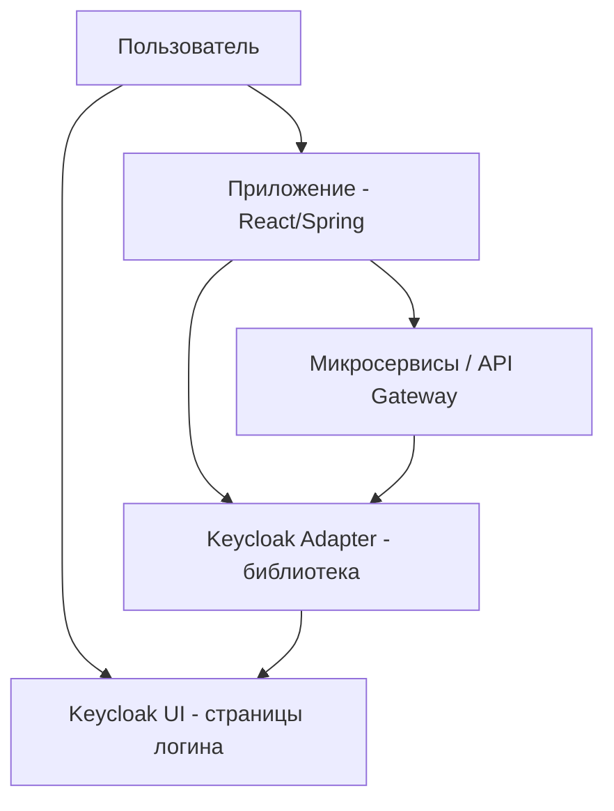
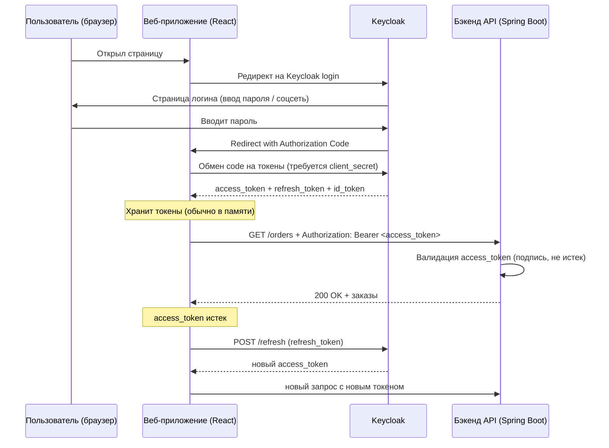

В современных приложениях часто требуется единый вход (SSO), поддержка разных способов аутентификации (логин/пароль, Google, GitHub, SAML, LDAP) и централизованное управление пользователями и ролями. Реализовывать это каждый раз с нуля — дорого и небезопасно.

**Keycloak** — это open-source решение для управления идентификацией и доступом (IAM). Оно реализует протоколы OAuth 2.0, OpenID Connect и SAML 2.0, предоставляя готовые компоненты: регистрация и вход пользователей, сброс пароля, двухфакторная аутентификация (2FA), социальные логины, администрирование пользователей, ролей и групп.

Keycloak часто используют как единый "центр выдачи токенов" (Authorization Server) в микросервисной архитектуре, заменяя самописные реализации аутентификации.

## Основные возможности Keycloak

### OAuth 2.0 и OpenID Connect (OIDC)

- Выдача Access Token (JWT) для доступа к API.
- Выдача ID Token (JWT) с информацией о пользователе (email, имя).
- Выдача Refresh Token для продления сессии.
- Поддержка всех типов grant flows (Authorization Code, Client Credentials, Resource Owner Password — deprecated, Device Code).

### SAML 2.0

- Интеграция с корпоративными приложениями и системами, которые поддерживают только SAML (например, устаревшие CRM).

### Social Login (социальные сети)

- Вход через Google, GitHub, Facebook, Twitter, GitLab и других провайдеров.
- Можно добавлять собственных провайдеров через API.

### Управление пользователями

- Готовый административный интерфейс (Web UI) для создания пользователей, ролей, групп.
- Поддержка LDAP и Active Directory (синхронизация пользователей из корпоративного каталога).

### Двухфакторная аутентификация (2FA)

- TOTP (Google Authenticator, FreeOTP).
- SMS (через интеграцию с внешними сервисами).
- WebAuthn (биометрия, ключи безопасности).

### Сброс пароля и email-подтверждение

- Встроенные страницы для восстановления пароля и подтверждения email (можно кастомизировать).
- Настройка срока жизни ссылок.

### Реализация единого входа (SSO)

- Пользователь входит один раз в Keycloak, и получает доступ ко всем подключённым приложениям (клиентам), не вводя пароль повторно.

## Архитектура Keycloak



### Компоненты

| Компонент | Назначение |
| :--- | :--- |
| **Keycloak Server** | Центральный сервер, реализующий OAuth2 / OIDC. Хранит пользователей, роли, клиентов, выдаёт токены. |
| **Admin Console** | Веб-интерфейс для настройки realm, клиентов, пользователей и ролей. |
| **Account Console** | Личный кабинет пользователя (сменить пароль, настроить 2FA, посмотреть активные сессии). |
| **Adapter (Client Library)** | Библиотека для приложения (Spring Security, JavaScript adapter, Node.js), которая упрощает проверку токенов и инициирует аутентификацию. |

### Терминология

- **Realm** — изолированное пространство (tenant). Поддерживает своих пользователей, клиентов, группы. Например, "realm для тестовой среды", "realm для продакшена". Из одного Keycloak могут работать несколько независимых realm.
- **Client** — приложение, которое регистрируется в Keycloak. Каждый клиент имеет `client_id` и, возможно, `client_secret`. Клиент получает токены от Keycloak.
- **User** — конечный пользователь, хранится в realm. Может иметь атрибуты (email, имя).
- **Role** — роль (например, `admin`, `user`, `manager`). Может быть назначена пользователю или группе.
- **Group** — группа пользователей. Удобно назначать роли и атрибуты на всю группу сразу.

## Типовой сценарий работы (Web-приложение + REST API)



## Установка и интеграция (для аналитика)

Для быстрого знакомства Keycloak можно запустить в Docker:

```bash
docker run -p 8080:8080 -e KEYCLOAK_ADMIN=admin -e KEYCLOAK_ADMIN_PASSWORD=admin quay.io/keycloak/keycloak:latest start-dev
```

После запуска:
- **Admin Console** доступна по адресу `http://localhost:8080/admin` (логин admin/admin)
- **Account Console** по адресу `http://localhost:8080/realms/myrealm/account`

### Регистрация клиента (приложения)

В Admin Console вы создаете client:
- `Client ID`: `my-web-app`
- `Client Protocol`: `openid-connect`
- `Access Type`: `confidential` (если приложение имеет бэкенд, который может хранить secret) или `public` (для SPA)
- `Valid Redirect URIs`: `http://localhost:3000/*`

Keycloak сгенерирует `client_secret` (для confidential). Этот secret должен знать только бэкенд приложения.

### Настройка scope (роли / права)

Вы определяете роли в realm (например, `user`, `admin`, `manager`). Затем в клиенте (или в realm) создаёте маппинг, чтобы эти роли попадали в `access_token`. Бэкенд API проверяет наличие роли в токене.

### Интеграция с приложением на Spring Boot (примерно)

```yaml
spring:
  security:
    oauth2:
      resourceserver:
        jwt:
          issuer-uri: http://localhost:8080/realms/myrealm
```

В коде достаточно аннотации `@PreAuthorize("hasRole('admin')")`. Spring автоматически проверяет токен через Keycloak.

## Преимущества использования Keycloak

- **Готовая UI для логина, регистрации, сброса пароля, 2FA** — не нужно писать ничего самим.
- **SSO (Single Sign-On).** Одна сессия в Keycloak для всех приложений.
- **Социальные логины** (Google, GitHub, Facebook) без сложной интеграции.
- **Стандартные протоколы** (OIDC, OAuth2, SAML) — не привязываетесь к вендору.
- **Управление пользователями** — административный UI, синхронизация с LDAP/AD.
- **Гибкость.** Можно расширять на Java (свои провайдеры, темы, скрипты).
- **Open Source с активным сообществом**, лицензия Apache 2.0.

## Недостатки и сложности (откровенно о них)

- **Keycloak — тяжелая Java-та. Потребляет минимум 512 МБ — 1 ГБ RAM.** Для небольших проектов может быть оверхедом.
- **Сложность первичной настройки:** realm, clients, roles, маппинг атрибутов — нужно разобраться.
- **База данных.** Keycloak требует базу данных (PostgreSQL, MySQL, MariaDB) для хранения пользователей и сессий. В production это дополнительные расходы.
- **Не умеет горизонтально масштабироваться "из коробки"** — при кластеризации нужен распределённый кэш (Infinispan, Hazelcast). Это сложно настраивать.
- **Версионирование и миграции:** обновление Keycloak с LTS на следующий LTS может быть нетривиальным.
- **Безопасность.** Keycloak должен быть очень хорошо защищён (компрометация админа = компрометация всех приложений).

## Keycloak vs самописный JWT (сравнение)

| Критерий | Keycloak | Самописный JWT |
| :--- | :--- | :--- |
| **UI для логина** | Готовый, сброс пароля, 2FA | Нужно писать самим |
| **Управление пользователями** | Админка из коробки | Нужно разрабатывать |
| **Social login** | Готово | Интегрироваться с каждым провайдером отдельно |
| **SSO (единый вход)** | Да | Настраивать сложно |
| **Сложность развертывания** | Средняя | Очень низкая |
| **Нагрузка на инфраструктуру** | Высокая (Java + БД) | Низкая (легковесный сервис) |
| **Поддержка специфических flows** | OAuth2, OIDC, SAML | Только то, что реализуете сами |
| **Компетенции команды** | Нужен инженер, знающий Keycloak | Достаточно знать JWT |

## Что нужно знать аналитику о Keycloak

- Keycloak — это готовый Authorization Server. Он выдаёт и проверяет JWT токены, управляет пользователями и ролями, реализует SSO и 2FA.
- Если в проекте есть требования к единому входу (SSO), интеграции с Google/GitHub, встроенной регистрации пользователей и двухфакторной аутентификации — Keycloak почти всегда проще, чем писать это с нуля.
- Keycloak требует собственной базы данных (PostgreSQL) и не тривиален в горизонтальном масштабировании. Для маленьких проектов (до 1000 пользователей) можно ставить один экземпляр.
- Аналитик должен указать в архитектурных требованиях:
  - Какие способы аутентификации требуются (пароль, соцсети, LDAP).
  - Какие роли и права нужны в системе (можно определить в Keycloak и передавать в токене).
  - Требования к длительности Access Token и Refresh Token.
  - Нужен ли SSO между несколькими приложениями.

**Альтернативы Keycloak:**
- **Auth0** (SaaS, платный, проще, но не open source)
- **Okta** (корпоративный)
- **Hydra** (легковесный OAuth2 сервер, нет UI)
- **Zitadel** (современная альтернатива на Go)
- **Dex** (для Kubernetes, OIDC, не имеет UI)