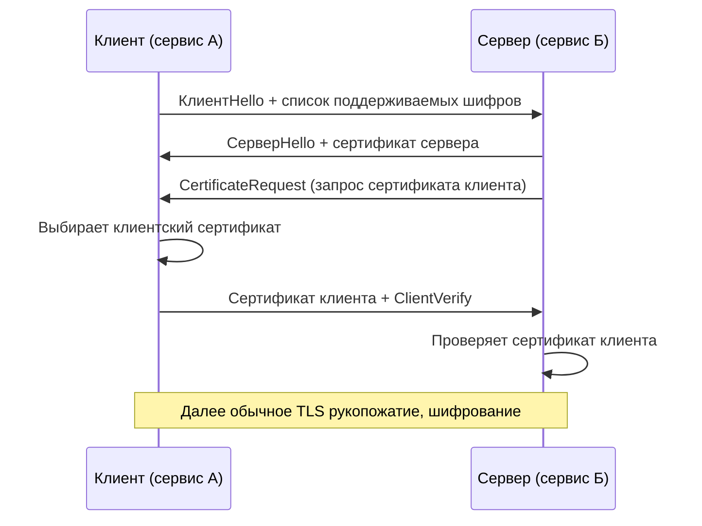

## mTLS (Mutual TLS)

Обычный TLS (HTTPS) защищает данные, передаваемые между клиентом и сервером, от подслушивания и подмены. Но он аутентифицирует только сервер. Клиент знает, что он подключился к правильному серверу (потому что проверяет сертификат сервера), но сервер не проверяет, кто подключился к нему. В открытом интернете этого достаточно: Amazon не нужно знать, что к нему зашёл именно Иван с конкретным паспортом, — достаточно, чтобы соединение было зашифровано.

Однако в микросервисной архитектуре (особенно в закрытых контурах) часто нужно, чтобы и сервер удостоверялся, что клиент — это действительно тот сервис, за который себя выдаёт. Например, сервис платежей не должен принимать запросы от левого клиента — только от сервиса заказов.

**mTLS (Mutual TLS, двухсторонний TLS)** — это расширение протокола TLS, при котором обе стороны (клиент и сервер) проверяют сертификаты друг друга. Клиент предъявляет свой сертификат на этапе рукопожатия, и сервер его проверяет. Только после этого начинается передача данных.

## Как это работает (детали)

1. Клиент инициирует соединение и отправляет `ClientHello`.
2. Сервер отвечает `ServerHello` и своим сертификатом (обычный TLS).
3. **Дополнительно** сервер отправляет `CertificateRequest` — запрос сертификата клиента.
4. Клиент выбирает свой сертификат (обычно X.509) и отправляет его серверу.
5. Клиент подписывает часть предыдущего сообщения своим приватным ключом (чтобы доказать владение сертификатом).
6. Сервер проверяет:
   - Сертификат клиента выпущен доверенным удостоверяющим центром (CA).
   - Сертификат не истёк и не отозван.
   - Копия сертификата соответствует предъявленному (через `ClientVerify`).
7. Если проверка прошла, TLS-соединение устанавливается, и данные передаются в зашифрованном виде.

Таким образом, mTLS обеспечивает:
- **Аутентификацию клиента** (сервер знает, какой именно сервис или пользователь подключился).
- **Шифрование трафика** (как и обычный TLS).
- **Защиту от MITM** (человек посередине не может подделать сертификат без доступа к приватному ключу).

## Где применяется mTLS

### Микросервисная архитектура (сервис-сервис)

Внутри дата-центра (или Kubernetes) между сервисами часто требуется взаимная аутентификация. Сервис А должен быть уверен, что он общается именно с сервисом Б, а не с самозванцем. mTLS позволяет настроить сеть так, что только сервисы с валидными сертификатами могут взаимодействовать.

### API Gateway и внутренние сервисы

Внешний клиент аутентифицируется через JWT/OAuth2. API Gateway проверяет токен, а уже к внутренним сервисам Gateway подключается по mTLS, чтобы каждый внутренний сервис был уверен, что запрос пришёл именно от Gateway, а не извне напрямую.

### Платежные системы и интеграции с банками

Банки часто требуют mTLS для взаимодействия: клиент предъявляет сертификат, выданный банком, и сервер банка проверяет его. Это стандарт безопасности в финансовом секторе (PCI DSS). Кстати, это один из ключевых признаков такой интеграции: "у вас должен быть сертификат, который мы подпишем".

### Kubernetes Service Mesh

Популярные решения (Istio, Linkerd) используют mTLS "из коробки" для шифрования и аутентификации трафика между подами. При включении strict mTLS поды без валидного сертификата не могут общаться между собой, что сильно повышает безопасность кластера.

## Как организовать mTLS: компоненты

| Компонент | Назначение |
| :--- | :--- |
| **CA (Certificate Authority)** | Центр сертификации, который выпускает и подписывает сертификаты. Может быть публичным (DigiCert) или внутренним (CFSSL, OpenSSL, Vault). |
| **Клиентский сертификат (X.509)** | Содержит публичный ключ клиента, идентификатор (CN = Common Name, часто имя сервиса) и подпись CA. |
| **Серверный сертификат** | Обычный TLS-сертификат для сервера. |
| **Приватные ключи** | Хранятся в секрете на клиенте и на сервере. |

**Процесс выпуска:**
1. Администратор генерирует ключевую пару (приватный и публичный ключи) для каждого сервиса.
2. Генерирует запрос на подпись сертификата (CSR) и отправляет в CA.
3. CA подписывает сертификат своим приватным ключом.
4. Сервис получает подписанный сертификат и сохраняет его (вместе с приватным ключом) в безопасное хранилище.

В Kubernetes это можно автоматизировать с помощью cert-manager и Issuer (самоподписанный или Let's Encrypt). Для mTLS внутри кластера обычно используют собственный CA на базе cert-manager.

## mTLS vs обычный TLS (HTTPS)

| Аспект | Обычный TLS | mTLS |
| :--- | :--- | :--- |
| **Проверка сервера** | Да (сертификат сервера) | Да |
| **Проверка клиента** | Нет (обычно) | Да (сертификат клиента отправляется при рукопожатии) |
| **Защита от MITM** | Да | Да |
| **Кому нужен сертификат** | Только серверу | И серверу, и клиенту |
| **Управление идентификацией** | Не требуется | Требуется управление сертификатами клиентов (CA для выдачи и отзыва) |
| **Сложность эксплуатации** | Низкая | Высокая (ротация сертификатов, отзыв, хранение приватных ключей) |

## Преимущества mTLS

- **Сильная аутентификация.** Невозможно подделать — нужен приватный ключ, соответствующий сертификату.
- **Шифрование трафика.** Даже внутри дата-центра.
- **Защита от подстановки.** Только авторизованные клиенты с валидным сертификатом могут установить соединение.
- **Совместимость.** Работает со стандартными TLS-библиотеками, не нужно изобретать проприетарные протоколы.

## Недостатки и сложности

- **Управление сертификатами.** Отличить живой сертификат от просроченного, отозвать скомпрометированный, автоматически ротировать (обновлять) — нетривиальная задача.
- **Начальная настройка.** Нужно поднять свой CA (или договориться с публичным), выпустить сертификаты, развернуть их на клиентах.
- **Производительность.** Двустороннее рукопожатие добавляет накладные расходы (два обмена сертификатами и проверки подписей), но для внутреннего трафика это обычно незаметно.
- **Не для браузеров / публичных пользователей.** mTLS требует от клиента наличия сертификата, что неприменимо для обычного веб-трафика (пользователи не установят себе сертификат). Поэтому mTLS используется для машинных (сервис-сервис) взаимодействий.

## Что должен знать аналитик о mTLS

- mTLS — это аутентификация на транспортном уровне, в отличие от OAuth2/JWT (прикладной уровень).
- При проектировании системы, где требуется железобезопасный контур (например, внутреннее API между микросервисами), можно требовать mTLS.
- Если интеграция требует "обмен сертификатами" (партнёр высылает .crt файл, вы ему свой), это почти наверняка mTLS.
- В отличие от секретов (API-ключей), сертификаты имеют счётчик времени жизни. Аналитик должен учитывать необходимость их ротации (обновления) — иначе интеграция неожиданно сломается.
- mTLS не отменяет авторизацию. После того как клиент аутентифицирован, нужно ещё проверить, может ли этот сервис выполнять данное действие (обычно по CN или SAN в сертификате).

**Когда стоит предлагать mTLS в проекте:**

- Интеграция с банками, платёжными системами, госсервисами (требование регуляторов).
- Внутренняя сеть микросервисов в изолированной среде (Kubernetes) как дополнительный слой защиты поверх других механизмов.
- Сценарии, где JWT/OAuth2 недостаточно (например, нужна аутентификация на уровне транспортного соединения, а не каждого запроса).
- Распределённые системы с высокими требованиями к безопасности (нельзя доверять паролям и токенам).

**Когда mTLS избыточен:**

- Публичное API с простой аутентификацией по API-ключам или JWT.
- Проекты без спецтребований к идентификации клиента (где достаточно, чтобы клиент знал секрет).
- Команды, не готовые к управлению сертификатами (отсутствие автоматизации ротации).