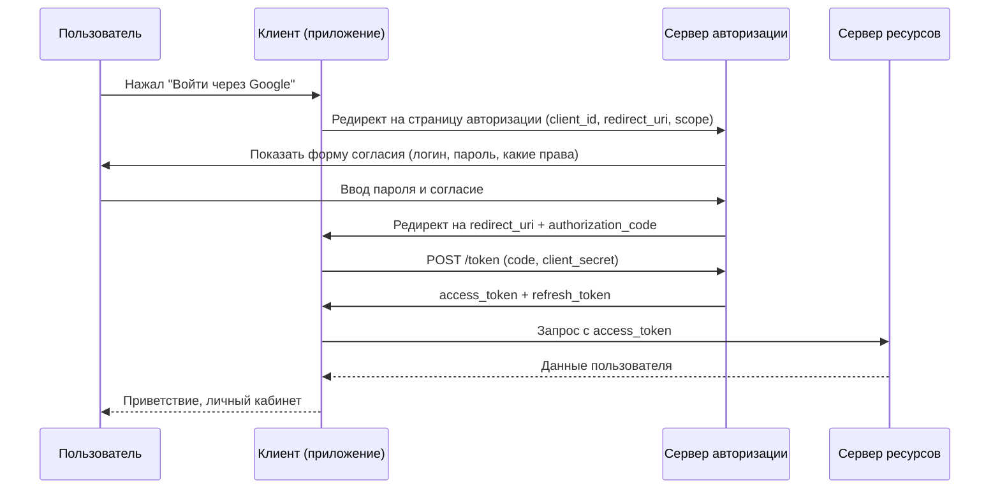

Представьте, что вы хотите дать мобильному приложению для печати фотографий доступ к вашим снимкам в Google Фото. Вы не хотите отдавать приложению свой пароль от Google — вдруг оно его сохранит или начнет удалять фото. Вместо этого вы используете механизм, при котором:

- Google (сервер авторизации) спрашивает ваше согласие (разрешение).
- После вашего согласия Google выдаёт приложению ограниченный, временный ключ (токен) для доступа к нужным фото.
- Приложение использует этот ключ, а ваш пароль остаётся в тайне.

Так работает **OAuth 2.0**.

**OAuth 2.0** — это протокол авторизации, который позволяет одному приложению (клиенту) получить ограниченный доступ к данным пользователя на другом сервисе (сервере ресурсов) без передачи учётных данных (пароля) пользователя. OAuth 2.0 широко используется для авторизации через соцсети ("Войти через Google"), для API-доступа сторонних приложений и для корпоративной федерации.

Важно понимать: OAuth 2.0 — это про авторизацию (что можно делать), а не про аутентификацию (кто вы). Однако на практике его часто применяют и для аутентификации (через OpenID Connect, надстройку над OAuth).

## Основные участники (роли)

| Роль | Описание | Пример |
| :--- | :--- | :--- |
| **Resource Owner (владелец ресурса)** | Пользователь, который владеет данными и может дать доступ к ним | Вы (человек) |
| **Client (клиент)** | Приложение, которое хочет получить доступ к данным пользователя | Мобильное приложение для печати фото |
| **Authorization Server (сервер авторизации)** | Сервер, который выдает токены после получения согласия пользователя | Сервер Google OAuth |
| **Resource Server (сервер ресурсов)** | Сервер, который хранит данные пользователя и предоставляет к ним API | Google Photos API |

## Как работает OAuth 2.0: основной поток (Authorization Code Grant)

Это самый безопасный и распространенный вариант для веб-приложений и публичных клиентов.

### Пошагово

1. **Запрос авторизации.** Клиент перенаправляет пользователя на сервер авторизации с параметрами: `client_id` (идентификатор клиента), `redirect_uri` (куда вернуться), `scope` (какие права запрашиваются, например, чтение фото, доступ к профилю).
2. **Аутентификация и согласие пользователя.** Пользователь вводит свой пароль на сервере авторизации (не в приложении) и видит список запрашиваемых прав. Он либо подтверждает, либо отклоняет доступ.
3. **Выдача авторизационного кода.** Сервер авторизации перенаправляет пользователя обратно в клиент по `redirect_uri` с одноразовым `authorization_code`.
4. **Обмен кода на токены.** Клиент (только бэкенд клиента!) отправляет `authorization_code`, `client_id`, `client_secret` и `redirect_uri` на эндпоинт `/token` сервера авторизации.
5. **Получение токенов.** Сервер авторизации выдаёт `access_token` (короткоживущий) и `refresh_token` (долгоживущий, опционально).
6. **Доступ к ресурсам.** Клиент использует `access_token` в заголовке `Authorization: Bearer <token>` для запросов к серверу ресурсов.

## Типы Grant Flow (способы получения токена)

OAuth 2.0 не предписывает один способ, а предлагает несколько вариантов в зависимости от типа клиента (публичный/конфиденциальный) и сценария.

| Grant Type | Когда использовать | Безопасность | Примечание |
| :--- | :--- | :--- | :--- |
| **Authorization Code** | Веб-приложения, мобильные приложения с бэкендом | Высокая | Самый распространённый |
| **Authorization Code + PKCE** | SPA, мобильные приложения без бэкенда | Высокая | Замена небезопасному Implicit flow |
| **Implicit** | Устарел | Низкая (токен в URL) | Не используйте в новых проектах |
| **Client Credentials** | Машина-к-машине (сервис-сервис) | Высокая (если защитить `client_secret`) | Нет пользователя |
| **Resource Owner Password** | Только для доверенных клиентов (почти не используется) | Низкая | Требует передачи пароля |
| **Device Code** | Устройства с ограниченным вводом (Smart TV, консоли) | Средняя | Пользователь вводит код на другом устройстве |

### Authorization Code + PKCE (Proof Key for Code Exchange)

Для одностраничных приложений (SPA) и нативных мобильных приложений, которые не могут безопасно хранить `client_secret`, используется **PKCE** (произносится "pixy"). Клиент генерирует случайную строку (`code_verifier`) и её хеш (`code_challenge`). При обмене кода на токены приложение передаёт `code_verifier`, что доказывает, что оно является тем же клиентом, который начинал поток.

### Client Credentials

Используется, когда клиент действует от своего имени, а не от имени пользователя. Например, ваш бэкенд хочет обновить список валют с центрального сервиса. Нет пользователя, только пара `client_id` + `client_secret`, и сервер выдаёт токен напрямую.

## Токены

### Access Token

- **Формат:** JWT (хотя стандарт допускает любые форматы).
- **Срок жизни:** Короткий (от 5 минут до 1 часа).
- **Содержит:** `scope` (права), `client_id`, `user_id` (если от имени пользователя), время истечения.
- **Предъявляется** к Resource Server в заголовке `Authorization: Bearer <token>`.

### Refresh Token

- **Назначение:** Получить новый Access Token после истечения старого.
- **Срок жизни:** Длинный (дни, месяцы).
- **Предъявляется** только на эндпоинт `/token` сервера авторизации, а не к Resource Server.
- **Отзыв:** Сервер авторизации может отозвать Refresh Token (например, при логауте пользователя или смене пароля). После отзыва выдача нового Access Token становится невозможной.

### ID Token (OpenID Connect)

OpenID Connect — это слой аутентификации поверх OAuth 2.0. ID Token — это JWT, который содержит информацию об аутентифицированном пользователе (`sub`, `email`, `name`). Используется для входа (кто пользователь), а не для доступа к API.

## Scope (область доступа)

`scope` — это список разрешений, которые клиент запрашивает и которые сервер авторизации выдает в токене.

**Примеры scope (Google):**

- `profile` — чтение имени, фото, даты рождения.
- `email` — чтение email.
- `https://www.googleapis.com/auth/photos.readonly` — чтение фото.
- `https://www.googleapis.com/auth/photos.delete` — удаление фото.

Пользователь видит запрашиваемые scope при выдаче согласия и может одобрить только их часть (меньшую, чем запросил клиент). Scope — ключевой механизм минимизации прав (least privilege).

## Безопасность OAuth 2.0

### Основные угрозы

| Угроза | Описание | Меры защиты |
| :--- | :--- | :--- |
| **Перехват authorization_code** | Злоумышленник перехватывает код при передаче через браузер | `redirect_uri` проверяется сервером авторизации; код одноразовый, истекает через минуты |
| **Кража Access Token** | Злоумышленник получает токен (через XSS, перехват, лог) | Короткое время жизни (5-15 минут); использование TLS всегда |
| **Утечка Refresh Token** | Хуже, чем кража Access Token, так как позволяет воровать токены долго | Хранить Refresh Token в HttpOnly cookie с `Secure` и `SameSite`; отзыв при компрометации |
| **CSRF (Cross-Site Request Forgery)** | Злоумышленник инициирует авторизацию от лица пользователя | Использовать параметр `state` (случайная строка, которую клиент проверяет при возврате) |
| **Clickjacking** | Страница согласия отображается в невидимом фрейме, пользователь случайно одобряет | Сервер должен включать заголовок `X-Frame-Options: DENY` или `Content-Security-Policy` |

### Практические рекомендации (must-have)

- **Всегда используйте HTTPS** для всех эндпоинтов OAuth (TLS обязателен).
- **Для публичных клиентов (SPA, мобильные) используйте PKCE**, никогда не встраивайте `client_secret` в клиентский код.
- **Поддерживайте короткое время жизни Access Token** (10-15 минут) и реализуйте обновление через Refresh Token.
- **Refresh Token храните в HttpOnly cookie** с `Secure` и `SameSite=Strict`, а Access Token — в памяти приложения (JavaScript).
- **Проверяйте `redirect_uri`** на сервере авторизации, не доверяйте клиенту.
- **Используйте `state`** для защиты от CSRF.

## OAuth 2.0 в микросервисах (Gateway-шаблон)

В микросервисной архитектуре часто используется схема:

- **API Gateway** проверяет Access Token (подпись, срок, scope) и извлекает `user_id` и `client_id`.
- Внутренние сервисы получают уже проверенный `user_id` в заголовке (например, `X-User-Id`).
- Внутренние сервисы могут не проверять подпись JWT, доверяя Gateway.

Это позволяет централизовать проверку токенов и снизить связанность сервисов с сервером авторизации.

## OAuth 2.0 vs JWT (в чём разница)

| Аспект | JWT | OAuth 2.0 |
| :--- | :--- | :--- |
| **Что такое** | Формат токена | Протокол для получения токенов |
| **Назначение** | Безопасная передача утверждений между сторонами | Делегирование доступа |
| **Включает** | Подпись, полезную нагрузку, заголовок | Процедуры получения токенов, типы grant, обмен кодов |
| **Может использоваться** | Как Access Token в OAuth 2.0 | С JWT в качестве формата токена |

## Что должен знать аналитик о OAuth 2.0

Аналитик может не настраивать сервер авторизации, но должен:

- Понимать роли: Resource Owner, Client, Authorization Server, Resource Server.
- Знать, какой grant flow подходит для сценария (Web-приложение → Authorization Code, мобильное → Authorization Code + PKCE, сервис-сервис → Client Credentials).
- При проектировании API определять, какие `scope` нужны для каждого эндпоинта. Например, `scope=orders:read` требуется для `GET /orders`, `scope=orders:write` для `POST /orders`.
- Фиксировать требования к безопасности: короткое время жизни Access Token, защита Refresh Token (HttpOnly cookie), обязательное использование `state`.
- Указывать в контрактах, что API принимает токен в заголовке `Authorization: Bearer <token>` и какие права (scope) необходимы.