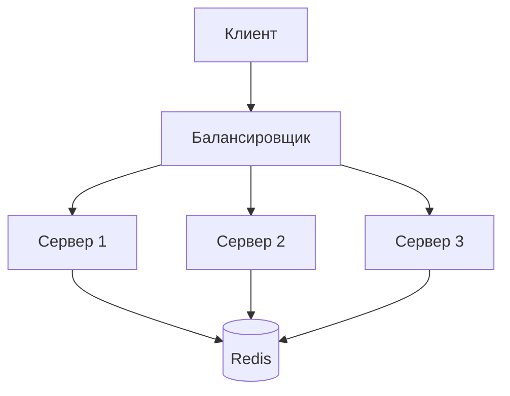

## Введение: Зачем ограничивать скорость

Представьте, что вы открыли кафе. Обычно вы обслуживаете 50 гостей в час. Но в один прекрасный день приходит группа из 500 человек и хочет кофе. Ваши бариста не справляются, очередь растёт, гости злятся, качество падает. Чтобы этого избежать, вы ставите ограничение: "Не более 100 гостей в час. Остальные — подождите".

В мире API то же самое. Сервер может обработать определённое количество запросов в секунду. Если клиентов слишком много, сервер перегружается, время ответа растёт, а потом сервер падает.

**Rate Limiting (ограничение частоты запросов)** — это механизм, который ограничивает количество запросов, которые клиент может отправить за определённый промежуток времени.

Rate limiting защищает сервер от перегрузки, от злоумышленников, от случайных ошибок в клиентском коде и от недобросовестных клиентов. Это не только техническая мера, но и бизнес-инструмент: в платных API разные тарифы имеют разные лимиты.

## Зачем нужен Rate Limiting

| Причина | Объяснение |
| :--- | :--- |
| **Защита от DDoS-атак** | Злоумышленник не сможет завалить сервер миллионом запросов |
| **Защита от брутфорса** | Нельзя перебирать пароли миллион раз в секунду |
| **Справедливость** | Один клиент не может занять весь ресурс сервера |
| **Стабильность** | Сервер работает в предсказуемом режиме |
| **Бизнес-монетизация** | Бесплатный тариф — 100 запросов/день, платный — 10 000 |
| **Защита от ошибок в клиенте** | Бесконечный цикл не убьёт сервер |

## Алгоритмы Rate Limiting

### 1. Fixed Window (Фиксированное окно)

**Как работает:** Время разбивается на окна фиксированной длины (например, 1 минута). В каждом окне разрешено N запросов. Счётчик обнуляется в начале следующего окна.

```mermaid
gantt
    title Fixed Window (10 запросов/минуту)
    dateFormat ss
    axisFormat %Ss
    
    section Окно 1 (00:00-00:59)
    Запрос 1 :00, 0s
    Запрос 2 :02, 0s
    Запрос 3 :10, 0s
    Запрос 4 :15, 0s
    Запрос 5 :20, 0s
    Запрос 6 :25, 0s
    Запрос 7 :30, 0s
    Запрос 8 :40, 0s
    Запрос 9 :45, 0s
    Запрос 10:50, 0s
    
    section Окно 2 (01:00-01:59)
    Запрос 11:00, 0s
```



**Пример кода:**

```python
class FixedWindow:
    def __init__(self, limit, window_seconds):
        self.limit = limit
        self.window_seconds = window_seconds
        self.window_start = time.time()
        self.counter = 0
    
    def allow(self):
        now = time.time()
        if now - self.window_start > self.window_seconds:
            self.window_start = now
            self.counter = 0
        if self.counter < self.limit:
            self.counter += 1
            return True
        return False
```

**Проблема:** На границе окон можно сделать 2× лимит.

**Пример:** Лимит 10 запросов/минуту. В 00:59:59 вы сделали 10 запросов. В 01:00:01 — ещё 10. Итого 20 запросов за 2 секунды.

### 2. Sliding Window (Скользящее окно)

**Как работает:** Учитывает запросы за последние N секунд (не с начала минуты, а за последние 60 секунд). Требует хранения временных меток запросов.

```mermaid
gantt
    title Sliding Window (10 запросов/минуту)
    dateFormat ss
    axisFormat %Ss
    
    section Окно (последние 60 секунд)
    Запрос 1 :00, 0s
    Запрос 2 :10, 0s
    Запрос 3 :20, 0s
    Запрос 4 :30, 0s
    Запрос 5 :40, 0s
    Запрос 6 :50, 0s
    
    section Текущий запрос (55 секунд)
    Запрос 7 :55, 0s
```



**Пример кода (точный, с хранением всех timestamps):**

```python
class SlidingWindow:
    def __init__(self, limit, window_seconds):
        self.limit = limit
        self.window_seconds = window_seconds
        self.requests = []
    
    def allow(self):
        now = time.time()
        # Удаляем старые запросы
        self.requests = [t for t in self.requests if t > now - self.window_seconds]
        if len(self.requests) < self.limit:
            self.requests.append(now)
            return True
        return False
```

**Проблема:** Требует хранения всех timestamps (память).

### 3. Sliding Window Counter (компромисс)

**Как работает:** Хранит только счётчики за текущую и предыдущую минуту. Вес предыдущей минуты уменьшается линейно.

```python
class SlidingWindowCounter:
    def __init__(self, limit, window_seconds):
        self.limit = limit
        self.window_seconds = window_seconds
        self.current_window_start = time.time()
        self.current_counter = 0
        self.previous_counter = 0
    
    def allow(self):
        now = time.time()
        # Переключение окна
        if now - self.current_window_start > self.window_seconds:
            self.previous_counter = self.current_counter
            self.current_counter = 0
            self.current_window_start = now
        
        # Расчёт веса предыдущего окна
        prev_weight = 1 - (now - self.current_window_start) / self.window_seconds
        total = self.current_counter + self.previous_counter * prev_weight
        
        if total < self.limit:
            self.current_counter += 1
            return True
        return False
```

### 4. Token Bucket (Корзина токенов)

**Как работает:** В корзине хранятся токены. Каждый запрос забирает один токен. Токены добавляются с фиксированной скоростью.

```python
class TokenBucket:
    def __init__(self, capacity, refill_rate):
        self.capacity = capacity
        self.refill_rate = refill_rate  # токенов в секунду
        self.tokens = capacity
        self.last_refill = time.time()
    
    def allow(self):
        now = time.time()
        # Добавляем токены
        elapsed = now - self.last_refill
        self.tokens = min(self.capacity, self.tokens + elapsed * self.refill_rate)
        self.last_refill = now
        
        if self.tokens >= 1:
            self.tokens -= 1
            return True
        return False
```

**Преимущества:** Позволяет "всплески" (bursts). Если корзина полная, можно сделать несколько запросов подряд.

### 5. Leaky Bucket (Дырявое ведро)

**Как работает:** Запросы попадают в очередь и обрабатываются с постоянной скоростью.

```python
class LeakyBucket:
    def __init__(self, capacity, leak_rate):
        self.capacity = capacity
        self.leak_rate = leak_rate  # запросов в секунду
        self.water = 0
        self.last_leak = time.time()
    
    def allow(self):
        now = time.time()
        # "Вытекаем"
        elapsed = now - self.last_leak
        self.water = max(0, self.water - elapsed * self.leak_rate)
        self.last_leak = now
        
        if self.water < self.capacity:
            self.water += 1
            return True
        return False
```

## Сравнение алгоритмов

| Алгоритм | Память | Всплески | Точность | Сложность |
| :--- | :--- | :--- | :--- | :--- |
| **Fixed Window** | Низкая | Нет (проблема на границе) | Низкая | Низкая |
| **Sliding Window (точный)** | Высокая | Нет | Высокая | Высокая |
| **Sliding Window Counter** | Низкая | Нет | Средняя | Средняя |
| **Token Bucket** | Низкая | Да | Высокая | Средняя |
| **Leaky Bucket** | Низкая | Нет (очередь) | Высокая | Средняя |

**Рекомендации:**
- **Token Bucket** — лучший выбор для большинства случаев (поддерживает всплески, не требует много памяти)
- **Fixed Window** — простой, но с проблемой на границах
- **Sliding Window** — точный, но дорогой по памяти

## Где применять Rate Limiting

| Уровень | Пример | Почему |
| :--- | :--- | :--- |
| **По пользователю** | 100 запросов/час | Защита от одного злоумышленника |
| **По IP** | 1000 запросов/час | Защита от DDoS |
| **По API ключу** | 10 000 запросов/день | Монетизация, тарифы |
| **По эндпоинту** | GET /login — 5 запросов/мин | Защита от брутфорса |
| **Глобально** | 10 000 запросов/сек | Защита сервера от перегрузки |

## HTTP заголовки Rate Limiting

Стандарт **RFC 6585** определяет заголовки для rate limiting.

| Заголовок | Значение | Пример |
| :--- | :--- | :--- |
| `X-RateLimit-Limit` | Максимум запросов в окне | `X-RateLimit-Limit: 100` |
| `X-RateLimit-Remaining` | Осталось запросов | `X-RateLimit-Remaining: 42` |
| `X-RateLimit-Reset` | Время сброса (Unix timestamp) | `X-RateLimit-Reset: 1704067200` |
| `Retry-After` | Через сколько секунд можно повторить (при 429) | `Retry-After: 3600` |

### Пример ответа при превышении

```http
HTTP/1.1 429 Too Many Requests
Content-Type: application/json
X-RateLimit-Limit: 100
X-RateLimit-Remaining: 0
X-RateLimit-Reset: 1704067200
Retry-After: 3600

{
    "error": "Rate limit exceeded",
    "message": "You have exceeded your 100 requests per hour limit",
    "reset_at": "2024-01-01T12:00:00Z"
}
```

## Rate Limiting в реальных API

### GitHub API

```http
GET /users/octocat
```

```http
HTTP/1.1 200 OK
X-RateLimit-Limit: 60
X-RateLimit-Remaining: 59
X-RateLimit-Reset: 1704067200
```

### Twitter API

```http
GET /1.1/statuses/user_timeline.json
```

```http
HTTP/1.1 200 OK
x-rate-limit-limit: 900
x-rate-limit-remaining: 899
x-rate-limit-reset: 1704067200
```

### Stripe API

```http
GET /v1/charges
```

```http
HTTP/1.1 200 OK
x-ratelimit-limit: 100
x-ratelimit-remaining: 99
x-ratelimit-reset: 1704067200
```

## Rate Limiting в распределённых системах

### Проблема

Если у вас несколько серверов, счётчик нужно хранить в общем месте.



### Решения

| Решение | Плюсы | Минусы |
| :--- | :--- | :--- |
| **Redis** | Быстро, атомарные операции (INCR) | Дополнительный компонент |
| **БД (PostgreSQL)** | Просто, если БД уже есть | Медленнее Redis |
| **Локальный + приблизительный** | Нет общих компонентов | Неточный, зависит от балансировки |

### Пример с Redis (Token Bucket)

```python
import redis
import time

r = redis.Redis()

def allow_request(user_id, limit=100, window=3600):
    key = f"ratelimit:{user_id}"
    current = r.get(key)
    
    if current is None:
        r.setex(key, window, 1)
        return True
    
    current = int(current)
    if current < limit:
        r.incr(key)
        return True
    
    return False
```

## Rate Limiting по разным измерениям

| Измерение | Ключ в Redis | Пример лимита |
| :--- | :--- | :--- |
| **По пользователю** | `ratelimit:user:{user_id}` | 100/час |
| **По IP** | `ratelimit:ip:{ip}` | 1000/час |
| **По API ключу** | `ratelimit:apikey:{api_key}` | 10000/день |
| **По эндпоинту** | `ratelimit:user:{user_id}:login` | 5/мин |
| **Комбинированный** | `ratelimit:{user_id}:{endpoint}` | 10/мин на логин, 100/мин на поиск |

## Стратегии при превышении лимита

### 1. Жёсткое ограничение (Hard limit)

Запросы сверх лимита отклоняются с 429.

**Когда использовать:** Публичные API, критичные системы.

### 2. Мягкое ограничение (Soft limit)

Запросы сверх лимита обрабатываются, но с предупреждением в заголовках.

**Когда использовать:** Внутренние системы, отладка.

### 3. Приоритизация

Запросы платных клиентов обрабатываются, бесплатные — отклоняются.

**Когда использовать:** SaaS платформы.

### 4. Очередь (Queue)

Запросы сверх лимита встают в очередь и обрабатываются позже.

**Когда использовать:** Асинхронные системы, batch-обработка.

## Rate Limiting для разных тарифов

```yaml
# Тарифы API
plans:
  free:
    limit: 100
    window: 86400   # 24 часа
    burst: 10
  pro:
    limit: 10000
    window: 86400
    burst: 100
  enterprise:
    limit: 1000000
    window: 86400
    burst: 1000
```

```python
def get_limit(user):
    plan = db.users.get(user.id).plan
    limits = {
        'free': {'limit': 100, 'window': 86400},
        'pro': {'limit': 10000, 'window': 86400},
        'enterprise': {'limit': 1000000, 'window': 86400}
    }
    return limits[plan]
```

## Rate Limiting и брутфорс

Особый случай — защита от перебора паролей.

```python
# Лимит на логин: 5 попыток за 5 минут
def check_login_rate_limit(ip, username):
    key = f"login:fail:{ip}:{username}"
    attempts = redis.get(key) or 0
    
    if attempts >= 5:
        return False
    
    return True

def record_failed_login(ip, username):
    key = f"login:fail:{ip}:{username}"
    redis.incr(key)
    redis.expire(key, 300)  # 5 минут
```

## Инструменты для Rate Limiting

| Инструмент | Тип | Описание |
| :--- | :--- | :--- |
| **NGINX (limit_req)** | Proxy | `limit_req_zone $binary_remote_addr zone=mylimit:10m rate=10r/s;` |
| **HAProxy (stick-table)** | Proxy | `stick-table type ip size 1m expire 1m store http_req_rate(10s)` |
| **Envoy** | Proxy | `rate_limits` filter |
| **Cloudflare** | CDN | Rate Limiting в панели управления |
| **AWS WAF** | Cloud | Rate-based rules |
| **Redis + Python/Go** | Библиотека | Самодельная реализация |
| **TokenBucket** | Библиотека | `pip install token-bucket` |

### Пример NGINX

```nginx
# Ограничение: 10 запросов в секунду
limit_req_zone $binary_remote_addr zone=mylimit:10m rate=10r/s;

server {
    location /api/ {
        limit_req zone=mylimit burst=20 nodelay;
        proxy_pass http://backend;
    }
}
```

## Распространённые ошибки

### Ошибка 1: Слишком низкий лимит

```python
# Плохо
limit = 10  # запросов в час

# Хорошо (в зависимости от API)
limit = 1000
```

### Ошибка 2: Слишком высокий лимит

```python
# Плохо (сервер ляжет)
limit = 1000000  # запросов в секунду

# Хорошо
limit = 100
```

### Ошибка 3: Нет заголовков

Клиент не знает, сколько запросов осталось, и не может адаптироваться.

**Исправление:** Всегда возвращать `X-RateLimit-*` заголовки.

### Ошибка 4: Rate limiting на уровне приложения (не на балансировщике)

Если у вас 10 серверов, клиент может сделать 10× лимит, обходя разные серверы.

**Исправление:** Общее хранилище (Redis) или балансировщик (NGINX).

### Ошибка 5: 429 без Retry-After

Клиент не знает, когда повторять запрос.

**Исправление:** Всегда добавлять `Retry-After`.

## Резюме для системного аналитика

1. **Rate Limiting** — ограничение частоты запросов. Защищает сервер от перегрузки, DDoS, брутфорса. Позволяет монетизировать API.

2. **Основные алгоритмы:**
   - **Fixed Window:** простой, но проблема на границах окон
   - **Sliding Window:** точный, но дорогой по памяти
   - **Token Bucket:** поддерживает всплески (bursts), лучший выбор для большинства случаев
   - **Leaky Bucket:** очередь с постоянной скоростью

3. **Где ограничивать:** по пользователю, IP, API ключу, эндпоинту, глобально.

4. **HTTP заголовки:** `X-RateLimit-Limit`, `X-RateLimit-Remaining`, `X-RateLimit-Reset`, `Retry-After`. При превышении — статус 429.

5. **В распределённых системах** нужно общее хранилище (Redis).

6. **Инструменты:** NGINX, HAProxy, Cloudflare, AWS WAF, Redis.