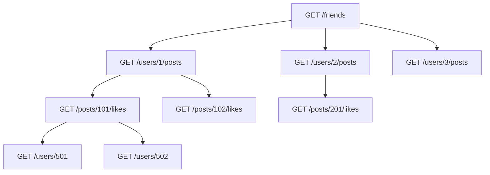

## Введение: REST хорош, но не идеален

REST — это доминирующий стиль API в современном вебе. Он прост, понятен, основан на HTTP и используется миллионами сервисов. Но у REST есть проблемы, которые становятся особенно заметными в сложных приложениях с большим количеством взаимосвязанных данных.

Представьте, что вы разрабатываете мобильное приложение для социальной сети. На главном экране нужно показать: информацию о пользователе, его последние посты, подписчиков, друзей, лайки под постами. В REST это может означать 5-10 отдельных запросов к разным эндпоинтам. Приложение медленное, трафик дорогой, батарея разряжается.

GraphQL был создан в Facebook именно для решения этих проблем. Он не отрицает ценность REST, но предлагает другой подход для сценариев, где REST показывает свои слабые места.

**Проблемы REST, которые решает GraphQL:**
1. **Over-fetching** — получение лишних данных
2. **Under-fetching** — неполучение нужных данных
3. **Множество запросов** — N+1 проблема и круговые зависимости
4. **Версионирование** — как менять API, не ломая клиентов
5. **Слабая типизация** — нет формального контракта
6. **Сложность с вложенными ресурсами** — глубокие связи требуют много запросов

## Проблема 1: Over-fetching (Избыточность данных)

### Что это такое

Over-fetching — это ситуация, когда клиент получает больше данных, чем ему нужно. Сервер возвращает весь объект целиком, а клиенту нужны только некоторые поля.

### Пример в REST

```http
GET /users/123
```

```json
{
    "id": 123,
    "name": "Иван",
    "email": "ivan@example.com",
    "phone": "+7-999-123-45-67",
    "address": "Москва, Тверская, 1",
    "birthday": "1990-01-01",
    "created_at": "2024-01-15T10:30:00Z",
    "updated_at": "2024-03-20T15:45:00Z",
    "is_active": true,
    "is_verified": true,
    "last_login": "2024-04-10T08:00:00Z",
    "preferences": {...},
    "statistics": {...},
    "settings": {...}
}
```

Мобильному приложению для отображения имени пользователя нужны только `id` и `name`. Остальные 90% данных — лишние.

### Почему это плохо

| Последствие | Объяснение |
| :--- | :--- |
| **Трафик** | Передаётся много лишних байт (особенно критично для мобильных сетей) |
| **Время загрузки** | Больше данных → дольше загрузка |
| **Память** | Приложение парсит и хранит ненужные данные |
| **Батарея** | Больше данных → больше процессорного времени |

### Как GraphQL решает

Клиент сам выбирает, какие поля ему нужны.

```graphql
query {
    user(id: "123") {
        id
        name
    }
}
```

**Ответ (только то, что попросили):**

```json
{
    "data": {
        "user": {
            "id": "123",
            "name": "Иван"
        }
    }
}
```

### Масштаб проблемы

| Сценарий | REST (данные) | GraphQL (данные) | Экономия |
| :--- | :--- | :--- | :--- |
| **Имя пользователя** | 500 байт | 50 байт | 90% |
| **Список пользователей (100 шт)** | 50 КБ | 5 КБ | 90% |
| **Список товаров с картинками** | 5 МБ | 500 КБ | 90% |

## Проблема 2: Under-fetching (Недостаточность данных)

### Что это такое

Under-fetching — это ситуация, когда одного запроса недостаточно, чтобы получить все нужные данные. Клиенту приходится делать несколько запросов, чтобы собрать полную информацию.

### Пример в REST

Нужно показать пользователя и его последние 5 постов.

```http
# Первый запрос: получить пользователя
GET /users/123
```

```json
{
    "id": 123,
    "name": "Иван"
}
```

```http
# Второй запрос: получить посты пользователя
GET /users/123/posts?limit=5
```

```json
[
    {"id": 1, "title": "Пост 1", "content": "..."},
    {"id": 2, "title": "Пост 2", "content": "..."}
]
```

Два запроса вместо одного.

### Почему это плохо

| Последствие | Объяснение |
| :--- | :--- |
| **Задержка** | Каждый запрос добавляет время (RTT — round trip time) |
| **Сложность** | Клиент должен управлять несколькими запросами, ждать все ответы |
| **Трафик** | Заголовки HTTP добавляются к каждому запросу |

### Как GraphQL решает

Один запрос может получить связанные данные.

```graphql
query {
    user(id: "123") {
        name
        posts(limit: 5) {
            id
            title
            content
        }
    }
}
```

**Ответ (один запрос):**

```json
{
    "data": {
        "user": {
            "name": "Иван",
            "posts": [
                {"id": 1, "title": "Пост 1", "content": "..."},
                {"id": 2, "title": "Пост 2", "content": "..."}
            ]
        }
    }
}
```

## Проблема 3: Множество запросов (N+1 и круговые зависимости)

### Что это такое

В сложных интерфейсах один экран может требовать данные из многих связанных ресурсов. REST часто приводит к каскаду последовательных запросов.

### Пример: Лента новостей

Для отображения ленты новостей нужно:
1. Получить список друзей
2. Для каждого друга получить его последние посты
3. Для каждого поста получить лайки
4. Для каждого лайка получить информацию о пользователе



**Количество запросов:** 1 (друзья) + N (посты друга) + M (лайки на пост) + K (пользователи лайков)

При 10 друзьях, у каждого 5 постов, на каждом посте 10 лайков → 1 + 10 + 50 + 500 = **561 запрос**!

### Почему это плохо

| Последствие | Объяснение |
| :--- | :--- |
| **Время загрузки** | Десятки или сотни запросов → секунды ожидания |
| **Нагрузка на сервер** | Каждый запрос — это обработка, БД, сеть |
| **Сложность кода** | Промисы, async/await, обработка ошибок для каждого запроса |

### Как GraphQL решает

Один запрос с глубокой вложенностью.

```graphql
query {
    me {
        friends(limit: 10) {
            posts(limit: 5) {
                likes(limit: 10) {
                    user {
                        name
                        avatar
                    }
                }
            }
        }
    }
}
```

**Один запрос, одна поездка на сервер.** Сервер сам разбирается, как эффективно собрать все данные (с помощью DataLoader для батчинга).

## Проблема 4: Версионирование

### Что это такое

Когда API меняется, нужно как-то управлять изменениями, чтобы не сломать старых клиентов. В REST это обычно делается через версионирование.

### Пример версионирования в REST

```http
GET /v1/users/123
GET /v2/users/123
GET /v3/users/123
```

**Проблемы версионирования в REST:**

| Проблема | Объяснение |
| :--- | :--- |
| **Разрастание** | v1, v2, v3, v4, v5 — нужно поддерживать все |
| **Сложность кода** | Условные операторы, адаптеры, разные сериализаторы |
| **Миграция клиентов** | Клиенты не обновляются мгновенно |

### Как GraphQL решает

GraphQL не требует версионирования. Вместо этого:

| Практика | Объяснение |
| :--- | :--- |
| **Добавляйте поля, не удаляйте** | Старые клиенты не видят новые поля, новые — используют |
| **Пометка @deprecated** | Поле помечается устаревшим, но продолжает работать |
| **Новые типы** | Вместо изменения старого типа, создайте новый |

```graphql
type User {
    id: ID!
    name: String!
    oldField: String @deprecated(reason: "Use newField instead")
    newField: String
}
```

**Результат:** Клиенты на v1 продолжают работать бесконечно. Клиенты на v2 постепенно переходят на новые поля. Нет необходимости в поддержке нескольких версий API.

## Проблема 5: Слабая типизация

### Что это такое

REST API обычно не имеет формального контракта. Документация (OpenAPI) — опциональна. Клиент узнаёт структуру ответа только во время выполнения.

### Пример

```http
GET /users/123
```

```json
{
    "id": 123,
    "name": "Иван"
}
```

Что такое `id`? Строка? Число? Что будет, если его нет? Клиент узнает только в рантайме.

### Почему это плохо

| Последствие | Объяснение |
| :--- | :--- |
| **Ошибки в рантайме** | Ошибки типов обнаруживаются только при выполнении |
| **Сложная документация** | Нужно поддерживать документацию отдельно |
| **Сложная генерация клиентов** | Сложно генерировать типизированные клиенты |

### Как GraphQL решает

GraphQL имеет строгую типизацию "из коробки". Схема — это контракт.

```graphql
type User {
    id: ID!
    name: String!
    email: String!
    age: Int
}

type Query {
    user(id: ID!): User
}
```

**Что это даёт:**

| Преимущество | Объяснение |
| :--- | :--- |
| **Валидация на этапе запроса** | Неправильный запрос (поле не существует, тип не совпадает) вернёт ошибку ДО выполнения |
| **Автодокументация** | Интроспекция даёт документацию бесплатно |
| **Автогенерация клиентов** | TypeScript, Swift, Kotlin клиенты генерируются из схемы |
| **Автодополнение в IDE** | GraphQL-плагины знают схему и подсказывают поля |

## Проблема 6: Сложность с вложенными ресурсами

### Что это такое

В REST отношения между ресурсами часто выражаются через вложенные эндпоинты.

```http
GET /users/123/posts
GET /users/123/posts/456/comments
GET /users/123/posts/456/comments/789/replies
```

### Почему это плохо

| Последствие | Объяснение |
| :--- | :--- |
| **Глубокие URL** | `/users/123/posts/456/comments/789/replies` — трудно читать |
| **Много эндпоинтов** | Каждая комбинация ресурсов требует отдельного эндпоинта |
| **Негибкость** | Если нужен другой путь (например, посты с комментариями, но без автора), нужен новый эндпоинт |

### Как GraphQL решает

В GraphQL любой тип может иметь поля любого другого типа. Нет вложенных URL — есть вложенные типы.

```graphql
query {
    user(id: "123") {
        posts {
            comments {
                replies {
                    author {
                        name
                    }
                }
            }
        }
    }
}
```

Один запрос, сколько угодно уровней вложенности. Клиент сам решает, насколько глубоко идти.

## Сравнение: REST vs GraphQL на примере

### Задача: Показать профиль пользователя с его последними 5 постами и 3 последними комментариями к каждому посту

**REST подход:**

```http
# 1. Получить пользователя
GET /users/123

# 2. Получить посты
GET /users/123/posts?limit=5

# 3. Для каждого поста (5 раз) получить комментарии
GET /posts/1/comments?limit=3
GET /posts/2/comments?limit=3
GET /posts/3/comments?limit=3
GET /posts/4/comments?limit=3
GET /posts/5/comments?limit=3
```

**Итого:** 1 + 1 + 5 = **7 запросов**

**GraphQL подход:**

```graphql
query {
    user(id: "123") {
        name
        email
        avatar
        posts(limit: 5) {
            title
            content
            createdAt
            comments(limit: 3) {
                text
                author {
                    name
                }
                createdAt
            }
        }
    }
}
```

**Итого:** **1 запрос**

## Когда REST всё ещё хорош

GraphQL решает реальные проблемы, но REST не стал плохим. REST всё ещё лучше в некоторых сценариях:

| Сценарий | Почему REST лучше |
| :--- | :--- |
| **Простые API** | CRUD над несколькими ресурсами |
| **Кеширование** | HTTP кеш (CDN, браузер) отлично работает с REST |
| **Загрузка файлов** | GraphQL не имеет встроенной поддержки |
| **Публичные API** | REST проще для внешних разработчиков |
| **Аналитика и логи** | REST эндпоинты легче анализировать |

## Резюме для системного аналитика

1. **Over-fetching** — клиент получает лишние данные. GraphQL решает: клиент сам выбирает поля.

2. **Under-fetching** — одного запроса недостаточно. GraphQL решает: один запрос может получить связанные данные любой глубины.

3. **Множество запросов (N+1)** — каскад последовательных запросов. GraphQL решает: один запрос вместо десятков или сотен.

4. **Версионирование** — поддержка нескольких версий API сложна. GraphQL решает: добавляйте поля, не удаляйте; deprecation вместо удаления.

5. **Слабая типизация** — нет формального контракта. GraphQL решает: строгая схема, валидация на этапе запроса, автодокументация.

6. **Сложность с вложенными ресурсами** — много эндпоинтов, негибкость. GraphQL решает: вложенные типы, один эндпоинт.