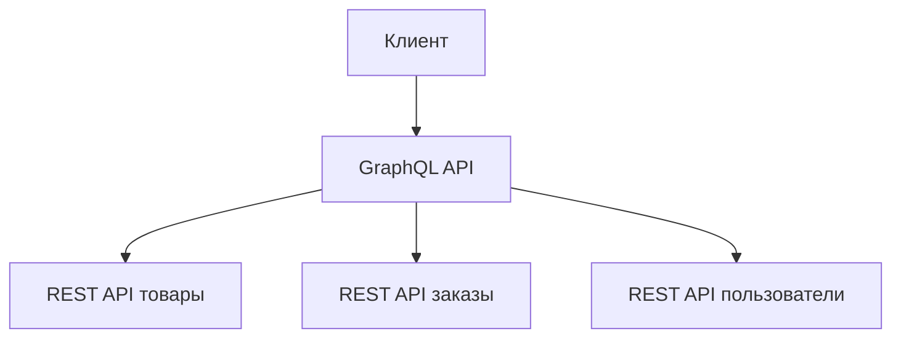
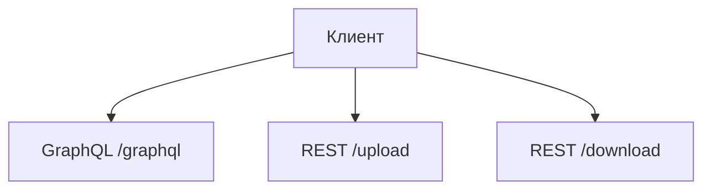

## Введение: Инструмент под задачу

В предыдущих темах мы разобрали, что такое GraphQL и какие проблемы REST он решает. GraphQL — мощный инструмент, но он не универсален. Как молоток отлично забивает гвозди, но плохо завинчивает шурупы.

**GraphQL не заменяет REST.** Он дополняет его. В некоторых сценариях GraphQL даёт огромные преимущества. В других — добавляет ненужную сложность.

Задача аналитика — понимать, когда GraphQL действительно решает проблемы, а когда REST (или другой подход) подходит лучше. В этой теме мы разберём конкретные критерии, сценарии и анти-сценарии для использования GraphQL.

## Признаки того, что GraphQL может быть хорошим выбором

### Признак 1: Множество клиентов с разными потребностями

| Ситуация | Почему GraphQL подходит |
| :--- | :--- |
| **Один API для веба, мобильных приложений (iOS/Android) и сторонних интеграций** | Каждый клиент запрашивает только то, что ему нужно |
| **У разных клиентов разные требования к данным** | Веб-версия может запрашивать больше полей, мобильная — меньше |
| **Клиенты часто меняют требования** | Не нужно менять API, клиент просто меняет запрос |

**Пример:** У вас есть мобильное приложение и веб-сайт. На главном экране мобильного приложения нужно показать только имя пользователя и аватар. На веб-сайте — имя, email, телефон, адрес, историю заказов.

- **REST:** Пришлось бы делать два разных эндпоинта (`/user/mobile` и `/user/web`) или один, который возвращает всё (over-fetching для мобилки).
- **GraphQL:** Оба клиента используют один запрос, но запрашивают разные поля.

### Признак 2: Сложные, взаимосвязанные данные

| Ситуация | Почему GraphQL подходит |
| :--- | :--- |
| **Много связей между объектами** | Пользователь → посты → комментарии → лайки → пользователи |
| **Графовые структуры** | Социальные сети, рекомендательные системы |
| **Глубокие вложенности** | Клиенту нужны данные с глубиной 3-5 уровней |

**Пример:** Лента новостей в социальной сети. Нужно показать друзей, их посты, комментарии к постам, авторов комментариев.

- **REST:** Потребуется каскад запросов (N+1 проблема). Или специальный "тяжёлый" эндпоинт, который возвращает всё, но с over-fetching.
- **GraphQL:** Один запрос с нужной глубиной вложенности.

### Признак 3: Мобильные приложения

| Ситуация | Почему GraphQL подходит |
| :--- | :--- |
| **Ограниченный трафик** | Мобильные сети дорогие, нужно минимизировать объём данных |
| **Ограниченная батарея** | Меньше запросов → меньше процессорного времени → экономия батареи |
| **Нестабильное соединение** | Один запрос (вместо многих) легче повторить при обрыве |

**Пример:** Приложение для заказа еды на телефоне.

- **REST:** 5-10 запросов для загрузки главного экрана. При плохом соединении каждый запрос может упасть.
- **GraphQL:** 1 запрос для всех данных. Проще обрабатывать ошибки и повторы.

### Признак 4: Быстрое прототипирование и часто меняющиеся требования

| Ситуация | Почему GraphQL подходит |
| :--- | :--- |
| **Требования часто меняются** | Добавили новое поле на экране — клиент просто начинает его запрашивать |
| **Продуктовая команда экспериментирует** | Можно быстро менять интерфейс без переделки бэкенда |
| **MVP (Minimum Viable Product)** | Один GraphQL эндпоинт может заменить несколько REST эндпоинтов |

**Пример:** Стартап разрабатывает новый продукт. Каждую неделю дизайн и требования меняются.

- **REST:** Каждое изменение требует нового эндпоинта или изменения существующего. Версионирование.
- **GraphQL:** Клиент просто меняет запрос. Бэкенд не трогаем.

### Признак 5: Проблемы с over-fetching или under-fetching

| Ситуация | Почему GraphQL подходит |
| :--- | :--- |
| **API возвращает слишком много данных (over-fetching)** | 90% полей в ответе не используются клиентом |
| **API возвращает слишком мало данных (under-fetching)** | Клиенту нужно делать несколько запросов, чтобы собрать нужные данные |

**Пример:** Дашборд с виджетами, где каждый виджет показывает разные поля одного объекта.

- **REST:** Пришлось бы делать много маленьких эндпоинтов или один большой с over-fetching.
- **GraphQL:** Каждый виджет запрашивает только нужные ему поля.

## Признаки того, что GraphQL НЕ подходит

### Признак 1: Простой CRUD API

| Ситуация | Почему REST лучше |
| :--- | :--- |
| **Несколько независимых ресурсов** | Пользователи, товары, заказы без сложных связей |
| **Стандартные операции** | CREATE, READ, UPDATE, DELETE |
| **Нет глубокой вложенности** | Не нужно запрашивать связанные данные |

**Пример:** API для админки блога: статьи, авторы, теги.

- **REST:** `GET /articles`, `GET /articles/{id}`, `POST /articles`, `PUT /articles/{id}`, `DELETE /articles/{id}` — всё просто и понятно.
- **GraphQL:** Избыточен. Сложность GraphQL не оправдана.

### Признак 2: Сильное кеширование — ключевое требование

| Ситуация | Почему REST лучше |
| :--- | :--- |
| **Высокая нагрузка на чтение** | Огромное количество запросов на чтение |
| **Данные редко меняются** | Справочники, каталоги товаров |
| **Требуется CDN** | Кеширование на граничных серверах |

**Пример:** Каталог товаров в интернет-магазине (товары обновляются раз в час).

- **REST:** `GET /products` можно закешировать в CDN. Миллионы запросов не долетают до сервера.
- **GraphQL:** Все запросы идут на один эндпоинт (`POST /graphql`). HTTP кеш не работает. Каждый запрос обрабатывается сервером.

### Признак 3: Загрузка файлов

| Ситуация | Почему REST лучше |
| :--- | :--- |
| **Загрузка изображений, видео, документов** | GraphQL не имеет встроенной поддержки загрузки файлов |
| **Стриминг больших файлов** | REST с HTTP range запросами подходит лучше |

**Пример:** API для загрузки аватарок, фото, видео.

- **REST:** `POST /upload` с `multipart/form-data` — стандартный, хорошо работающий подход.
- **GraphQL:** Нужно использовать расширения (например, `graphql-upload`) или загружать файлы через отдельный REST эндпоинт.

### Признак 4: Простые публичные API

| Ситуация | Почему REST лучше |
| :--- | :--- |
| **API для внешних разработчиков** | REST проще для понимания |
| **Большое количество разных клиентов** | Кеширование, простота документации |
| **Стандартные инструменты** | curl, браузер, Postman — всё работает с REST из коробки |

**Пример:** Публичное API погодного сервиса.

- **REST:** `GET /weather?city=Moscow` — любой разработчик поймёт с первого взгляда.
- **GraphQL:** Нужно учить GraphQL, писать запросы, разбираться со схемой.

### Признак 5: Аналитика и логирование

| Ситуация | Почему REST лучше |
| :--- | :--- |
| **Нужно анализировать, какие данные чаще всего запрашиваются** | В REST каждый эндпоинт — отдельная метрика |
| **Мониторинг и алертинг** | Проще настроить алерты на медленные эндпоинты |

**Пример:** Команда хочет знать, сколько запросов к `/users` и сколько к `/orders`.

- **REST:** Готово из коробки. Каждый эндпоинт — отдельная метрика.
- **GraphQL:** Все запросы идут на `/graphql`. Нужно парсить тело запроса, чтобы понять, какие данные запрашивались. Сложнее.

## Сравнительная таблица

| Критерий | GraphQL | REST |
| :--- | :--- | :--- |
| **Сложность данных** | Высокая (много связей) | Низкая (независимые ресурсы) |
| **Количество клиентов** | Много (веб, iOS, Android, партнёры) | Мало |
| **Мобильные приложения** | Отлично (экономия трафика) | Хорошо, но больше трафика |
| **Кеширование** | Сложное (нужен Apollo Client, Relay) | Отличное (HTTP, CDN) |
| **Загрузка файлов** | Плохо | Отлично |
| **Быстрота разработки (клиент)** | Высокая (клиент сам решает) | Средняя (нужно согласовывать с бэкендом) |
| **Быстрота разработки (бэкенд)** | Средняя (резолверы, DataLoader) | Высокая (CRUD эндпоинты) |
| **Производительность (запросы)** | Один запрос вместо многих | Много запросов |
| **Производительность (обработка)** | Сложные запросы могут быть медленными | Предсказуемая |
| **Публичное API** | Плохо (сложно для внешних) | Отлично |
| **Версионирование** | Не нужно (добавляем поля) | Нужно (v1, v2, v3) |

## Реальные примеры

### Кто использует GraphQL (и почему)

| Компания | Сценарий | Почему GraphQL |
| :--- | :--- | :--- |
| **Facebook** | Лента новостей, профили | Сложные графовые данные, много клиентов |
| **GitHub** | API для разработчиков | Сложные запросы (репозитории, коммиты, pull requests) |
| **Shopify** | API для магазинов | Магазины сильно различаются по требованиям к данным |
| **Twitter** | Twitter API v2 | Мобильные клиенты, сложные запросы |
| **The New York Times** | API для статей | Разные клиенты (веб, мобильные, партнёры) |

### Кто использует REST (и почему)

| Компания | Сценарий | Почему REST |
| :--- | :--- | :--- |
| **Google Maps** | Публичное API | Простота для разработчиков, кеширование |
| **Stripe** | Платёжное API | CRUD операции над счетами, платежами, клиентами |
| **Amazon S3** | Хранилище объектов | Простые операции (GET, PUT, DELETE), кеширование |
| **Twitter (v1.1)** | Старое API | Простота, обратная совместимость |

## Гибридный подход

Ничто не мешает использовать оба подхода вместе.

### Пример: GraphQL + REST

**Сценарий:**
- GraphQL как единая точка входа (фасад)
- Внутри GraphQL вызывает существующие REST микросервисы
- Клиент получает удобство GraphQL, а бэкенд остаётся на REST

### Пример: REST для файлов, GraphQL для данных

**Сценарий:**
- GraphQL для всех операций с данными (пользователи, заказы, товары)
- REST для загрузки и скачивания файлов (где GraphQL слаб)

## Резюме для системного аналитика

1. **GraphQL не заменяет REST.** Это инструмент для специфических сценариев. Он хорош там, где REST показывает свои слабые места.

2. **Выбирайте GraphQL, если:** много клиентов с разными потребностями, сложные и глубокие связи данных, мобильные приложения, часто меняющиеся требования.

3. **Оставайтесь на REST, если:** простое CRUD API, критически важно кеширование, нужна загрузка файлов, публичное API для внешних разработчиков.

4. **Гибридный подход — отличное решение.** GraphQL для сложных запросов, REST для файлов и простых операций.

5. **Стоимость внедрения:** GraphQL сложнее в реализации (резолверы, DataLoader, N+1). Нужно оценить, стоит ли выигрыш в гибкости этих затрат.