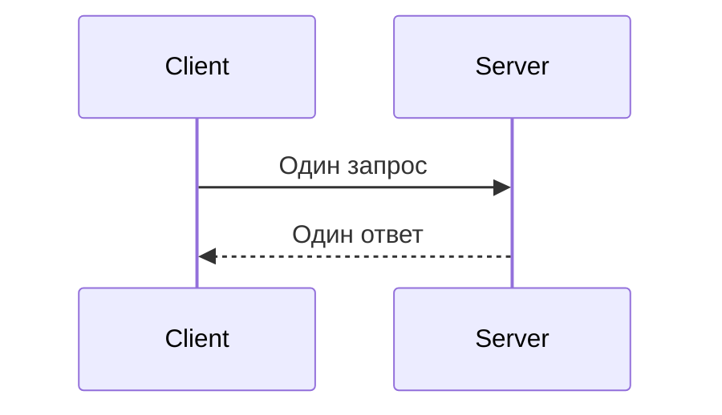
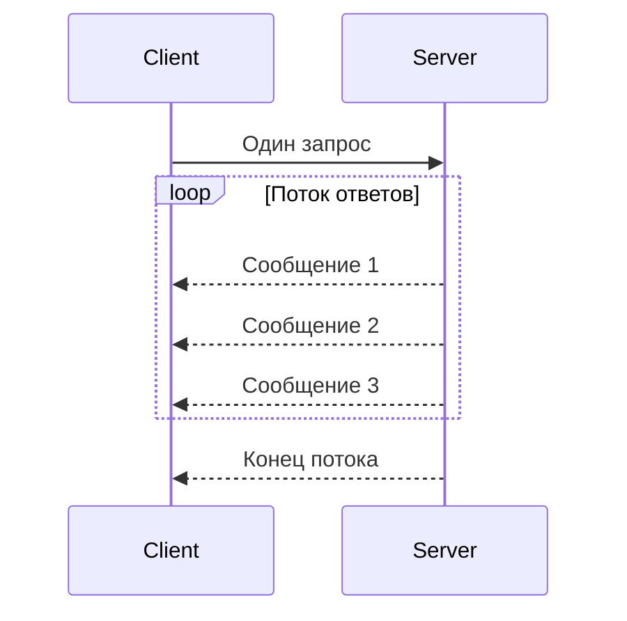
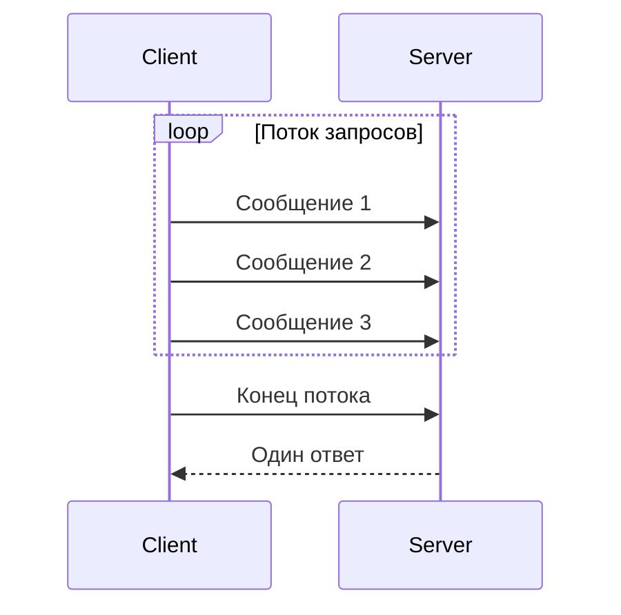
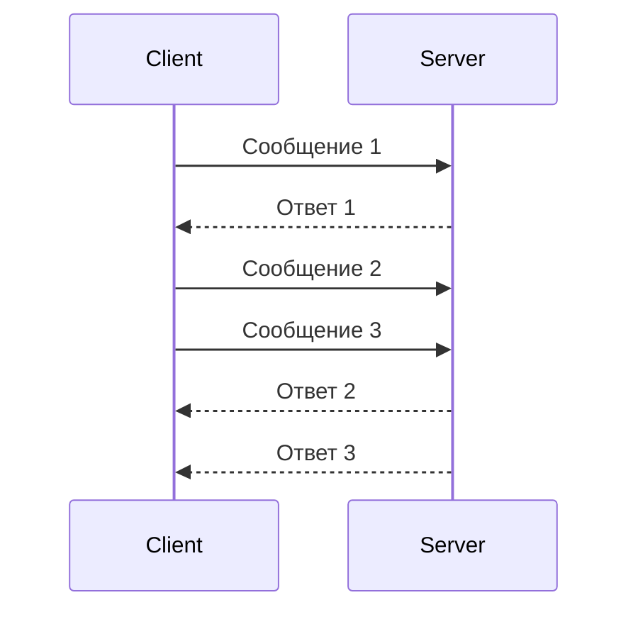

## Введение: От телефонного звонка до видеоконференции

Представьте, что вы общаетесь с другом. Есть несколько способов это сделать:

- **Короткое сообщение:** "Привет, как дела?" → "Хорошо" (один запрос, один ответ).
- **Лекция:** Вы слушаете, друг говорит 30 минут без перерыва (один запрос, поток ответов).
- **Рассказ:** Вы говорите 10 минут, потом друг отвечает (поток запросов, один ответ).
- **Разговор:** Вы оба говорите и слушаете одновременно, перебиваете друг друга, уточняете (поток запросов, поток ответов).

gRPC поддерживает все четыре способа общения. Это называется **типами вызовов**.

В отличие от REST, где почти всегда "один запрос → один ответ", gRPC позволяет организовать потоковую передачу данных в реальном времени. Это делает gRPC идеальным для сценариев, где данные поступают непрерывно: логи, метрики, чаты, события.

## Четыре типа вызовов gRPC

| Тип | Запросы | Ответы | Аналогия |
| :--- | :--- | :--- | :--- |
| **Unary** | 1 | 1 | Телефонный звонок (поговорили и положили трубку) |
| **Server streaming** | 1 | Много | Подписка на новости (один запрос, много писем) |
| **Client streaming** | Много | 1 | Отправка большой фотографии (много кусочков, один результат) |
| **Bidirectional streaming** | Много | Много | Чат (оба говорят одновременно) |

## 1. Unary (Простой вызов)

### Что это такое

Самый простой тип. Клиент отправляет один запрос, сервер возвращает один ответ. Похоже на обычный REST или HTTP запрос.



### .proto определение

```protobuf
service UserService {
    rpc GetUser (GetUserRequest) returns (User);
}
```

### Пример использования

**Сценарий:** Получение информации о пользователе.

```go
// Клиент (Go)
req := &pb.GetUserRequest{UserId: 123}
resp, err := client.GetUser(ctx, req)
fmt.Println(resp.Name) // "Иван"
```

### Когда использовать

| Сценарий | Пример |
| :--- | :--- |
| **CRUD операции** | Получить пользователя, создать заказ, обновить товар |
| **Запрос-ответ** | Проверить баланс, перевести деньги |
| **Аутентификация** | Вход в систему |

## 2. Server streaming (Серверный стриминг)

### Что это такое

Клиент отправляет один запрос, сервер отвечает потоком сообщений. Сервер может отправлять данные частями, по мере их готовности.



### .proto определение

```protobuf
service LogService {
    rpc StreamLogs (StreamLogsRequest) returns (stream LogEntry);
}
```

### Пример использования

**Сценарий:** Получение потоков логов. Клиент подписывается на логи, сервер отправляет их по мере поступления.

```go
// Клиент (Go)
stream, err := client.StreamLogs(ctx, &pb.StreamLogsRequest{Level: "ERROR"})
for {
    log, err := stream.Recv()
    if err == io.EOF {
        break // Конец потока
    }
    fmt.Println(log.Message)
}
```

```go
// Сервер (Go)
func (s *logServer) StreamLogs(req *pb.StreamLogsRequest, stream pb.LogService_StreamLogsServer) error {
    for log := range s.logsChannel {
        if err := stream.Send(log); err != nil {
            return err
        }
    }
    return nil
}
```

### Когда использовать

| Сценарий | Пример |
| :--- | :--- |
| **Логи и метрики** | Поток логов, метрик, трейсов |
| **Большие наборы данных** | Выгрузка 1 млн записей (отдаём частями) |
| **Новости / лента** | Поток новых сообщений |
| **Мониторинг** | Получение статусов серверов |

## 3. Client streaming (Клиентский стриминг)

### Что это такое

Клиент отправляет поток сообщений, сервер отвечает одним ответом после получения всех данных.



### .proto определение

```protobuf
service UploadService {
    rpc UploadFile (stream Chunk) returns (UploadResponse);
}
```

### Пример использования

**Сценарий:** Загрузка большого файла частями (chunk by chunk).

```go
// Клиент (Go)
stream, err := client.UploadFile(ctx)
for _, chunk := range fileChunks {
    stream.Send(&pb.Chunk{Data: chunk})
}
resp, err := stream.CloseAndRecv()
fmt.Printf("Загружено %d байт", resp.Size)
```

```go
// Сервер (Go)
func (s *uploadServer) UploadFile(stream pb.UploadService_UploadFileServer) error {
    var totalSize int64
    for {
        chunk, err := stream.Recv()
        if err == io.EOF {
            return stream.SendAndClose(&pb.UploadResponse{Size: totalSize})
        }
        totalSize += int64(len(chunk.Data))
        // сохраняем chunk в файл
    }
}
```

### Когда использовать

| Сценарий | Пример |
| :--- | :--- |
| **Загрузка больших файлов** | Видео, изображения, бэкапы |
| **Агрегация данных** | Сбор метрик от множества датчиков |
| **Пакетная обработка** | Отправка тысячи записей одним вызовом |

## 4. Bidirectional streaming (Двунаправленный стриминг)

### Что это такое

Самый мощный тип. Клиент и сервер обмениваются потоками сообщений одновременно. Обе стороны могут отправлять сообщения в любое время.



### .proto определение

```protobuf
service ChatService {
    rpc Chat (stream ChatMessage) returns (stream ChatMessage);
}
```

### Пример использования

**Сценарий:** Чат. Клиент отправляет сообщения, сервер отвечает (могут быть как ответы, так и новые сообщения от других участников).

```go
// Клиент (Go)
stream, err := client.Chat(ctx)

// Горутина для отправки сообщений
go func() {
    for msg := range outbox {
        stream.Send(msg)
    }
    stream.CloseSend()
}()

// Горутина для получения сообщений
for {
    msg, err := stream.Recv()
    if err == io.EOF {
        break
    }
    displayMessage(msg)
}
```

```go
// Сервер (Go)
func (s *chatServer) Chat(stream pb.ChatService_ChatServer) error {
    // Канал для новых сообщений от этого клиента
    for {
        msg, err := stream.Recv()
        if err == io.EOF {
            return nil
        }
        // Отправляем сообщение всем участникам чата
        for _, participant := range s.rooms[msg.RoomId] {
            participant.Send(msg)
        }
    }
}
```

### Другие примеры

| Сценарий | Пример |
| :--- | :--- |
| **Чат** | Обмен сообщениями в реальном времени |
| **Онлайн-игры** | Обновление позиций игроков |
| **Финансовые котировки** | Подписка на изменения цен, отправка ордеров |
| **IoT** | Датчики отправляют данные, сервер отправляет команды |
| **Совместное редактирование** | Google Docs (многопользовательское редактирование) |

## Сравнение типов вызовов

| Характеристика | Unary | Server streaming | Client streaming | Bidirectional streaming |
| :--- | :--- | :--- | :--- | :--- |
| **Количество запросов** | 1 | 1 | N | N |
| **Количество ответов** | 1 | N | 1 | N |
| **Завершение клиента** | После ответа | После ответов | Явное CloseSend() | Явное CloseSend() |
| **Завершение сервера** | После ответа | После последнего ответа | После ответа | После закрытия стрима |
| **Сложность реализации** | Низкая | Средняя | Средняя | Высокая |
| **Использование памяти** | Низкое | Среднее | Зависит от буферизации | Зависит от буферизации |

## Обработка потоков

### На клиенте

```go
// Unary: просто вызываем
resp, err := client.Unary(ctx, req)

// Server streaming: читаем в цикле
stream, err := client.ServerStream(ctx, req)
for {
    msg, err := stream.Recv()
    if err == io.EOF { break }
    // обрабатываем msg
}

// Client streaming: отправляем в цикле
stream, err := client.ClientStream(ctx)
for _, chunk := range chunks {
    stream.Send(chunk)
}
resp, err := stream.CloseAndRecv()

// Bidirectional: две горутины
stream, err := client.Bidirectional(ctx)
go sendMessages(stream)  // отправка
go receiveMessages(stream) // получение
```

### На сервере

```go
// Unary: просто возвращаем
func (s *server) Unary(ctx context.Context, req *pb.Request) (*pb.Response, error) {
    return &pb.Response{}, nil
}

// Server streaming: отправляем в цикле
func (s *server) ServerStream(req *pb.Request, stream pb.Service_ServerStreamServer) error {
    for _, item := range items {
        stream.Send(item)
    }
    return nil
}

// Client streaming: читаем в цикле
func (s *server) ClientStream(stream pb.Service_ClientStreamServer) error {
    for {
        chunk, err := stream.Recv()
        if err == io.EOF {
            return stream.SendAndClose(&pb.Response{})
        }
        // обрабатываем chunk
    }
}

// Bidirectional: читаем и отправляем одновременно
func (s *server) Bidirectional(stream pb.Service_BidirectionalServer) error {
    // Обработка входящих сообщений
    go func() {
        for {
            msg, err := stream.Recv()
            if err == io.EOF { return }
            // обрабатываем msg
        }
    }()
    
    // Отправка исходящих сообщений
    for msg := range outgoing {
        stream.Send(msg)
    }
    return nil
}
```

## Ошибки и завершение потоков

### EOF (End of File)

`io.EOF` сигнализирует, что поток закрыт.

```go
for {
    msg, err := stream.Recv()
    if err == io.EOF {
        break // поток закрыт корректно
    }
    if err != nil {
        // реальная ошибка
    }
}
```

### CloseSend()

Клиент может закрыть отправляющую сторону потока.

```go
stream.CloseSend()  // больше не будем отправлять
// Но всё ещё можем получать ответы
```

### Отмена контекста

```go
ctx, cancel := context.WithCancel(context.Background())
stream, err := client.Chat(ctx)

// Позже, когда нужно остановить
cancel()
```

## Производительность и буферизация

### Flow control (управление потоком)

HTTP/2 предоставляет управление потоком, чтобы быстрый отправитель не завалил медленного получателя.

- **Send** может блокироваться, если получатель не успевает читать
- **Recv** может блокироваться, если нет данных

### Рекомендации

| Тип вызова | Рекомендация |
| :--- | :--- |
| **Unary** | Используйте для простых запросов-ответов |
| **Server streaming** | Устанавливайте разумный размер сообщения (не слишком маленькие, не слишком большие) |
| **Client streaming** | Отправляйте сообщения пачками (batch) для уменьшения накладных расходов |
| **Bidirectional** | Используйте отдельные горутины для отправки и получения |

## Практические примеры

### Пример 1: Система логирования (Server streaming)

```protobuf
service LogService {
    rpc TailLogs (TailRequest) returns (stream LogEntry);
}

message TailRequest {
    string service = 1;
    int32 lines = 2;
    string level = 3;
}
```

### Пример 2: Загрузка фотографии (Client streaming)

```protobuf
service PhotoService {
    rpc UploadPhoto (stream Chunk) returns (PhotoInfo);
}

message Chunk {
    bytes data = 1;
    int32 sequence = 2;
}
```

### Пример 3: Игровой сервер (Bidirectional streaming)

```protobuf
service GameService {
    rpc Play (stream PlayerAction) returns (stream GameState);
}

message PlayerAction {
    int32 player_id = 1;
    string action = 2;
    map<string, string> params = 3;
}

message GameState {
    repeated Player players = 1;
    repeated Bullet bullets = 2;
    int32 score = 3;
}
```

## Распространённые ошибки

### Ошибка 1: Не закрывать клиентский стрим

```go
// Плохо: забыли CloseSend()
for _, chunk := range chunks {
    stream.Send(chunk)
}
resp, _ := stream.CloseAndRecv() // будет ждать вечно
```

**Исправление:** Всегда вызывайте `CloseSend()`.

### Ошибка 2: Игнорирование ошибок в стриме

```go
// Плохо: игнорируем ошибки
for {
    msg, _ := stream.Recv()
    process(msg)
}
```

### Ошибка 3: Неправильная обработка EOF

```go
// Плохо: EOF как ошибка
for {
    msg, err := stream.Recv()
    if err != nil {
        break  // не отличаем EOF от реальной ошибки
    }
}
```

### Ошибка 4: Гонка данных в bidirectional

```go
// Плохо: общий ресурс без синхронизации
var counter int
go func() {
    for { counter++ }  // пишем
}()
for { fmt.Println(counter) } // читаем
```

### Ошибка 5: Слишком маленькие сообщения в стриме

Отправка каждого байта отдельным сообщением → огромные накладные расходы.

**Исправление:** Буферизация, отправка пачками.

## Резюме для системного аналитика

1. **Unary (простой вызов)** — 1 запрос, 1 ответ. Как REST. Для простых операций.

2. **Server streaming** — 1 запрос, поток ответов. Для логов, метрик, выгрузки больших данных.

3. **Client streaming** — поток запросов, 1 ответ. Для загрузки файлов, агрегации данных.

4. **Bidirectional streaming** — поток запросов, поток ответов. Для чатов, онлайн-игр, финансовых котировок.

5. **Все четыре типа** используют одно HTTP/2 соединение, что эффективнее, чем множество соединений в REST.

6. **Обработка потоков** требует внимания к ошибкам (`io.EOF` — конец, другие ошибки — реальные проблемы).

7. **Управление потоком (flow control)** встроено в HTTP/2. Быстрый отправитель не завалит медленного получателя.