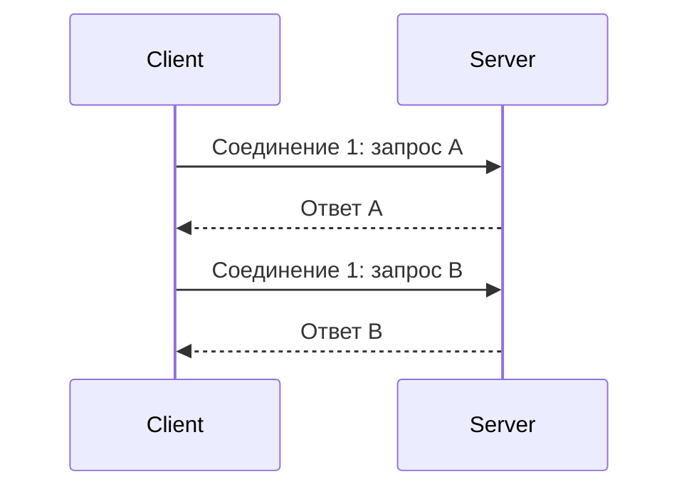
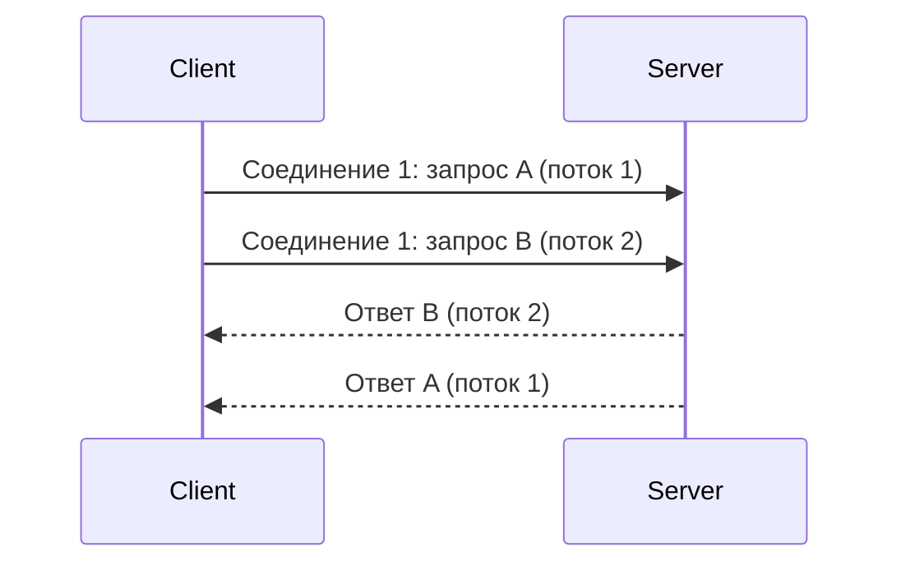
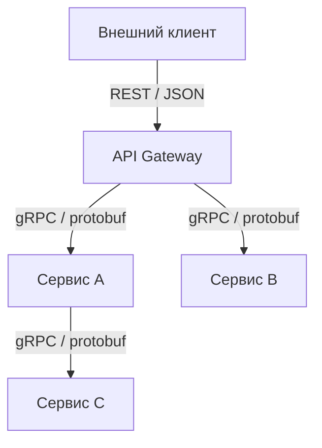

## Введение: Два подхода к общению

В мире API есть два популярных способа общения между сервисами. REST долгое время был стандартом де-факто. Он прост, понятен, использует HTTP/1.1 и JSON. Но у него есть ограничения: он медленный, не поддерживает потоковую передачу, каждое соединение обрабатывает один запрос.

gRPC — более молодой протокол от Google. Он использует HTTP/2, бинарную сериализацию (protobuf) и поддерживает стриминг. Он быстрее, но сложнее.

REST — это как "почта": вы отправляете письмо (запрос), вам приходит ответ (письмо). Всё просто, но каждое письмо — отдельное.

gRPC — это как "телефонный разговор": вы устанавливаете соединение и можете обмениваться сообщениями в реальном времени, параллельно, без задержек.

**REST (Representational State Transfer)** — архитектурный стиль для построения API поверх HTTP. Использует HTTP методы (GET, POST, PUT, DELETE), статус-коды, и обычно JSON.

**gRPC (gRPC Remote Procedure Call)** — высокопроизводительный фреймворк для удалённого вызова процедур. Использует Protocol Buffers, HTTP/2, и поддерживает стриминг.

Выбор между gRPC и REST — это не вопрос "что лучше", а вопрос "что подходит для вашей задачи". Они решают разные проблемы.

## Сравнение по ключевым параметрам

| Параметр | REST | gRPC |
| :--- | :--- | :--- |
| **Транспорт** | HTTP/1.1 (обычно) | HTTP/2 |
| **Формат данных** | JSON, XML, текст, HTML | Protocol Buffers (protobuf) |
| **Сериализация** | Текстовая | Бинарная |
| **Человеко-читаемый** | Да (curl, браузер) | Нет (бинарный) |
| **Типизация** | Слабая (динамическая) | Строгая (статическая, .proto) |
| **Контракт** | OpenAPI (опционально) | .proto (обязателен) |
| **Генерация кода** | Опционально (OpenAPI генераторы) | Да (из .proto) |
| **Стриминг** | Нет (только WebSockets/SSE) | Да (server, client, bidirectional) |
| **Мультиплексирование** | Нет (одно соединение → один запрос) | Да (одно соединение → много потоков) |
| **Кеширование** | Отличное (HTTP кеш, CDN) | Нет (POST всегда) |
| **Браузеры** | Отличная поддержка | Плохая (требуется gRPC-Web) |
| **Производительность** | Средняя | Высокая |
| **Размер сообщения** | Большой (JSON) | Маленький (protobuf) |
| **Сложность** | Низкая | Высокая |

## Формат данных: JSON vs Protobuf

### REST: JSON (текстовый)

```json
{
    "id": 123,
    "name": "Иван Петров",
    "email": "ivan@example.com",
    "age": 30,
    "address": {
        "city": "Москва",
        "street": "Тверская",
        "zip": 101000
    }
}
```

**Размер:** ~150 байт

### gRPC: Protobuf (бинарный)

```protobuf
message User {
    int32 id = 1;
    string name = 2;
    string email = 3;
    int32 age = 4;
    Address address = 5;
}

message Address {
    string city = 1;
    string street = 2;
    int32 zip = 3;
}
```

**Размер (бинарный):** ~60 байт

### Сравнение

| Аспект | JSON | Protobuf |
| :--- | :--- | :--- |
| **Читаемость** | Высокая (отладка curl) | Низкая (бинарный) |
| **Размер** | Большой | Маленький (в 2-3 раза) |
| **Скорость парсинга** | Медленная (текст) | Быстрая (бинарный) |
| **Схема** | Опциональна (JSON Schema) | Обязательна (.proto) |

## Протокол: HTTP/1.1 vs HTTP/2

### REST: HTTP/1.1



**Проблемы:**
- Head-of-line blocking (запрос B ждёт A)
- Много соединений (каждое со своим handshake)
- Заголовки не сжимаются
- Текстовый формат

### gRPC: HTTP/2



**Преимущества:**
- Мультиплексирование (один запрос не блокирует другие)
- Одно соединение (меньше накладных расходов)
- Сжатие заголовков (HPACK)
- Бинарный протокол

## Типизация: Слабая vs Строгая

### REST: Слабая типизация

```json
// Что такое id? Строка? Число?
// Что будет, если поле отсутствует?
// Нет контракта.
{
    "id": 123,
    "name": "Иван"
}
```

**Проблемы:**
- Ошибки типов в рантайме
- Клиент должен угадывать
- Сложная автогенерация клиентов

### gRPC: Строгая типизация

```protobuf
message User {
    int32 id = 1;     // id — целое число, обязательно
    string name = 2;  // name — строка
}
```

**Преимущества:**
- Ошибки на этапе компиляции
- Автогенерация типизированных клиентов
- Контракт обязателен

## Контракт: OpenAPI vs .proto

### REST: OpenAPI (опционально)

```yaml
openapi: 3.0.0
paths:
  /users/{id}:
    get:
      parameters:
        - name: id
          in: path
          schema:
            type: integer
      responses:
        '200':
          content:
            application/json:
              schema:
                type: object
                properties:
                  id:
                    type: integer
                  name:
                    type: string
```

**Проблемы:**
- Опционально (может не быть)
- Не синхронизируется с кодом (часто расходится)
- Генерация клиентов — внешний шаг

### gRPC: .proto (обязателен)

```protobuf
service UserService {
    rpc GetUser (GetUserRequest) returns (User);
}

message GetUserRequest {
    int32 user_id = 1;
}

message User {
    int32 id = 1;
    string name = 2;
}
```

**Преимущества:**
- Обязателен (без него ничего не работает)
- Единый источник истины
- Генерация клиентов и сервера из одного файла

## Стриминг: REST vs gRPC

### REST: Нет встроенного стриминга

| Технология | Что это | Проблемы |
| :--- | :--- | :--- |
| **WebSockets** | Полно-дуплексная связь | Не REST, отдельный протокол |
| **SSE (Server-Sent Events)** | Server → Client стриминг | Только односторонний, не REST |
| **Long polling** | Клиент ждёт ответа | Неэффективно |

### gRPC: Встроенный стриминг

```protobuf
service LogService {
    rpc TailLogs (TailRequest) returns (stream LogEntry);  // server streaming
    rpc UploadLogs (stream LogEntry) returns (Summary);    // client streaming
    rpc Chat (stream ChatMessage) returns (stream ChatMessage); // bidirectional
}
```

**Встроенная поддержка:**
- Server streaming (логи, метрики)
- Client streaming (загрузка файлов)
- Bidirectional streaming (чат, игры)

## Кеширование

### REST: Отличное кеширование

```http
GET /users/123
Cache-Control: max-age=300
ETag: "abc123"
```

```http
# При повторном запросе
GET /users/123
If-None-Match: "abc123"
→ 304 Not Modified (без тела)
```

**Где кешируется:** браузер, CDN, прокси.

### gRPC: Нет встроенного кеширования

- Все запросы — POST (даже для чтения)
- HTTP кеш не работает
- Нужен отдельный кеш (Redis, Memcached)

## Браузеры

### REST: Отличная поддержка

```javascript
// Браузерный JavaScript
fetch('/api/users/123')
    .then(response => response.json())
    .then(user => console.log(user.name));
```

### gRPC: Плохая поддержка

Браузеры не поддерживают gRPC напрямую. Нужен gRPC-Web — прослойка, которая эмулирует gRPC поверх HTTP/1.1.

```javascript
// gRPC-Web
const client = new UserServiceClient('http://localhost:8080');
client.getUser({userId: 123}, (err, user) => {
    console.log(user.getName());
});
```

**Ограничения gRPC-Web:**
- Нет bidirectional streaming
- Нет client streaming
- Дополнительная прослойка (Envoy, gRPC-Web proxy)

## Производительность

### Сравнение (условное)

| Параметр | REST (JSON + HTTP/1.1) | gRPC (protobuf + HTTP/2) |
| :--- | :--- | :--- |
| **Размер запроса** | 500 байт | 150 байт |
| **Размер ответа** | 5 КБ | 1.5 КБ |
| **Время сериализации** | 1 мс | 0.2 мс |
| **Запросов в секунду** | 10 000 | 50 000 |
| **Стриминг** | Нет | Да |

### Когда gRPC значительно быстрее

- Много маленьких запросов (экономия на заголовках)
- Высокая нагрузка (миллионы RPS)
- Большие объёмы данных (компактный protobuf)

### Когда разница незначительна

- Несколько запросов в секунду
- Маленькие объёмы данных
- Внешнее API (узкое место — сеть, не сериализация)

## Примеры кода

### REST (клиент на Python)

```python
import requests

response = requests.get('https://api.example.com/users/123')
user = response.json()
print(user['name'])
```

### gRPC (клиент на Python)

```python
import grpc
import user_pb2
import user_pb2_grpc

channel = grpc.insecure_channel('localhost:50051')
stub = user_pb2_grpc.UserServiceStub(channel)
request = user_pb2.GetUserRequest(user_id=123)
user = stub.GetUser(request)
print(user.name)
```

## Когда использовать REST

| Сценарий | Почему REST |
| :--- | :--- |
| **Публичное API** | Простота, документация, curl, браузер |
| **Веб-приложения** | Браузерная поддержка, кеширование |
| **Внешние интеграции** | Партнёрам проще использовать REST |
| **CRUD операции** | GET, POST, PUT, DELETE идеально подходят |
| **Небольшие проекты** | Меньше сложности |
| **Кеширование критично** | HTTP кеш, CDN |

## Когда использовать gRPC

| Сценарий | Почему gRPC |
| :--- | :--- |
| **Внутренние микросервисы** | Высокая производительность, HTTP/2 |
| **Высокая нагрузка** | Миллионы запросов в секунду |
| **Потоковая передача** | Логи, метрики, чаты, загрузка файлов |
| **Мультиязычные системы** | Генерация кода из .proto |
| **Мобильные приложения** | Меньше трафика, лучше батарея (но сложнее) |
| **Строгая типизация** | Ошибки на этапе компиляции |

## Гибридный подход

Ничто не мешает использовать оба подхода вместе.

### Архитектура: REST для внешних, gRPC для внутренних



### Пример: REST + gRPC

- **Публичный API:** REST (простота, кеширование, браузеры)
- **Внутренние сервисы:** gRPC (скорость, стриминг, типизация)
- **API Gateway:** Конвертирует REST → gRPC

## Сравнительная таблица (расширенная)

| Аспект | REST | gRPC |
| :--- | :--- | :--- |
| **Транспорт** | HTTP/1.1, HTTP/2 | HTTP/2 |
| **Формат** | JSON, XML, YAML | Protobuf (бинарный) |
| **Человеко-читаемый** | ✅ Да | ❌ Нет |
| **Браузеры** | ✅ Отлично | ❌ Плохо (gRPC-Web) |
| **Кеширование** | ✅ Отличное (HTTP, CDN) | ❌ Нет |
| **Стриминг** | ❌ Нет (только WebSockets) | ✅ Да (4 типа) |
| **Мультиплексирование** | ❌ Нет | ✅ Да |
| **Типизация** | ❌ Слабая | ✅ Строгая |
| **Контракт** | ⚠️ OpenAPI (опционально) | ✅ .proto (обязателен) |
| **Генерация кода** | ⚠️ Опционально | ✅ Да |
| **Производительность** | ⚠️ Средняя | ✅ Высокая |
| **Размер сообщения** | ⚠️ Большой | ✅ Маленький |
| **Сложность** | ✅ Низкая | ⚠️ Высокая |
| **Публичные API** | ✅ Отлично | ❌ Плохо |
| **Микросервисы** | ⚠️ Хорошо | ✅ Отлично |
| **Мобильные приложения** | ✅ Хорошо | ⚠️ Хорошо (но сложнее) |

## Распространённые ошибки

### Ошибка 1: gRPC для публичного API

Вы сделали публичный API на gRPC. Внешние разработчики не могут его вызвать из браузера.

**Исправление:** REST для публичных API. gRPC для внутренних.

### Ошибка 2: REST для высоконагруженных микросервисов

У вас 100 микросервисов, 1 млн запросов в секунду. REST с JSON и HTTP/1.1 не вывозит.

**Исправление:** gRPC для внутренних микросервисов.

### Ошибка 3: gRPC для кешируемых данных

Вы делаете gRPC для каталога товаров, который обновляется раз в час. Нет кеширования.

**Исправление:** REST с CDN.

### Ошибка 4: REST для стриминга

Вам нужен чат в реальном времени. Вы пытаетесь использовать REST + polling (каждую секунду запрос). Неэффективно.

**Исправление:** gRPC с bidirectional streaming.

### Ошибка 5: REST без OpenAPI

У вас REST API, но нет OpenAPI. Клиенты не знают, как его вызывать.

**Исправление:** Документируйте REST с OpenAPI.

## Резюме для системного аналитика

1. **REST и gRPC решают разные задачи.** REST — для публичных API, внешних интеграций, веб-приложений. gRPC — для внутренних микросервисов, высоких нагрузок, потоковой передачи.

2. **Главные преимущества REST:** простота, кеширование, браузеры, человеко-читаемый JSON.

3. **Главные преимущества gRPC:** производительность (protobuf + HTTP/2), стриминг, строгая типизация, генерация кода.

4. **Форматы:** JSON (REST) — большой, текстовый, медленный. Protobuf (gRPC) — маленький, бинарный, быстрый.

5. **Транспорт:** HTTP/1.1 (REST) — одно соединение → один запрос. HTTP/2 (gRPC) — одно соединение → много потоков.

6. **Кеширование:** REST отлично кешируется (HTTP, CDN). gRPC — нет (все запросы POST).

7. **Стриминг:** REST не имеет встроенного стриминга (только WebSockets). gRPC имеет 4 типа стриминга.