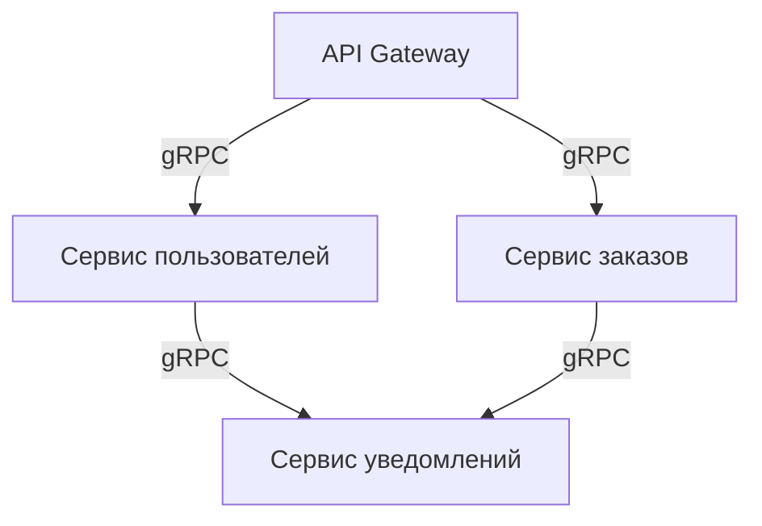
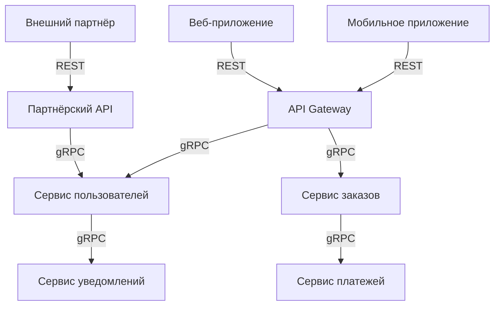

## Введение: Инструмент для внутренней кухни

В предыдущих темах мы разобрали, что такое gRPC, какие у него типы вызовов и чем он отличается от REST. gRPC — мощный инструмент, но он не универсален. Как швейцарский нож: можно открыть консервную банку, но лучше использовать открывашку.

gRPC создавался для внутренних микросервисных коммуникаций внутри Google. Он решает проблемы, которые возникают, когда у вас сотни сервисов, миллионы запросов в секунду и десятки языков программирования. Для этой задачи он подходит идеально. Для маленького блога на WordPress — избыточен.

**gRPC не заменяет REST.** Он дополняет его. В этой теме мы разберём конкретные сценарии, когда gRPC даёт огромные преимущества, а когда REST всё ещё лучше.

## Когда gRPC — отличный выбор

### 1. Внутренние микросервисы (Backend-to-Backend)

| Признак | Почему gRPC подходит |
| :--- | :--- |
| **Сервисы общаются внутри дата-центра** | Низкая задержка, высокая пропускная способность |
| **Высокая нагрузка** | Миллионы запросов в секунду |
| **Много языков** | Go, Java, Python, C++, Node.js, Ruby, C# |
| **Строгие контракты** | .proto файл — единый источник истины |

**Пример:** Netflix, Uber, Google, Lyft используют gRPC для внутренних микросервисов.



### 2. Потоковая передача данных (Streaming)

| Сценарий | Тип стриминга |
| :--- | :--- |
| **Логи и метрики** | Server streaming |
| **Загрузка больших файлов** | Client streaming |
| **Чат в реальном времени** | Bidirectional streaming |
| **Финансовые котировки** | Server streaming |
| **Онлайн-игры** | Bidirectional streaming |

**Пример:** Система мониторинга, где агенты отправляют метрики, а сервер возвращает команды.

```protobuf
service Monitoring {
    rpc StreamMetrics (stream Metric) returns (stream Command);
}
```

### 3. Мультиязычные системы (Polyglot)

| Ситуация | Проблема REST | Решение gRPC |
| :--- | :--- | :--- |
| **Сервисы на разных языках** | Нужно вручную писать клиенты | Генерация кода из .proto |
| **Часто меняющиеся API** | Синхронизация клиентов | .proto — единый контракт |

**Пример:** У вас сервисы на Go, Python, Java и C++.

```bash
# Один .proto файл для всех языков
protoc --go_out=. user.proto      # Go
protoc --python_out=. user.proto  # Python
protoc --java_out=. user.proto    # Java
protoc --cpp_out=. user.proto     # C++
```

### 4. Высокая производительность и низкая задержка

| Параметр | REST (JSON) | gRPC (protobuf) |
| :--- | :--- | :--- |
| **Размер сообщения** | 500 байт | 150 байт |
| **Сериализация** | 1 мс | 0.2 мс |
| **RPS** | 10 000 | 50 000 |

**Пример:** Платёжный шлюз, биржевой движок, рекламный аукцион (миллионы запросов в секунду).

### 5. Долго работающие соединения

| Сценарий | Почему gRPC подходит |
| :--- | :--- |
| **Keep-alive соединения** | HTTP/2 держит соединение открытым |
| **Много маленьких запросов** | Мультиплексирование — один запрос не блокирует другие |
| **Push-уведомления** | Server streaming |

**Пример:** Сервис нотификаций, который держит соединение с клиентом и отправляет уведомления по мере поступления.

### 6. Системы с жёсткими требованиями к latency

| Сценарий | Почему gRPC подходит |
| :--- | :--- |
| **Финансовые транзакции** | Каждая миллисекунда на счету |
| **Игровые серверы** | Низкая задержка критична |
| **Рекламные аукционы** | Миллионы запросов, миллисекундные таймауты |

### 7. Мобильные приложения (с осторожностью)

| Преимущества | Недостатки |
| :--- | :--- |
| Меньше трафика (protobuf) | Сложнее отладка |
| Меньше батареи (меньше запросов) | gRPC-Web ограничен |
| Стриминг для чатов | Не для всех приложений |

**Пример:** Приложение доставки еды (gRPC между приложением и сервером). Но нужно тестировать на слабых сетях.

## Когда gRPC НЕ подходит

### 1. Публичные API для внешних разработчиков

| Причина | Объяснение |
| :--- | :--- |
| **Сложность** | Внешние разработчики не знают gRPC |
| **Инструменты** | curl, браузер, Postman не работают |
| **gRPC-Web** | Ограниченная функциональность |

**Лучше:** REST + OpenAPI.

### 2. Браузерные приложения

| Проблема | Объяснение |
| :--- | :--- |
| **Нет нативной поддержки** | Браузеры не поддерживают gRPC |
| **gRPC-Web** | Нет клиентского и bidirectional стриминга |
| **Прокси** | Нужен Envoy или gRPC-Web proxy |

**Лучше:** REST или GraphQL.

### 3. Кеширование критично

| Проблема | Объяснение |
| :--- | :--- |
| **Все запросы POST** | HTTP кеш не работает |
| **CDN не помогает** | Нельзя закешировать ответы |

**Лучше:** REST с GET и кеширующими заголовками.

### 4. Маленькие проекты

| Причина | Объяснение |
| :--- | :--- |
| **Оверхед** | Настройка gRPC сложнее REST |
| **Команда не знает protobuf** | Крутая кривая обучения |
| **Нет реальной нагрузки** | REST и JSON достаточно |

**Лучше:** REST.

### 5. Простые CRUD API

| Причина | Объяснение |
| :--- | :--- |
| **Преимущества gRPC не нужны** | Стриминг не нужен, нагрузка низкая |
| **REST проще** | GET, POST, PUT, DELETE понятны всем |

**Лучше:** REST.

### 6. Загрузка больших файлов (как основной сценарий)

| Проблема | Объяснение |
| :--- | :--- |
| **Protobuf не для больших файлов** | Сообщения >100 МБ не рекомендуются |
| **Стриминг есть, но сложнее** | REST с multipart/form-data проще |

**Лучше:** REST для загрузки файлов. gRPC для метаданных.


## Примеры реального выбора

### Пример 1: Netflix

- **Внутренние сервисы:** gRPC (микросервисы, высокая нагрузка)
- **Публичное API:** REST (внешние разработчики)

### Пример 2: Uber

- **Внутренние сервисы:** gRPC (миллионы поездок, много языков)
- **Мобильное приложение:** gRPC (экономия трафика, но сложно)

### Пример 3: Интернет-магазин (небольшой)

- **Всё на REST:** публичное API, админка, внешние интеграции.
- **gRPC не нужен:** нагрузка низкая, стриминг не нужен.

### Пример 4: Система мониторинга (Prometheus + Thanos)

- **Агенты → Сервер:** gRPC (стриминг метрик)
- **Публичный API:** REST (запросы метрик)

### Пример 5: Чат-приложение

- **Чат (реальное время):** gRPC bidirectional streaming
- **Профили, истории:** REST (кеширование)

## Гибридный подход

Лучшая архитектура часто гибридная.



### Что где использовать

| Слой | Технология | Почему |
| :--- | :--- | :--- |
| **Публичное API** | REST | Простота, кеширование, браузеры |
| **API Gateway** | REST + gRPC | REST для внешних, gRPC для внутренних |
| **Микросервисы** | gRPC | Скорость, стриминг, типизация |
| **Браузер** | REST | Нативная поддержка |
| **Мобильное приложение** | REST или gRPC | REST проще, gRPC экономит трафик |

## Миграция с REST на gRPC

### Стратегия 1: Новые сервисы на gRPC

- Старые сервисы остаются на REST
- Новые пишутся на gRPC
- API Gateway конвертирует REST → gRPC

### Стратегия 2: Постепенная замена

- Выделите "горячие" эндпоинты (высокая нагрузка)
- Переведите их на gRPC
- Остальное оставьте на REST

### Стратегия 3: Гибрид

- REST для внешних (публичное API)
- gRPC для внутренних (микросервисы)

## Распространённые ошибки

### Ошибка 1: gRPC для публичного API

Сделали публичное API на gRPC. Внешние разработчики не могут его использовать.

**Исправление:** REST для публичных API.

### Ошибка 2: gRPC для кешируемых данных

Используете gRPC для каталога товаров, который обновляется раз в час. Нет кеширования, каждый запрос идёт в БД.

**Исправление:** REST + CDN.

### Ошибка 3: gRPC для маленького проекта

Три микросервиса, 10 запросов в секунду. gRPC добавляет сложность без выгоды.

**Исправление:** REST.

### Ошибка 4: Игнорирование gRPC-Web

Мобильное приложение использует gRPC, но gRPC-Web не настроен. В браузере не работает.

**Исправление:** REST для браузера, gRPC для нативных приложений.

### Ошибка 5: gRPC для больших файлов

Передаёте 100 МБ видео через gRPC. Protobuf не оптимизирован для таких размеров.

**Исправление:** REST для файлов, gRPC для метаданных.

## Резюме для системного аналитика

1. **gRPC создавался для внутренних микросервисов.** Это его родная среда. Высокая нагрузка, много языков, стриминг — вот где gRPC сияет.

2. **gRPC не для публичных API.** Внешние разработчики не знают gRPC, инструменты не работают, браузеры не поддерживают.

3. **Используйте gRPC для:** внутренних микросервисов, потоковой передачи (логи, метрики, чаты), мультиязычных систем, высоких нагрузок, долго живущих соединений.

4. **Не используйте gRPC для:** публичных API, браузерных приложений (без gRPC-Web), кешируемых данных, маленьких проектов, простых CRUD API.

5. **Гибридный подход — лучшее решение.** REST для внешних, gRPC для внутренних. API Gateway как мост.

6. **gRPC-Web** позволяет использовать gRPC из браузера, но с ограничениями (нет клиентского и bidirectional стриминга).