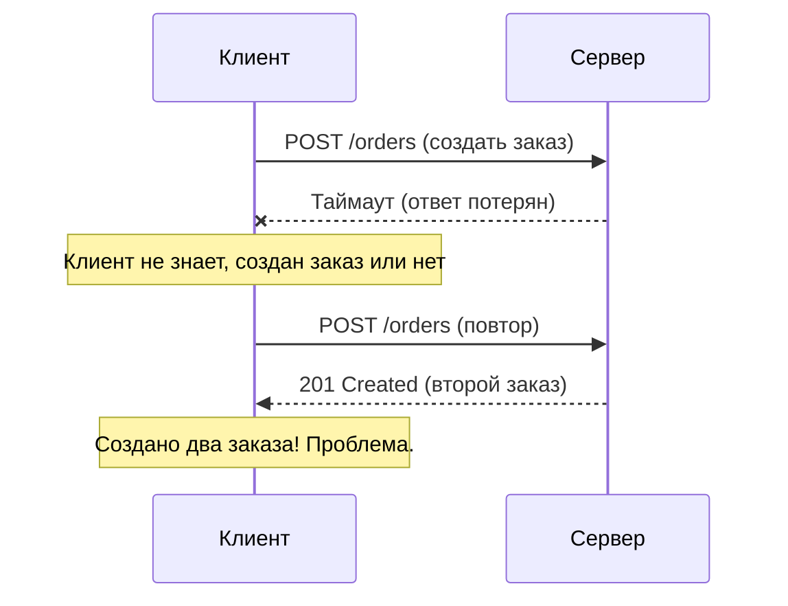

## Введение: Безопасность повторения

Представьте, что вы отправляете деньги через банковское приложение. Нажали кнопку "Перевести". Приложение показывает "Отправляем..." И тут — интернет пропал. Вы не знаете, дошёл перевод или нет. Вы нажимаете ещё раз. А потом ещё.

Что произойдёт? Если перевод обработан один раз — хорошо. Если три раза — деньги ушли трижды. Катастрофа.

В идеальном мире повторный запрос не должен менять результат. В мире HTTP это свойство называется **идемпотентностью**.

**Идемпотентность (Idempotence)** — это свойство операции, при котором повторное выполнение операции даёт тот же результат, что и однократное. Состояние системы после одного запроса такое же, как после двух, трёх или ста одинаковых запросов.

Идемпотентность критически важна для надёжности API в условиях ненадёжных сетей. Если клиент не получил ответ (таймаут, обрыв связи), он может безопасно повторить запрос, зная, что повторение не навредит.

## Что значит "тот же результат"

Важно понимать, что "тот же результат" не означает "тот же ответ сервера". Речь о состоянии системы.

| Запрос | Результат (состояние) | Идемпотентен? |
| :--- | :--- | :--- |
| `GET /users/123` | Первый раз: вернул данные. Второй раз: те же данные | Да |
| `DELETE /users/123` | Первый раз: удалил. Второй раз: пользователя уже нет, но состояние "пользователь удалён" то же | Да |
| `POST /users` | Первый раз: создал пользователя. Второй раз: создал второго пользователя | Нет |
| `PUT /users/123` | Первый раз: обновил. Второй раз: обновил тем же значением | Да |

**Ключевой момент:** Ответ сервера может отличаться (первый DELETE вернул 200, второй — 404), но состояние системы после двух запросов такое же, как после одного.

## Идемпотентность HTTP методов

| Метод | Идемпотентный? | Почему |
| :--- | :--- | :--- |
| `GET` | Да | Повторное чтение не меняет состояние |
| `HEAD` | Да | Аналогично GET, только заголовки |
| `OPTIONS` | Да | Информация о методах не меняется |
| `PUT` | Да | Повторная запись того же значения не меняет результат |
| `DELETE` | Да | Повторное удаление того же ресурса не меняет состояние (его уже нет) |
| `POST` | Нет | Повторная отправка может создать второй ресурс |
| `PATCH` | Не гарантирован | Зависит от реализации. Может быть идемпотентным, но не обязан |

## Почему GET всегда идемпотентен

`GET` только читает данные. Он не должен ничего менять на сервере. Поэтому повторные вызовы всегда возвращают одно и то же (если данные не изменились извне).

```http
GET /users/123
GET /users/123
GET /users/123
```

Все три вызова возвращают одного и того же пользователя. Состояние системы не меняется.

**Важное замечание:** GET может возвращать разные ответы, если данные изменились между запросами (другой пользователь обновил профиль). Но это не нарушает идемпотентность, потому что сами запросы GET не вызвали эти изменения.

## Почему POST не идемпотентен

`POST` обычно создаёт новые ресурсы. Каждый вызов создаёт новый объект.

```http
POST /users
{"name": "Иван"}
```

**Первый вызов:** Создаёт пользователя с ID=1.

```http
HTTP/1.1 201 Created
Location: /users/1
```

**Второй вызов:** Создаёт пользователя с ID=2.

```http
HTTP/1.1 201 Created
Location: /users/2
```

Состояние после двух вызовов отличается от состояния после одного. POST не идемпотентен.

### Исключения: POST может быть идемпотентным

Некоторые реализации POST могут быть идемпотентными, но клиент не должен на это рассчитывать.

Пример: POST с idempotency ключом (см. ниже).

## Почему PUT идемпотентен

`PUT` полностью заменяет ресурс. Если вы несколько раз отправите одно и то же представление, результат будет одинаковым.

```http
PUT /users/123
{"name": "Иван", "email": "ivan@example.com"}
```

**Первый вызов:** Создаёт или обновляет пользователя.

**Второй вызов:** Обновляет тем же значением. Состояние не меняется.

**Третий вызов:** То же самое.

После любого количества вызовов у пользователя имя "Иван" и email "ivan@example.com".

**Важно:** Если PUT меняет значение (например, увеличивает счётчик), он перестаёт быть идемпотентным. Но так PUT использовать не следует.

## Почему DELETE идемпотентен

`DELETE` удаляет ресурс. После удаления повторные вызовы не меняют состояние.

```http
DELETE /users/123
```

**Первый вызов:** Удаляет пользователя. Сервер возвращает 200 или 204.

**Второй вызов:** Пользователя уже нет. Сервер возвращает 404 или 204 (в зависимости от реализации).

Состояние после двух вызовов: пользователь удалён. То же, что и после одного вызова.

## Почему PATCH не гарантирует идемпотентность

`PATCH` применяет частичные изменения. Идемпотентность зависит от того, что именно делает PATCH.

**Идемпотентный PATCH:**

```http
PATCH /users/123
{"email": "new@example.com"}
```

Повторная отправка того же патча не меняет состояние — email уже new@example.com.

**НЕ идемпотентный PATCH:**

```http
PATCH /users/123
{"$inc": {"views": 1}}
```

Каждый вызов увеличивает счётчик на 1. Состояние после двух вызовов отличается от состояния после одного.


## Идемпотентность в реальных сценариях

### Проблема: Повторная отправка POST при сбое сети



### Решение 1: Идемпотентные ключи (Idempotency Key)

Клиент генерирует уникальный ключ для операции и передаёт его в заголовке.

```http
POST /orders
Idempotency-Key: 123e4567-e89b-12d3-a456-426614174000
Content-Type: application/json

{"product": "iPhone", "quantity": 1}
```

**Как это работает:**

1. Сервер проверяет, обрабатывал ли он уже ключ `123e4567...`
2. Если нет — обрабатывает запрос, сохраняет результат, ассоциированный с ключом
3. Если да — возвращает сохранённый результат (без повторной обработки)

```http
HTTP/1.1 201 Created
Idempotency-Key: 123e4567-e89b-12d3-a456-426614174000

{"order_id": 101}
```

При повторном запросе с тем же ключом:

```http
HTTP/1.1 200 OK
Idempotency-Key: 123e4567-e89b-12d3-a456-426614174000

{"order_id": 101}
```

### Решение 2: PUT вместо POST

Если клиент может сгенерировать ID, используйте PUT.

```http
PUT /orders/101
{"product": "iPhone", "quantity": 1}
```

PUT идемпотентен. Повторные вызовы не создадут второй заказ.

### Решение 3: Сохранять состояние на клиенте

Перед созданием ресурса проверять, существует ли он.

```http
GET /orders?external_id=abc123
# если не найден
POST /orders
{"external_id": "abc123", "product": "iPhone"}
```

## Идемпотентность и безопасность

Это разные, но связанные понятия.

| Свойство | GET | PUT | DELETE | POST | PATCH |
| :--- | :--- | :--- | :--- | :--- | :--- |
| **Безопасный (Safe)** | Да | Нет | Нет | Нет | Нет |
| **Идемпотентный** | Да | Да | Да | Нет | Не гарантирован |

**Безопасный (Safe):** Метод не должен изменять состояние сервера. GET, HEAD, OPTIONS.

**Идемпотентный (Idempotent):** Повторные вызовы не меняют состояние относительно однократного. PUT, DELETE.

**Пример:** DELETE не безопасен (он изменяет состояние), но идемпотентен.

## Примеры идемпотентных и неидемпотентных операций

### Идемпотентные

```http
# Чтение
GET /users/123

# Полная замена
PUT /users/123
{"name": "Иван", "email": "ivan@example.com"}

# Удаление
DELETE /users/123

# Установка значения
PUT /counters/123
{"value": 100}
```

### Неидемпотентные

```http
# Создание (ID генерируется)
POST /users
{"name": "Иван"}

# Инкремент
POST /counters/123/increment

# Добавление в коллекцию
POST /users/123/tags
{"tag": "vip"}

# Отправка email
POST /emails/send
```

### Могут быть идемпотентными (зависит от реализации)

```http
# Частичное обновление
PATCH /users/123
{"email": "new@example.com"}  # идемпотентно

PATCH /users/123
{"$inc": {"views": 1}}  # НЕ идемпотентно
```

## Идемпотентность и повторение запросов

При сетевых проблемах клиент может повторять запросы.

| Ситуация | Что делать | Почему |
| :--- | :--- | :--- |
| **GET, PUT, DELETE** | Можно повторить безопасно | Идемпотентны |
| **POST без идемпотентного ключа** | Повторять осторожно | Может создать дубликат |
| **POST с идемпотентным ключом** | Можно повторить | Ключ гарантирует идемпотентность |
| **PATCH (идемпотентный)** | Можно повторить | Зависит от реализации |
| **PATCH (неидемпотентный)** | Повторять осторожно | Может накапливать изменения |

## Идемпотентность в API дизайне

### Хороший дизайн

```http
# Идемпотентное создание с известным ID
PUT /users/123
{"name": "Иван"}

# Идемпотентное удаление
DELETE /users/123

# Идемпотентная замена
PUT /users/123/settings
{"theme": "dark"}

# Неидемпотентное создание с идемпотентным ключом
POST /orders
Idempotency-Key: uuid-123
{"product": "iPhone"}
```

### Плохой дизайн

```http
# POST с действием, которое не должно дублироваться
POST /payments/charge
{"amount": 100}  # без идемпотентного ключа

# GET с побочным эффектом
GET /users/123/notify  # отправляет email

# DELETE неидемпотентный
DELETE /counters/123  # уменьшает счётчик
```

## Идемпотентность и REST

REST не требует, чтобы все методы были идемпотентными. Но требует, чтобы клиент мог полагаться на идемпотентность GET, PUT, DELETE.

**REST принципы и идемпотентность:**

1. **GET** — безопасный и идемпотентный
2. **PUT** — идемпотентный
3. **DELETE** — идемпотентный
4. **POST** — не идемпотентный (клиент должен учитывать это)

API, нарушающее эти свойства, сложно назвать RESTful.

## Идемпотентность и сложные операции

Бывают операции, которые не вписываются в простые CRUD. Например, "перевести деньги".

**Плохо:**

```http
POST /transfers
{"from": 1, "to": 2, "amount": 100}
```

Повторный вызов переведёт деньги дважды.

**Хорошо (идемпотентный ключ):**

```http
POST /transfers
Idempotency-Key: transfer-2024-01-15-abc123
{"from": 1, "to": 2, "amount": 100}
```

**Хорошо (PUT с известным ID):**

```http
PUT /transfers/transfer-2024-01-15-abc123
{"from": 1, "to": 2, "amount": 100}
```

**Хорошо (проверка перед созданием):**

```http
GET /transfers?reference=transfer-2024-01-15-abc123
# если не найден
POST /transfers
{"reference": "transfer-2024-01-15-abc123", "from": 1, "to": 2, "amount": 100}
```

## Частые ошибки

### Ошибка 1: Использование POST для идемпотентных операций

```http
POST /users/123
{"name": "Иван"}  # обновление через POST
```

**Почему плохо:** POST не идемпотентен. Клиент не может безопасно повторить запрос.

**Как исправить:** PUT /users/123.

### Ошибка 2: Неидемпотентный PUT

```http
PUT /counters/123
{"value": current_value + 1}
```

**Почему плохо:** PUT должен полностью заменять ресурс. Инкремент лучше делать через POST или PATCH.

**Как исправить:** POST /counters/123/increment.

### Ошибка 3: GET с побочным эффектом

```http
GET /users/123/notify
```

**Почему плохо:** GET должен быть безопасным. Поисковые роботы, префетчеры могут вызвать этот URL.

**Как исправить:** POST /users/123/notify.

### Ошибка 4: Игнорирование идемпотентности для критичных операций

```http
POST /payments
{"amount": 1000}
```

При сбое сети клиент не знает, списаны деньги или нет. Повтор вызова может списать дважды.

**Как исправить:** Идемпотентный ключ.

### Ошибка 5: Удаление с телом запроса

```http
DELETE /users
{"ids": [1, 2, 3]}
```

DELETE по спецификации не запрещает тело, но не все серверы и прокси его поддерживают.

**Как исправить:** POST /users/bulk-delete.

## Резюме для системного аналитика

1. **Идемпотентность** — свойство операции, при котором повторное выполнение даёт тот же результат, что и однократное. Состояние системы после двух запросов такое же, как после одного.

2. **GET, PUT, DELETE — идемпотентны.** POST — нет. PATCH — не гарантирует.

3. **Почему это важно:** В ненадёжных сетях клиент может не получить ответ. Идемпотентные операции можно безопасно повторять. Неидемпотентные — нельзя.

4. **Идемпотентность ≠ безопасность.** DELETE идемпотентен, но не безопасен (меняет состояние). GET безопасен и идемпотентен.

5. **Как сделать POST идемпотентным:** Использовать идемпотентный ключ (Idempotency-Key). Сервер запоминает обработанные ключи и не обрабатывает повторные запросы с тем же ключом.

6. **PUT должен быть полностью идемпотентным.** Не используйте PUT для операций вроде инкремента.