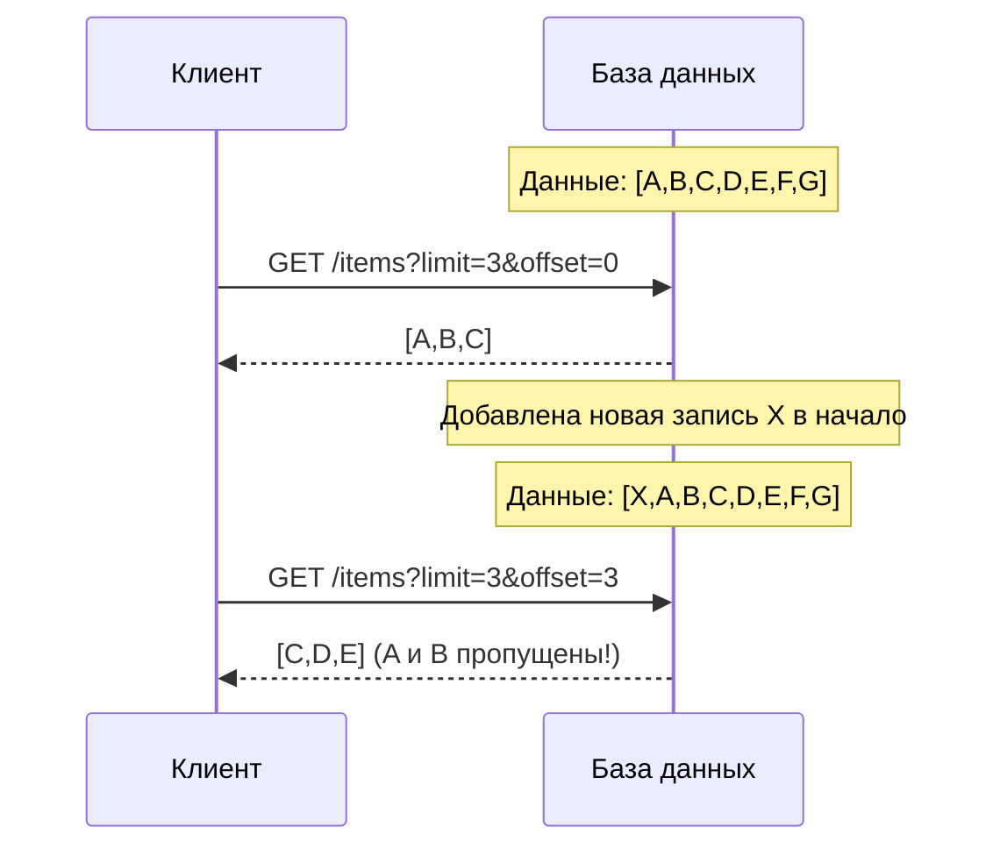

## Введение: Как не утонуть в данных

Представьте, что вы ищете книгу в библиотеке с миллионом томов. Библиотекарь не может вывалить на стол все миллион книг — они просто не поместятся. Вместо этого он выдаёт вам по 10-20 книг за раз. Вы просматриваете первую партию, просите следующую, и так до тех пор, пока не найдёте нужную.

В API та же проблема. Клиент запрашивает список пользователей, а сервер не может вернуть все 10 миллионов сразу — это убьёт память сервера, сеть и браузер клиента.

**Пагинация (Pagination)** — это механизм разбиения большого набора данных на последовательные страницы (порции). Клиент запрашивает страницу за страницей, получая данные частями.

Пагинация решает несколько проблем: ограничивает нагрузку на сервер (не нужно возвращать миллионы строк), уменьшает время ответа (меньше данных для передачи), экономит память клиента и улучшает пользовательский опыт (постепенная подгрузка).

## Основные подходы к пагинации

| Подход | Принцип | Когда использовать |
| :--- | :--- | :--- |
| **Offset / Limit** | Пропустить N записей, взять M | Простые случаи, небольшие объёмы |
| **Cursor (Keyset)** | Использовать указатель (последний ID, дата) | Большие данные, реальное время |
| **Page / Limit** | Номер страницы и размер страницы | Человеко-читаемые интерфейсы |
| **Seek (Search After)** | Поиск после определённого значения | Elasticsearch, большие данные |

## Offset / Limit (Смещение и лимит)

Самый простой и распространённый подход. Клиент передаёт два параметра:

- `limit` — сколько записей вернуть (размер страницы)
- `offset` — сколько записей пропустить (смещение)

### Пример запроса

```http
GET /users?limit=10&offset=0   # страница 1
GET /users?limit=10&offset=10  # страница 2
GET /users?limit=10&offset=20  # страница 3
```

### Формат ответа

```json
{
    "data": [
        {"id": 1, "name": "Иван"},
        {"id": 2, "name": "Петр"},
        ...
    ],
    "pagination": {
        "limit": 10,
        "offset": 0,
        "total": 100,
        "next_offset": 10,
        "prev_offset": null
    }
}
```

### Преимущества

| Преимущество | Объяснение |
| :--- | :--- |
| **Простота** | Легко понять и реализовать |
| **Произвольный доступ** | Можно сразу перейти на 100-ю страницу |
| **Поддержка ORDER BY** | Работает с любой сортировкой |

### Недостатки

| Недостаток | Объяснение |
| :--- | :--- |
| **Проблема пропущенных/дублирующихся записей** | Если между запросами добавилась новая запись, смещение сдвигается |
| **Низкая производительность на больших offset** | `OFFSET 100000` заставляет базу данных считать 100000 строк |
| **Неэффективно при частых изменениях** | Актуальна для статичных данных, не для real-time |

### Проблема плавающих данных



**Решение:** Использовать курсорную пагинацию.

### Производительность offset

```sql
-- База данных выполняет эту работу
SELECT * FROM users ORDER BY id LIMIT 10 OFFSET 100000;
-- Нужно прочитать и пропустить 100000 строк
```

Для больших таблиц это становится проблемой. Чем больше offset, тем медленнее запрос.

## Cursor (Keyset) пагинация

Использует указатель (cursor) — значение последнего полученного элемента. Следующий запрос начинается с этого значения.

### Пример с курсором на основе ID

```http
GET /users?limit=10&cursor=123   # вернуть записи после id=123
GET /users?limit=10&cursor=456
```

### Формат ответа

```json
{
    "data": [
        {"id": 124, "name": "Иван"},
        {"id": 125, "name": "Петр"},
        ...
    ],
    "pagination": {
        "limit": 10,
        "next_cursor": 134,
        "has_more": true
    }
}
```

### SQL реализация

```sql
-- Страница 1
SELECT * FROM users ORDER BY id LIMIT 10;
-- Последний id = 123

-- Страница 2
SELECT * FROM users WHERE id > 123 ORDER BY id LIMIT 10;
-- Последний id = 134

-- Страница 3
SELECT * FROM users WHERE id > 134 ORDER BY id LIMIT 10;
```

### Пример с курсором по дате

```http
GET /events?limit=20&cursor=2024-01-15T10:30:00Z
```

```sql
SELECT * FROM events 
WHERE created_at > '2024-01-15T10:30:00Z' 
ORDER BY created_at 
LIMIT 20;
```

### Составной курсор (несколько полей)

Если сортировка по нескольким полям, курсор должен быть составным.

```http
GET /users?sort=name,id&cursor=Иван,123
```

```sql
SELECT * FROM users 
WHERE (name > 'Иван') OR (name = 'Иван' AND id > 123)
ORDER BY name, id 
LIMIT 10;
```

### Opaque cursor (непрозрачный курсор)

Вместо передачи значения поля (которое может быть чувствительным), сервер может закодировать курсор.

```http
GET /users?limit=10&cursor=eyJpZCI6MTIzLCJuYW1lIjoi0JjQstCw0L0ifQ==
```

Сервер кодирует позицию в безопасную строку (base64, JWT). Клиент не знает, что внутри.

```python
# Генерация курсора
cursor = base64.encode(json.dumps({"id": 123, "name": "Иван"}))
# Возврат клиенту: "cursor": "eyJpZCI6MTIzLCJuYW1lIjoi0JjQstCw0L0ifQ=="

# При следующем запросе
cursor = base64.decode(request.args['cursor'])
last = json.loads(cursor)
```

### Преимущества курсорной пагинации

| Преимущество | Объяснение |
| :--- | :--- |
| **Стабильность** | Новые записи не влияют на результат (если сортировка по стабильному полю) |
| **Производительность** | `WHERE id > last_id` использует индекс, быстро даже на больших объёмах |
| **Подходит для real-time** | Работает с постоянно меняющимися данными |

### Недостатки курсорной пагинации

| Недостаток | Объяснение |
| :--- | :--- |
| **Нет произвольного доступа** | Нельзя перейти на 100-ю страницу, только "вперёд" |
| **Требует стабильной сортировки** | Сортировка должна быть уникальной (добавляем id) |
| **Сложнее в реализации** | Чем offset/limit |

## Page / Limit (Номер страницы)

Вариант offset/limit, где используется номер страницы вместо смещения.

```http
GET /users?page=2&limit=10
```

Сервер вычисляет: `offset = (page - 1) * limit`

### Формат ответа

```json
{
    "data": [...],
    "pagination": {
        "page": 2,
        "limit": 10,
        "total_pages": 10,
        "total_items": 100,
        "next_page": 3,
        "prev_page": 1
    }
}
```

**Когда использовать:** Человеко-читаемые интерфейсы (веб-приложения, админки). Пользователю понятно "страница 2 из 10".

## Seek (Search After) пагинация

Используется в поисковых системах (Elasticsearch). Клиент получает "точку поиска" и передаёт её для следующей страницы.

```http
# Первый запрос
POST /search
{
    "query": "iphone",
    "size": 10
}
```

```json
{
    "hits": [...],
    "pit_id": "abc123",
    "search_after": [1704067200000, "doc_123"]
}
```

```http
# Следующий запрос
POST /search
{
    "query": "iphone",
    "size": 10,
    "pit_id": "abc123",
    "search_after": [1704067200000, "doc_123"]
}
```

**Когда использовать:** Поисковые системы, распределённые данные, где нет единой сортировки.

## Выбор подхода

| Сценарий | Рекомендуемый подход |
| :--- | :--- |
| **Небольшие данные (< 10 000 записей)** | Offset/Limit (простота) |
| **Большие данные (> 100 000)** | Cursor (производительность) |
| **Пользовательский интерфейс с номерами страниц** | Page/Limit |
| **Real-time данные (часто меняются)** | Cursor |
| **Поисковые системы (Elasticsearch)** | Search After / PIT |
| **Мобильное приложение (бесконечный скролл)** | Cursor |
| **Админка с навигацией по страницам** | Offset/Limit или Page/Limit |

## Где хранить курсор

Клиент хранит курсор (в URL, в состоянии приложения). Сервер не хранит ничего.

**Почему сервер не хранит:** Это нарушает stateless принцип REST. Если сервер хранит курсоры, нужна синхронизация между экземплярами, привязанность клиента к серверу.

**Правильно:** Клиент получает курсор в ответе и отправляет его в следующем запросе. Сервер не хранит состояние.

## Пагинация и HEAD запросы

Клиент может запросить только метаинформацию о пагинации, без данных.

```http
HEAD /users?limit=10
```

```http
HTTP/1.1 200 OK
X-Total-Count: 1000
X-Page: 1
X-Total-Pages: 100
Link: <https://api.example.com/users?limit=10&page=2>; rel="next"
```

Полезно для получения общего количества элементов без загрузки всех данных.

## Заголовки Link для пагинации

Стандарт RFC 5988 предлагает использовать заголовок `Link` для навигации.

```http
HTTP/1.1 200 OK
Link: <https://api.example.com/users?limit=10&cursor=123>; rel="next",
      <https://api.example.com/users?limit=10&cursor=0>; rel="first",
      <https://api.example.com/users?limit=10&cursor=111>; rel="prev"
```

| rel | Значение |
| :--- | :--- |
| `first` | Первая страница |
| `last` | Последняя страница |
| `next` | Следующая страница |
| `prev` | Предыдущая страница |

## Заголовки для общего количества

```http
HTTP/1.1 200 OK
X-Total-Count: 1000
X-Page: 2
X-Total-Pages: 100
X-Per-Page: 10
```

Не стандартизировано, но широко используется.

## Пагинация и сортировка

Сортировка должна быть стабильной. Добавляйте уникальное поле (обычно id) в сортировку.

**Плохо:**

```http
GET /users?sort=name
```

Если у двух пользователей одинаковое имя, порядок между ними может меняться.

**Хорошо:**

```http
GET /users?sort=name,id
```

Имя + ID гарантируют уникальность и стабильность.

## Частые ошибки

### Ошибка 1: Огромные limit

```http
GET /users?limit=100000
```

**Почему плохо:** Сервер может не выдержать, сеть может не выдержать, клиент может не выдержать.

**Как исправить:** Установить максимальный limit (например, 100) и документировать.

### Ошибка 2: Отсутствие total count

Клиент не знает, сколько всего элементов, не может построить навигацию.

**Как исправить:** Возвращать `total` в ответе.

### Ошибка 3: Сортировка без уникального поля

```http
GET /users?sort=created_at
```

При одинаковых created_at порядок нестабилен.

**Как исправить:** `sort=created_at,id`.

### Ошибка 4: Хранение состояния пагинации на сервере

```http
POST /users/search
{"filters": {...}, "page": 1}
→ сервер создаёт "сессию поиска" с ID
GET /users/search/abc123/page/2
```

**Почему плохо:** Нарушает stateless принцип REST. Не масштабируется.

**Как исправить:** Вся информация в запросе: `GET /users?filters=...&cursor=...`.

### Ошибка 5: Использование offset для больших данных

```http
GET /users?limit=10&offset=1000000
```

**Почему плохо:** Медленно. База данных считает 1 000 000 строк.

**Как исправить:** Курсорная пагинация.

## Резюме для системного аналитика

1. **Пагинация** — механизм разбиения большого набора данных на страницы. Без неё API не может работать с большими объёмами данных.

2. **Offset/Limit** — самый простой подход. Хорош для небольших данных (<10 000) и интерфейсов с номерами страниц. Плох для больших offset и часто меняющихся данных.

3. **Cursor (Keyset)** — подход на основе указателя. Стабилен, производителен на больших объёмах, подходит для real-time. Не поддерживает произвольный доступ к страницам.

4. **Page/Limit** — вариант offset/limit для человеко-читаемых интерфейсов.

5. **Выбор подхода** зависит от объёма данных, требований к производительности, необходимости произвольного доступа и частоты изменений данных.

6. **Курсор должен быть стабильным.** Добавляйте уникальное поле (обычно id) в сортировку.