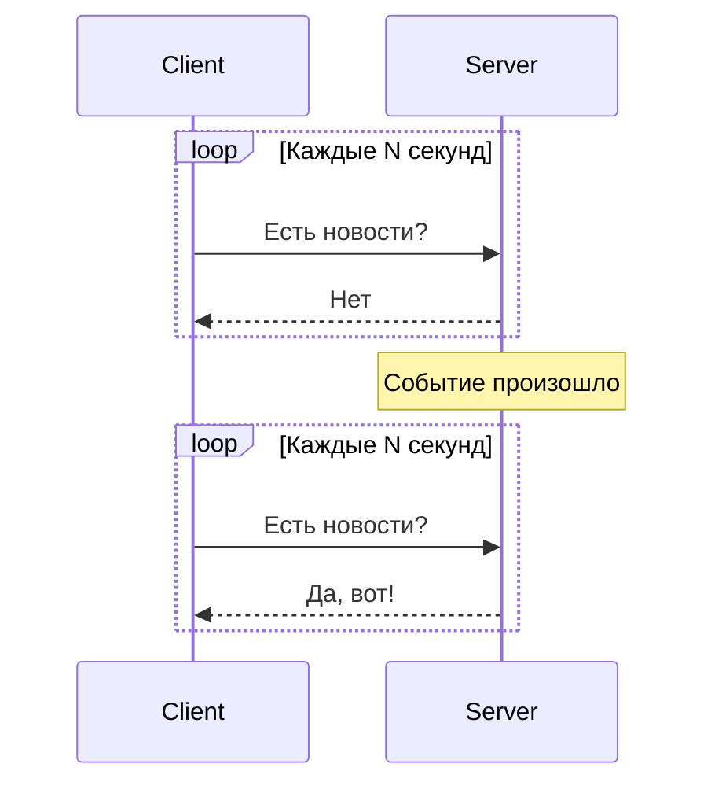
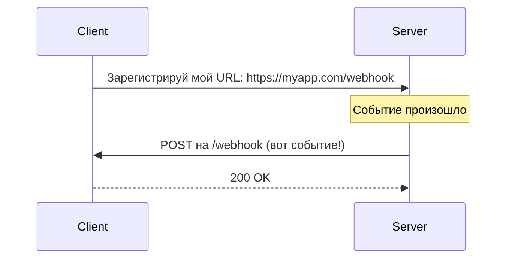
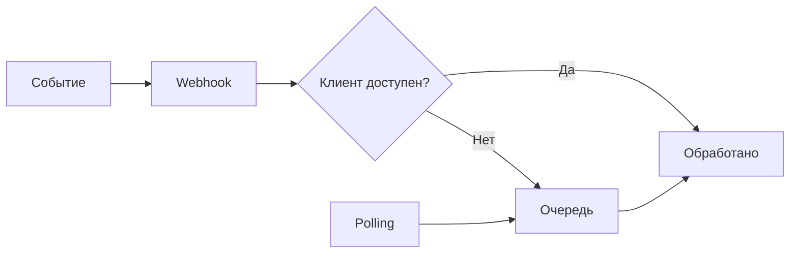

## Введение: Две стратегии получения обновлений

Представьте, что вы ждёте посылку. Есть два способа узнать, пришла ли она:

**Polling (опрос):** Вы звоните в почтовое отделение каждые 10 минут: "Посылка пришла?" — "Нет". Через 10 минут снова: "А теперь?" — "Нет". И так, пока не скажут "Да". Вы тратите время, нагружаете операторов, но контролируете процесс.

**Webhook (уведомление):** Вы оставляете свой номер телефона. Когда посылка приходит, почтальон сам звонит вам. Никаких лишних звонков. Посылка пришла — вы узнали об этом сразу.

В мире API эти два подхода называются **Polling** и **Webhooks**. Это две фундаментально разные стратегии получения обновлений от сервера.

**Polling** — клиент периодически опрашивает сервер: "Есть что-то новое?". **Webhook** — сервер сам уведомляет клиента, когда происходит событие.

Выбор между ними зависит от частоты событий, требований к задержке, архитектурных ограничений и возможностей провайдера.

## Polling: Клиент всё спрашивает сам

### Как работает

Клиент отправляет запросы на сервер через равные интервалы времени и проверяет, есть ли новые данные.



### Виды polling

| Вид | Описание | Пример |
| :--- | :--- | :--- |
| **Short polling** | Клиент спрашивает каждые N секунд, сервер отвечает сразу | Запрос статуса заказа каждые 5 секунд |
| **Long polling** | Клиент спрашивает, сервер держит соединение открытым, пока не случится событие (или не пройдёт таймаут) | Чат, уведомления |
| **WebSockets / SSE** | Постоянное соединение, сервер отправляет данные | Реальное время (но это уже не polling) |

### Пример short polling

```http
GET /orders/123/status
```

```json
{"status": "pending"}
```

Через 5 секунд:

```http
GET /orders/123/status
```

```json
{"status": "shipped"}
```

### Пример long polling

```http
GET /events?timeout=30
```

Сервер держит соединение до 30 секунд. Если событие происходит — отвечает сразу. Если нет — через 30 секунд отвечает "пусто", и клиент переподключается.

## Webhook: Сервер сам уведомляет

### Как работает

Клиент предоставляет URL, сервер отправляет POST запрос при наступлении события.



### Пример

```http
POST https://myapp.com/webhooks/payment
Content-Type: application/json

{
    "event": "payment.succeeded",
    "data": {"payment_id": "pay_123", "amount": 1000}
}
```

```http
HTTP/1.1 200 OK
```

## Сравнение по ключевым параметрам

| Параметр | Polling | Webhook |
| :--- | :--- | :--- |
| **Направление** | Клиент → Сервер | Сервер → Клиент |
| **Задержка (latency)** | Зависит от интервала опроса (N секунд) | Реальное время (секунды, миллисекунды) |
| **Нагрузка на сервер** | Высокая (много бесполезных запросов) | Низкая (только при событиях) |
| **Нагрузка на клиент** | Высокая (постоянные запросы) | Низкая (только обработка уведомлений) |
| **Сложность реализации (клиент)** | Низкая | Средняя (нужно принимать HTTP запросы) |
| **Сложность реализации (сервер)** | Низкая | Высокая (нужно отправлять, retry, подписи) |
| **Контроль над частотой** | У клиента | У сервера |
| **Firewall/NAT** | Легко (исходящие соединения) | Сложно (нужен публичный URL) |
| **Гарантия доставки** | Нет (клиент сам спросит) | Есть (retry, очереди) |
| **Подходит для редких событий** | Плохо (много бесполезных запросов) | Отлично (уведомления только когда надо) |
| **Подходит для частых событий** | Хорошо (опрос часто) | Отлично (уведомления без задержки) |

## Задержка (Latency)

### Polling

Задержка = интервал опроса. Если опрашивать раз в 5 секунд, в среднем событие будет обнаружено через 2.5 секунды, в худшем — через 5 секунд.

```mermaid
gantt
    title Polling задержка
    dateFormat ss
    axisFormat %Ss
    
    section Время
    Событие :event, 00, 0s
    Следующий опрос :poll, 05, 0s
    Обнаружение :detect, 05, 0s
```



### Webhook

Задержка = время обработки + сеть. Обычно миллисекунды или секунды.

```mermaid
gantt
    title Webhook задержка
    dateFormat ss
    axisFormat %Ss
    
    section Время
    Событие :event, 00, 0s
    Отправка :send, 00, 0.2s
    Получение :receive, 00, 0.2s
```



**Вывод:** Webhook всегда быстрее. Polling можно ускорить, уменьшая интервал, но это увеличивает нагрузку.

## Нагрузка

### Polling: Математика нагрузки

- Частота опроса: раз в 5 секунд
- Количество клиентов: 10 000
- Запросов в секунду: 10 000 / 5 = 2000 RPS

Если событий мало (например, 1% клиентов что-то меняет за час), 99% запросов — бесполезные.

### Webhook: Нагрузка только на события

- Количество событий в секунду: 100
- Запросов в секунду: 100

**Экономия:** в 20 раз меньше запросов.

### Пример: Статус заказа

| Сценарий | Polling (каждые 5с) | Webhook |
| :--- | :--- | :--- |
| **Запросов в день** | 17 280 | 1 (при изменении статуса) |
| **Бесполезных запросов** | 17 279 | 0 |

## Сложность реализации

### Polling (просто)

```python
# Клиент
while True:
    response = requests.get('/api/order/123/status')
    if response.json()['status'] == 'shipped':
        break
    time.sleep(5)
```

### Webhook (сложнее)

```python
# Клиент: регистрация
requests.post('/api/webhooks', json={'url': 'https://myapp.com/webhook', 'events': ['order.shipped']})

# Клиент: обработка входящих webhook
@app.post('/webhook')
def handle_webhook():
    event = request.json
    if event['type'] == 'order.shipped':
        process_order(event['data'])
    return 'OK'
```

## Firewall и NAT

### Polling

Клиент инициирует исходящие соединения. Легко проходит через корпоративные файрволы и NAT.

### Webhook

Сервер инициирует входящие соединения. Клиент должен иметь публичный URL и открытый порт. В корпоративной сети это может быть проблемой.

**Решение:** Использовать туннели (ngrok, Cloudflare Tunnel) или промежуточные очереди (webhook → очередь → клиент забирает).

## Гарантия доставки

### Polling

Клиент сам спрашивает. Если пропустил опрос — спросит в следующий раз. Потеря данных возможна только если клиент перестал опрашивать совсем.

### Webhook

Сервер отправляет один раз. Если клиент недоступен, уведомление может потеряться.

**Решение:**
- **Retry (повторные попытки):** сервер повторяет отправку (экспоненциальная задержка)
- **Очередь неудачных доставок (dead letter queue):** неудачные webhook сохраняются для ручного разбора
- **Идемпотентность:** дубликаты безопасны
- **Fallback polling:** клиент периодически опрашивает, если webhook не пришёл

## Потребление ресурсов

| Ресурс | Polling | Webhook |
| :--- | :--- | :--- |
| **CPU сервера** | Высокое (много запросов) | Низкое (только при событиях) |
| **Сеть сервера** | Высокая (много запросов) | Низкая (только при событиях) |
| **CPU клиента** | Среднее (отправка запросов, парсинг) | Низкое (только при уведомлениях) |
| **Батарея (мобильные)** | Высокое (радио включается каждые N секунд) | Низкое (только push уведомления) |
| **Память** | Низкая | Средняя (очереди, retry) |

## Когда использовать Polling

| Сценарий | Почему Polling |
| :--- | :--- |
| **Провайдер не поддерживает webhook** | Нет выбора |
| **События очень редкие** | Polling с большим интервалом (раз в час) допустим |
| **Клиент за NAT/firewall** | Нет публичного URL |
| **Простое приложение** | Polling проще реализовать |
| **Низкие требования к задержке** | Секунды или минуты допустимы |
| **Клиент сам решает, когда обновляться** | Polling даёт контроль над частотой |
| **Нужно получить все изменения за период** | Polling может забрать всё сразу |

**Примеры:**
- Проверка статуса заказа (каждые 30 секунд)
- Обновление курса валют (раз в час)
- Получение новых email (IMAP polling)

## Когда использовать Webhook

| Сценарий | Почему Webhook |
| :--- | :--- |
| **Требуется реальное время** | Миллисекунды, не секунды |
| **Событий много** | Экономия ресурсов |
| **События редкие, но важные** | Не нужно опрашивать впустую |
| **Мобильное приложение** | Экономия батареи и трафика |
| **Сервер может инициировать соединение** | Есть публичный URL |
| **Провайдер поддерживает webhook** | Стандарт для современных API |
| **Нужна гарантия доставки** | Retry, очереди, fallback |

**Примеры:**
- Уведомление об оплате (Stripe webhook)
- CI/CD триггеры (GitHub webhook)
- Новые сообщения в чате (Slack webhook)
- Алерты мониторинга (Prometheus Alertmanager)

## Гибридный подход

Лучшая стратегия часто гибридная.

### Webhook + fallback polling



**Как работает:**
1. Основной канал — webhook (быстро, эффективно)
2. Клиент периодически опрашивает fallback URL (раз в минуту)
3. Если webhook не пришёл, клиент найдёт событие при опросе

### Polling с адаптивным интервалом

```python
# Умный polling: часто в начале, реже потом
intervals = [1, 2, 5, 10, 30, 60]  # секунды
for interval in intervals:
    check()
    if event_found:
        break
    time.sleep(interval)
```

## Сравнительная таблица

| Характеристика | Polling | Webhook |
| :--- | :--- | :--- |
| **Задержка** | Секунды-минуты | Миллисекунды-секунды |
| **Нагрузка на сервер** | Высокая | Низкая |
| **Нагрузка на клиент** | Высокая | Низкая |
| **Сложность клиента** | Низкая | Средняя |
| **Сложность сервера** | Низкая | Высокая |
| **Firewall/NAT** | Легко | Сложно |
| **Гарантия доставки** | Нет (клиент спросит) | Да (retry, очередь) |
| **Контроль частоты** | У клиента | У сервера |
| **Подходит для редких событий** | Плохо | Отлично |
| **Подходит для частых событий** | Хорошо | Отлично |
| **Мобильные устройства** | Плохо (батарея) | Хорошо (push) |

## Пример выбора

### Ситуация 1: Статус заказа в интернет-магазине

- События: редкие (один заказ → несколько статусов)
- Требования: не критично реальное время (секунды-минуты)
- Клиент: браузер

**Решение:** Polling (каждые 5-10 секунд) + long polling как оптимизация.

### Ситуация 2: Платёж через Stripe

- События: редкие (платёж)
- Требования: реальное время (активация подписки сразу)
- Провайдер: поддерживает webhook

**Решение:** Webhook.

### Ситуация 3: GitHub CI/CD

- События: частые (пуш в репозиторий)
- Требования: реальное время
- Провайдер: поддерживает webhook

**Решение:** Webhook.

### Ситуация 4: Мобильное приложение для заказа еды

- События: статус заказа меняется 2-3 раза
- Требования: реальное время (пользователь ждёт)
- Клиент: мобильное приложение (экономия батареи)

**Решение:** Webhook + push уведомления (FCM, APNS).

### Ситуация 5: Старый корпоративный CRM

- События: новые лиды
- Провайдер: не поддерживает webhook
- Клиент: внутри корпоративной сети

**Решение:** Polling (каждую минуту).

## Распространённые ошибки

### Ошибка 1: Polling с очень маленьким интервалом

```python
while True:
    check()        # каждые 0.1 секунды
    time.sleep(0.1)
```

**Почему плохо:** Огромная нагрузка на сервер (600 запросов в минуту). Бесполезно, если события редкие.

**Исправление:** Увеличить интервал или использовать webhook.

### Ошибка 2: Webhook без retry

```python
def webhook_handler(request):
    try:
        process(request.json)
    except Exception:
        return HTTP 500  # retry? нет, просто ошибка
```

**Исправление:** Retry стратегия (экспоненциальная задержка).

### Ошибка 3: Webhook без проверки подписи

Любой может отправить поддельный webhook.

**Исправление:** Проверка подписи (HMAC).

### Ошибка 4: Синхронная обработка в webhook

```python
def webhook_handler(request):
    process_slow(request.json)  # может занять минуты
    return HTTP 200
```

**Исправление:** Асинхронная обработка (очередь, фоновая задача).

### Ошибка 5: Long polling без таймаута

Клиент висит на соединении вечно. Сервер не может закрыть соединение.

**Исправление:** Таймаут (30-60 секунд), переподключение.

## Резюме для системного аналитика

1. **Polling** — клиент сам спрашивает. Webhook — сервер сам уведомляет. Это две фундаментально разные стратегии получения обновлений.

2. **Polling:** просто, работает везде, но создаёт нагрузку и имеет задержку. Хорош для редких событий, когда webhook не поддерживается.

3. **Webhook:** эффективно, реальное время, но сложнее в реализации и требует публичного URL. Хорош для частых событий и реального времени.

4. **Задержка:** polling = интервал опроса (секунды), webhook = миллисекунды.

5. **Нагрузка:** polling создаёт много бесполезных запросов, webhook — только при событиях.

6. **Надёжность:** у webhook есть retry, у polling — нет (клиент сам спросит в следующий раз).

7. **Гибридный подход:** webhook + fallback polling — лучшее из двух миров.