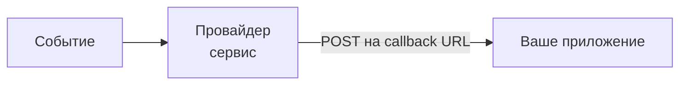

## Введение: Когда сервер сам стучится в дверь

Представьте, что вы заказали пиццу. Вы можете каждую минуту звонить в пиццерию и спрашивать: "Моя пицца готова?" Это называется **polling** (опрос). Но можно поступить иначе: оставить свой номер телефона, и пиццерия сама позвонит, когда пицца будет готова. Это **webhook**.

В мире API большинство взаимодействий инициируется клиентом: клиент отправляет запрос, сервер отвечает. Но есть сценарии, где сервер должен сам уведомить клиента о событии: платёж прошёл, статус заказа изменился, новый пользователь зарегистрировался.

**Webhook** — это механизм, при котором сервер отправляет HTTP-запрос (обычно POST) на заранее заданный URL клиента при наступлении определённого события. Клиент предоставляет URL, сервер вызывает его, когда нужно.

Это как "обратный вызов" (callback) в реальном мире: вы оставляете серверу свой адрес, и сервер сам приходит к вам с новостями. Webhooks лежат в основе многих современных интеграций: платежные системы уведомляют о транзакциях, CRM сообщают о новых лидах, GitHub оповещает о пушах в репозиторий.

## Зачем нужны webhooks

### Проблема: Как узнать, что событие произошло?

Допустим, вы интегрируетесь с платёжной системой. Клиент оплатил заказ. Как ваше приложение узнает, что платёж прошёл?

| Подход | Как работает | Проблемы |
| :--- | :--- | :--- |
| **Polling (опрос)** | Приложение каждые 5 секунд спрашивает: "Платёж прошёл?" | Трата ресурсов, задержка, нагрузка на сервер |
| **Webhook** | Платёжная система сама шлёт уведомление | Нет задержки, нет лишних запросов |

### Преимущества webhooks

| Преимущество | Объяснение |
| :--- | :--- |
| **Реальное время** | Уведомление приходит сразу после события |
| **Эффективность** | Нет лишних запросов, экономия ресурсов |
| **Масштабируемость** | Клиент не нагружает сервер опросами |
| **Простота для клиента** | Клиент предоставляет URL и ждёт уведомлений |

## Как работают webhooks

### Основные участники



| Участник | Роль |
| :--- | :--- |
| **Провайдер (Provider)** | Сервис, у которого происходят события (платёжная система, GitHub, CRM) |
| **Событие (Event)** | Что произошло (платёж, пуш в репозиторий, новый лид) |
| **Callback URL** | URL вашего приложения, который вы предоставили провайдеру |
| **Ваше приложение (Consumer)** | Получает и обрабатывает уведомление |

### Процесс

1. **Регистрация webhook:** Вы сообщаете провайдеру URL вашего приложения (и, возможно, какие события вас интересуют).
2. **Наступление события:** В провайдере происходит событие (например, платёж).
3. **Отправка уведомления:** Провайдер отправляет HTTP POST запрос на ваш URL с данными о событии.
4. **Обработка:** Ваше приложение получает запрос, обрабатывает его, возвращает HTTP 200 OK.
5. **Retry (при ошибке):** Если ваш сервер не ответил 200 OK, провайдер повторит отправку (обычно с экспоненциальной задержкой).

## Пример: Webhook от платёжной системы

### 1. Регистрация webhook

```http
POST https://api.paymentsystem.com/webhooks
Authorization: Bearer api_key
Content-Type: application/json

{
    "url": "https://myapp.example.com/webhooks/payment",
    "events": ["payment.succeeded", "payment.failed"],
    "secret": "my_secret_key_123"
}
```

### 2. Наступление события

Пользователь оплатил заказ.

### 3. Провайдер отправляет webhook

```http
POST https://myapp.example.com/webhooks/payment
Content-Type: application/json
User-Agent: PaymentSystem-Webhook
X-PaymentSystem-Signature: sha256=abc123...

{
    "event": "payment.succeeded",
    "timestamp": "2024-01-15T10:30:00Z",
    "data": {
        "payment_id": "pay_123456",
        "amount": 1000,
        "currency": "rub",
        "customer_id": "cus_789",
        "order_id": "order_456"
    }
}
```

### 4. Ваше приложение обрабатывает

```http
HTTP/1.1 200 OK
```

### 5. Если ошибка (500)

Провайдер повторит через 10 секунд, потом через 1 минуту, потом через 10 минут...

## Webhook vs API: Кто кого вызывает

| Аспект | Обычный API | Webhook |
| :--- | :--- | :--- |
| **Кто инициирует** | Клиент | Сервер (провайдер) |
| **Направление** | Клиент → Сервер | Провайдер → Клиент |
| **Когда используется** | Запрос данных, выполнение действий | Уведомление о событиях |
| **Пример** | GET /payment/123 | POST на ваш URL при оплате |

Обычный API и webhook не исключают друг друга. Часто они работают вместе:

- **API** для инициирования действий (создать платёж, отправить запрос)
- **Webhook** для получения уведомлений (платёж прошёл)

## Типичные сценарии использования

| Сценарий | Провайдер | Событие | Что делает клиент |
| :--- | :--- | :--- | :--- |
| **Платежи** | Платёжная система (Stripe, PayPal) | Платёж прошёл | Активирует подписку, отправляет товар |
| **CI/CD** | GitHub, GitLab | Пуш в репозиторий | Запускает сборку, тесты |
| **CRM** | AmoCRM, Salesforce | Новый лид | Отправляет в отдел продаж |
| **Мессенджеры** | Slack, Telegram | Новое сообщение | Обрабатывает команду |
| **Мониторинг** | Prometheus, Datadog | Алерт | Отправляет уведомление |
| **Email** | SendGrid, Mailgun | Открытие письма | Обновляет статистику |
| **Заказы** | Интернет-магазин | Статус заказа изменился | Уведомляет клиента |

## Формат webhook сообщения

Стандартного формата нет, но есть общие практики.

### Типичная структура

```json
{
    "event": "payment.succeeded",      // тип события
    "id": "evt_123456",                // уникальный ID события
    "timestamp": "2024-01-15T10:30:00Z", // время события
    "data": {                          // данные события
        "payment_id": "pay_123",
        "amount": 1000
    },
    "webhook_id": "whk_789"            // ID webhook (если несколько)
}
```

### Версионирование

```json
{
    "version": "2",
    "event": "payment.succeeded",
    "data": { ... }
}
```

### Идемпотентность (idempotency key)

```json
{
    "idempotency_key": "abc-123-def",  // одинаковый для повторных попыток
    "event": "payment.succeeded",
    "data": { ... }
}
```

## Безопасность webhooks

Webhooks — это HTTP запросы из внешней сети в вашу. Их нужно защищать.

### 1. Проверка подписи (Signature verification)

Провайдер подписывает запрос секретным ключом. Вы проверяете подпись.

```http
POST /webhooks/payment
X-Signature: sha256=abc123def456...
```

```python
# Псевдокод проверки подписи
def verify_signature(payload, signature, secret):
    expected = hmac.new(secret, payload, hashlib.sha256).hexdigest()
    return hmac.compare_digest(signature, expected)
```

### 2. Белый список IP

Провайдер публикует список IP, с которых приходят webhook. Вы проверяете IP отправителя.

```python
ALLOWED_IPS = ['192.0.2.0/24', '198.51.100.0/24']
if request.remote_addr not in ALLOWED_IPS:
    return HTTP 403
```

### 3. Проверка User-Agent

```python
ALLOWED_USER_AGENTS = ['PaymentSystem-Webhook/1.0']
if request.user_agent not in ALLOWED_USER_AGENTS:
    return HTTP 403
```

### 4. Использование HTTPS

Всегда используйте HTTPS для webhook URL. Без шифрования подпись и данные могут быть перехвачены.

### 5. Проверка idempotency key (защита от дубликатов)

```python
if idempotency_key in processed_keys:
    return HTTP 200 OK  # уже обработали
```

## Retry и обработка ошибок

Сети ненадёжны. Webhook может не доставиться.

### Стратегия retry (у провайдера)

| Попытка | Типичная задержка |
| :--- | :--- |
| 1 | 0 сек (сразу) |
| 2 | 10 сек |
| 3 | 1 мин |
| 4 | 10 мин |
| 5 | 1 час |
| 6 | 6 часов |
| 7 | 24 часа |

### Что должен вернуть клиент

| HTTP статус | Значение | Будет ли retry |
| :--- | :--- | :--- |
| 200 OK | Успех, обработано | Нет |
| 202 Accepted | Принято, но не обработано | Обычно нет |
| 4xx (400-499) | Ошибка клиента (неправильный запрос) | Нет (провайдер не будет повторять) |
| 5xx (500-599) | Ошибка сервера | Да |

### Идемпотентность обработки

Один и тот же webhook может быть отправлен несколько раз (retry, сетевые проблемы). Ваше приложение должно обрабатывать дубликаты идемпотентно.

```python
# Псевдокод
def handle_webhook(event_id, data):
    if already_processed(event_id):
        return  # уже обработали, игнорируем
    process(data)
    mark_processed(event_id)
```

## Регистрация и управление webhooks

### Через API

```http
# Создать webhook
POST /webhooks
{"url": "https://myapp.com/webhook", "events": ["user.created"]}

# Получить список webhooks
GET /webhooks

# Обновить webhook
PUT /webhooks/whk_123
{"url": "https://myapp.com/webhook/v2"}

# Удалить webhook
DELETE /webhooks/whk_123
```

### Через UI (дашборд)

Многие провайдеры (GitHub, Stripe, Slack) предлагают UI для настройки webhooks.

**Пример из GitHub:**
Settings → Webhooks → Add webhook → Payload URL: https://myapp.com/github → Content type: application/json → Secret: my_secret

### Webhook vs Event Subscription

| Подход | Описание |
| :--- | :--- |
| **Один webhook на всё** | Один URL получает все события |
| **Разные webhooks** | Разные URL для разных событий |
| **Фильтрация событий** | Клиент указывает, какие события ему нужны |

## Webhook vs Polling vs WebSockets vs Server-Sent Events

| Механизм | Направление | Задержка | Нагрузка | Сложность |
| :--- | :--- | :--- | :--- | :--- |
| **Polling** | Клиент → Сервер | Секунды-минуты | Высокая | Низкая |
| **Webhook** | Сервер → Клиент | Реальное время | Низкая | Средняя |
| **WebSockets** | Двунаправленный | Реальное время | Средняя | Высокая |
| **SSE (Server-Sent Events)** | Сервер → Клиент | Реальное время | Низкая | Средняя |

**Кратко:**
- **Polling:** когда webhook нельзя настроить, или события редкие.
- **Webhook:** когда провайдер поддерживает, и нужно реальное время.
- **WebSockets:** когда нужна двусторонняя связь (чат, игра).
- **SSE:** когда нужно однонаправленное real-time (лента новостей).

## Распространённые проблемы и решения

### Проблема 1: Webhook не пришёл

| Причина | Решение |
| :--- | :--- |
| URL недоступен | Проверить доступность, логи |
| Провайдер не отправил | Проверить дашборд провайдера |
| Неправильная подпись | Проверить secret |
| IP в блок-листе | Добавить IP провайдера |

### Проблема 2: Дубликаты

| Причина | Решение |
| :--- | :--- |
| Retry провайдера | Идемпотентность (idempotency key) |
| Сетевые проблемы | Хранить ID обработанных событий |

### Проблема 3: Медленная обработка

| Причина | Решение |
| :--- | :--- |
| Синхронная обработка | Поставить в очередь (queue) |
| Тяжёлые операции | Асинхронная обработка |

```python
# Хорошо: быстро подтвердить, медленно обработать
def webhook_handler(request):
    event = parse(request)
    queue.send(event)          # в очередь
    return HTTP 200 OK

# Плохо: медленно обрабатывать синхронно
def webhook_handler(request):
    event = parse(request)
    process_slow(event)        # может занять секунды
    return HTTP 200 OK
```

### Проблема 4: Webhook URL изменился

| Причина | Решение |
| :--- | :--- |
| Переезд на новый домен | Обновить webhook через API провайдера |
| Реорганизация API | Оставить старый URL с редиректом |

## Webhook в популярных сервисах

### GitHub

```http
POST /webhook
X-GitHub-Event: push
X-Hub-Signature-256: sha256=abc...

{
    "ref": "refs/heads/main",
    "repository": {"name": "myrepo"},
    "pusher": {"name": "ivan"},
    "commits": [...]
}
```

### Stripe

```http
POST /webhook
Stripe-Signature: t=1734567890,v1=abc...

{
    "id": "evt_123",
    "type": "payment_intent.succeeded",
    "data": {
        "object": {
            "id": "pi_123",
            "amount": 1000
        }
    }
}
```

### Slack

```http
POST /webhook
Content-Type: application/json

{
    "token": "legacy_token_abc",
    "team_id": "T123",
    "event": {
        "type": "message",
        "user": "U123",
        "text": "Hello"
    }
}
```

## Проектирование webhook API для СА

### Что нужно определить

| Вопрос | Что решить |
| :--- | :--- |
| **Формат payload** | JSON, XML? Какие поля? |
| **Подпись** | Как подписывать? Какой заголовок? |
| **Retry стратегия** | Сколько попыток? Какие задержки? |
| **Идемпотентность** | Будет ли idempotency key? |
| **Безопасность** | IP белый список? HTTPS? |
| **Регистрация** | Через API? Через UI? |

### Пример спецификации

```yaml
Webhook:
  URL: https://myapp.com/webhook
  Method: POST
  Headers:
    - X-Signature: sha256=...
    - Content-Type: application/json
  Body:
    event: string (required)
    id: string (required)
    timestamp: string (ISO8601)
    data: object
  Retry:
    attempts: 5
    backoff: exponential (1s, 2s, 4s, 8s, 16s)
  Security:
    signature: HMAC-SHA256 with secret
    https: required
```

## Резюме для системного аналитика

1. **Webhook — это когда сервер сам звонит клиенту.** Клиент предоставляет URL, сервер отправляет POST при событии. Реальное время, без лишних запросов.

2. **Основные сценарии:** платежи (Stripe), CI/CD (GitHub), CRM, мессенджеры, мониторинг, email.

3. **Безопасность критична.** Проверка подписи, белый список IP, HTTPS, идемпотентность.

4. **Retry стратегия** — экспоненциальная задержка (1с, 2с, 4с...). Клиент должен возвращать 200 OK при успехе, 5xx — при временной ошибке (будет retry).

5. **Идемпотентность обязательна.** Один webhook может прийти несколько раз. Клиент должен обрабатывать дубликаты (по idempotency key или ID события).

6. **Обработка должна быть асинхронной.** Подтвердите 200 OK быстро, тяжёлую логику делайте в фоне (очередь, фоновая задача).

7. **Webhook vs Polling:** Webhook — реальное время, эффективно. Polling — когда webhook нельзя настроить или события очень редкие.