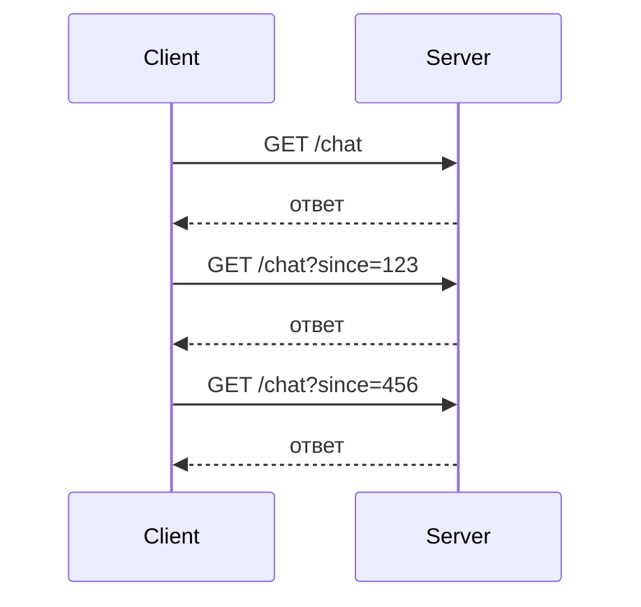
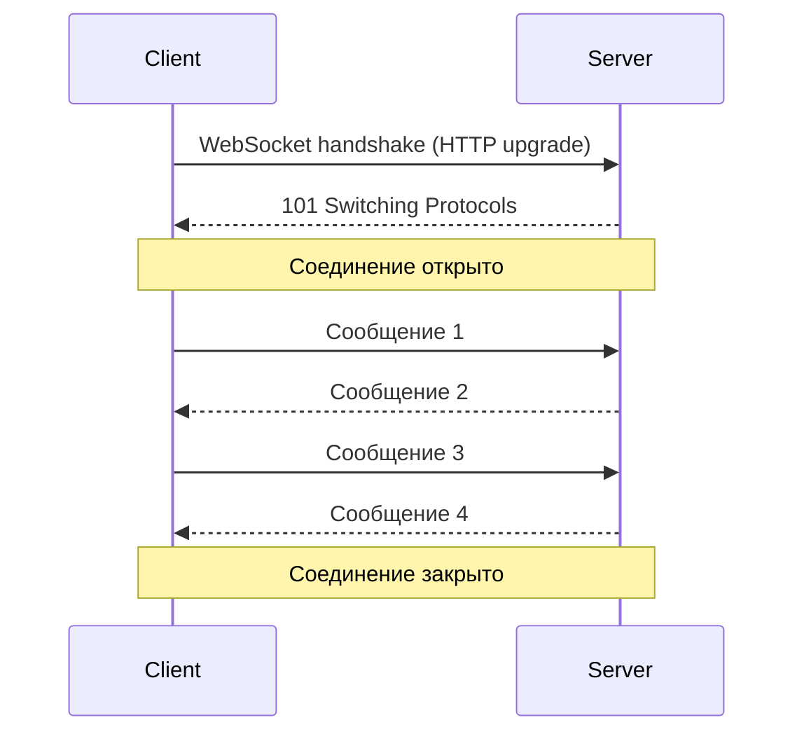
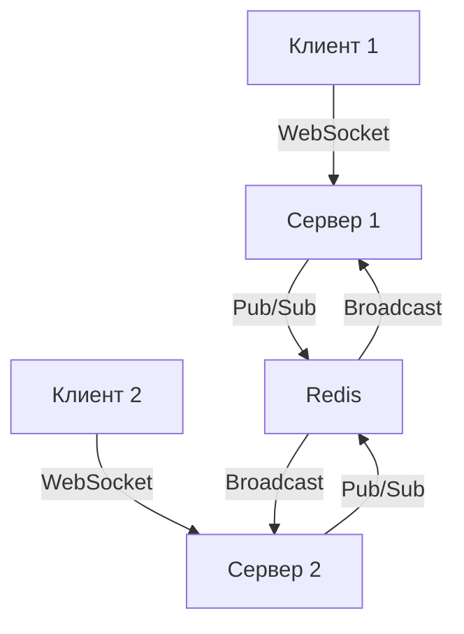

## Введение: Разговор вместо писем

Представьте, что вы общаетесь с другом по переписке. Вы отправляете сообщение, ждёте ответ, отправляете следующее. Каждое сообщение — отдельное "письмо". Это похоже на HTTP: клиент запросил — сервер ответил. Соединение закрылось.

А теперь представьте телефонный разговор. Вы установили связь и говорите непрерывно: вы — друг, друг — вам. Не нужно каждый раз "набирать номер". Соединение открыто, пока вы не положите трубку.

**WebSocket** — это как телефонный разговор для интернета. Это протокол, который устанавливает постоянное двустороннее соединение между клиентом и сервером. Однажды открыв соединение, обе стороны могут отправлять сообщения в любой момент, без необходимости создавать новое соединение для каждого сообщения.

Веб начался с HTTP — протокола, где каждое сообщение требует нового соединения. Клиент спрашивает, сервер отвечает, соединение закрывается. Это нормально для веб-страниц, но плохо для чатов, игр, биржевых котировок. WebSocket был создан, чтобы сделать веб реального времени возможным.

## Проблема, которую решают WebSockets

### Традиционный HTTP: запрос-ответ



Каждое сообщение — новый HTTP запрос. Для чата это означает тысячи запросов.

### Альтернативы до WebSockets

| Технология | Проблемы |
| :--- | :--- |
| **Polling (опрос)** | Клиент спрашивает каждые N секунд. Много бесполезных запросов, задержка. |
| **Long polling** | Клиент ждёт, пока сервер ответит. Лучше, но всё ещё накладные расходы на каждый запрос. |
| **Server-Sent Events (SSE)** | Сервер может отправлять, клиент — нет (однонаправленный). |

### WebSocket: постоянное двустороннее соединение



Одно соединение. Много сообщений в обе стороны. Минимальные накладные расходы.

## Как работают WebSockets

### 1. Handshake (рукопожатие)

WebSocket начинается как обычный HTTP запрос, но с особыми заголовками, которые "просят" сервер переключиться на WebSocket протокол.

```http
GET /chat HTTP/1.1
Host: example.com
Upgrade: websocket
Connection: Upgrade
Sec-WebSocket-Key: dGhlIHNhbXBsZSBub25jZQ==
Sec-WebSocket-Version: 13
```

Сервер отвечает:

```http
HTTP/1.1 101 Switching Protocols
Upgrade: websocket
Connection: Upgrade
Sec-WebSocket-Accept: s3pPLMBiTxaQ9kYGzzhZRbK+xOo=
```

Статус **101 Switching Protocols** означает: "Переключаюсь на WebSocket". С этого момента соединение переключается с HTTP на WebSocket протокол.

### 2. Передача сообщений (frames)

После handshake клиент и сервер могут отправлять **фреймы** (кадры) — небольшие сообщения с минимальными заголовками.

**Структура фрейма WebSocket:**

| Байты | Назначение |
| :--- | :--- |
| 1 бит | Флаг FIN (последний ли фрагмент) |
| 3 бита | RSV (зарезервировано) |
| 4 бита | Opcode (тип сообщения: текст, бинарное, закрытие, ping, pong) |
| 1 бит | Флаг маскирования |
| 7 бит | Длина полезной нагрузки |
| 0-8 байт | Длина (если больше 125) |
| 4 байта | Ключ маскирования (если клиент → сервер) |
| ... | Данные |

**Типы сообщений (opcode):**

| Opcode | Тип |
| :--- | :--- |
| 0x1 | Текстовое сообщение (UTF-8) |
| 0x2 | Бинарное сообщение |
| 0x8 | Закрытие соединения |
| 0x9 | Ping (проверка соединения) |
| 0xA | Pong (ответ на ping) |

### 3. Ping / Pong (keep-alive)

Соединение может быть разорвано из-за простоя. WebSocket использует **Ping** и **Pong** фреймы для проверки активности.

- Клиент (или сервер) отправляет Ping
- Другая сторона отвечает Pong

Если Pong не пришёл, соединение считается разорванным.

### 4. Закрытие соединения

Любая сторона может отправить фрейм закрытия (opcode 0x8). Другая сторона отвечает своим фреймом закрытия, и соединение закрывается.

```javascript
// JavaScript
socket.close(1000, "Normal closure");
```

**Коды закрытия:**

| Код | Значение |
| :--- | :--- |
| 1000 | Нормальное закрытие |
| 1001 | Уход (страница закрылась) |
| 1006 | Аномальное закрытие (нет фрейма) |
| 1011 | Внутренняя ошибка сервера |

## WebSocket vs HTTP

| Характеристика | HTTP/1.1 | WebSocket |
| :--- | :--- | :--- |
| **Соединение** | Каждый запрос — новое соединение | Одно соединение на всё время |
| **Направление** | Клиент → Сервер (запрос-ответ) | Двустороннее (клиент и сервер) |
| **Заголовки** | Большие (каждый запрос) | Только handshake, потом минимальные |
| **Задержка** | Высокая (новое соединение) | Низкая (постоянное соединение) |
| **Реальное время** | Плохо (polling, long polling) | Отлично |
| **Бинарные данные** | Да (но base64 или multipart) | Да (нативно) |
| **Прокси/кэширование** | Отлично | Сложно (не все прокси поддерживают) |

## WebSocket vs Webhook vs Polling vs SSE

| Механизм | Направление | Задержка | Постоянное соединение | Сложность |
| :--- | :--- | :--- | :--- | :--- |
| **Polling** | Клиент → Сервер | Секунды-минуты | Нет | Низкая |
| **Long polling** | Клиент → Сервер | Секунды | Да (удержание) | Средняя |
| **Server-Sent Events (SSE)** | Сервер → Клиент | Низкая | Да | Средняя |
| **WebSocket** | Двусторонний | Низкая | Да | Высокая |
| **Webhook** | Сервер → Клиент | Низкая | Нет | Средняя |

**Кратко:**
- **Webhook:** сервер уведомляет клиента (один раз), соединение не держится.
- **WebSocket:** постоянное соединение, обе стороны могут отправлять в любое время.

## Пример использования WebSocket

### Клиент (браузер JavaScript)

```javascript
// 1. Создание соединения
const socket = new WebSocket('wss://chat.example.com/room/123');

// 2. Событие: соединение открыто
socket.onopen = function() {
    console.log('Соединение установлено');
    socket.send(JSON.stringify({type: 'join', user: 'Иван'}));
};

// 3. Событие: получено сообщение
socket.onmessage = function(event) {
    const message = JSON.parse(event.data);
    console.log('Новое сообщение:', message.text);
    displayMessage(message);
};

// 4. Отправка сообщения
function sendMessage(text) {
    socket.send(JSON.stringify({type: 'message', text: text}));
}

// 5. Событие: ошибка
socket.onerror = function(error) {
    console.error('Ошибка WebSocket:', error);
};

// 6. Событие: закрытие
socket.onclose = function(event) {
    console.log('Соединение закрыто', event.code, event.reason);
};

// 7. Закрытие соединения
function disconnect() {
    socket.close(1000, 'Пользователь вышел');
}
```

### Сервер (Node.js + ws)

```javascript
const WebSocket = require('ws');
const server = new WebSocket.Server({ port: 8080 });

server.on('connection', (socket, request) => {
    console.log('Новый клиент подключился');
    
    // Отправка приветствия
    socket.send(JSON.stringify({type: 'welcome', message: 'Добро пожаловать!'}));
    
    // Обработка сообщений от клиента
    socket.on('message', (data) => {
        const message = JSON.parse(data);
        console.log('Получено:', message);
        
        // Отправка ответа
        socket.send(JSON.stringify({type: 'echo', text: message.text}));
        
        // Рассылка всем клиентам
        server.clients.forEach((client) => {
            if (client !== socket && client.readyState === WebSocket.OPEN) {
                client.send(JSON.stringify({type: 'broadcast', user: message.user, text: message.text}));
            }
        });
    });
    
    socket.on('close', () => {
        console.log('Клиент отключился');
    });
    
    socket.on('error', (error) => {
        console.error('Ошибка:', error);
    });
});
```

## Подпротоколы WebSocket

WebSocket позволяет поверх установленного соединения использовать **подпротоколы** — соглашения о формате сообщений.

**Пример: подпротокол STOMP (Simple Text Oriented Messaging Protocol)**

```javascript
const socket = new WebSocket('wss://example.com/ws', ['stomp', 'wamp']);
```

Сервер выбирает подпротокол из предложенных и возвращает в заголовке `Sec-WebSocket-Protocol`.

**Популярные подпротоколы:**

| Подпротокол | Описание |
| :--- | :--- |
| **STOMP** | Простой текстовый протокол для обмена сообщениями |
| **WAMP** | WebSocket Application Messaging Protocol (RPC + Pub/Sub) |
| **MQTT** | Легковесный протокол для IoT (поверх WebSocket) |

## Безопасность WebSockets

### wss:// vs ws://

| Схема | Шифрование | Порт |
| :--- | :--- | :--- |
| `ws://` | Нет (как HTTP) | 80 |
| `wss://` | Да (TLS, как HTTPS) | 443 |

**Всегда используйте `wss://` в продакшене.** Как и HTTPS, `wss://` шифрует трафик, защищая от прослушивания.

### Origin проверка

Сервер должен проверять заголовок `Origin`, чтобы предотвратить cross-site WebSocket hijacking.

```javascript
server.on('upgrade', (request, socket) => {
    const origin = request.headers.origin;
    if (origin !== 'https://myapp.com') {
        socket.destroy();
        return;
    }
    // продолжить handshake
});
```

### Аутентификация

WebSocket не имеет встроенной аутентификации. Обычно токен передаётся в URL или в первом сообщении.

```javascript
// Вариант 1: в URL
const socket = new WebSocket(`wss://chat.example.com?token=${token}`);

// Вариант 2: в первом сообщении
socket.onopen = () => {
    socket.send(JSON.stringify({type: 'auth', token: token}));
};
```

### Rate limiting

WebSocket соединение долгое, злоумышленник может отправить тысячи сообщений. Нужно ограничивать количество сообщений в секунду.

## Прокси и балансировка WebSocket

### Проблема

Не все прокси и балансировщики поддерживают WebSocket. HTTP прокси ожидают, что соединение закроется после ответа. WebSocket держит соединение открытым.

### Решения

| Решение | Описание |
| :--- | :--- |
| **NGINX (с поддержкой)** | `proxy_pass http://backend; proxy_http_version 1.1; proxy_set_header Upgrade $http_upgrade;` |
| **HAProxy** | `option http-server-close; timeout tunnel 1h;` |
| **Envoy** | Поддерживает WebSocket из коробки |
| **Cloudflare** | Поддерживает WebSocket |
| **AWS ALB** | Поддерживает WebSocket с 2018 года |

### Пример NGINX конфигурации

```nginx
location /ws/ {
    proxy_pass http://websocket_backend;
    proxy_http_version 1.1;
    proxy_set_header Upgrade $http_upgrade;
    proxy_set_header Connection "upgrade";
    proxy_set_header Host $host;
    proxy_read_timeout 60s;
}
```

## WebSocket в браузерах

### Поддержка

Все современные браузеры поддерживают WebSocket:

- Chrome (с 2011)
- Firefox (с 2011)
- Safari (с 2010)
- Edge (с 2015)
- Opera (с 2011)

### Ограничения

| Ограничение | Значение |
| :--- | :--- |
| **Максимум открытых соединений** | Зависит от браузера (обычно 200-1000) |
| **Размер сообщения** | Ограничен памятью (но лучше < 1 МБ) |
| **Прокси** | Некоторые корпоративные прокси блокируют WebSocket |

### Fallback стратегии

Если WebSocket не поддерживается (или заблокирован), можно использовать fallback:

1. **Проверка поддержки WebSocket**
2. **Если нет — использовать polling/long polling**
3. **Библиотеки:** SockJS, Socket.IO (автоматически выбирают лучший транспорт)

```javascript
// Socket.IO автоматически fallback
const socket = io('https://example.com', {
    transports: ['websocket', 'polling']
});
```

## WebSocket в мобильных приложениях

### iOS (URLSessionWebSocketTask)

```swift
let webSocketTask = URLSession.shared.webSocketTask(with: URL(string: "wss://chat.example.com")!)
webSocketTask.resume()

webSocketTask.send(.string("Hello"), completionHandler: { error in
    // обработка
})

webSocketTask.receive { result in
    switch result {
    case .success(let message):
        // обработка
    case .failure(let error):
        // ошибка
    }
}
```

### Android (OkHttp)

```kotlin
val client = OkHttpClient()
val request = Request.Builder().url("wss://chat.example.com").build()
val listener = object : WebSocketListener() {
    override fun onMessage(webSocket: WebSocket, text: String) {
        // обработка
    }
}
val webSocket = client.newWebSocket(request, listener)
webSocket.send("Hello")
```

## Нагрузка и масштабирование

### Проблема

Каждый WebSocket занимает:
- Память (состояние соединения)
- Файловый дескриптор
- Поток (в некоторых реализациях)

Один сервер может выдержать десятки тысяч WebSocket соединений, но не миллионы.

### Решения

| Решение | Описание |
| :--- | :--- |
| **Горизонтальное масштабирование** | Несколько серверов за балансировщиком |
| **Sticky sessions (липкие сессии)** | Клиент всегда подключается к одному серверу |
| **Pub/Sub брокер (Redis, Kafka)** | Серверы обмениваются сообщениями через брокер |
| **Специализированные серверы** | Socket.IO, SockJS, Centrifuge |

### Архитектура с Redis Pub/Sub



## Распространённые ошибки

### Ошибка 1: WebSocket для простых данных

Использование WebSocket для получения данных, которые можно получить обычным HTTP запросом.

**Исправление:** HTTP + кеширование.

### Ошибка 2: Нет keep-alive (ping/pong)

Соединение разрывается через 30-60 секунд простоя.

**Исправление:** Отправлять ping каждые 20-30 секунд.

### Ошибка 3: Отсутствие reconnection logic

Сеть нестабильна, соединение рвётся. Клиент не переподключается.

**Исправление:** Автоматическое переподключение с exponential backoff.

```javascript
function connect() {
    const socket = new WebSocket(url);
    socket.onclose = () => {
        setTimeout(connect, delay);
        delay = Math.min(delay * 2, 30000);
    };
}
```

### Ошибка 4: Синхронная обработка сообщений

Обработка одного сообщения занимает 1 секунду, а сообщений приходит 100 в секунду. Очередь растёт.

**Исправление:** Асинхронная обработка, очереди.

### Ошибка 5: WebSocket без аутентификации

Любой может подключиться и отправлять сообщения.

**Исправление:** Токен при handshake или в первом сообщении.

## Резюме для системного аналитика

1. **WebSocket** — протокол для постоянного двустороннего соединения между клиентом и сервером. Одно соединение, много сообщений в обе стороны.

2. **Как работает:** Handshake (HTTP upgrade) → постоянное соединение → фреймы (текст, бинарные) → закрытие. Ping/Pong для keep-alive.

3. **Ключевое преимущество:** Низкая задержка, минимальные накладные расходы, реальное время. Идеален для чатов, игр, биржевых котировок.

4. **Когда использовать:** Чат, онлайн-игры, совместное редактирование, финансовые котировки, мониторинг в реальном времени, IoT.

5. **Когда НЕ использовать:** Простые API (HTTP достаточно), загрузка файлов (HTTP проще), публичные API (webhook лучше), редкие события (polling или webhook).

6. **Безопасность:** `wss://` вместо `ws://`, проверка Origin, аутентификация (токен), rate limiting.

7. **Масштабирование:** Горизонтальное масштабирование + sticky sessions + Pub/Sub брокер (Redis).