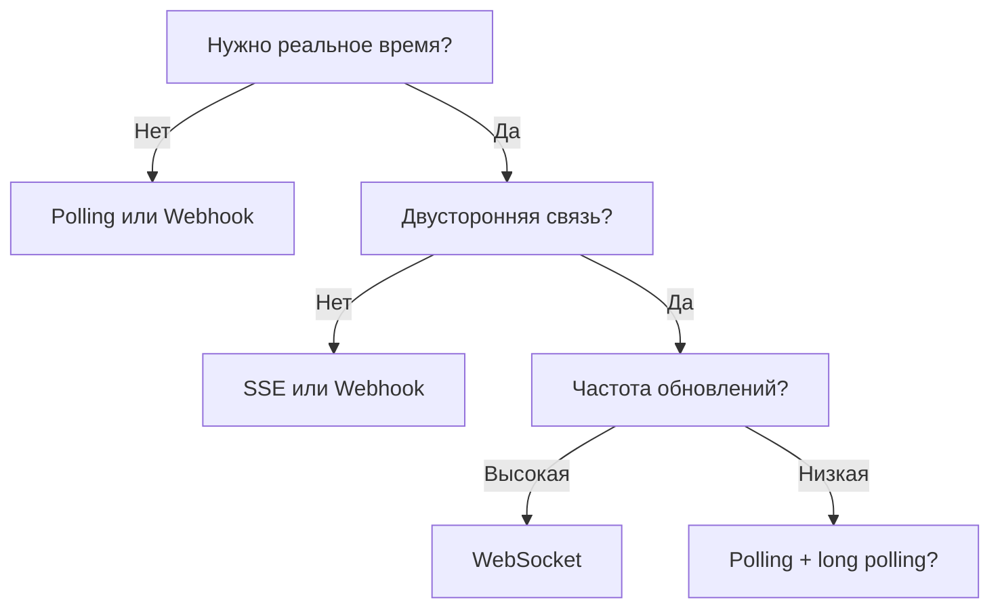
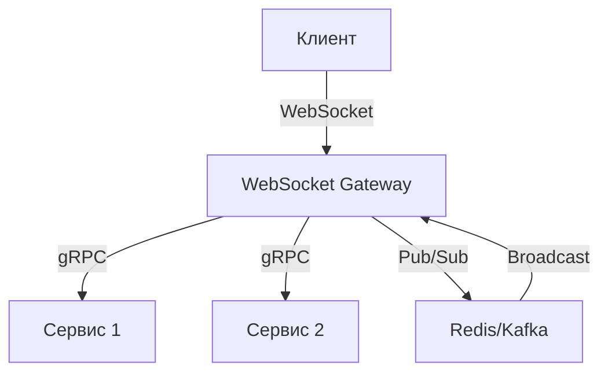

## Введение: Инструмент для реального времени

В предыдущей теме мы разобрали, что такое WebSockets — постоянное двустороннее соединение между клиентом и сервером. Но когда его использовать, а когда лучше остаться на HTTP, polling или webhooks?

WebSocket — мощный инструмент, но он сложнее и дороже. Как швейцарский нож: можно открыть консервную банку, но лучше использовать открывашку. WebSocket нужен не всегда.

**WebSocket** — для реального времени, двусторонней связи, частых обновлений.

**HTTP + polling** — для простых случаев, где задержка не критична.

**Webhook** — для уведомлений от сервера к клиенту (без постоянного соединения).

## Признаки того, что WebSocket — хороший выбор

### Признак 1: Нужно реальное время (low latency)

| Сценарий | Допустимая задержка | Подходит ли WebSocket |
| :--- | :--- | :--- |
| Чат | < 100 мс | ✅ Да |
| Онлайн-игра | < 50 мс | ✅ Да |
| Биржевые котировки | < 10 мс | ✅ Да |
| Мониторинг серверов | < 1 с | ✅ Да |
| Статус заказа | 5-10 с | ❌ Нет (хватит polling) |

**Правило:** Если задержка > 1-2 секунды, WebSocket избыточен.

### Признак 2: Двусторонняя связь (оба направления)

| Сценарий | Направление | Подходит ли WebSocket |
| :--- | :--- | :--- |
| Чат | Клиент → Сервер, Сервер → Клиент | ✅ Да |
| Игра | Движения игрока → сервер, состояние игры → клиент | ✅ Да |
| Совместное редактирование | Изменения → сервер, изменения других → клиент | ✅ Да |
| Лента новостей | Только сервер → клиент | ❌ Нет (SSE или webhook) |
| Уведомления | Только сервер → клиент | ❌ Нет (webhook) |

**Правило:** Если данные движутся только в одну сторону, WebSocket избыточен.

### Признак 3: Частые обновления (high frequency)

| Сценарий | Частота | Подходит ли WebSocket |
| :--- | :--- | :--- |
| Биржевые котировки | 100 обновлений/с | ✅ Да |
| Позиция в игре | 60 раз/с | ✅ Да |
| Курс валют | 1 раз/мин | ❌ Нет (polling) |
| Погода | 1 раз/час | ❌ Нет (HTTP) |

**Правило:** Если обновления редкие (< 1 раза в минуту), WebSocket не нужен.

### Признак 4: Постоянное соединение допустимо

| Сценарий | Количество клиентов | Проблема |
| :--- | :--- | :--- |
| Чат в комнате (1000 клиентов) | 1000 | Нормально |
| Чат в Zoom (100 000 клиентов) | 100 000 | Сложно |
| IoT (1 млн датчиков) | 1 000 000 | Очень сложно |

**Правило:** Каждое WebSocket соединение потребляет память и ресурсы. Для миллионов клиентов нужна специальная архитектура.

### Признак 5: Браузер как целевая платформа

| Платформа | Поддержка WebSocket | Альтернатива |
| :--- | :--- | :--- |
| Браузер (современный) | ✅ Отличная | — |
| Браузер (старый) | ⚠️ Частичная | Polling, long polling |
| Мобильное приложение (нативное) | ✅ Хорошая | FCM, APNS (push) |
| Мобильное приложение (фон) | ⚠️ Ограничена | Push уведомления |
| Backend-сервис | ✅ Отличная | gRPC, HTTP/2 |

## WebSocket vs Альтернативы

### WebSocket vs HTTP + Polling

| Характеристика | Polling | WebSocket |
| :--- | :--- | :--- |
| **Задержка** | Секунды (интервал опроса) | Миллисекунды |
| **Нагрузка на сервер** | Высокая (много запросов) | Низкая (одно соединение) |
| **Нагрузка на клиент** | Средняя | Низкая |
| **Простота** | Просто | Сложно |
| **Реальное время** | Нет | Да |

**Вывод:** WebSocket для реального времени, polling — для простоты.

### WebSocket vs Server-Sent Events (SSE)

| Характеристика | SSE | WebSocket |
| :--- | :--- | :--- |
| **Направление** | Сервер → Клиент (одно) | Двустороннее |
| **Заголовки** | Обычные HTTP | Upgrade + фреймы |
| **Переподключение** | Встроенное | Нужно ручное |
| **Бинарные данные** | Нет (base64) | Да |
| **Сложность** | Низкая | Высокая |

**Вывод:** SSE для однонаправленных (сервер → клиент) потоков. WebSocket для двусторонних.

### WebSocket vs Webhook

| Характеристика | Webhook | WebSocket |
| :--- | :--- | :--- |
| **Постоянное соединение** | Нет | Да |
| **Задержка** | Секунды-минуты | Миллисекунды |
| **Направление** | Сервер → Клиент | Двустороннее |
| **Клиент должен иметь URL** | Да | Нет |
| **Firewall** | Сложно (входящие) | Легче (исходящие) |

**Вывод:** Webhook для асинхронных уведомлений (клиент не всегда онлайн). WebSocket для реального времени (клиент онлайн).

### WebSocket vs gRPC streaming

| Характеристика | gRPC streaming | WebSocket |
| :--- | :--- | :--- |
| **Протокол** | HTTP/2 | HTTP/1.1 upgrade |
| **Формат** | Protobuf (бинарный) | Текст, бинарный |
| **Браузеры** | Плохо (gRPC-Web) | Отлично |
| **Типизация** | Строгая (.proto) | Нет |
| **Сложность** | Высокая | Средняя |

**Вывод:** gRPC streaming для внутренних микросервисов. WebSocket для браузеров.

## Идеальные сценарии для WebSocket

### 1. Чаты и мессенджеры

**Требования:**
- Реальное время (сообщения приходят мгновенно)
- Двусторонняя связь (отправка и получение)
- Онлайн-статус, печатает...

**Почему WebSocket:** Постоянное соединение, мгновенная доставка, минимальные накладные расходы.

**Примеры:** Slack, WhatsApp Web, Telegram Web, Discord.

### 2. Онлайн-игры

**Требования:**
- Очень низкая задержка (50-100 мс)
- Высокая частота обновлений (60 раз в секунду)
- Двусторонняя связь (действия игрока, состояние мира)

**Почему WebSocket:** Каждая миллисекунда важна. Polling или HTTP не подходят.

**Примеры:** Agar.io, .io игры, карточные игры, шахматы.

### 3. Финансовые котировки и биржи

**Требования:**
- Цены обновляются десятки раз в секунду
- Задержка критична (арбитраж)

**Почему WebSocket:** Одно соединение, минимальная задержка.

**Примеры:** Биржевые терминалы, криптобиржи (Binance, Coinbase WebSocket API).

### 4. Совместное редактирование (collaborative editing)

**Требования:**
- Изменения пользователей должны мгновенно отображаться у всех
- Конфликты разрешаются в реальном времени

**Почему WebSocket:** Нужна двусторонняя связь для синхронизации.

**Примеры:** Google Docs (WebSocket + WebRTC), Figma, Notion.

### 5. Мониторинг и дашборды в реальном времени

**Требования:**
- Метрики обновляются каждую секунду
- Алерты приходят мгновенно

**Почему WebSocket:** Эффективнее, чем polling каждую секунду.

**Примеры:** Дашборд мониторинга (Grafana с WebSocket), трекинг заказов курьеров.

### 6. IoT и телеметрия

**Требования:**
- Датчики отправляют данные часто
- Сервер может отправлять команды датчикам

**Почему WebSocket:** Двусторонняя связь, эффективность.

**Примеры:** Умный дом, промышленные датчики, автопарк.

## Сомнительные сценарии (лучше alternatives)

### 1. Простые уведомления

**Вместо WebSocket:** Webhook или SSE.

**Пример:** Уведомление о новом заказе. Клиент не всегда онлайн, push-уведомление подходит лучше.

### 2. Статус заказа

**Вместо WebSocket:** Polling (каждые 5-10 секунд) или webhook.

**Пример:** Статус заказа в интернет-магазине. Задержка 5 секунд допустима.

### 3. Лента новостей

**Вместо WebSocket:** SSE (сервер → клиент).

**Пример:** Twitter лента. Клиент только получает, не отправляет.

### 4. API для внешних разработчиков

**Вместо WebSocket:** REST или webhook.

**Пример:** Публичное API погоды. WebSocket слишком сложен для внешних клиентов.

### 5. Редкие обновления (< 1 раза в минуту)

**Вместо WebSocket:** HTTP + polling.

**Пример:** Курс валют (обновляется раз в минуту). Polling с интервалом 60 секунд.

## Критерии принятия решения

### Таблица выбора

| Критерий | WebSocket | SSE | Webhook | Polling |
| :--- | :--- | :--- | :--- | :--- |
| **Двусторонняя связь** | ✅ Да | ❌ Нет | ❌ Нет | ✅ Да (но дорого) |
| **Низкая задержка** | ✅ Да | ✅ Да | ⚠️ Зависит | ❌ Нет |
| **Простота клиента** | ⚠️ Средняя | ✅ Простой | ✅ Простой | ✅ Простой |
| **Простота сервера** | ❌ Сложный | ✅ Простой | ⚠️ Средний | ✅ Простой |
| **Клиент за NAT** | ✅ Да | ✅ Да | ❌ Нет | ✅ Да |
| **Постоянное соединение** | ✅ Да | ✅ Да | ❌ Нет | ❌ Нет |
| **Экономия ресурсов** | ✅ Да | ✅ Да | ✅ Да | ❌ Нет |

### Алгоритм выбора

## Примеры реальных проектов

### Проект 1: Чат для поддержки

**Требования:**
- Операторы видят сообщения клиентов в реальном времени
- Клиенты видят ответы операторов
- Несколько клиентов на одного оператора

**Решение:** WebSocket.

**Почему:** Двусторонняя связь, реальное время, частая отправка сообщений.

### Проект 2: Система мониторинга серверов

**Требования:**
- Дашборд показывает метрики (CPU, RAM) каждые 2 секунды
- Оповещения при превышении порогов

**Решение:** WebSocket для дашборда (активные клиенты), webhook для оповещений (клиенты могут быть офлайн).

**Почему:** Дашборд в реальном времени, оповещения — асинхронно.

### Проект 3: API курса валют для партнёров

**Требования:**
- Курс обновляется раз в минуту
- Партнёры могут интегрироваться легко

**Решение:** HTTP + polling (раз в минуту) или webhook (подписка).

**Почему:** WebSocket избыточен, усложнит интеграцию.

### Проект 4: Онлайн-трансляция позиций такси

**Требования:**
- Позиции такси обновляются каждые 2-3 секунды
- Пассажиры видят приближение такси в реальном времени

**Решение:** WebSocket.

**Почему:** Частые обновления, много клиентов, реальное время.

## WebSocket в мобильных приложениях

### Особенности

| Аспект | Описание |
| :--- | :--- |
| **Фоновая работа** | iOS/Android ограничивают фоновые соединения. WebSocket может закрыться через несколько минут |
| **Батарея** | Постоянное соединение потребляет больше энергии, чем push-уведомления |
| **Сеть** | Мобильные сети могут разрывать долгие соединения |

### Рекомендации

| Сценарий | Решение |
| :--- | :--- |
| **Приложение активно (foreground)** | WebSocket (чат, игра) |
| **Приложение в фоне** | Push-уведомления (FCM, APNS) |
| **Гибрид** | WebSocket при открытом приложении, push при закрытом |

## WebSocket в микросервисах

### Когда использовать

| Сценарий | Почему |
| :--- | :--- |
| **Внутренние сервисы** | gRPC (HTTP/2) обычно лучше |
| **API Gateway** | WebSocket для клиентов, gRPC для бэкенда |
| **Сервис нотификаций** | WebSocket для клиентов, Kafka/RabbitMQ для внутренних |

### Архитектура

---

## Распространённые ошибки

### Ошибка 1: WebSocket для всего API

"Давайте всё переведём на WebSocket, это же быстро".

**Почему плохо:** WebSocket сложнее, не кешируется, не работает с CDN, хуже логируется.

**Исправление:** Только для реального времени, двусторонней связи.

### Ошибка 2: WebSocket для редких событий

"Оповещение раз в час — сделаем WebSocket".

**Почему плохо:** Постоянное соединение ради редких событий — трата ресурсов.

**Исправление:** Webhook или SSE.

### Ошибка 3: WebSocket без fallback

"У всех есть WebSocket".

**Почему плохо:** Корпоративные прокси, старые браузеры, мобильные сети.

**Исправление:** Fallback на polling/long polling (Socket.IO, SockJS).

### Ошибка 4: WebSocket без аутентификации

"Соединение установлено — значит, можно доверять".

**Почему плохо:** Любой может подключиться.

**Исправление:** Токен при handshake или в первом сообщении.

### Ошибка 5: WebSocket без keep-alive

Соединение разрывается через 30 секунд простоя.

**Исправление:** Ping/Pong каждые 20-30 секунд.

## Резюме для системного аналитика

1. **WebSocket — для реального времени, двусторонней связи, частых обновлений.** Не используйте его для простых API, редких событий или однонаправленных потоков.

2. **Ключевые сценарии:** чаты, онлайн-игры, биржевые котировки, совместное редактирование, мониторинг в реальном времени, IoT.

3. **WebSocket vs SSE:** SSE для однонаправленных (сервер → клиент), WebSocket для двусторонних.

4. **WebSocket vs Webhook:** Webhook для асинхронных уведомлений (клиент не всегда онлайн), WebSocket для реального времени (клиент онлайн).

5. **WebSocket vs Polling:** Polling для простоты и редких событий, WebSocket для эффективности и реального времени.

6. **Мобильные приложения:** WebSocket только в foreground. Для фона — push-уведомления.

7. **Микросервисы:** gRPC (HTTP/2) обычно лучше для внутренних коммуникаций. WebSocket — для клиентских соединений.