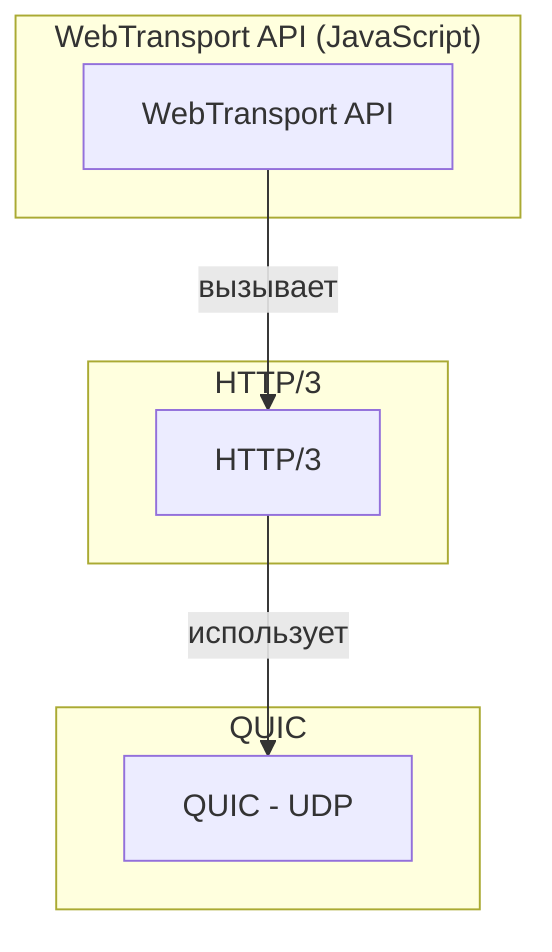

## WebTransport: новый протокол для real-time приложений

В течение многих лет у разработчиков был ограниченный выбор для реализации real-time функциональности в вебе. WebSocket, появившийся в 2011 году, долгое время был стандартом де-факто для двусторонней связи. Однако у него есть фундаментальные ограничения: он работает поверх TCP, который подвержен проблеме "головы очереди" (head-of-line blocking) при потере пакетов, и не позволяет использовать преимущества современных транспортных протоколов.

**WebTransport** — это современный API, использующий протокол HTTP/3 в качестве транспорта. Он позволяет веб-приложениям обмениваться данными с сервером с низкой задержкой, используя надежные и ненадежные каналы передачи данных, работая поверх QUIC. WebTransport не является заменой WebSocket, а скорее дополнением, предлагающим более гибкие и эффективные механизмы для определенных сценариев.

## Проблемы WebSocket, которые решает WebTransport

WebSocket — это отличный протокол, и он никуда не исчезнет. Но у него есть несколько ограничений:

### 1. Транспортный уровень (TCP)

WebSocket работает поверх TCP. TCP гарантирует доставку пакетов в правильном порядке. Это хорошо для надежности, но плохо для задержек. Если один TCP-пакет потерян, весь поток данных останавливается, пока потерянный пакет не будет передан заново. Это называется "блокировка заголовка очереди" (Head-of-Line (HOL) blocking). Для real-time видео или игр это критично: задержка может резко возрасти из-за одного потерянного пакета.

### 2. Одиночный поток

WebSocket предлагает одно, упорядоченное, надежное сообщение за раз. Хотя можно эмулировать многопоточность на уровне приложения, фундаментально WebSocket не поддерживает многопоточность из-за своей модели.

### 3. Нет встроенной поддержки ненадежной передачи

Для некоторых приложений, таких как стриминг видео или live-трансляции, важнее своевременная доставка, чем 100% надежность. Потеря нескольких кадров видео не так страшна, как задержка, вызванная повторной передачей потерянного пакета. WebSocket не предоставляет встроенных механизмов для ненадежной (unreliable) или неупорядоченной (unordered) передачи.

## Что такое QUIC и HTTP/3

QUIC — это транспортный протокол, разработанный Google, который стал основой для HTTP/3. Он работает поверх UDP, но добавляет надежность, шифрование и контроль перегрузки, аналогичные TCP, но с меньшими задержками.

**Ключевые особенности QUIC:**

- **Встроенное шифрование.** QUIC шифрует все пакеты, включая сами параметры соединения, что делает их защищенными по умолчанию.
- **Мультиплексирование без блокировки HOL.** QUIC позволяет передавать несколько независимых потоков (streams) данных внутри одного соединения. Потеря пакета в одном потоке не останавливает остальные потоки — решается проблема "головы очереди" на транспортном уровне.
- **0-RTT.** QUIC может устанавливать соединение и отправлять данные за один Round Trip Time (RTT) при повторных подключениях, что значительно ускоряет повторные визиты.
- **Поддержка как надежных, так и ненадежных потоков.** QUIC умеет маркировать потоки как "надежные" (требуют подтверждения) и "ненадежные" (не требующие подтверждения). В QUIC streams передаются как надежные потоки, а datagrams — как ненадежные.

**HTTP/3** — это версия HTTP, которая использует QUIC вместо TCP и TLS.

**WebTransport** — это API, который предоставляет доступ к возможностям HTTP/3 из JavaScript. Он позволяет веб-приложениям использовать QUIC-потоки и датаграммы напрямую.



## Как работает WebTransport

Процесс установки WebTransport-соединения (с точки зрения разработчика):

1.  Клиент (браузер) создает новый объект `WebTransport`, передавая URL сервера, поддерживающего HTTP/3:

    ```javascript
    const transport = new WebTransport('https://example.com:4433');
    ```

2.  WebTransport инициирует соединение через HTTP/3. Этот процесс включает в себя согласование протоколов и параметров, таких как поддержка WebTransport со стороны сервера.

3.  После успешного открытия соединения, клиент может создавать потоки (streams) для надежной передачи или отправлять датаграммы (datagrams) для ненадежной.

### Потоки (Streams) — для надежной передачи

Потоки в WebTransport аналогичны WebSocket-соединениям, но их можно создавать много внутри одного соединения (мультиплексирование). Каждый поток — это независимая, упорядоченная, надежная последовательность байтов.

```javascript
// Создание исходящего двустороннего потока
const sendStream = await transport.createSendStream();
const writer = sendStream.writable.getWriter();
await writer.write(new TextEncoder().encode('Hello, server!'));
await writer.close();

// Прием входящего потока от сервера (например, для стриминга)
const reader = transport.incomingUnidirectionalStreams.getReader();
const { value: receiveStream } = await reader.read();
const streamReader = receiveStream.readable.getReader();
const { value } = await streamReader.read();
console.log(new TextDecoder().decode(value));
```

### Датаграммы (Datagrams) — для ненадежной передачи

Датаграммы — это независимые сообщения, которые не гарантируют доставку и порядок. Они идеально подходят для приложений, где важнее своевременность, чем надежность, например, для передачи голоса или видео.

```javascript
const writer = transport.datagrams.writable.getWriter();
await writer.write(new TextEncoder().encode('Unreliable data chunk'));

const reader = transport.datagrams.readable.getReader();
const { value } = await reader.read();
console.log(new TextDecoder().decode(value));
```

### Получение и обработка данных

Сервер может инициировать отправку данных клиенту без предварительного запроса. Клиент подписывается на входящие датаграммы и потоки, как показано выше.

## Ключевые особенности и преимущества

| Особенность | WebTransport | WebSocket |
| :--- | :--- | :--- |
| **Транспорт** | QUIC (UDP) | TCP |
| **Мультиплексирование** | Естественная поддержка нескольких независимых потоков | Нет (одно соединение, один поток сообщений) |
| **HOL blocking** | Отсутствует (потеря пакета в одном потоке не блокирует другие) | Присутствует (потеря пакета блокирует всё соединение) |
| **Типы передачи** | Надежная (потоки) и ненадежная (датаграммы) | Только надежная |
| **Установка соединения** | 0-RTT (при повторных подключениях), быстрее | 1-RTT (как минимум) |
| **Безопасность** | Встроенное шифрование (TLS 1.3) | Шифрование через WSS (TLS поверх TCP) |
| **Протокол** | HTTP/3 | HTTP/1.1 (обычно) |

## Use cases (сценарии использования)

- **Игры.** Передача координат игроков (ненадежные датаграммы), загрузка игровых ассетов (надежные потоки), голосовой чат (датаграммы).
- **Стриминг видео в реальном времени.** Трансляция с камеры на веб-страницу с низкой задержкой (ненадежные датаграммы), передача субтитров или метаданных (надежные потоки).
- **Live-трансляции с взаимодействием.** Опросы, чат, реакции зрителей, наложение графики (все это можно передавать через разные потоки, не блокируя видео).
- **Удаленный рабочий стол / ИИ ассистенты.** Передача видео с экрана (ненадежно), передача команд мыши и клавиатуры (надежно).
- **Финансовые приложения.** Передача потоков котировок (ненадежные датаграммы) в сочетании с надежной передачей ордеров на покупку/продажу.

## Поддержка браузерами

На момент написания (2025 год), WebTransport уже поддерживается во всех современных браузерах: Chrome, Edge, Firefox, Safari.

Поддержка в мобильных браузерах также реализована. Однако, поддержка некоторых опций (например, настраиваемые параметры конфигурации сервера) может различаться.

**Проверка поддержки в JavaScript:**

```javascript
if ('WebTransport' in window) {
  console.log('WebTransport is supported!');
} else {
  console.log('WebTransport is not supported, falling back to WebSocket.');
}
```

## Резюме

- WebTransport — это не замена WebSocket, а дополнительный инструмент для задач, критичных к задержкам и требующих гибкости в передаче данных.
- WebTransport особенно эффективен в сценариях с потерей пакетов (например, мобильные сети, удаленные соединения), поскольку позволяет изолировать последствия потери на уровне отдельных потоков.
- Для аналитика WebTransport означает необходимость более внимательного анализа требований: если приложению требуется надежная, упорядоченная передача всех сообщений — WebSocket по-прежнему хороший выбор. Если же важна своевременность отдельных сообщений или необходимость передавать разные типы данных с разными требованиями к надежности — стоит рассмотреть WebTransport.
- При проектировании систем, использующих WebTransport, нужно учитывать, что сервер также должен поддерживать HTTP/3 и WebTransport (например, на базе библиотек aioquic, quiche, или расширений для nginx/Apache).
- WebTransport — это шаг вперед к более эффективному, гибкому и производительному вебу. Он позволяет создавать real-time веб-приложения, которые ранее были возможны только на нативных платформах.