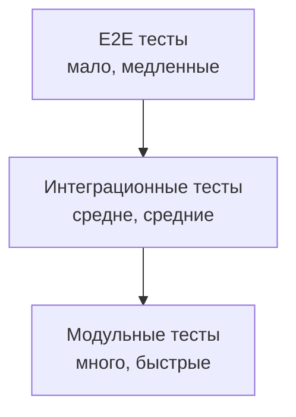
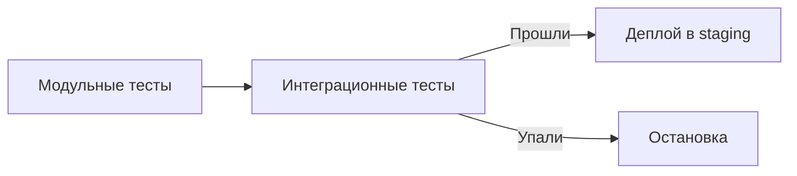

## Введение: Когда детали собираются вместе

Представьте, что вы проверили каждую деталь механизма отдельно: шестерёнка крутится, пружина сжимается, винт закручивается. Но когда вы собрали механизм, он всё равно не работает. Шестерёнка не попадает в паз, пружина слишком слабая для веса.

Модульные тесты проверяют детали по отдельности. **Интеграционное тестирование** проверяет, как эти детали работают вместе.

В мире API интеграционное тестирование проверяет взаимодействие между компонентами: API → база данных, API → внешний сервис, сервис → сервис. Это тесты, которые запускают реальный API (или его часть) и проверяют, что он правильно общается с зависимостями.

Для системного аналитика интеграционное тестирование — это проверка того, что API соответствует контракту (спецификации). Модульные тесты проверяют код. Интеграционные тесты проверяют поведение системы. Если интеграционные тесты проходят, API делает то, что обещано.

## Место интеграционного тестирования в пирамиде тестов



| Уровень | Что проверяет | Зависимости | Скорость |
| :--- | :--- | :--- | :--- |
| **Модульные** | Один метод | Изолированы (mock) | Миллисекунды |
| **Интеграционные** | Связь компонентов | Реальные (БД, API) | Секунды |
| **E2E** | Весь сценарий | Все зависимости | Минуты |

**Почему интеграционные тесты важны:**

- Модульные тесты не ловят проблемы интеграции (неправильные параметры, форматы данных, сетевые таймауты)
- Без интеграционных тестов ошибки находят только на E2E (поздно и дорого)
- Интеграционные тесты — компромисс между скоростью и реалистичностью

## Что тестируют интеграционные тесты API

### Контракт API

| Что проверяет | Пример |
| :--- | :--- |
| **Пути (paths)** | `/users` существует, `/users/{id}` существует |
| **Методы** | `GET /users/{id}` работает, `POST /users` работает |
| **Статус-коды** | Успех → 200, создано → 201, не найдено → 404 |
| **Заголовки** | `Content-Type: application/json`, `Location` для создания |
| **Тело ответа** | Структура JSON соответствует схеме |

### Взаимодействие с базой данных

| Что проверяет | Пример |
| :--- | :--- |
| **Создание** | `POST /users` → запись появилась в БД |
| **Чтение** | `GET /users/{id}` → данные из БД |
| **Обновление** | `PUT /users/{id}` → запись в БД изменилась |
| **Удаление** | `DELETE /users/{id}` → запись исчезла из БД |
| **Транзакции** | При ошибке данные не сохранились |

### Взаимодействие с внешними сервисами

| Что проверяет | Пример |
| :--- | :--- |
| **Вызовы** | API вызывает внешний платёжный шлюз |
| **Обработка ответов** | Шлюз вернул успех → заказ оформлен |
| **Обработка ошибок** | Шлюз вернул ошибку → заказ не оформлен |
| **Таймауты** | Шлюз не ответил → API вернул 504 |
| **Повторы** | При временной ошибке API повторяет запрос |

### Аутентификация и авторизация

| Что проверяет | Пример |
| :--- | :--- |
| **Отсутствие токена** | 401 Unauthorized |
| **Неверный токен** | 401 Unauthorized |
| **Просроченный токен** | 401 Unauthorized |
| **Недостаточно прав** | 403 Forbidden |
| **Достаточно прав** | 200 OK |

## Интеграционные vs Модульные тесты

| Характеристика | Модульные | Интеграционные |
| :--- | :--- | :--- |
| **Зависимости** | Mock (заглушки) | Реальные (БД, API) |
| **Скорость** | Миллисекунды | Секунды |
| **Среда** | Локальная (без развёртывания) | Требует БД, контейнеров |
| **Что ловят** | Ошибки в логике | Ошибки в связях |
| **Количество** | Много (сотни) | Средне (десятки) |
| **Типичная проблема** | Не заметили пустой список | Не сходится формат даты с БД |

**Аналогия:** Модульные тесты — проверка детали на станке. Интеграционные — сборка узла и проверка, что детали подходят друг другу.

## Среда для интеграционного тестирования

### Контейнеризация (Docker)

Самый популярный подход. Тесты поднимают контейнеры с зависимостями перед запуском.

| Зависимость | Контейнер |
| :--- | :--- |
| **База данных** | PostgreSQL, MySQL, MongoDB |
| **Очереди** | Kafka, RabbitMQ |
| **Кеш** | Redis |
| **Внешние API** | WireMock (имитация) |

**Что видит аналитик:** Тесты запускаются в CI, поднимают контейнеры, выполняются, контейнеры уничтожаются.

### Тестовая база данных

Для интеграционных тестов используется отдельная БД (не production, не development).

**Требования к тестовой БД:**

| Требование | Почему |
| :--- | :--- |
| **Чистая перед каждым тестом** | Тесты не должны влиять друг на друга |
| **Сброс после тестов** | Не оставлять мусор |
| **Схема как в production** | Идентичные структуры |

### Внешние API (WireMock)

Для внешних API используют заглушки (mock-серверы). WireMock — популярный инструмент.

**Что даёт WireMock:**

| Возможность | Пример |
| :--- | :--- |
| **Симуляция ответов** | GET /payment/123 → 200 OK |
| **Симуляция ошибок** | GET /payment/123 → 500 Internal Error |
| **Проверка вызовов** | Убедиться, что API вызвал внешний сервис |
| **Задержки** | Симуляция медленного ответа |

## Что аналитик должен знать об интеграционных тестах

### Какие требования проверяются

| Тип требования | Проверяется интеграционными тестами? |
| :--- | :--- |
| **Функциональные** | Да |
| **Валидационные** | Да |
| **Контракт API** | Да |
| **Обработка ошибок** | Да |
| **Аутентификация/авторизация** | Да |
| **Производительность** | Нет (нагрузочное тестирование) |
| **Безопасность** | Частично (не пентест) |
| **Доступность** | Нет (инфраструктурное) |

### Примеры требований, проверяемых интеграционными тестами

| Требование | Интеграционный тест |
| :--- | :--- |
| "При создании заказа отправляется событие в Kafka" | Проверить, что сообщение появилось в топике |
| "Email пользователя должен быть уникален" | Создать пользователя с email, попробовать создать второго — получить 409 |
| "При удалении пользователя удаляются его заказы" | Создать пользователя с заказами, удалить, проверить, что заказы исчезли |

### Как читать отчёт об интеграционных тестах

```
Integration Tests Report
=======================
Tests run: 45
Passed: 43
Failed: 2
Skipped: 0

Failed tests:
- testCreateOrder_PaymentGatewayTimeout
  ожидал: 503 Service Unavailable
  получил: 500 Internal Server Error
  причина: PaymentService не обрабатывает таймаут

- testGetUser_WithOrders
  ожидал: поле orders в ответе
  получил: поле order_list
  причина: Несовпадение имени поля в API и БД
```

**Что видит аналитик:**
- Сколько тестов упало
- Какие именно тесты
- В чём расхождение между ожидаемым и фактическим

## Контрактное тестирование (Consumer-Driven Contracts)

### Что это

Специальный вид интеграционного тестирования, где клиент (consumer) определяет, какой контракт он ожидает от API (provider).


### Инструменты

| Инструмент | Языки | Особенность |
| :--- | :--- | :--- |
| **Pact** | Многие | Самый популярный |
| **Spring Cloud Contract** | Java | Интеграция со Spring |
| **PactumJS** | JS/TS | Лёгкий |

### Пример сценария (аналитик понимает)

**Клиент (фронтенд) определяет:**

```
При GET /users/123 ожидаю:
- Статус 200
- Тело содержит id (число) и name (строка)
- name не пустой
```

**Провайдер (API) проверяет, что соответствует контракту.**

**Что даёт:**

| Преимущество | Объяснение |
| :--- | :--- |
| **Раннее обнаружение** | API узнает, что изменение сломает клиента |
| **Независимость команд** | Клиент и сервер могут развиваться отдельно |
| **Документация** | Контракт = документация |

## Интеграционные тесты в CI/CD

### Где запускаются



### Что нужно для запуска

| Компонент | Почему |
| :--- | :--- |
| **Docker / Docker Compose** | Поднять БД, Kafka и т.д. |
| **Ресурсы (CPU, RAM)** | БД требует памяти |
| **Сеть** | Доступ к внешним API (или их заглушкам) |
| **Время** | Секунды или минуты |

### Время выполнения

| Тип тестов | Типичное время |
| :--- | :--- |
| Модульные | 1-10 секунд |
| Интеграционные | 10-60 секунд |
| E2E | 1-10 минут |

## Проблемы интеграционного тестирования

### Проблема 1: Нестабильные тесты (Flaky)

Тест то проходит, то падает без изменения кода.

**Причины:**

| Причина | Решение |
| :--- | :--- |
| Гонка данных (race condition) | Синхронизация |
| Зависимость от порядка тестов | Изоляция тестов |
| Таймауты | Увеличить таймауты |
| Внешние API | Использовать WireMock |

### Проблема 2: Долгое время выполнения

Слишком много интеграционных тестов → CI идёт долго → разработка замедляется.

**Решение:**

| Стратегия | Как |
| :--- | :--- |
| **Параллельный запуск** | Разделить тесты на группы |
| **Выборочный запуск** | Только тесты, связанные с изменениями |
| **Пирамида тестов** | Больше модульных, меньше интеграционных |

### Проблема 3: Окружение

Тесты падают в CI, но работают локально.

**Причины:**

| Причина | Решение |
| :--- | :--- |
| Разные версии БД | Одинаковые контейнеры |
| Разные переменные окружения | Конфигурация через env |
| Сетевые ограничения | WireMock вместо реальных API |

### Проблема 4: Чистота данных

Тесты влияют друг на друга (один создал пользователя, другой не может его создать).

**Решение:**

| Стратегия | Как |
| :--- | :--- |
| **Откат транзакций** | Каждый тест в транзакции → откат после теста |
| **Уникальные данные** | timestamp в именах |
| **Чистая БД перед каждым тестом** | `TRUNCATE` всех таблиц |

## Сравнение с другими уровнями тестирования

| Характеристика | Модульные | Интеграционные | E2E |
| :--- | :--- | :--- | :--- |
| **Зависимости** | Mock | Реальные + mock | Все реальные |
| **Среда** | Локальная | Контейнеры | Staging/Prod |
| **Время** | мс | с | мин |
| **Количество** | Сотни | Десятки | Единицы |
| **Что ловят** | Логику | Связи | Весь сценарий |
| **Стоимость починки** | Дешёво | Средне | Дорого |

## Что аналитик должен требовать от команды

| Требование | Почему |
| :--- | :--- |
| "Есть ли тесты на все эндпоинты?" | Без тестов эндпоинт может сломаться |
| "Есть ли тесты на ошибки (400, 401, 403, 404)?" | Пользователи ошибаются, API должен отвечать корректно |
| "Тесты запускаются в CI при каждом коммите?" | Чем раньше найдём ошибку, тем дешевле |
| "Могу ли я посмотреть отчёт о тестах?" | Прозрачность качества |
| "Сколько времени идут интеграционные тесты?" | Влияет на скорость разработки |

## Резюме

1. **Интеграционное тестирование** — проверка взаимодействия между компонентами. API → БД, API → внешний сервис, сервис → сервис.

2. **Что проверяет:** контракт API (пути, методы, статусы, схемы), взаимодействие с БД, внешние вызовы, аутентификацию/авторизацию.

3. **В отличие от модульных:** использует реальные зависимости (БД, API), медленнее, но реалистичнее.

4. **Среда:** контейнеры (Docker), тестовая БД, WireMock для внешних API.

5. **Контрактное тестирование (Pact)** — клиент определяет контракт, сервер проверяет. Уверенность, что изменение API не сломает клиента.

6. **Проблемы:** нестабильные тесты (flaky), долгое время выполнения, чистота данных между тестами.

7. **В CI/CD:** интеграционные тесты запускаются после модульных, перед деплоем. Если падают — деплой останавливается.