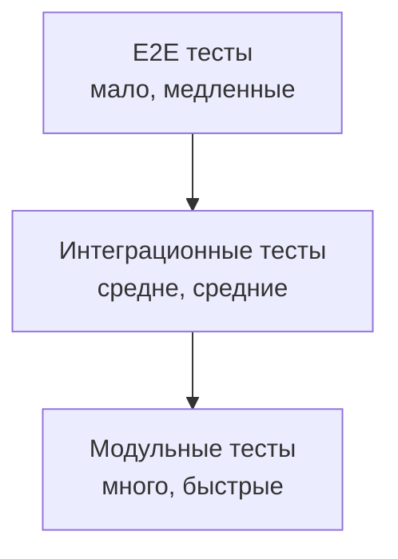
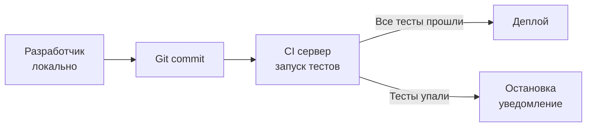

## Введение: Проверка деталей

Представьте, что вы собираете сложный механизм из сотен деталей. Можно собрать всё сразу и надеяться, что заработает. А можно проверить каждую деталь отдельно: шестерёнку — на станке, пружину — на стенде, винт — калибром.

Модульное тестирование — это проверка деталей. В мире API это проверка одного метода, одной функции, одного класса в изоляции от остальной системы.

**Модульное тестирование (Unit Testing)** — это тестирование наименьших тестируемых частей приложения (методов, функций, классов) в изоляции от внешних зависимостей.

Для системного аналитика модульное тестирование — это не про написание тестов (это задача разработчиков). Это про понимание: что такое хороший модульный тест, какие требования к API можно проверить на этом уровне, как интерпретировать результаты тестов, как участвовать в ревью тестовой стратегии.

Модульные тесты — это первая линия обороны. Если они проходят, можно двигаться дальше. Если нет — интеграционное и нагрузочное тестирование бессмысленны, потому что базовая логика уже сломана.

## Место модульного тестирования в пирамиде тестов



| Уровень | Количество | Скорость | Что проверяет |
| :--- | :--- | :--- | :--- |
| **Модульные тесты** | Много (сотни/тысячи) | Миллисекунды | Один метод, одна функция |
| **Интеграционные тесты** | Средне (десятки) | Секунды | Связь между компонентами |
| **E2E тесты** | Мало (единицы) | Минуты | Весь сценарий пользователя |

**Почему модульные тесты — основа пирамиды:**
- Их много (покрывают все ветки кода)
- Они быстрые (можно запускать после каждого изменения)
- Они дёшевы (не требуют развёртывания инфраструктуры)
- Они точные (указывают на конкретную строку, где проблема)

## Что тестируют модульные тесты API

### Входная валидация

| Что проверяет | Пример |
| :--- | :--- |
| Обязательные поля | Запрос без `name` возвращает 400 |
| Типы данных | `age` должно быть числом |
| Диапазоны | `age` от 0 до 150 |
| Форматы | `email` соответствует формату |
| Длины | `name` не длиннее 100 символов |
| Списки значений | `status` только из [active, pending, blocked] |

### Бизнес-логика

| Что проверяет | Пример |
| :--- | :--- |
| Условия | Если баланс < 0, возвращается ошибка |
| Вычисления | Скидка 10% применена правильно |
| Статусы | Заказ со статусом "delivered" нельзя отменить |
| Права | Пользователь без прав не может удалить чужой заказ |

### Обработка ошибок

| Что проверяет | Пример |
| :--- | :--- |
| Несуществующий ресурс | GET /users/99999 → 404 |
| Конфликты | Создание пользователя с существующим email → 409 |
| Ошибки валидации | Неправильный формат → 422 |
| Ошибки авторизации | Без токена → 401 |
| Ошибки прав | С токеном, но нет прав → 403 |

### Пограничные случаи

| Что проверяет | Пример |
| :--- | :--- |
| Пустые значения | name = "" |
| Null значения | age = null |
| Максимальные значения | name из 100 символов |
| Минимальные значения | age = 0 |
| Пустые списки | items = [] |

## Изоляция: Что такое mock

Модульные тесты не должны зависеть от внешних систем. Для этого используют **mock** (заглушки).

### Зависимости, которые нужно изолировать

| Зависимость | Почему нужно изолировать |
| :--- | :--- |
| **База данных** | Медленно, требует чистой базы для каждого теста |
| **Внешние API** | Нестабильны, медленны, могут быть платными |
| **Файловая система** | Состояние между тестами, права доступа |
| **Время** | Тест должен работать одинаково в любое время |
| **Случайность** | Тест должен быть детерминированным |

### Пример: Проверка бизнес-логики без БД

Вместо реальной базы данных тест использует mock репозитория.

| Без mock (плохо) | С mock (хорошо) |
| :--- | :--- |
| Тест реально пишет в БД | Тест использует заглушку |
| Нужна чистая БД перед каждым тестом | Нет внешних зависимостей |
| Медленно (секунды) | Быстро (миллисекунды) |
| Может упасть из-за проблем с БД | Падает только из-за логики |

## Покрытие кода (Code Coverage)

### Что это

Процент кода, который выполняется во время тестов.

| Показатель | Что значит | Рекомендация |
| :--- | :--- | :--- |
| **Строки (Lines)** | Сколько строк кода выполнено | > 80% |
| **Ветки (Branches)** | Сколько условий проверено (if/else) | > 70% |
| **Функции (Functions)** | Сколько функций вызвано | > 90% |

### Как интерпретировать покрытие

| Покрытие | Что значит |
| :--- | :--- |
| **90%+** | Отлично. Код хорошо протестирован |
| **70-90%** | Хорошо. Есть небольшие пробелы |
| **50-70%** | Средне. Есть риски |
| **< 50%** | Плохо. Много непроверенного кода |

**Важное предупреждение:** Высокое покрытие не гарантирует качество. Можно написать тест, который выполняет строку, но не проверяет результат. Покрытие — это количество, а не качество.

## Что аналитик должен знать о модульных тестах

### Какие требования можно проверить модульными тестами

| Тип требования | Можно проверить? | Пример |
| :--- | :--- | :--- |
| **Функциональные** | Да | "При переводе денег баланс уменьшается" |
| **Валидационные** | Да | "Email должен быть в правильном формате" |
| **Бизнес-правила** | Да | "Скидка не более 50%" |
| **Обработка ошибок** | Да | "При неверном ID возвращается 404" |
| **Производительность** | Нет | Требует нагрузочного тестирования |
| **Безопасность** | Частично | SQL инъекции — да, DDoS — нет |
| **Совместимость** | Нет | Требует интеграционного тестирования |
| **Доступность** | Нет | Требует инфраструктурного тестирования |

### Как читать результаты модульных тестов

```
TestCreateUser_Success PASSED (0.02s)
TestCreateUser_MissingName FAILED (0.01s)
    expected: 400 Bad Request
    actual:   200 OK
    user_test.go:45: response.StatusCode = 200, want 400
```

**Что видит аналитик:**
- Какой тест упал (`TestCreateUser_MissingName`)
- Почему упал (ожидал 400, получил 200)
- Где искать проблему (`user_test.go:45`)

### Какие вопросы задать команде

| Вопрос | Зачем |
| :--- | :--- |
| "Какое у нас покрытие кода?" | Понимать уровень риска |
| "Есть ли тесты на негативные сценарии?" | Проверка обработки ошибок |
| "Как часто запускаются тесты?" | В CI при каждом коммите? Раз в день? |
| "Что делают тесты, которые падают?" | Новые баги или сломанные тесты? |
| "Есть ли тесты на граничные случаи?" | Пустые значения, максимальные длины |

## Хорошие и плохие модульные тесты

### Хороший тест (понимает аналитик)

```
Тест: Создание пользователя с валидными данными
Действие: POST /users с {name: "Иван", email: "ivan@example.com"}
Ожидание: 201 Created, тело содержит id и name
Результат: PASSED
```

### Плохой тест (непонятен аналитику)

```
Тест: userCreateTest
Действие: someFunction("test", 123)
Ожидание: !null
Результат: PASSED
```

**Признаки хорошего модульного теста:**

| Признак | Что значит |
| :--- | :--- |
| **Понятное имя** | `testCreateUser_Success`, а не `test1` |
| **Одна проверка** | Тест проверяет одно поведение |
| **Независимость** | Не зависит от других тестов |
| **Детерминизм** | Всегда даёт одинаковый результат |
| **Быстрота** | Выполняется за миллисекунды |

## Модульные тесты и CI/CD

### Где запускаются тесты



### Что происходит при падении тестов

| Действие | Кто делает |
| :--- | :--- |
| CI останавливает сборку | Автоматически |
| Уведомление в чат (Slack, Teams) | Автоматически |
| Автор коммита получает письмо | Автоматически |
| Аналитик видит в отчёте | В дашборде CI |

### Что должен знать аналитик о CI

- Как часто падают тесты? (редко — хорошо, часто — плохо)
- Сколько времени идут тесты? (минуты — хорошо, часы — плохо)
- Кто чинит упавшие тесты? (команда разработки)
- Есть ли отчёт о покрытии? (дашборд)

## Связь модульных тестов с требованиями

### Traceability (прослеживаемость)

Хорошая практика — связывать тесты с требованиями.

| Требование | Тесты |
| :--- | :--- |
| `REQ-001: Пользователь может зарегистрироваться` | `testCreateUser_Success`, `testCreateUser_MissingEmail`, `testCreateUser_DuplicateEmail` |
| `REQ-002: Email должен быть уникален` | `testCreateUser_DuplicateEmail` |

**Что даёт аналитику:**
- Понимание, какие требования покрыты тестами
- Быстрая оценка влияния изменения требования
- Обоснование, почему тест нужен

## Частые проблемы с модульными тестами

### Проблема 1: Хрупкие тесты (Brittle tests)

Тесты падают при любом изменении кода, даже не влияющем на поведение.

**Пример:** Тест проверяет точное сообщение ошибки, а разработчик изменил текст.

**Решение:** Проверять код ошибки, а не сообщение.

### Проблема 2: Медленные тесты

Модульные тесты, которые работают секунды (должны — миллисекунды).

**Решение:** Изолировать зависимости (БД, сеть, файлы).

### Проблема 3: Flaky tests (нестабильные)

Тест то проходит, то падает без изменения кода.

**Решение:** Убрать случайность, зависимости от времени, порядка выполнения.

### Проблема 4: Тестирование реализации, а не поведения

Тест проверяет, как метод делает, а не что делает.

**Решение:** Тестировать контракт (вход → выход), а не внутреннюю реализацию.

## Резюме

1. **Модульное тестирование** — проверка наименьших частей приложения (методов, функций) в изоляции. База пирамиды тестов.

2. **Что проверяет:** входную валидацию, бизнес-логику, обработку ошибок, пограничные случаи.

3. **Что не проверяет:** производительность, безопасность (полностью), совместимость, доступность.

4. **Изоляция (mock)** — ключевое понятие. Тесты не должны зависеть от БД, сети, времени, случайности.

5. **Покрытие кода (coverage)** — процент проверенного кода. >80% строк, >70% веток — хорошо. Но покрытие не гарантирует качество.

6. **Хороший тест:** понятное имя, одна проверка, независим, детерминирован, быстр.

7. **В CI/CD:** тесты запускаются при каждом коммите. Если тесты падают — деплой останавливается.