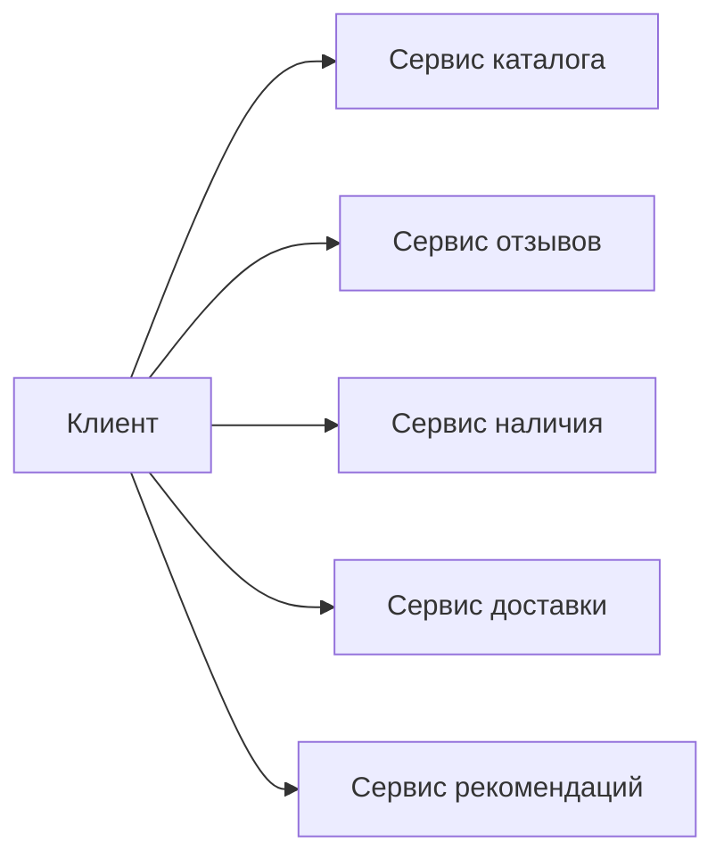
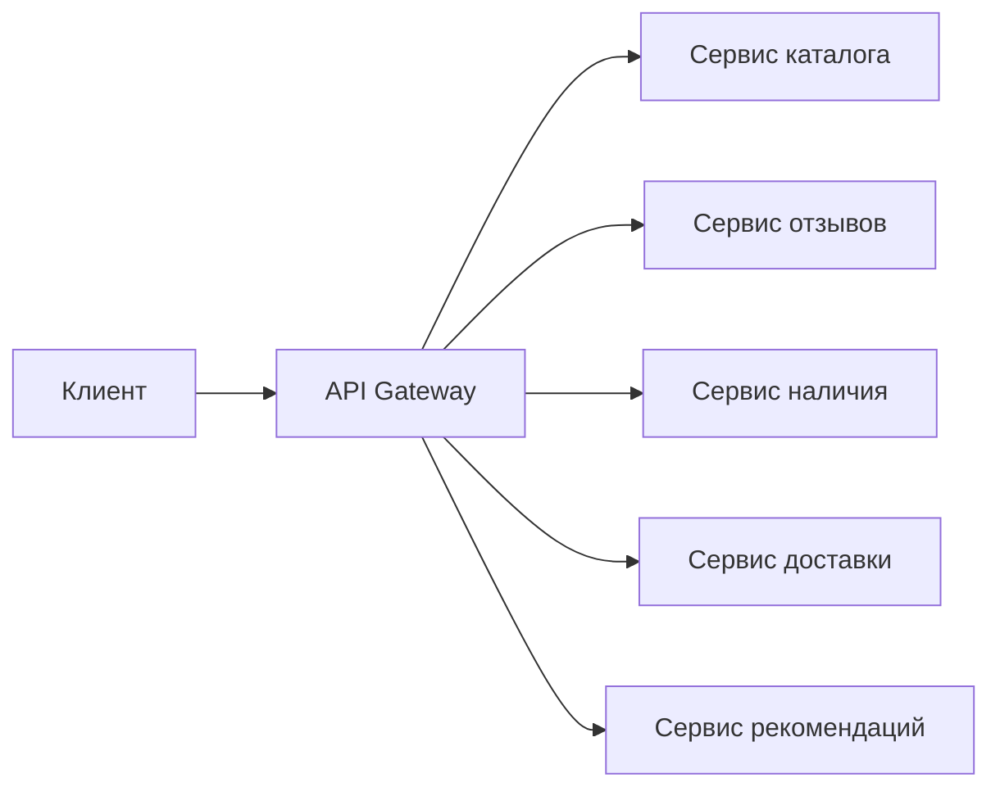
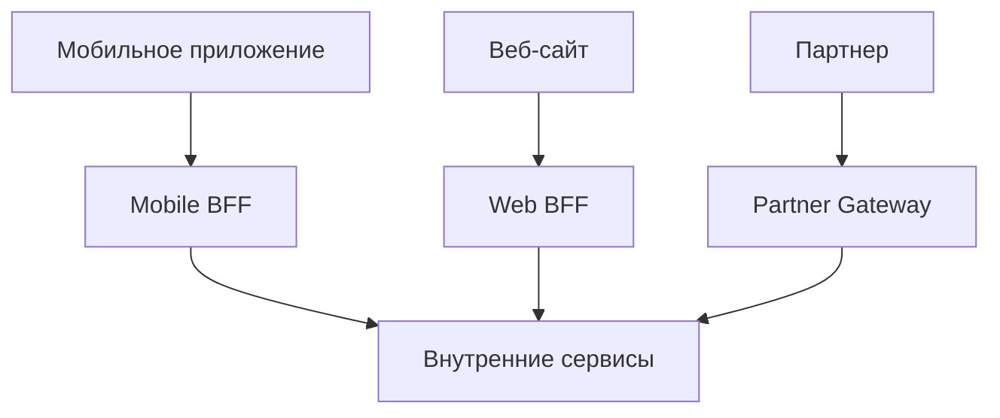

## API Gateway: единая точка входа в распределенную систему

В монолитной архитектуре клиенту достаточно знать адрес одного сервера. Все запросы идут в одно приложение, которое само решает, какую логику выполнить. В микросервисной архитектуре все иначе. Клиенту пришлось бы знать адреса десятков сервисов, разбираться, какой сервис отвечает за заказы, какой — за пользователей, какой за платежи. Клиентское приложение становится хрупким, связанным с внутренней топологией системы.

**API Gateway** — это сервер, который становится единой точкой входа для всех клиентских запросов. Клиент обращается только к Gateway, который маршрутизирует запросы к нужным внутренним сервисам, применяет сквозные политики (аутентификация, лимитирование, логирование) и при необходимости преобразует или агрегирует ответы.

API Gateway решает несколько задач одновременно: скрывает внутреннюю структуру системы, централизует инфраструктурные функции и упрощает клиентскую разработку. Однако он также становится дополнительным сетевым прыжком и потенциальной точкой отказа.

## Проблема, которую решает API Gateway

Представьте интернет-магазин из десяти микросервисов: сервис пользователей, сервис заказов, сервис платежей, сервис доставки, сервис каталога, сервис поиска, сервис рекомендаций, сервис отзывов, сервис корзины, сервис инвентаризации.

Мобильное приложение для показа страницы товара должно собрать данные из шести разных сервисов: каталог (название, цена), наличие (есть на складе), отзывы (средний рейтинг), рекомендации (похожие товары), доставка (срок и стоимость), поиск (если пользователь пришел из поиска). Если клиент обращается к каждому сервису напрямую:

- Клиент должен знать адреса всех шести сервисов.
- Клиент делает шесть отдельных запросов вместо одного (больше трафика, выше задержка).
- Каждый сервис должен самостоятельно реализовать аутентификацию, rate limiting, логирование.
- Изменение внутренней архитектуры (например, разделение сервиса каталога на два) потребует изменения клиента.



API Gateway решает эти проблемы, становясь посредником. Клиент знает только Gateway. Gateway обращается к внутренним сервисам, собирает ответы и возвращает клиенту один агрегированный JSON.



## Основные функции API Gateway

### Маршрутизация (Routing)

Главная функция Gateway — направлять запрос клиента к нужному внутреннему сервису. Маршрутизация может быть простой (по префиксу пути) или сложной (по заголовкам, параметрам запроса, типу клиента).

**Примеры маршрутов:**

- `POST /v1/orders` → сервис заказов
- `GET /v1/orders/{id}` → сервис заказов
- `GET /v1/products/search?q=...` → сервис поиска
- `GET /v1/products/{id}` → сервис каталога
- `POST /v1/users/register` → сервис пользователей

Маршрутизация может быть версионированной. `/v1/orders` идет в старую версию сервиса заказов, `/v2/orders` — в новую. Это позволяет постепенно мигрировать клиентов.

### Аутентификация и авторизация (Authentication & Authorization)

Gateway — идеальное место для проверки подлинности клиента. Вместо того чтобы каждый внутренний сервис реализовывал проверку JWT или OAuth, это делает Gateway один раз.

**Процесс:**

1. Клиент отправляет запрос с токеном (в заголовке `Authorization: Bearer <token>`).
2. Gateway проверяет токен (валидность, срок действия, подпись).
3. Если токен невалиден — Gateway возвращает `401 Unauthorized`, не передавая запрос дальше.
4. Если токен валиден — Gateway может извлечь из него идентификатор пользователя и его роли, добавить их в заголовки запроса к внутреннему сервису (например, `X-User-Id`, `X-User-Roles`).
5. Внутренний сервис получает уже проверенный идентификатор и может реализовать более тонкую авторизацию (например, "пользователь может редактировать только свои заказы").

**Что Gateway не делает:** авторизацию на уровне отдельных ресурсов (проверку, что пользователь имеет право на конкретный заказ) лучше оставлять внутренним сервисам, потому что только они знают бизнес-правила.

### Rate Limiting (ограничение частоты запросов)

Gateway защищает внутренние сервисы от перегрузки, ограничивая количество запросов от одного клиента или IP-адреса.

**Стратегии rate limiting:**

- **Per client (по клиенту).** Клиент (мобильное приложение) имеет лимит 100 запросов в минуту на основе API-ключа.
- **Per user (по пользователю).** Аутентифицированный пользователь имеет лимит 1000 запросов в час.
- **Per endpoint (по эндпоинту).** Тяжелые эндпоинты (поиск, отчеты) имеют более низкий лимит, чем легкие (GET /status).
- **Per IP.** Защита от DDoS и ботов.

**Алгоритмы:**

- **Token bucket.** Популярный алгоритм, позволяющий небольшие всплески. Клиент получает "токены" с фиксированной скоростью, каждый запрос потребляет токен. Нет токенов — запрос отклоняется с кодом `429 Too Many Requests`.
- **Leaky bucket.** Запросы ставятся в очередь с фиксированной скоростью обработки. При переполнении очереди запросы отклоняются.
- **Sliding window.** Учитывает количество запросов за скользящий интервал времени (например, последние 60 секунд). Более точный, но сложнее в реализации.

Rate limiting обычно реализуется с помощью Redis (для подсчета запросов в распределенной среде, где несколько экземпляров Gateway) или встроенными механизмами Gateway (Kong, NGINX, AWS API Gateway).

### Трансформация запросов и ответов (Request/Response Transformation)

Gateway может изменять запрос клиента перед отправкой во внутренний сервис и ответ сервиса перед возвратом клиенту.

**Примеры трансформаций:**

- Добавление заголовков (``X-User-Id`, `X-Request-Id`, `X-Client-Version`).
- Удаление заголовков, которые не должны попадать во внутренний сервис (например, оригинальный `Authorization` после его проверки).
- Изменение формата запроса: клиент отправил XML, а внутренний сервис ожидает JSON (или наоборот).
- Фильтрация полей в ответе: удаление чувствительных данных (номера карт, паролей) перед отправкой клиенту.
- Преобразование кодов ошибок: маппинг внутренних ошибок (сервис вернул 500) на более подходящие клиентские коды.

### Агрегация (Aggregation)

Одна из самых ценных функций Gateway — объединение нескольких запросов к разным сервисам в один.

**Пример:** Мобильное приложение показывает страницу заказа. Нужно получить:

- Данные заказа (сервис заказов).
- Данные пользователя (сервис пользователей).
- Список товаров в заказе с их текущими ценами (сервис каталога).
- Статус доставки (сервис логистики).

Без Gateway клиент делал бы четыре отдельных запроса. С Gateway — один запрос к `/v1/orders/{id}?expand=user,items,delivery`. Gateway делает четыре запроса параллельно, собирает результаты и возвращает единый JSON.

```json
{
  "order": { "id": 123, "total": 299.99 },
  "user": { "name": "Иван", "email": "ivan@example.com" },
  "items": [
    { "productId": 1, "name": "Товар 1", "price": 199.99 },
    { "productId": 2, "name": "Товар 2", "price": 100.00 }
  ],
  "delivery": { "status": "in_transit", "estimated": "2025-01-20" }
}
```

Агрегация сокращает количество запросов трафик и упрощает логику клиента. Плата — дополнительная задержка на агрегацию и сложность реализации (обработка частичных ошибок, таймаутов).

## Дополнительные функции

### Логирование и мониторинг

Gateway — идеальное место для сбора метрик и логов. Он видит все запросы и может записывать: какой эндпоинт был вызван, сколько времени занял запрос, какой код ответа, какой пользователь, с какого IP. Эта информация используется для дашбордов, алертов и аудита.

### SSL Termination

Gateway может завершать HTTPS-соединение, расшифровывать трафик и передавать внутренним сервисам обычный HTTP. Это разгружает внутренние сервисы от криптографических операций и централизует управление сертификатами.

### Кэширование

Gateway может кэшировать ответы сервисов для часто повторяющихся запросов. Например, `GET /v1/products/{id}` для популярного товара может кэшироваться на 5 секунд, разгружая бэкенд.

### Canary deployment и A/B тестирование

Gateway может направлять небольшой процент трафика на новую версию сервиса. Например, 95% запросов к сервису заказов идут на старую версию (`/orders-v1`), 5% — на новую (`/orders-v2`). Это позволяет тестировать изменения в продакшене с минимальным риском.

### Circuit Breaker

Gateway может отслеживать ошибки при вызове внутренних сервисов. Если сервис начал часто падать или отвечать с таймаутом, Gateway временно перестает направлять к нему запросы (размыкает цепь) и возвращает fallback-ответ. Это защищает систему от каскадных отказов.

## Типы API Gateway

### Программный (self-hosted)

**Примеры:** NGINX, Kong, Traefik, Apache APISIX, Spring Cloud Gateway.

**Плюсы:** Гибкость, полный контроль, можно настраивать под любые нужды. **Минусы:** Требует администрирования, надо разворачивать и поддерживать самостоятельно.

### Облачный (managed)

**Примеры:** AWS API Gateway, Azure API Management, Google Cloud Endpoints, Yandex API Gateway.

**Плюсы:** Не нужно администрировать, автоматически масштабируется, интегрируется с другими сервисами облака (CloudFront, Lambda, IAM). **Минусы:** Привязка к провайдеру, может выходить дороже при большом трафике, некоторые функции ограничены.

### Специализированный для GraphQL

**Примеры:** Apollo Gateway, Hasura, WunderGraph.

**Плюсы:** Умеет собирать схему из нескольких GraphQL-сервисов (federation), автоматически агрегировать запросы. **Минусы:** Специфичен для GraphQL, не подходит для REST-сервисов.

## Архитектурные сценарии: один Gateway или несколько

**Один Gateway для всех клиентов.** Просто, но клиенты (мобильное приложение, веб-сайт, партнерское API) могут иметь разные потребности. Мобильному приложению нужна агрегация (чтобы меньше запросов), веб-сайту — другие данные, партнерам — отдельная аутентификация.

**Backend for Frontend (BFF) — отдельный Gateway для каждого типа клиента.** Мобильное приложение имеет свой BFF, который оптимизирует ответы под маленький экран и медленную сеть. Веб-сайт — свой BFF. Партнеры — свой API Gateway.



BFF-паттерн сложнее в эксплуатации (больше компонентов), но дает больше гибкости и изоляции.

## Ограничения и риски API Gateway

**Дополнительная задержка (latency).** Каждый запрос проходит через Gateway, что добавляет небольшой сетевой прыжок (обычно 5-20 мс) и время на обработку (маршрутизация, трансформация). Для большинства систем это приемлемо.

**Единая точка отказа (Single Point of Failure).** Если Gateway упал, вся система недоступна. Нужна отказоустойчивость: несколько реплик Gateway за балансировщиком.

**Риск "толстого" Gateway (fat gateway).** Gateway начинает включать в себя бизнес-логику (сложные агрегации, трансформации). Это делает его тяжелым, сложным в поддержке и нарушает принцип разделения ответственности. Gateway должен быть умным, но не умнее необходимого. Бизнес-логика — во внутренних сервисах, Gateway только маршрутизирует и агрегирует.

**Сложность конфигурации.** Управление маршрутами, правилами rate limiting, сертификатами для десятков сервисов становится нетривиальной задачей. Требует автоматизации (infrastructure as code).

**Диагностика проблем.** Когда запрос проходит через Gateway, проблему сложнее локализовать. Нужна распределенная трассировка (Jaeger, Zipkin) и сквозные Correlation ID.

## API Gateway и системный анализ: что нужно знать

При проектировании API с использованием Gateway аналитик должен определить:

1. **Маршруты:** какой путь к какому сервису ведет? Требуется ли версионирование?
2. **Аутентификация:** все ли эндпоинты требуют авторизации? Есть ли публичные эндпоинты (например, `GET /products`)?
3. **Rate limiting:** какие лимиты для разных клиентов (мобильное приложение, веб-сайт, партнеры)? 100 запросов в минуту или 1000 в час?
4. **Трансформации:** нужно ли преобразовывать запрос/ответ (менять формат, фильтровать поля, добавлять заголовки)?
5. **Агрегации:** какие запросы можно объединить, чтобы уменьшить количество вызовов от клиента? Какие поля клиент запрашивает часто вместе?
6. **Таймауты и ретраи:** сколько времени Gateway ждет ответ от сервиса? Что делать при таймауте?
7. **Кэширование:** какие ответы можно кэшировать и на сколько?

Эти требования должны быть задокументированы в контракте API (OpenAPI) и в архитектурной документации.

## Резюме

API Gateway — это архитектурный паттерн и компонент инфраструктуры, который становится единой точкой входа для клиентов в распределенной системе.

**Основные функции:**

- **Маршрутизация** — направление запросов к нужным внутренним сервисам.
- **Аутентификация и авторизация** — проверка токенов, добавление identity в запрос.
- **Rate limiting** — защита от перегрузки и злоупотреблений.
- **Трансформация** — изменение формата запросов и ответов.
- **Агрегация** — объединение данных из нескольких сервисов в один ответ.

**Дополнительные функции:** логирование, мониторинг, SSL termination, кэширование, canary deployment, circuit breaker.

**Варианты реализации:** программные (NGINX, Kong, Traefik), облачные (AWS API Gateway, Azure API Management), специализированные (Apollo Gateway для GraphQL).

**Риски:** дополнительная задержка, единая точка отказа, риск "толстого" Gateway, сложность конфигурации.

**Для аналитика:** API Gateway требует четкого определения маршрутов, политик безопасности, лимитов и правил агрегации. Все эти решения нужно документировать и согласовывать с разработкой.

API Gateway не решает всех проблем, но без него микросервисная архитектура становится почти невыносимой для клиентов. Это необходимая плата за распределенность — компонент, который берет на себя сквозные функции, позволяя внутренним сервисам оставаться простыми и сфокусированными на бизнес-логике.