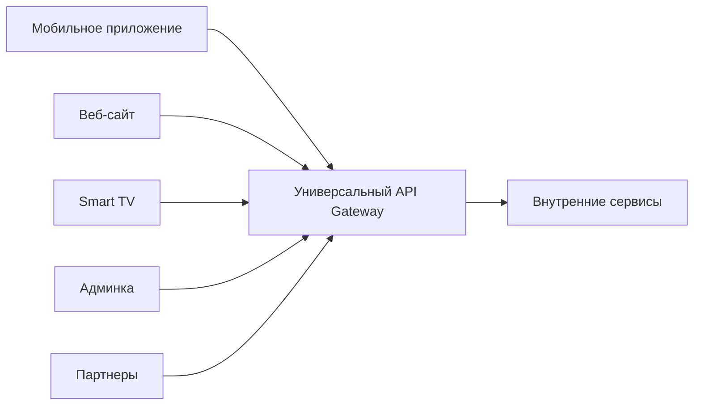
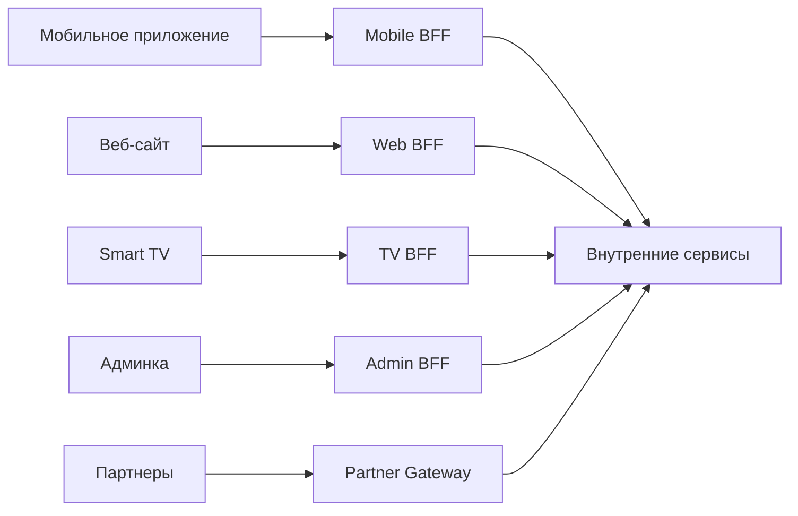

## BFF Pattern: когда одному API нужны разные лица

В классической микросервисной архитектуре с API Gateway часто возникает проблема: все клиенты получают одни и те же API. Мобильное приложение, веб-сайт, smart TV и партнерская интеграция вынуждены пользоваться универсальными эндпоинтами, которые пытаются угодить всем сразу. Это приводит к компромиссам, которые никого не устраивают.

**BFF (Backend for Frontend)** — это архитектурный паттерн, при котором для каждого типа клиента создается отдельный специализированный бэкенд (иногда называемый "шлюзом" или "адаптером"), который работает напрямую с внутренними сервисами и предоставляет API, идеально подходящее для конкретного клиента.

Термин введен Филом Калтонбэком в SoundCloud в 2015 году. Идея проста: вместо того чтобы заставлять клиентов подстраиваться под универсальный API, создайте для них отдельные бэкенды, которые будут делать именно то, что нужно клиенту.

## Проблема: универсальный API неудобен для всех

Представьте интернет-магазин. У него есть:

- **Мобильное приложение (iOS/Android).** Работает в условиях нестабильной сети, экономит трафик и батарею. Требует минимального количества запросов и компактных ответов.
- **Веб-сайт (десктопная версия).** Работает в стабильной сети, может позволить себе больше запросов. Нужны более насыщенные данные (больше полей, сложные вложенные структуры).
- **Веб-сайт (мобильная версия).** Что-то среднее между мобильным приложением и десктопной версией.
- **Smart TV приложение.** Управляется пультом, интерфейс радикально отличается, нужны другие типы данных.
- **Административная панель.** Требует доступа к данным, которые скрыты от обычных пользователей.
- **Партнерский API.** Нужны стабильные, хорошо задокументированные, версионированные эндпоинты.

Если сделать один универсальный API, он, скорее всего, будет:

- **Слишком тяжелым для мобильного приложения.** Много избыточных полей, которые мобильному клиенту не нужны, но они передаются и замедляют загрузку.
- **Слишком бедным для веб-сайта.** Не хватает полей, которые нужны в интерфейсе.
- **Слишком медленным для всех.** Универсальный API пытается агрегировать данные для всех сценариев, что приводит к сложным и медленным запросам.
- **Сложным в поддержке.** Одно изменение должно учитывать всех потребителей, что приводит к раздутым контрактам и долгому согласованию.



## Решение: BFF для каждого клиента

BFF-паттерн предлагает вынести логику подстройки под конкретного клиента в отдельный слой. Каждый клиент получает свой BFF, который знает особенности этого клиента и предоставляет API, оптимизированное именно для него.



**Что может делать BFF:**

- **Агрегировать** данные из нескольких внутренних сервисов в один ответ, удобный для конкретного экрана.
- **Фильтровать поля**, удаляя данные, не нужные данному клиенту.
- **Трансформировать** форматы (переименовывать поля, преобразовывать типы, менять структуру).
- **Объединять** несколько вызовов в один для экономии трафика (мобильное приложение).
- **Кэшировать** ответы, чтобы уменьшить нагрузку на серверы.
- **Пред- и пост-обрабатывать** данные (например, обогащать геоданными, переводить валюту).
- **Реализовывать** клиент-специфичную аутентификацию и авторизацию.

## Пример: чем отличаются BFF для мобильного и веб-приложения

**Сценарий:** Показать список заказов пользователя.

**Внутренние сервисы:**

- Сервис заказов: возвращает `order_id`, `date`, `total`, `status`, `user_id`.
- Сервис пользователей: возвращает `name`, `email`, `avatar_url`.
- Сервис доставки: возвращает `tracking_number`, `estimated_delivery`, `status`.
- Сервис оплаты: возвращает `payment_method`, `receipt_url`.

**Web BFF (десктоп).** Пользователь на большом экране, сеть стабильная. Можно показать много деталей. BFF возвращает развернутый ответ с полной информацией по каждому заказу.

```json
[
  {
    "id": 123,
    "date": "2025-01-15",
    "total": 299.99,
    "status": "delivered",
    "user": {
      "name": "Иван",
      "email": "ivan@example.com",
      "avatar": "https://..."
    },
    "delivery": {
      "tracking": "TRK123",
      "estimated": "2025-01-18",
      "status": "delivered"
    },
    "payment": {
      "method": "visa",
      "receipt": "https://..."
    }
  }
]
```

**Mobile BFF.** Пользователь на телефоне, экран маленький, сеть может быть медленной. Нужно экономить трафик и показывать только самое важное. BFF возвращает минимальный набор полей.

```json
[
  {
    "id": 123,
    "date": "2025-01-15",
    "total": 299.99,
    "status": "delivered"
  }
]
```

При этом детальная информация по конкретному заказу загружается отдельным запросом (только когда пользователь откроет карточку заказа). Mobile BFF может предоставить отдельный эндпоинт `/mobile/orders/{id}/details`, который вернет ту же детальную информацию, что и web BFF.

**TV BFF.** Пульт, интерфейс на расстоянии, крупные плитки. Нужны изображения, минимальный текст. BFF может отдавать только самые последние заказы и их статусы в виде крупных иконок.

**Admin BFF.** Нужны данные для редактирования. BFF может возвращать заказы в формате, удобном для массового редактирования (например, плоский список с полями `order_id`, `user_email`, `total`, `status`, `admin_notes`), включая поля, недоступные обычным пользователям.

## Преимущества BFF

**Оптимизация для каждого клиента.** Каждый BFF решает проблемы конкретного клиента. Мобильный BFF экономит трафик, TV BFF отдает крупные изображения, веб BFF предоставляет полные данные.

**Независимая эволюция.** Мобильное приложение может изменить свою логику, не затрагивая веб-сайт. Обновление Mobile BFF не влияет на Web BFF и наоборот. Команды могут развивать свои BFF независимо.

**Упрощение клиентского кода.** Клиентское приложение становится проще. Вся логика агрегации, фильтрации, трансформации вынесена в BFF. Клиенту не нужно делать 5 запросов и склеивать ответы — BFF делает это за него.

**Безопасность.** Чувствительные данные возвращаются только тем BFF, которым они нужны. Например, Admin BFF получает доступ к `admin_notes`, а Mobile BFF — нет.

**Контроль версий.** Разные версии клиента могут использовать разные BFF или разные версии BFF. Это упрощает миграцию.

## Недостатки и сложности BFF

**Разрастание числа компонентов.** Для каждого клиента нужен свой BFF. Если у вас 5 клиентов, у вас 5 BFF. Это 5 сервисов, которые нужно разворачивать, мониторить, логировать, поддерживать.

**Дублирование логики.** Логика, которая почти одинакова для разных клиентов, дублируется в BFF. Например, базовая агрегация заказа может быть реализована в Mobile BFF и Web BFF. Если изменится внутренний API, придется обновлять все BFF.

**Сложность согласования.** Если бизнес-правило меняется и должно примениться ко всем клиентам, нужно обновить все BFF. Монорепозиторий с общими библиотеками может смягчить проблему, но не решить полностью.

**BFF должен быть "толстым" или "тонким"?** Есть риск, что BFF начнет содержать бизнес-логику, дублируя внутренние сервисы. Это антипаттерн. BFF должен быть тонким слоем подстройки, а не хранилищем бизнес-правил.

**Задержка (latency).** Запрос теперь проходит: клиент → BFF → внутренний сервис. Это два сетевых прыжка вместо гипотетического одного. На практике задержка обычно приемлема.

## Когда BFF полезен

**Несколько клиентов с разными потребностями.** Мобильное приложение, веб-сайт, TV, голосовые ассистенты, чат-боты. Каждому нужен свой формат данных.

**Один клиент, но сложный.** Даже если у вас одно мобильное приложение, но оно должно показывавать много разных экранов с разной степенью детализации, BFF может быть полезен для централизации агрегации.

**Клиентское приложение разрабатывается отдельной командой.** BFF позволяет команде клиента менять API под свои нужды без согласования с командами внутренних сервисов (в рамках оговоренных контрактов между BFF и сервисами).

**Клиент работает в условиях ограниченных ресурсов.** Мобильное приложение, IoT-устройство. BFF берет на себя всю "тяжелую" работу по сбору и трансформации данных.

**Вы хотите изолировать изменения.** Можно обновить BFF без перезапуска внутренних сервисов и наоборот.

## Когда BFF вреден

**Один клиент.** Если у вас только веб-приложение и больше ничего, BFF не нужен. Универсальный API Gateway или даже прямой API из монолита будет проще.

**Все клиенты одинаковы.** Если мобильное приложение и веб-сайт требуют абсолютно одинаковых данных, два BFF — это ненужное усложнение.

**Маленький проект с одной командой.** Overhead от поддержки нескольких BFF перевешивает выгоды.

**Отсутствие четких границ.** Если команда не может четко определить, что должно быть в BFF, а что во внутренних сервисах, BFF превратится в свалку логики.

**Клиент может сам агрегировать данные.** Если у клиента стабильная сеть и достаточно вычислительных ресурсов, проще дать ему возможность делать несколько запросов и собирать ответы самостоятельно.

## BFF vs API Gateway: в чем разница

API Gateway и BFF — разные паттерны, которые часто путают.

| Аспект | API Gateway | BFF |
| :--- | :--- | :--- |
| **Назначение** | Единая точка входа для всех клиентов, сквозные функции (auth, rate limit, routing) | Специализированный бэкенд для конкретного клиента |
| **Количество** | Обычно один на всю систему | По одному на тип клиента |
| **Знание о клиенте** | Не знает ничего (общий) | Идеально знает особенности клиента |
| **Бизнес-логика** | Не должно быть (только инфраструктура) | Может содержать логику подстройки под клиент |
| **Агрегация** | Может делать простую агрегацию | Делает сложную, клиент-специфичную агрегацию |

На практике часто используют оба паттерна вместе: API Gateway отвечает за аутентификацию, rate limiting и маршрутизацию на нужный BFF, а BFF уже делает агрегацию и трансформацию для конкретного клиента.


## Реальные примеры использования BFF

**Netflix.** Использует BFF для разных устройств: телевизоры, смартфоны, планшеты, приставки. У каждого устройства свои требования к разрешению видео, формату данных, сценариям навигации.

**Spotify.** BFF для десктопного приложения, мобильного приложения, веб-плеера и smart TV заметно отличаются. Например, BFF для автомобильной версии учитывает, что водитель не должен отвлекаться — интерфейс и данные сильно упрощены.

**SoundCloud (где и появился паттерн).** У SoundCloud были отдельные команды для iOS, Android и веба. Каждая команда хотела контролировать свой API. BFF позволил им делать это, не конфликтуя друг с другом.

**Zalando.** У интернет-магазина одежды разные BFF для мобильного приложения, десктопного веба, мобильного веба и приставок.

## Проектирование BFF: что нужно аналитику

При проектировании BFF аналитик должен ответить на вопросы:

**1. Сколько BFF нужно?**
- По одному на каждый тип клиента? (Mobile, Web, TV, Admin, Partner)
- Или объединить Web и мобильный Web в один BFF?
- Или сделать отдельный BFF для разных версий клиента (iOS v1 и iOS v2)?

**2. Какие данные нужны каждому клиенту?**
- Какие поля требуются на каждом экране?
- Какие агрегации можно выполнить на BFF, чтобы уменьшить количество запросов от клиента?
- Какие данные можно отдавать "лениво" (load on demand), а какие — сразу?

**3. Кто владеет BFF?**
- Команда, разрабатывающая клиент, или отдельная платформенная команда?
- Как согласуются изменения BFF с изменениями внутренних сервисов?

**4. Как версионировать BFF?**
- BFF меняется вместе с клиентом? Или BFF поддерживает несколько версий клиента?
- Как обеспечить обратную совместимость BFF при обновлении клиента?

**5. BFF как антикоррупционный слой (Anti-Corruption Layer).**
BFF часто выступает в роли ACL, изолируя клиента от изменений во внутренних сервисах. Если внутренний сервис изменил структуру данных, BFF может транслировать старый формат в новый, чтобы клиент не менялся. Это нужно документировать.

## Резюме

BFF (Backend for Frontend) — это архитектурный паттерн, при котором для каждого типа клиента создается отдельный специализированный бэкенд.

**Проблема:** Универсальный API неудобен для разных клиентов (мобильное приложение, веб, TV, админка). Клиенты вынуждены либо получать избыточные данные, либо делать много запросов.

**Решение:** Создать для каждого клиента свой BFF, который предоставляет API, идеально подходящее для этого клиента. BFF агрегирует, фильтрует, трансформирует данные из внутренних сервисов.

**Преимущества:**

- Оптимизация под каждого клиента (трафик, количество запросов, формат данных).
- Независимая эволюция клиентов и бэкенда.
- Упрощение клиентского кода.
- Безопасность (разные BFF имеют разные права доступа).

**Недостатки и риски:**

- Разрастание числа компонентов.
- Дублирование логики между BFF.
- Риск "толстого" BFF с бизнес-логикой.
- Дополнительные сетевые задержки.

**Когда использовать:**

- Несколько клиентов с разными потребностями.
- Сложный клиент, требующий агрегации.
- Клиент разрабатывается отдельной командой.
- Клиент работает в условиях ограниченных ресурсов.

**Когда не использовать:**

- Один клиент.
- Все клиенты одинаковы.
- Маленький проект с одной командой.
- Отсутствие четких границ ответственности.

**BFF vs API Gateway:** API Gateway — общий для всех клиентов, отвечает за сквозную инфраструктуру (auth, rate limit, routing). BFF — клиент-специфичный, отвечает за агрегацию и трансформацию данных. Они часто используются вместе.

Для системного аналитика BFF — важный инструмент для проектирования API под разные потребители. Понимание BFF позволяет принимать решение, когда нужен один универсальный API, а когда — несколько специализированных. Чем больше различаются клиенты, тем больше пользы от BFF. Чем их меньше и чем они однороднее, тем выше вероятность, что BFF будет оверинжинирингом.