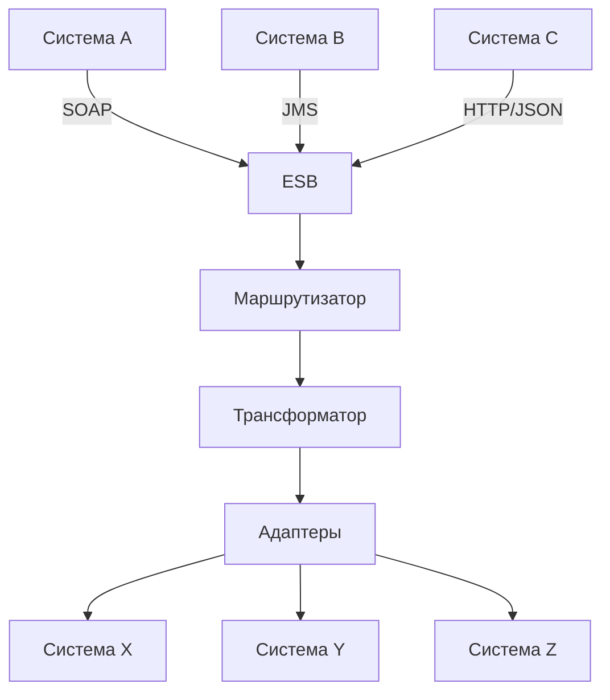
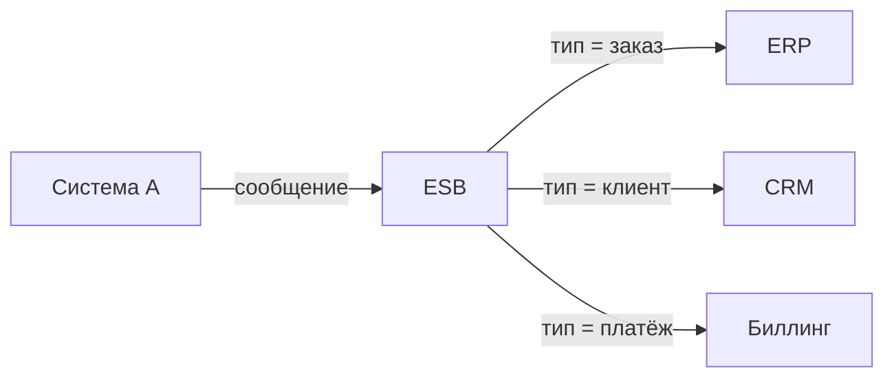
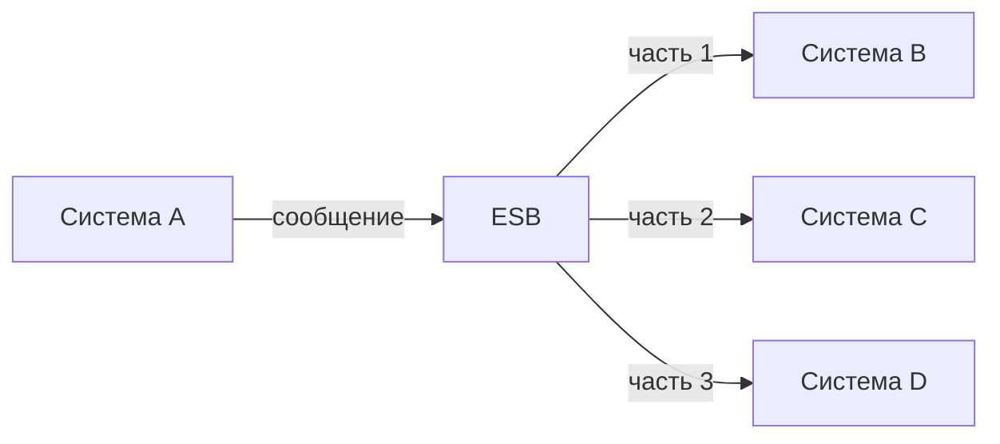
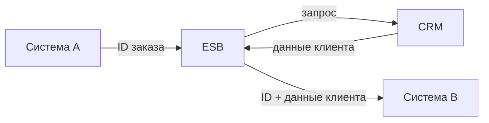
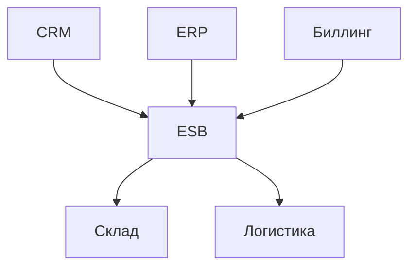
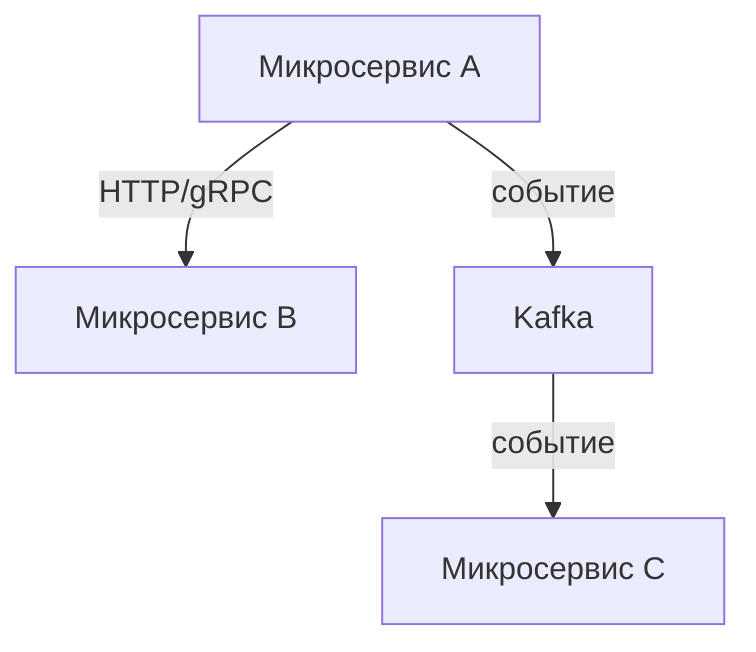

## Введение: Центральная нервная система предприятия

Представьте, что в большой компании разные отделы говорят на разных языках. Бухгалтерия — на цифрах, маркетинг — на графиках, производство — на схемах. Если они хотят общаться напрямую, каждому отделу нужен переводчик для каждого другого отдела.

ESB — это как центральное бюро переводов. Каждый отдел говорит на своём языке, а ESB переводит сообщение в нужный формат для получателя. Кроме того, ESB может решать, куда направить сообщение, преобразовывать данные, применять бизнес-правила.

**Enterprise Service Bus (ESB)** — это архитектурный паттерн для интеграции корпоративных систем, представляющий собой центральную шину, через которую проходят все сообщения между системами. ESB не только доставляет сообщения (как брокер), но и преобразует их, маршрутизирует, трансформирует, применяет бизнес-правила.

Для системного аналитика ESB — это инструмент для сложных корпоративных интеграций. Если у вас десятки разнородных систем, написанных на разных языках, работающих на разных платформах, с разными форматами данных — ESB может стать центральным узлом, который всё это связывает.

## ESB vs Простой брокер сообщений

| Характеристика | Брокер сообщений | ESB |
| :--- | :--- | :--- |
| **Основная функция** | Доставка сообщений | Доставка + трансформация + маршрутизация |
| **Преобразование форматов** | Нет (или минимальное) | Да (из XML в JSON, из CSV в SOAP) |
| **Маршрутизация** | Простая (очередь/топик) | Сложная (по содержимому, бизнес-правилам) |
| **Бизнес-правила** | Нет | Да |
| **Сервисы** | Нет | Мониторинг, логирование, аудит |
| **Сложность** | Низкая-средняя | Высокая |
| **Примеры** | Kafka, RabbitMQ | Mule ESB, Apache Camel, WSO2 |

## Компоненты ESB



### 1. Адаптеры (Adapters)

Подключаются к разным системам с разными протоколами.

| Протокол | Адаптер |
| :--- | :--- |
| SOAP | SOAP adapter |
| REST | HTTP adapter |
| JMS | JMS adapter |
| FTP/файлы | File adapter |
| База данных | JDBC adapter |

### 2. Маршрутизатор (Router)

Решает, куда отправить сообщение.

```yaml
Правила маршрутизации:
- Если тип = "заказ" → очередь заказов
- Если тип = "платёж" → очередь платежей
- Если сумма > 1 000 000 → очередь проверки
```

### 3. Трансформатор (Transformer)

Преобразует форматы данных.

```yaml
Преобразования:
- XML → JSON
- CSV → XML
- SOAP → REST
- ID из системы A → ID из системы B
```

### 4. Каналы (Channels)

Очереди и топики для передачи сообщений между компонентами.

### 5. Управление (Management)

Мониторинг, логирование, аудит, отслеживание сообщений.

## Паттерны ESB

### Трансформация сообщений


**Зачем:** Система A говорит на XML, система B понимает только JSON.

### Маршрутизация на основе содержимого



**Зачем:** Один поток сообщений разбирается по разным системам.

### Разделение и агрегация



**Зачем:** Одно сообщение нужно разослать в несколько систем.

### Усиление сообщений (Enrichment)



**Зачем:** Дополнить сообщение данными из другой системы.

## Преимущества ESB

| Преимущество | Объяснение |
| :--- | :--- |
| **Централизация** | Вся логика интеграции в одном месте |
| **Переиспользование** | Адаптеры и трансформации можно использовать многократно |
| **Слабая связанность** | Системы не знают друг о друге, знают только ESB |
| **Мониторинг** | Единая точка для логирования, аудита, отладки |
| **Безопасность** | Единая точка для авторизации, шифрования |
| **Трансформация** | Преобразование любых форматов |
| **Протоколы** | Поддержка десятков протоколов "из коробки" |

## Недостатки ESB

| Недостаток | Объяснение |
| :--- | :--- |
| **Единая точка отказа** | Если ESB упал — вся интеграция встала |
| **Узкое место** | Весь трафик через ESB → может стать бутылочным горлышком |
| **Сложность** | ESB — сложная система, требует обучения |
| **Стоимость** | Коммерческие ESB (Mule, Oracle) дороги |
| **Монолитность** | ESB может стать монолитом в мире микросервисов |
| **Задержка** | Каждое сообщение проходит через ESB → задержка |

## ESB в эпоху микросервисов

### Традиционный монолит



### Микросервисная архитектура



**Тренд:** Отход от тяжёлых ESB к лёгким брокерам (Kafka) и прямым вызовам (HTTP/gRPC).

**Когда ESB всё ещё нужен:**

| Ситуация | Почему |
| :--- | :--- |
| **Десятки устаревших систем** | Нет API, только файлы, базы данных |
| **Сложная трансформация** | XML ↔ EDI ↔ JSON ↔ CSV |
| **Разные протоколы** | SOAP, JMS, FTP, HTTP, файлы |
| **Безопасность и аудит** | Требования регуляторов |
| **Большая компания, много систем** | ESB как единый центр |

## Популярные ESB

| ESB | Лицензия | Особенность |
| :--- | :--- | :--- |
| **Apache Camel** | Open Source | Не совсем ESB, скорее framework |
| **Mule ESB** | Коммерческая + Community | Популярный, мощный |
| **WSO2** | Open Source | Полный набор интеграционных сервисов |
| **Oracle Service Bus** | Коммерческая | Для экосистемы Oracle |
| **IBM Integration Bus** | Коммерческая | Для экосистемы IBM |
| **Microsoft BizTalk** | Коммерческая | Для экосистемы Microsoft |

## Когда выбирать ESB

| Условия | Почему |
| :--- | :--- |
| **Много разных протоколов** | ESB поддерживает всё из коробки |
| **Много разных форматов** | XML, JSON, CSV, EDI, бинарные |
| **Сложная маршрутизация** | По содержимому, бизнес-правилам |
| **Нужна трансформация** | Преобразование данных между системами |
| **Централизованный мониторинг** | Одна панель для всех интеграций |
| **Устаревшие системы** | Нет API, только файлы, БД, очереди |

## Когда ESB избыточен

| Условия | Альтернатива |
| :--- | :--- |
| **Всё на HTTP/JSON** | API Gateway |
| **Событийная архитектура** | Kafka |
| **Мало систем (2-5)** | Точка-точка |
| **Микросервисы** | HTTP/gRPC + лёгкий брокер |
| **Стартап, небольшой проект** | Проще начать без ESB |

## ESB vs API Gateway vs Брокер

| Характеристика | API Gateway | Брокер | ESB |
| :--- | :--- | :--- | :--- |
| **Синхронность** | Синхронный | Асинхронный | И то, и другое |
| **Трансформация** | Минимальная | Нет | Да (сложная) |
| **Маршрутизация** | Простая (по пути) | Простая (очередь/топик) | Сложная (по содержимому) |
| **Протоколы** | HTTP/HTTPS | AMQP, MQTT, Kafka | Десятки |
| **Типичные задачи** | Маршрутизация к микросервисам | Асинхронные события | Интеграция устаревших систем |
| **Где используется** | Микросервисы | Событийная архитектура | Корпоративные интеграции |

## Распространённые ошибки

### Ошибка 1: ESB как "серебряная пуля"

Пытаются все интеграции пропускать через ESB, даже простые HTTP-вызовы между двумя сервисами.

**Решение:** Использовать ESB только когда нужна трансформация или сложная маршрутизация.

### Ошибка 2: ESB как монолит

В ESB складывают всю логику, он становится монолитом, который трудно менять.

**Решение:** Выносить логику в микросервисы, ESB оставить для маршрутизации и трансформации.

### Ошибка 3: Слабый мониторинг

ESB упал, интеграция встала. Кто виноват? Что делать? Непонятно.

**Решение:** Настроить мониторинг, алерты, дашборды.

### Ошибка 4: Производительность не тестировалась

ESB не выдержал нагрузки в первый же час пик.

**Решение:** Нагрузочное тестирование.

### Ошибка 5: Игнорирование идемпотентности

ESB пересылает сообщения, получатель обрабатывает дважды.

**Решение:** Идемпотентность на получателе.

## Резюме

1. **Enterprise Service Bus (ESB)** — центральная шина для интеграции корпоративных систем. Доставка + трансформация + маршрутизация + бизнес-правила.

2. **Отличие от брокера:** брокер только доставляет, ESB трансформирует, маршрутизирует, обогащает.

3. **Компоненты:** адаптеры (протоколы), маршрутизаторы, трансформаторы, каналы, управление.

4. **Паттерны:** трансформация, маршрутизация по содержимому, разделение, усиление.

5. **Преимущества:** централизация, переиспользование, слабая связанность, мониторинг.

6. **Недостатки:** единая точка отказа, сложность, стоимость, монолитность.

7. **Когда выбирать:** много устаревших систем, разные протоколы и форматы, сложная маршрутизация.

8. **Когда не выбирать:** микросервисы, стартапы, всё на HTTP/JSON (тогда API Gateway + брокер).