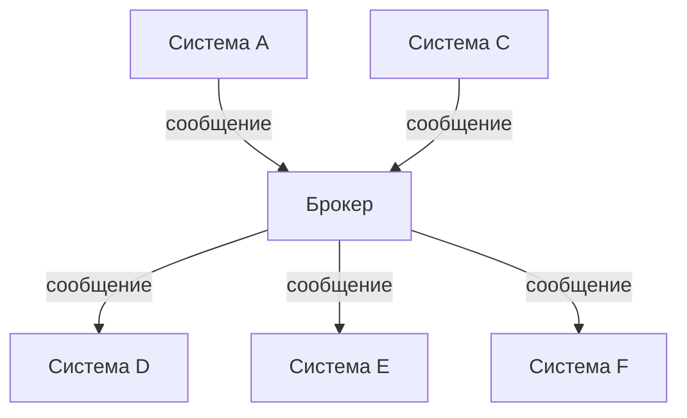
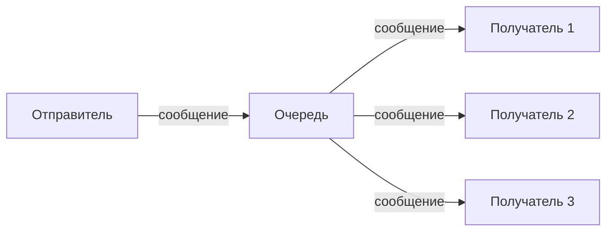
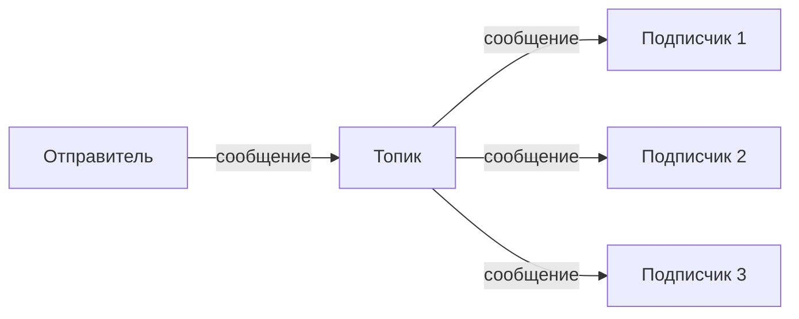
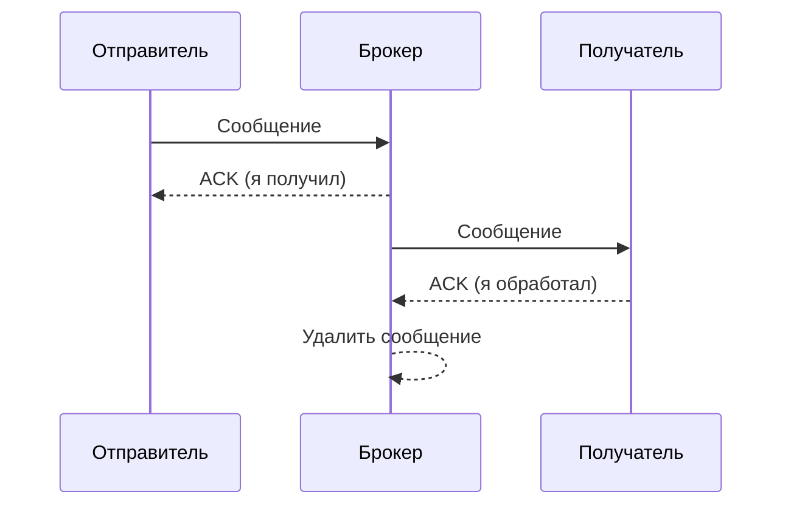
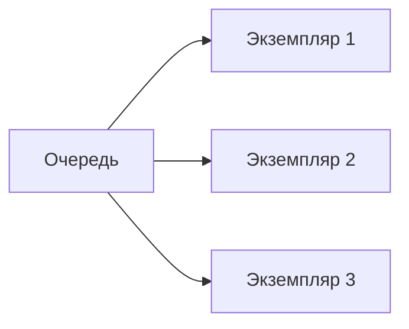
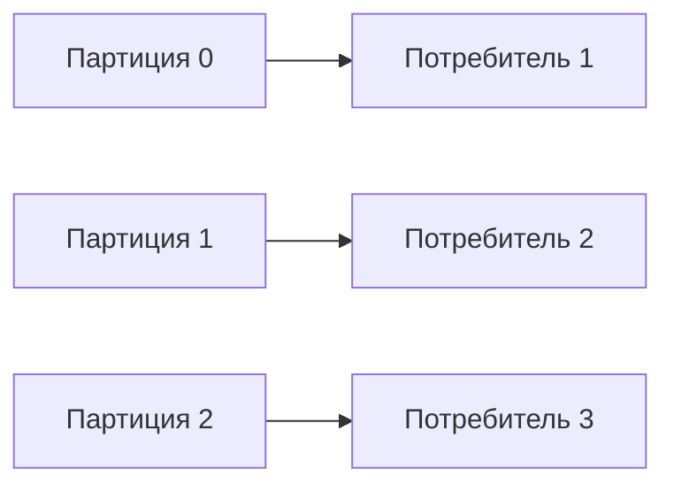
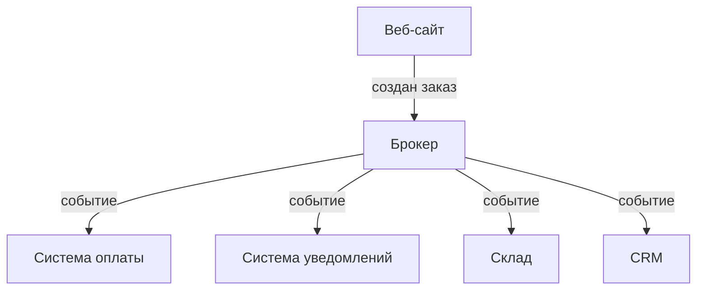

## Введение: Диспетчер, а не прямые звонки

Представьте, что в городе нет телефонной сети. Каждый, кто хочет позвонить, должен соединить провод от своего дома к дому собеседника. Если у вас 10 друзей, нужно 10 проводов. Если появляется новый друг — нужно тянуть ещё один провод.

Теперь представьте, что есть телефонная станция. Вы подключаетесь к станции, станция соединяет вас с нужным абонентом. Новый друг — не нужно тянуть новый провод. Достаточно, чтобы он тоже подключился к станции.

**Брокер сообщений (Message Broker)** — это и есть такая телефонная станция для программ. Системы не общаются напрямую. Они общаются через брокера. Отправитель кладёт сообщение в брокера. Получатель забирает сообщение из брокера. Отправитель не знает, кто получит сообщение. Получатель не знает, кто отправил.

Это архитектурный паттерн, при котором все системы подключаются к центральному посреднику — брокеру сообщений. Брокер принимает сообщения от отправителей и доставляет их получателям. Системы не знают друг о друге. Они знают только о брокере.

Для системного аналитика брокер сообщений — это инструмент для слабой связанности, асинхронной обработки, масштабирования и надёжности. Выбор между "точка-точка" и "через брокер" — одно из ключевых архитектурных решений.

## Как это выглядит

**Примеры брокеров:**

| Брокер | Тип | Особенность |
| :--- | :--- | :--- |
| **Kafka** | Лог-ориентированный | Высокая производительность, хранение событий |
| **RabbitMQ** | Очередной | Гибкая маршрутизация, сложные сценарии |
| **ActiveMQ** | Очередной | Java-экосистема |
| **AWS SQS** | Очередной | Управляемый, облачный |
| **AWS SNS** | Pub/Sub | Управляемый, облачный |
| **NATS** | Лёгкий | Высокая скорость, простота |

## Модели доставки

### Очередь (Queue)

Одно сообщение — одному получателю.

**Пример:** Задача на обработку. Кто первый взял — тот и обработал. Остальные задачу не видят.

### Топик (Topic) / Pub-Sub

Одно сообщение — многим получателям.

**Пример:** Событие "пользователь создан". Все системы, которым это важно (CRM, биллинг, маркетинг), получают копию.

## Синхронный vs Асинхронный через брокер

| Характеристика | Синхронный (HTTP) | Асинхронный (брокер) |
| :--- | :--- | :--- |
| **Ожидание ответа** | Отправитель ждёт | Отправитель не ждёт |
| **Буферизация** | Нет | Сообщение хранится в брокере |
| **Надёжность** | При сбое ответа — потеря | Сообщение не теряется |
| **Связанность** | Отправитель знает получателя | Отправитель не знает получателя |
| **Задержка** | Миллисекунды | Миллисекунды + время в очереди |
| **Масштабирование** | Трудно | Легко |

## Плюсы и минусы

### Плюсы

| Плюс | Объяснение |
| :--- | :--- |
| **Слабая связанность** | Системы не знают друг о друге. Меняем получателя — отправитель не знает |
| **Асинхронность** | Отправитель не ждёт ответа. Не блокируется |
| **Буферизация** | Если получатель временно недоступен, сообщения накапливаются |
| **Надёжность** | Сообщения не теряются (персистентность) |
| **Масштабируемость** | Легко добавить нового получателя — просто подписываем на топик |
| **Балансировка нагрузки** | Несколько экземпляров читают из одной очереди |
| **Повторы** | Брокер может повторить доставку при ошибке |

### Минусы

| Минус | Объяснение |
| :--- | :--- |
| **Сложность** | Появляется дополнительный компонент (брокер) |
| **Задержка** | Сообщение проходит через брокера (миллисекунды) |
| **Синхронный ответ** | Нужен отдельный механизм (корреляция) |
| **Дополнительная инфраструктура** | Нужно администрировать брокера |
| **Порядок сообщений** | Гарантирован не всегда |

## Режимы доставки

### At-most-once (не более одного раза)

Сообщение может потеряться, но не будет доставлено дважды.

**Где используется:** Логи, метрики (потеря одного лога не страшна).

### At-least-once (не менее одного раза)

Сообщение не потеряется, но может быть доставлено несколько раз.

**Где используется:** Большинство сценариев. Требует идемпотентности на получателе.

### Exactly-once (ровно один раз)

Сообщение не потеряется и не дублируется.

**Где используется:** Финансы, критические данные. Дорого, сложно.

## Порядок сообщений

| Гарантия | Что значит | Примеры |
| :--- | :--- | :--- |
| **Порядок в рамках партиции** | В одной партиции порядок сохраняется | Kafka |
| **Глобальный порядок** | Все сообщения упорядочены | Редко, дорого |
| **Без гарантий** | Порядок не сохраняется | RabbitMQ (по умолчанию) |

**Для аналитика:** Если важен порядок (например, "сначала создание, потом обновление"), выбирайте брокер с гарантиями порядка.

## Требования к надёжности

### Персистентность (сохранение на диск)

| Уровень | Что значит | Риск потери |
| :--- | :--- | :--- |
| **In-memory** | Сообщения только в RAM | При сбое брокера — потеря |
| **На диске** | Сообщения на диске | При сбое диска — потеря (редко) |
| **Реплицированное** | На нескольких узлах | Очень низкий |

### Подтверждения (Acknowledgment)

**Что даёт:** Сообщение не потеряется, если получатель упал до обработки.

## Dead Letter Queue (DLQ)

Очередь для сообщений, которые не удалось обработать.

**Когда сообщение попадает в DLQ:**

- Превышено количество попыток (например, 3)
- Сообщение невалидно (нельзя обработать в принципе)
- Таймаут обработки

**Для СА:** DLQ — источник данных о проблемах. Регулярно смотреть, что туда попадает.

## Масштабирование

### Конкурирующие потребители (Competing Consumers)

Несколько экземпляров читают из одной очереди.

**Что даёт:** Горизонтальное масштабирование обработки. Каждый экземпляр берёт следующее сообщение.

### Партиционирование

Очередь разбивается на партиции. Каждая партиция обрабатывается одним потребителем.

**Что даёт:** Параллельная обработка с сохранением порядка внутри партиции.

## Пример: Обработка заказа

**Схема:**

**Что происходит:**

1. Веб-сайт создаёт заказ и отправляет событие в брокера
2. Брокер рассылает событие всем подписчикам
3. Каждая система обрабатывает независимо
4. Если склад временно недоступен — сообщение ждёт в очереди
5. Если CRM упала — при восстановлении получит все события

**Что получаем:**

- Слабая связанность: веб-сайт не знает о CRM, складе, уведомлениях
- Асинхронность: веб-сайт не ждёт обработки
- Надёжность: сообщения не теряются

## Брокер vs Точка-точка

| Характеристика | Точка-точка | Через брокер |
| :--- | :--- | :--- |
| **Связанность** | Высокая | Низкая |
| **Масштабирование** | Трудно | Легко |
| **Буферизация** | Нет | Да |
| **Надёжность** | Низкая | Высокая |
| **Задержка** | Низкая | Немного выше |
| **Сложность** | Низкая | Средняя |
| **Новые системы** | Нужно подключать ко всем | Просто подписать на топик |
| **Изменение API** | Ломает всех | Ломает только отправителя и получателя |

## Когда выбирать брокер

| Условие | Почему |
| :--- | :--- |
| **Систем >5** | Иначе спагетти интеграции |
| **Часто меняются API** | Брокер изолирует изменения |
| **Нужна надёжность** | Буферизация, повторы, DLQ |
| **Асинхронность допустима** | Отправитель не ждёт ответа |
| **Нужно масштабировать обработку** | Конкурирующие потребители |
| **Одно событие — много получателей** | Pub-Sub |

## Когда точка-точка всё ещё лучше

| Условие | Почему |
| :--- | :--- |
| **Мало систем (2-5)** | Брокер — оверхед |
| **Низкая задержка критична** | Прямой вызов быстрее |
| **Синхронный ответ нужен** | "Заплатил — сразу узнал результат" |
| **Проект небольшой** | Брокер — избыточная сложность |

## Распространённые ошибки

### Ошибка 1: Брокер как серебряная пуля

Внедрили брокер, но продолжают делать синхронные вызовы через него.

**Решение:** Для синхронных вызовов используйте HTTP/gRPC. Брокер — для асинхронных.

### Ошибка 2: Игнорирование идемпотентности

Брокер гарантирует at-least-once, получатель не обрабатывает дубликаты.

**Решение:** Сделать обработку идемпотентной (по idempotency key).

### Ошибка 3: Нет мониторинга DLQ

Сообщения падают в DLQ, никто не смотрит.

**Решение:** Алерт при появлении сообщений в DLQ.

### Ошибка 4: Неправильный выбор брокера

Выбрали Kafka для сложной маршрутизации (нужен RabbitMQ). Или RabbitMQ для высоких нагрузок (нужна Kafka).

**Решение:** Изучить сильные стороны брокеров.

### Ошибка 5: Порядок сообщений не обеспечен

Отправили "сначала обновление, потом создание". Получатель получил в другом порядке.

**Решение:** Использовать партиции или гарантии порядка.

## Резюме

1. **Брокер сообщений** — центральный посредник, через который системы обмениваются сообщениями.

2. **Модели:** очередь (одному получателю), топик (многим получателям).

3. **Плюсы:** слабая связанность, асинхронность, буферизация, надёжность, масштабируемость.

4. **Минусы:** сложность, дополнительная задержка, инфраструктура.

5. **Режимы доставки:** at-most-once, at-least-once, exactly-once.

6. **Dead Letter Queue (DLQ)** — очередь для сообщений, которые не удалось обработать.

7. **Когда выбирать брокер:** систем >5, нужна надёжность, асинхронность, масштабирование.