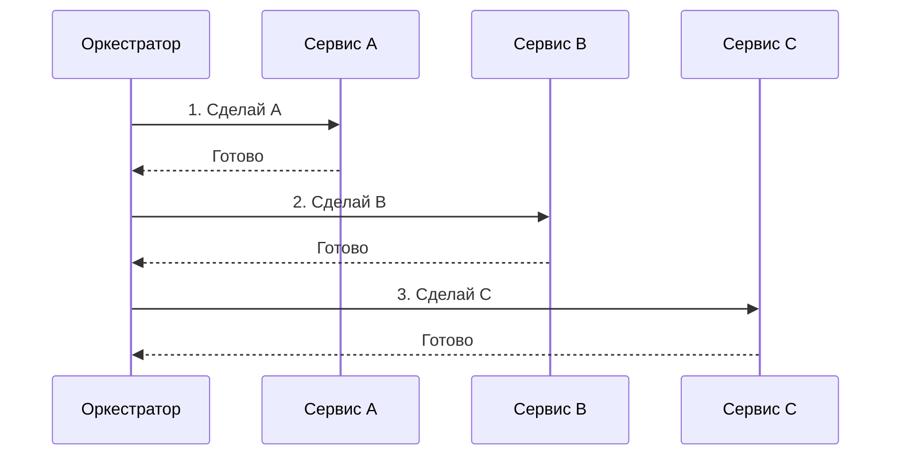
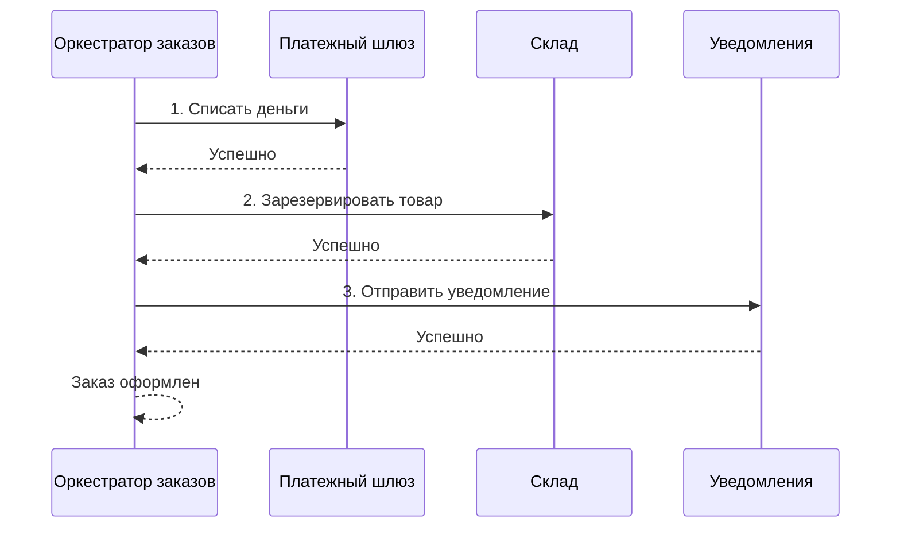
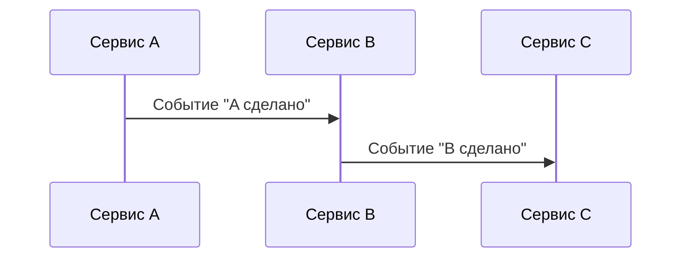
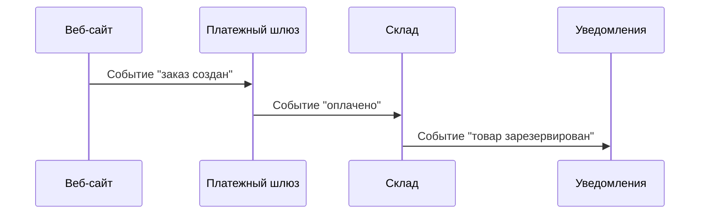
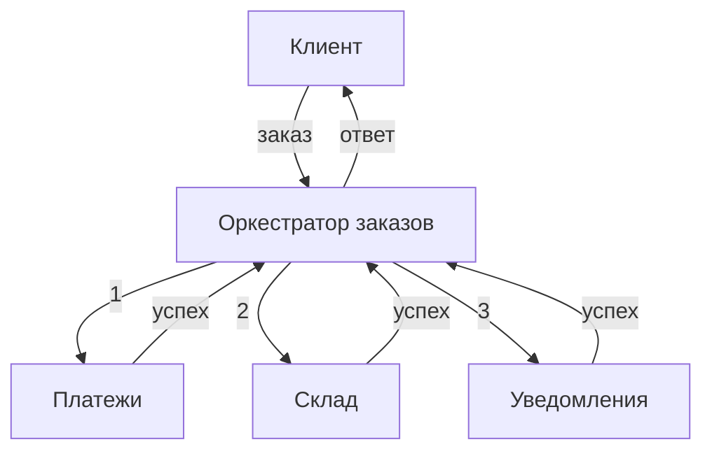
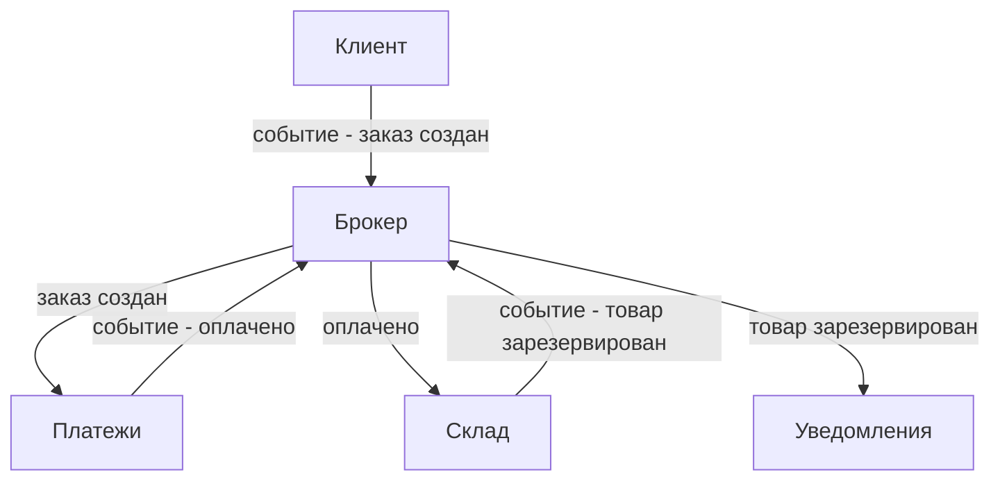
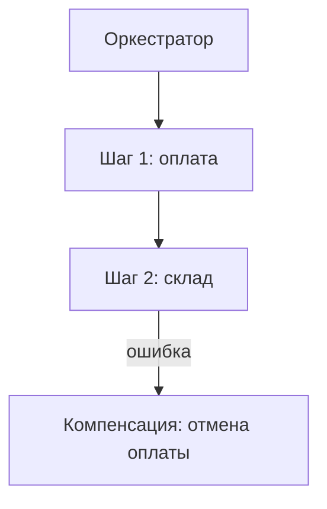
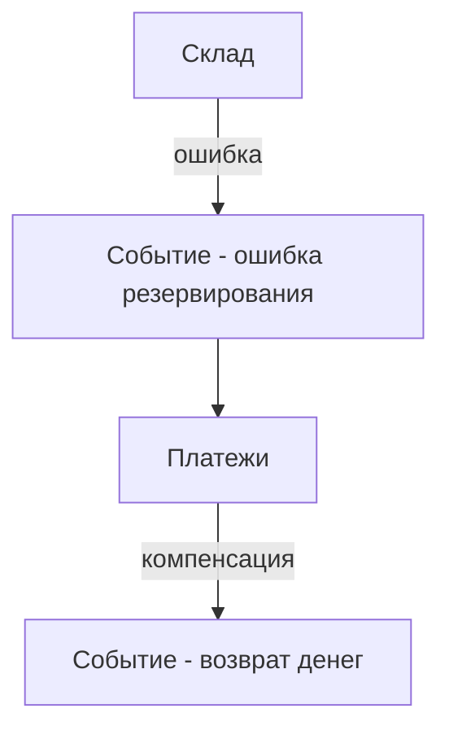
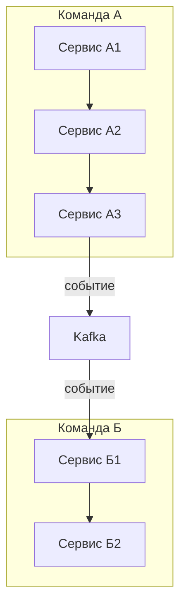

## Введение: Дирижёр или джаз-банд

Представьте симфонический оркестр. Есть дирижёр, который стоит в центре и указывает, когда какой музыкант должен вступить. Дирижёр знает всю партитуру. Музыканты смотрят только на дирижёра. Если дирижёр ушёл, оркестр останавливается. Это **оркестрация**.

Теперь представьте джазовый ансамбль. Нет дирижёра. Музыканты слушают друг друга. Саксофон начал — барабаны подхватили, пианино добавило аккорд. Каждый знает, что делать, наблюдая за другими. Если кто-то ошибся, остальные подстраиваются. Нет единого центра. Это **хореография**.

В мире распределённых систем и интеграций два подхода к координации сервисов.

**Оркестрация** — есть центральный координатор (оркестратор), который вызывает сервисы в нужном порядке, обрабатывает ошибки, управляет транзакциями. Оркестратор знает весь процесс.

**Хореография** — нет центрального координатора. Сервисы общаются через события. Каждый сервис знает, что делать, реагируя на события от других. Решение распределено между участниками.

Для системного аналитика выбор между оркестрацией и хореографией — это выбор между контролем и гибкостью, между простотой отладки и масштабируемостью.

## Оркестрация: Есть дирижёр

**Пример: Оформление заказа**

## Хореография: Нет дирижёра

**Пример: Оформление заказа (хореография)**

## Сравнение

| Характеристика | Оркестрация | Хореография |
| :--- | :--- | :--- |
| **Центральный координатор** | Есть | Нет |
| **Знание процесса** | Оркестратор знает всё | Каждый сервис знает свою часть |
| **Связанность** | Оркестратор знает всех | Сервисы знают только о событиях |
| **Сложность процесса** | В одном месте | Распределена |
| **Отладка** | Проще (один лог) | Сложнее (много логов) |
| **Масштабирование** | Оркестратор — узкое место | Легко |
| **Устойчивость** | Оркестратор — единая точка отказа | Высокая (нет центра) |
| **Изменение процесса** | Меняем оркестратора | Меняем несколько сервисов |
| **Транзакции** | Легче (компенсации) | Сложнее (сага) |
| **Пример** | BPMN, Camunda, Temporal | Kafka, события |

## Плюсы и минусы

### Оркестрация: Плюсы

| Плюс | Объяснение |
| :--- | :--- |
| **Централизованная логика** | Весь процесс в одном месте |
| **Простая отладка** | Один лог, один трейс |
| **Лёгкие компенсации** | Оркестратор знает, что откатить |
| **Синхронный ответ** | Клиент ждёт результат |
| **Контроль** | Можно реализовать сложные ветвления |

### Оркестрация: Минусы

| Минус | Объяснение |
| :--- | :--- |
| **Единая точка отказа** | Упал оркестратор — всё встало |
| **Узкое место** | Весь трафик через оркестратора |
| **Связанность** | Оркестратор знает всех |
| **Масштабирование** | Оркестратор сложно масштабировать |

### Хореография: Плюсы

| Плюс | Объяснение |
| :--- | :--- |
| **Слабая связанность** | Сервисы знают только о событиях |
| **Масштабирование** | Легко добавить новых участников |
| **Устойчивость** | Нет единой точки отказа |
| **Гибкость** | Можно добавить новый сервис без изменения старых |

### Хореография: Минусы

| Минус | Объяснение |
| :--- | :--- |
| **Сложная отладка** | Трудно понять, что произошло |
| **Распределённая логика** | Процесс "размазан" по сервисам |
| **Сложные компенсации** | Трудно откатить |
| **Нет синхронного ответа** | Клиент не ждёт |

## Когда что выбирать

### Оркестрация подходит, когда

| Условие | Почему |
| :--- | :--- |
| **Процесс сложный, с ветвлениями** | Оркестратор может реализовать любую логику |
| **Нужен синхронный ответ** | Клиент ждёт результат |
| **Важен контроль** | Нужно чётко управлять порядком |
| **Требуются компенсации** | Легче откатить через оркестратора |
| **Мало участников** | Оркестратор не станет узким местом |
| **Процесс меняется часто** | Меняем только оркестратора |

### Хореография подходит, когда

| Условие | Почему |
| :--- | :--- |
| **Много участников** | Оркестратор станет узким местом |
| **Процесс линейный** | Просто цепочка событий |
| **Высокая нагрузка** | Легко масштабировать |
| **Нужна слабая связанность** | Сервисы не знают друг о друге |
| **Асинхронность допустима** | Клиенту не нужен мгновенный ответ |
| **Процесс редко меняется** | Менять несколько сервисов не проблема |

## Реальный пример: Обработка заказа

### Оркестрация

**Что происходит:**
1. Клиент отправляет заказ оркестратору
2. Оркестратор вызывает платёжный сервис (ждёт ответа)
3. Оркестратор вызывает склад (ждёт ответа)
4. Оркестратор вызывает уведомления (ждёт ответа)
5. Оркестратор отвечает клиенту

**Если платеж не прошёл:** Оркестратор не вызывает склад, возвращает ошибку.

### Хореография

**Что происходит:**
1. Клиент публикует событие "заказ создан"
2. Платежи получают событие, списывают деньги, публикуют "оплачено"
3. Склад получает "оплачено", резервирует товар, публикует "товар зарезервирован"
4. Уведомления получают "товар зарезервирован", отправляют письмо

**Если платеж не прошёл:** Платежи публикуют "оплата не удалась". Никто не реагирует (или кто-то реагирует, например, уведомления).

## Компенсации (Откат)

### Оркестрация

Оркестратор знает, что откатить.

### Хореография

Каждый сервис публикует компенсирующие события. Сложнее.

## Гибридный подход

Часто используют комбинацию.

**Пример:** Внутри команды — оркестрация (микросервисы вызывают друг друга синхронно). Между командами — хореография (события через Kafka).

## Инструменты

| Подход | Инструменты |
| :--- | :--- |
| **Оркестрация** | Camunda, Temporal, Zeebe, AWS Step Functions, Apache Airflow |
| **Хореография** | Kafka, RabbitMQ, AWS SNS/SQS, NATS |

## Распространённые ошибки

### Ошибка 1: Оркестратор знает слишком много деталей

Оркестратор знает не только порядок, но и внутренние детали сервисов. При изменении сервиса меняется оркестратор.

**Решение:** Оркестратор должен знать только внешний API сервисов.

### Ошибка 2: Хореография без мониторинга

События идут, никто не знает, что происходит.

**Решение:** Централизованное логирование, трассировка.

### Ошибка 3: Сложные компенсации в хореографии

Пытаются откатить распределённую транзакцию через события.

**Решение:** Проектировать систему так, чтобы компенсации были простыми, или переходить на оркестрацию.

### Ошибка 4: Оркестратор как монолит

Оркестратор превращается в монолитный "супер-сервис".

**Решение:** Разбивать оркестратора на несколько по доменам.

### Ошибка 5: Синхронный вызов в хореографии

Пытаются получить синхронный ответ в событийной архитектуре.

**Решение:** Либо принимать асинхронность, либо переходить на оркестрацию.

## Резюме

1. **Оркестрация** — есть центральный координатор (дирижёр). Он вызывает сервисы, знает весь процесс, управляет ошибками.

2. **Хореография** — нет центрального координатора. Сервисы общаются через события. Каждый знает свою роль.

3. **Ключевое различие:** кто знает процесс? Оркестратор знает всё. При хореографии процесс распределён.

4. **Оркестрация:** проще отладка, легче компенсации, но единая точка отказа, узкое место.

5. **Хореография:** слабая связанность, масштабируемость, устойчивость, но сложная отладка и компенсации.

6. **Когда оркестрация:** сложный процесс, нужен синхронный ответ, контроль.

7. **Когда хореография:** много участников, высокая нагрузка, слабая связанность.