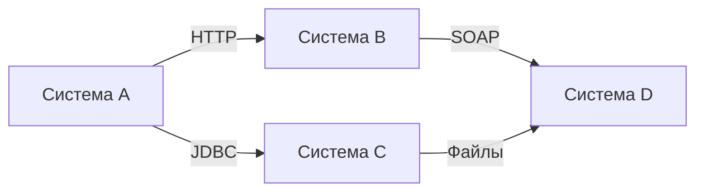
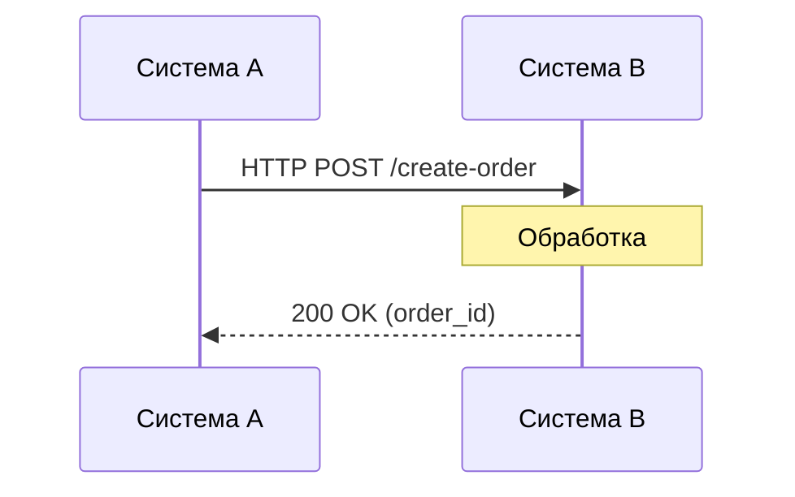
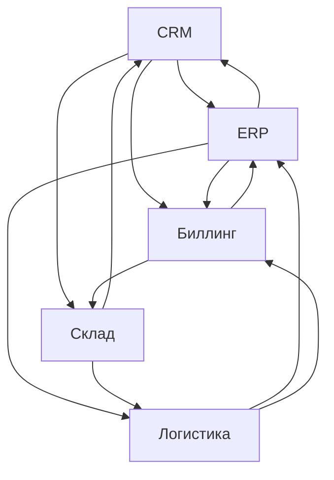
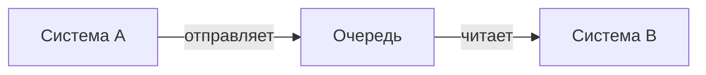
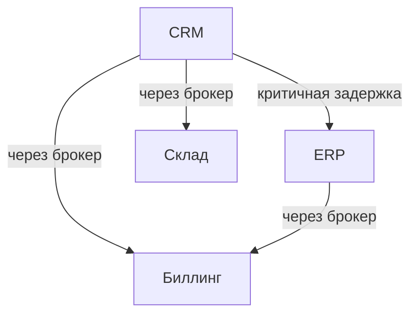

## Введение: Прямой разговор

Представьте, что два человека разговаривают напрямую, без телефона, без секретаря, без мессенджера. Один говорит, другой слушает. Связь прямая, быстрая, но если один ушёл — разговор прервался.

**Точка-точка (Point-to-Point Integration)** — это самый простой способ интеграции систем. Одна система напрямую обращается к другой. Без посредников, без брокеров, без очередей. Система А вызывает API системы Б.

Это архитектурный паттерн, при котором системы соединяются напрямую. Каждая пара систем имеет свой собственный канал связи. В отличие от подхода "через брокер", где все системы подключаются к общему центру, здесь системы общаются один на один.

Для системного аналитика точка-точка — это базовый паттерн интеграции. Простой для понимания, но сложный для масштабирования. Выбор между "точка-точка" и "через брокер" — одно из ключевых архитектурных решений.

## Как это выглядит

**Примеры прямых связей:**

| Связь | Протокол | Пример |
| :--- | :--- | :--- |
| API → API | HTTP/REST | CRM вызывает API платежной системы |
| Приложение → БД | JDBC/ODBC | Сервер приложения напрямую к PostgreSQL |
| Сервис → сервис | gRPC | Микросервис заказов вызывает микросервис пользователей |
| Система → система | Очередь (прямая) | Система A отправляет в очередь, система B читает |

## Простейшая форма: Прямой вызов API

Самый распространённый пример точки-точка — синхронный HTTP запрос.

**Что происходит:**
- Система A знает адрес системы B
- Система A отправляет запрос и ждёт ответа
- Если B не отвечает, A получает ошибку

## Плюсы и минусы

### Плюсы

| Плюс | Объяснение |
| :--- | :--- |
| **Простота** | Нет дополнительных компонентов (брокеров, очередей) |
| **Скорость** | Нет задержек на промежуточном слое |
| **Низкая задержка** | Прямой вызов быстрее, чем через брокер |
| **Простота отладки** | Легко понять, кто кому звонит |
| **Мало движущихся частей** | Меньше точек отказа |

### Минусы

| Минус | Объяснение |
| :--- | :--- |
| **Тесная связанность** | Системы знают друг о друге. Изменение API одной ломает другую |
| **Трудно масштабировать** | При росте числа систем связи растут квадратично |
| **Синхронность** | Вызов блокируется, пока другая система не ответит |
| **Единая точка отказа** | Если B упала, A не может работать |
| **Трудно расширять** | Добавление новой системы требует изменения всех, кто с ней связан |
| **Нет буферизации** | Если B временно недоступна, данные теряются |

## Проблема "Спагетти интеграции"

Когда систем становится много, связи "точка-точка" превращаются в спагетти.

**Что происходит:**
- 5 систем → до 20 связей
- 10 систем → до 90 связей
- 20 систем → до 380 связей

**Формула:** `N*(N-1)` возможных связей.

**Последствия для аналитика:**

| Проблема | Проявление |
| :--- | :--- |
| **Кто с кем связан?** | Нет единой схемы |
| **Где данные?** | Данные дублируются, непонятно, где источник истины |
| **Что сломается при изменении?** | Трудно оценить влияние |
| **Как добавить новую систему?** | Нужно подключать её ко всем |

## Примеры в реальных проектах

### Хороший сценарий: Мало систем, стабильные связи

| Система | Связь |
| :--- | :--- |
| CRM → ERP | Заказы |
| CRM → Биллинг | Платежи |
| ERP → Склад | Остатки |

**Когда это работает:** 3-5 систем, связи редко меняются.

### Плохой сценарий: Много систем, частые изменения

| Система | Связи с... |
| :--- | :--- |
| CRM | 8 систем |
| ERP | 10 систем |
| Биллинг | 6 систем |
| Маркетинг | 5 систем |
| ... | ... |

**Когда это ломается:** Каждое изменение API требует обновления всех связанных систем.

## Асинхронная точка-точка

Не всегда точка-точка означает синхронный HTTP. Можно использовать очередь напрямую.

**Особенности:**

| Характеристика | Синхронная (HTTP) | Асинхронная (очередь) |
| :--- | :--- | :--- |
| **Ожидание ответа** | Да | Нет |
| **Буферизация** | Нет | Да (если B недоступна) |
| **Надёжность** | Низкая | Высокая |
| **Сложность** | Низкая | Средняя |

## Когда выбирать точку-точку

| Условие | Почему |
| :--- | :--- |
| **Мало систем (2-5)** | Проще, чем разворачивать брокер |
| **Связи стабильны** | Не будут часто меняться |
| **Низкая задержка критична** | Прямой вызов быстрее |
| **Синхронность нужна** | Система A должна знать результат сразу |
| **Нет требований к надёжности** | Допустима потеря данных при сбое |
| **Проект небольшой** | Брокер — оверхед |

## Когда точка-точка становится проблемой

| Триггер | Что происходит |
| :--- | :--- |
| **Систем стало >5** | Связи растут квадратично |
| **Часто меняются API** | Каждое изменение требует обновления всех связанных систем |
| **Появились требования к надёжности** | Нет буферизации, при сбое данные теряются |
| **Нужно добавить новую систему** | Придётся подключать её ко всем |
| **Трудно понять картину целиком** | Нет единого центра управления |

**Когда пора переходить на брокер сообщений:** появление 6-й системы или требование надёжности.

## Пример расчёта: Стоимость изменений

**Сценарий:** 10 систем, связанных по принципу точка-точка. Нужно изменить API одной системы.

| Что нужно сделать | Количество работ |
| :--- | :--- |
| Изменить API системы | 1 |
| Обновить всех потребителей | 9 |
| Протестировать каждую связь | 9 |
| Развернуть обновления | 9 |

**Итого:** 1 изменение → 28 работ.

**С брокером сообщений:** изменить API → обновить брокер → остальные системы не трогать.

## Комбинированный подход

Иногда используют гибрид: часть связей точка-точка, часть — через брокер.

**Пример:** 
- CRM → ERP (синхронно, нужна мгновенная проверка остатков)
- CRM → Биллинг (асинхронно, через брокер, некритично)

## Резюме

1. **Точка-точка** — системы общаются напрямую, без посредников. Простейший паттерн интеграции.

2. **Формы:** синхронная (HTTP, gRPC) и асинхронная (прямая очередь).

3. **Плюсы:** простота, скорость, низкая задержка.

4. **Минусы:** тесная связанность, спагетти интеграции, трудно масштабировать, нет буферизации.

5. **Проблема "спагетти":** при N систем число связей растёт как `N*(N-1)`.

6. **Когда выбирать:** мало систем (2-5), стабильные связи, низкая задержка критична.

7. **Когда переходить на брокер:** систем стало >5, частые изменения API, нужна надёжность.