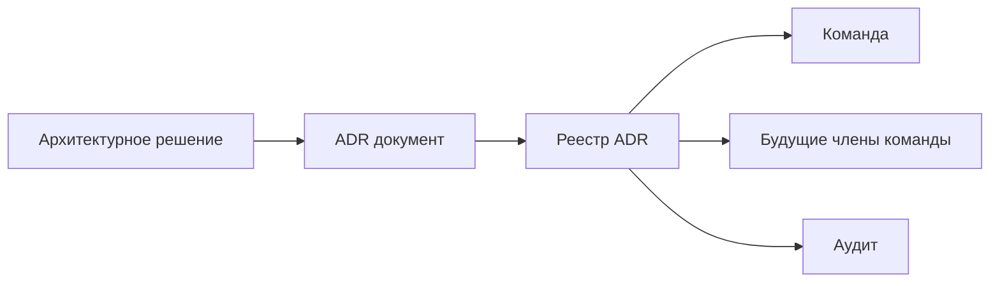

## ADR: как фиксировать архитектурные решения и почему это важно

В любом проекте рано или поздно возникают вопросы: почему мы выбрали PostgreSQL, а не Cassandra? Почему решили делать микросервисы, а не монолит? Почему для обмена сообщениями используем Kafka, а не RabbitMQ? Если эти решения не задокументированы, через полгода в команде новый разработчик спросит: "А почему, собственно, так?" А ответа нет. Или хуже: кто-то решит "улучшить" систему, не зная, какие компромиссы были заложены.

**ADR (Architecture Decision Record)** — это документ, который фиксирует значимое архитектурное решение: его контекст, альтернативы, обоснование и последствия. ADR помогает сохранить знания, избежать "исторических ошибок" и упростить онбординг новых членов команды.

## Что такое ADR и зачем он нужен

**Architecture Decision Record (ADR)** — это короткий текстовый документ (обычно от 0.5 до 2 страниц), описывающий одно архитектурное решение. Каждое решение фиксируется в отдельном файле. Со временем они собираются в реестр (ADR log), по которому можно проследить эволюцию архитектуры.

**ADR отвечает на вопросы:**

- В каком контексте принималось решение? (Какие были требования, ограничения?)
- В чем суть решения? (Что именно решили сделать?)
- Какие альтернативы рассматривались? (Почему не выбрали их?)
- Какие последствия (positive и negative) у решения?
- Кто принимал решение и когда?

**Зачем нужны ADR:**

- **Сохранение контекста.** Через год уже никто не помнит, почему выбрали одну БД вместо другой.
- **Онбординг.** Новый разработчик или аналитик может прочитать ADR и понять логику архитектуры.
- **Предотвращение "велосипедов".** ADR — это напоминание, что альтернативы уже рассматривались.
- **Дисциплина.** Процесс написания ADR заставляет думать о компромиссах и последствиях.
- **Рефлексия.** При пересмотре архитектуры можно вернуться к старым ADR и оценить, правильными ли были решения.



## Формат ADR (стандарт Michael Nygard)

Классический формат ADR (Michael Nygard) состоит из следующих разделов:

- **Title (заголовок).** Краткое название решения, например, "Использовать PostgreSQL для хранения заказов".
- **Status (статус).** Предложено, принято, устарело, заменено.
- **Context (контекст).** Описание ситуации, требований, ограничений, которые требуют принятия решения.
- **Decision (решение).** Какое решение принято (может быть список или просто текст).
- **Alternatives (альтернативы).** Какие другие варианты рассматривались? Почему они не подошли?
- **Consequences (последствия).** Положительные и отрицательные эффекты решения (что становится легче, а что сложнее).

## Пример ADR (для системы заказов)

```markdown
# ADR-001: Выбор базы данных для сервиса заказов

## Status
Принято (2025-01-15)

## Context
Сервис заказов должен хранить заказы и историю их изменений.
Требования:
- 10 000 заказов в секунду в пик (черная пятница).
- Строгая консистентность (нельзя потерять заказ и нельзя дублировать).
- Запросы: 90% по order_id (точечные чтения), 10% по user_id + status.
- Задержка p99 < 100 мс.
- Ожидается рост до 100 000 заказов/сек через 2 года.

Ограничения: команда имеет опыт работы с PostgreSQL и Cassandra.

## Decision
Использовать PostgreSQL в качестве основной базы данных для сервиса заказов.
Для масштабирования записи применить шардирование на уровне приложения (Citus).
Для чтения использовать реплики.

## Alternatives
1. **Cassandra.** Хорошо масштабируется, AP, но не поддерживает транзакции и сложные запросы.
   - Отвергнута, так как нужна строгая консистенция и фильтрация по user_id + status.

2. **CockroachDB.** Распределенная SQL с ACID, но команда не имеет опыта, а лицензия дороже.
   - Отвергнута из-за отсутствия экспертизы и стоимости.

3. **Шардирование PostgreSQL на уровне приложения (current choice).**
   - Принято: знакомый стек, ACID, возможность шардирования через Citus.

## Consequences
### Положительные
- Строгая консистенция для заказов.
- Возможность использовать сложные запросы и JOIN.
- Знакомый стек (PostgreSQL + Citus).

### Отрицательные
- Шардирование добавляет сложность (перебалансировка, ключи шардирования).
- Запросы по user_id+status будут идти во все шарды (fan-out).
- Нагрузка на запись ограничена шардами (но 10k/сек достаточно).
- Нужно проектировать ключ шардирования (скорее всего, order_id, тогда запросы по user_id становятся дорогими).

## Related ADRs
- ADR-002: Выбор стратегии шардирования для PostgreSQL
- ADR-003: Репликация и отказоустойчивость сервиса заказов
```

## Где и как хранить ADR

**Репозиторий кода (рядом с кодом).** Лучшая практика — хранить ADR в папке `docs/adr` в том же репозитории, что и код (или в отдельном репозитории архитектурных решений). Преимущества:

- ADR версионируется вместе с кодом.
- При работе над фичей разработчик видит связанные ADR.
- Можно ссылаться в pull request'ах.

**wiki/Confluence.** Тоже вариант, но у ADR должна быть история изменений. В wiki это сложнее, чем в git.

**Именование:** `NNN-title-with-dashes.md`, где NNN — порядковый номер (ADR-001, ADR-002...). Нумерация глобальная.

**Реестр (log).** Создайте файл `README.md` в папке `adr`, где перечислены все ADR с номерами и заголовками.

## Жизненный цикл ADR


1. **Proposed (предложено).** Решение предложено, но еще не утверждено. Обсуждается в команде.
2. **Accepted (принято).** Решение утверждено (архитектором, командой). Действует.
3. **Deprecated (устарело).** Решение больше не рекомендуется, но пока не заменено.
4. **Superseded (заменено).** Решение заменено другим ADR. В поле "Superseded by" указывается номер нового ADR.

При изменении архитектуры не редактируйте старый ADR (он отражает историю), а создайте новый со статусом "Superseded", указав, какой ADR он заменяет.

## Когда стоит писать ADR

Не каждая мелочь требует ADR. Пишите ADR для решений, которые:

- Имеют долгосрочные последствия (выбор БД, архитектурного стиля, паттерна).
- Обсуждались командой (был спор, несколько альтернатив).
- Могут быть пересмотрены позже.
- Влияют на несколько компонентов системы.
- Нетривиальны (не "используем PostgreSQL для простого CRUD").

**Примеры без ADR:** "Добавили кэш для каталога на Redis". Это тривиально. **Примеры с ADR:** "Выбрали Redis, а не Memcached, из-за поддержки структур данных (Redis Sets для индексации недавних заказов)."

## Как аналитик может участвовать в ADR

Системный аналитик — ключевой стейкхолдер при принятии архитектурных решений. Вы:

- **Поставляете требования (функциональные и не функциональные).** Без них ADR бессмыслен.
- **Задаете контекст:** какие процессы, какие ограничения, кого затронет решение.
- **Участвуете в обсуждении альтернатив:** понимаете бизнес-последствия решения.
- **Документируете ADR (или проверяете качество документации).** Часто ADR пишут разработчики, но аналитик должен проверить, учтены ли все требования.
- **Следите за обратной совместимостью (API, данные).** При изменении архитектуры аналитик обновляет контракты.

## Типичные ошибки при написании ADR

1. **Слишком детализировано (down to implementation).** ADR про выбор PostgreSQL с Citus, а не про параметры `wal_buffers`. Оставьте детали для инженеров.
2. **Отсутствие альтернатив и обоснования.** "Выбрали PostgreSQL, потому что он крутой". Это не ADR.
3. **Отсутствие негативных последствий.** Архитектура — это всегда компромисс. Обязательно напишите, от чего пришлось отказаться.
4. **ADR пишут после реализации.** ADR должен быть написан до или в момент принятия решения. Постфактум люди забывают альтернативы и риски.
5. **ADR живут отдельно от кода.** В корпоративной wiki ADR никто не читает. Храните их в репозитории.

## Примеры плохого и хорошего ADR

**Плохой ADR (бесполезен):**

```markdown
Title: Использовать PostgreSQL.
Status: Accepted
Context: Нужна база данных.
Decision: Используем PostgreSQL.
Alternatives: Нет.
Consequences: Нет.
```

**Хороший ADR:**

```markdown
Title: Использовать PostgreSQL с шардированием (Citus) для сервиса заказов
Status: Accepted
Context: Сервис заказов: 10k записей/сек, строгая консистенция, 90% запросов по order_id, ожидаемый рост 100k/сек.
Decision: PostgreSQL + Citus. Шардирование по order_id (хэш). 16 шардов.
Alternatives:
  - Cassandra: AP, сложные запросы по user_id+status неэффективны.
  - CockroachDB: хороша, но нет опыта в команде.
Consequences:
  + ACID, знакомая команде БД.
  + Возможность сложных запросов.
  - Запросы по user_id идут во все шарды (fan-out).
  - Ключ шардирования (order_id) нельзя менять после создания.
```

## ADR и архитектурная документация

ADR — это не замена всей архитектурной документации, а дополнение. ADR фиксируют *решения*. Вся архитектурная документация (диаграммы C4, контекст, компоненты) описывает *состояние системы*. Они не заменяют, а дополняют друг друга.

- **Архитектурная документация:** как система устроена сейчас (статическая картинка).
- **ADR:** почему система устроена именно так (динамика, история, компромиссы).

## Резюме

ADR — это инструмент для фиксации архитектурных решений. Он помогает сохранить контекст, обосновать выборы и избежать будущих споров.

**Основные элементы ADR:**
- Title (заголовок)
- Status (статус)
- Context (контекст, вызовы)
- Decision (решение)
- Alternatives (альтернативы)
- Consequences (последствия)

**Где хранить:** в репозитории в папке `docs/adr` с именованием `NNN-title.md`.

**Когда писать:** для значимых, спорных, имеющих долгосрочные последствия решений.

**Ошибки:** нет альтернатив, нет негативных последствий, нет контекста.

**Для аналитика:** ADR — это мост между бизнес-требованиями и технической реализацией. Вы отвечаете за качество контекста (требования) и за то, чтобы решение не противоречило нефункциональным ожиданиям (масштабируемость, безопасность). Участвуйте в создании ADR, а не только читайте их. Это поднимет уровень всей команды.