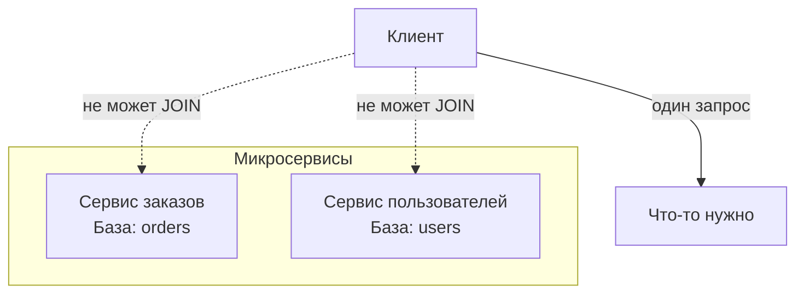
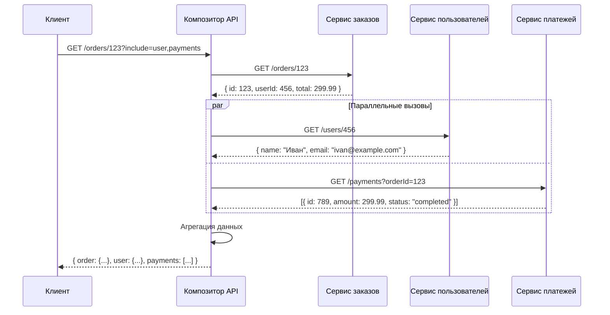
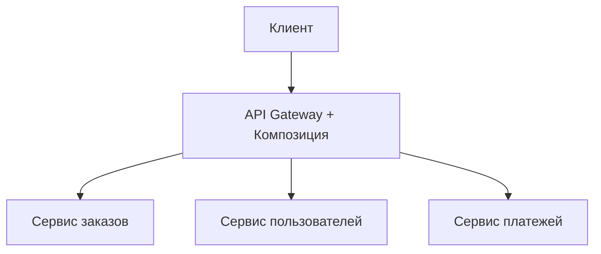
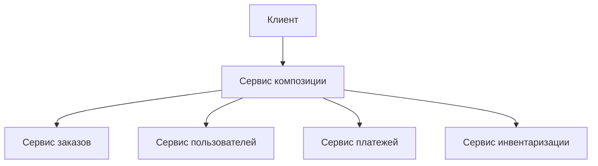
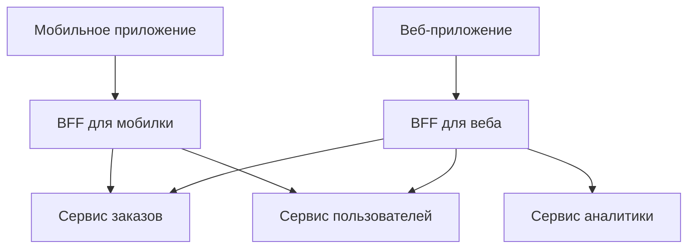
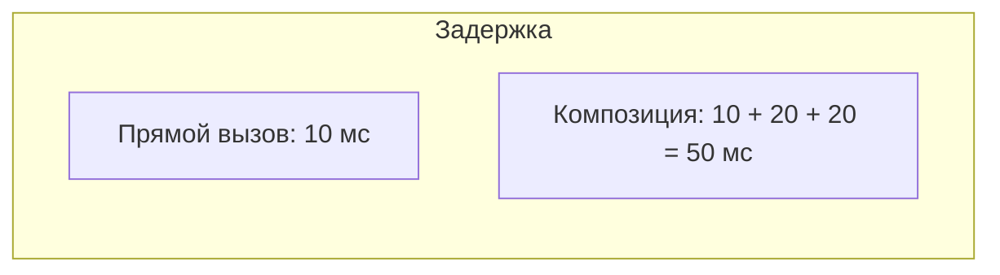
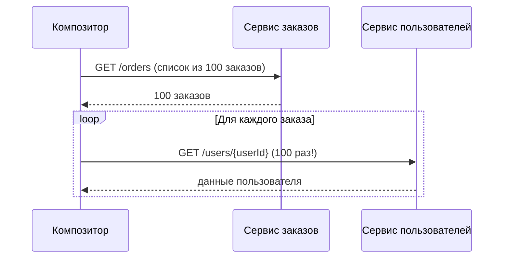
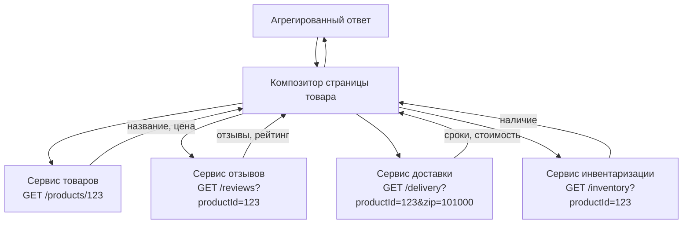

## Введение: Собираем пазл из чужих деталей

Представьте, что вам нужно получить информацию о заказе и о пользователе, который этот заказ сделал. В монолите вы пишете один SQL-запрос с JOIN между таблицей заказов и таблицей пользователей. Все просто.

В микросервисной архитектуре данные о заказах хранятся в одном сервисе, а данные о пользователях — в другом. Базы данных у них разные, JOIN сделать нельзя. Как получить заказ вместе с данными пользователя?

**API Composition (Композиция API)** — это паттерн, который решает эту проблему. Вместо одного запроса к базе данных вы делаете несколько запросов к разным сервисам, а затем собираете (композируете) результаты в один ответ. Есть специальный компонент — композитор (composer) — который знает, какие сервисы вызывать и как объединить их ответы.

API Composition — это простейший способ получить данные из нескольких микросервисов. Он не требует сложной инфраструктуры, не требует eventual consistency. Но у него есть недостатки: увеличивается задержка (несколько сетевых вызовов вместо одного), и композитор становится точкой, знающей о структуре данных многих сервисов.

## Проблема, которую решает API Composition

В монолите с одной базой данных получение агрегированных данных — это один запрос:

```sql
SELECT orders.*, users.name, users.email
FROM orders
JOIN users ON orders.user_id = users.id
WHERE orders.id = 123;
```

В микросервисах данные разнесены:

- Сервис заказов имеет свою базу данных с таблицей orders
- Сервис пользователей имеет свою базу данных с таблицей users
- Нет общей базы данных, нет возможности сделать JOIN

Клиент (мобильное приложение, веб-интерфейс) хочет получить заказ вместе с именем и email пользователя. Как это сделать?



Есть три варианта:

1. Клиент сам делает два запроса (сначала в сервис заказов, потом в сервис пользователей) и собирает данные. Но клиент (мобильное приложение) не должен знать о внутренней архитектуре. Плюс, несколько запросов от клиента = больше трафика, больше задержек.

2. Сервис заказов хранит копию данных пользователя (денормализация). Но тогда нужно синхронизировать данные при изменении пользователя.

3. **API Composition** — создается специальный компонент (композитор), который делает запросы к нужным сервисам и собирает ответ.

## Как работает API Composition



**Шаг 1.** Клиент отправляет запрос к композитору. В запросе может быть указано, какие данные нужны (include=user,payments).

**Шаг 2.** Композитор вызывает сервис заказов, получает базовые данные о заказе. Из ответа извлекает userId.

**Шаг 3.** Композитор вызывает сервис пользователей (чтобы получить имя и email) и сервис платежей (чтобы получить историю платежей). Эти вызовы можно делать параллельно, чтобы сократить общее время.

**Шаг 4.** Композитор собирает данные из всех ответов в одну структуру и возвращает клиенту.

Клиент получает один ответ, как будто это монолит. Клиент не знает, что данные пришли из трех разных сервисов.

## Где живет композитор

Композитор может быть реализован на разных уровнях архитектуры.

**API Gateway как композитор.** API Gateway — это единая точка входа для всех клиентов. Он может не только маршрутизировать запросы, но и агрегировать данные из нескольких сервисов. Это хорошее место для простой композиции.



**Специальный сервис-композитор.** Для сложной композиции (с логикой, трансформациями, разными источниками) лучше выделить отдельный сервис. Он может быть "толстым" — содержать бизнес-логику агрегации.



**Backend for Frontend (BFF).** Если у вас несколько клиентов (мобильное приложение, веб-приложение, API для партнеров), у каждого могут быть свои требования к данным. BFF — это сервис-композитор, специфичный для конкретного клиента. Мобильный BFF может агрегировать одни данные, веб- BFF — другие.



**Клиентская композиция.** Самый простой, но часто плохой вариант — клиент сам делает несколько запросов. Подходит только для внутренних инструментов с одним разработчиком, не для production.

## Преимущества API Composition

**Простота.** Паттерн легко понять и реализовать. Нет сложной инфраструктуры, нет eventual consistency, нет распределенных транзакций. Просто вызываете сервисы и собираете ответы.

**Синхронность.** Клиент получает ответ сразу, с полными данными. Нет задержек на асинхронную обработку.

**Гибкость.** Композитор может решать, какие сервисы вызывать в зависимости от запроса. Например, если клиент не запросил платежи, можно не вызывать сервис платежей.

**Независимость сервисов.** Сервисы не знают о композиторе. Они просто предоставляют свои API. Композитор — это отдельный компонент, который можно менять независимо.

## Недостатки и сложности API Composition

### Увеличенная задержка (latency)

Вместо одного вызова (клиент → сервис заказов) получается цепочка: клиент → композитор → сервис заказов → сервис пользователей → сервис платежей → композитор → клиент. Каждый сетевой вызов добавляет миллисекунды или десятки миллисекунд.



Как смягчить:

- Делать вызовы к сервисам параллельно, а не последовательно
- Кэшировать ответы сервисов (особенно редко меняющиеся данные, как имя пользователя)
- Использовать быстрые протоколы (gRPC вместо HTTP/JSON)

### Дополнительная точка отказа

Композитор становится новым компонентом в системе. Если композитор упал, клиенты не могут получить агрегированные данные. Нужно обеспечивать отказоустойчивость композитора (несколько реплик, мониторинг).

### Сложность обработки частичных отказов

Что делать, если сервис пользователей ответил ошибкой, а сервис заказов — успешно? Варианты:

- Вернуть клиенту ошибку (все или ничего)
- Вернуть частичные данные (заказ есть, пользователя нет — показать "неизвестный пользователь")
- Использовать fallback (кэшированную копию данных пользователя)

Выбор зависит от бизнес-требований.

### Композитор знает слишком много

Композитор должен знать:

- Какие сервисы существуют
- Какие API у этих сервисов
- Как связаны данные (order.userId → нужно вызвать сервис пользователей)
- Как объединять данные из разных ответов

Это создает скрытую связность. Если изменится API сервиса пользователей, композитор тоже придется менять.

### N+1 проблема

Классическая проблема. Композитор получает список из N объектов (например, список заказов). Для каждого объекта нужно вызвать другой сервис (например, чтобы получить имя пользователя). Получается 1 + N вызовов.



Решения:

- **Batch API.** Сервис пользователей должен предоставлять API для получения нескольких пользователей за раз: GET /users?ids=1,2,3. Тогда будет 1 вызов вместо N.
- **Денормализация.** Сервис заказов хранит копию имени пользователя. Не нужно вызывать сервис пользователей.
- **GraphQL.** Клиент (или композитор) может запросить именно те поля, которые нужны, и сервер может оптимизировать загрузку.

## API Composition vs другие паттерны

| Паттерн | Механизм | Консистентность | Задержка | Сложность |
| :--- | :--- | :--- | :--- | :--- |
| **API Composition** | Синхронные вызовы + агрегация | Строгая (моментальная) | Высокая (N вызовов) | Низкая |
| **CQRS с read models** | Асинхронное обновление read models | Eventual | Низкая (один запрос к read model) | Высокая |
| **Event Sourcing** | Хранение событий, материализация состояний | Eventual | Средняя | Очень высокая |
| **Denormalization (копирование данных)** | Сервис хранит копию чужих данных | Eventual (нужна синхронизация) | Низкая (нет лишних вызовов) | Средняя |

**Выбирайте API Composition, когда:**

- Нужна строгая консистентность (данные должны быть актуальными на момент запроса)
- Объем данных не очень большой (не нужно агрегировать тысячи объектов)
- Задержка в десятки-сотни миллисекунд приемлема
- Не хотите усложнять архитектуру eventual consistency

**Выбирайте CQRS / read models, когда:**

- Данные обновляются редко, но читаются часто
- Нужна высокая производительность чтения
- Готовы к eventual consistency

## Реальный пример: E-commerce агрегатор

Представьте сервис, который показывает страницу товара: название, цена, отзывы, информация о доставке, наличие на складе.

Данные живут в разных сервисах:

- Сервис товаров: название, описание, цена
- Сервис отзывов: список отзывов, рейтинг
- Сервис доставки: сроки, стоимость доставки
- Сервис инвентаризации: наличие на складе



Композитор:

1. Параллельно вызывает 4 сервиса
2. Ждет ответы (самый медленный определяет общее время)
3. Агрегирует в один JSON
4. Возвращает клиенту

Если какой-то сервис недоступен, композитор может вернуть частичные данные (например, показать товар, но без отзывов).

## Когда API Composition — правильный выбор

- **Запросы, требующие агрегации из нескольких сервисов.** Это основное применение паттерна.

- **Нужна строгая консистентность.** Данные должны быть актуальными на момент запроса. Eventual consistency не подходит.

- **Объем агрегируемых данных небольшой.** Не нужно собирать тысячи объектов и делать N+1 запросов.

- **Команда не готова к сложности CQRS/Event Sourcing.** API Composition проще реализовать и понять.

- **Скорость разработки важнее микрооптимизации производительности.** API Composition — быстрое решение.

## Когда API Composition — плохой выбор

- **Очень высокая нагрузка и требования к низкой задержке.** Каждый дополнительный вызов увеличивает задержку. Для систем, где важны миллисекунды, API Composition может не подойти.

- **Агрегация больших объемов данных.** Например, нужно получить 1000 заказов и для каждого подтянуть данные пользователя. Без batch API будет 1001 вызов — слишком много.

- **Сервисы с разной доступностью.** Если один из сервисов часто падает, композитор будет часто возвращать ошибки или неполные данные.

- **Данные часто меняются, и их нужно много раз агрегировать.** В этом случае лучше построить read model (CQRS), которая будет уже содержать агрегированные данные.

## API Composition в экосистеме

API Composition часто используется вместе с:

**API Gateway.** В простых случаях API Gateway может выполнять роль композитора. Это снижает количество компонентов.

**GraphQL.** GraphQL — это язык запросов, который позволяет клиенту запрашивать именно те данные, которые нужны, в одной иерархической структуре. GraphQL сервер по сути является композитором, который вызывает нужные сервисы (resolvers). GraphQL решает многие проблемы API Composition (гибкость, batch requests).

**Backend for Frontend (BFF).** BFF — это специализированный композитор для конкретного клиента. Мобильное приложение и веб-приложение могут иметь разные BFF с разной логикой агрегации.

## Резюме

API Composition — это паттерн для получения агрегированных данных из нескольких микросервисов. Специальный компонент (композитор) делает запросы к нужным сервисам и собирает результаты в один ответ.

Как работает:

1. Клиент запрашивает агрегированные данные
2. Композитор вызывает нужные сервисы (часто параллельно)
3. Композитор объединяет ответы
4. Композитор возвращает единый ответ клиенту

Преимущества:

- Простота реализации
- Строгая консистентность (данные актуальны на момент запроса)
- Независимость сервисов (они не знают о композиторе)

Недостатки:

- Увеличенная задержка (несколько сетевых вызовов)
- Дополнительная точка отказа
- Композитор знает структуру данных многих сервисов
- Потенциальная проблема N+1 при агрегации списков

Где живет композитор:

- API Gateway (для простой композиции)
- Отдельный сервис композиции (для сложной логики)
- Backend for Frontend (для специфичных клиентов)
- GraphQL сервер (современный подход)

API Composition — это самый простой способ решить проблему агрегации данных в микросервисах. Он не требует eventual consistency, сложной инфраструктуры или распределенных транзакций. Но плата за это — увеличенная задержка и то, что композитор знает "слишком много".

Выбирайте API Composition, когда нужна строгая консистентность, объем данных не очень большой, а команда не готова к сложности CQRS. Для высоконагруженных систем с требованиями к низкой задержке рассмотрите CQRS с read models или денормализацию данных.