## Введение: Перегородки на корабле

Представьте большой корабль. Если в одном отсеке пробоина, вода затапливает только его. Остальные отсеки остаются сухими, и корабль продолжает плыть. Это принцип **bulkhead** (переборка) — разделение корабля на водонепроницаемые отсеки.

В программной архитектуре происходит то же самое. Если один компонент системы начинает потреблять все ресурсы (CPU, память, потоки, соединения), он не должен "затопить" всю систему. Падение или перегрузка одного модуля не должны убивать остальные.

**Bulkhead Pattern** — это паттерн, который изолирует компоненты системы друг от друга, выделяя каждому свои ресурсы (пулы потоков, соединения, память). Если один компонент выходит из строя или перегружается, ресурсы других компонентов остаются нетронутыми, и они продолжают работать.

Bulkhead — это один из ключевых паттернов для построения отказоустойчивых систем, особенно в микросервисной архитектуре. Он помогает предотвратить каскадные отказы (когда один сбой тянет за собой другие).

## Проблема, которую решает Bulkhead

В системе без изоляции все компоненты делят одни и те же ресурсы: пул потоков приложения, соединения с базой данных, память.

Что происходит при перегрузке одного компонента:

- Компонент А начинает обрабатывать много запросов (например, из-за DDOS-атаки или внезапного пика)
- Он занимает все потоки в общем пуле
- Компонент Б, которому нужны потоки для своей работы, не может их получить
- Компонент Б начинает тормозить или падать по таймауту
- Ошибка распространяется дальше

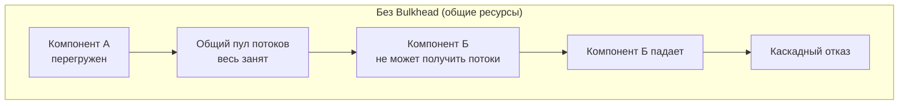

Это называется "шумный сосед" (noisy neighbor). Один компонент создает шум и мешает всем остальным.

Bulkhead решает эту проблему, выделяя каждому компоненту (или группе компонентов) свои ресурсы. Компонент А имеет свой пул потоков, компонент Б — свой. Если А перегружен, он заполняет только свой пул. Б продолжает работать в своем пуле.

## Как работает Bulkhead

**Физический Bulkhead** — разделение на уровне инфраструктуры. Разные сервисы работают на разных серверах или в разных контейнерах с выделенными CPU/памятью.

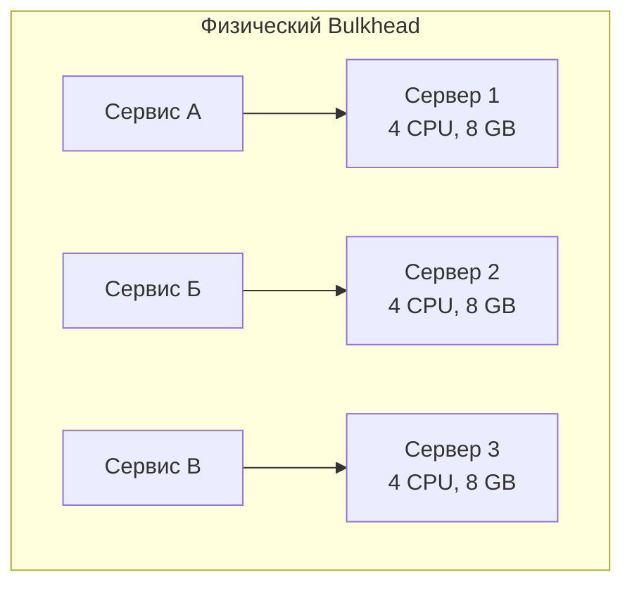

**Логический Bulkhead** — разделение на уровне процессов/потоков внутри одного приложения. Разные компоненты используют разные пулы потоков.

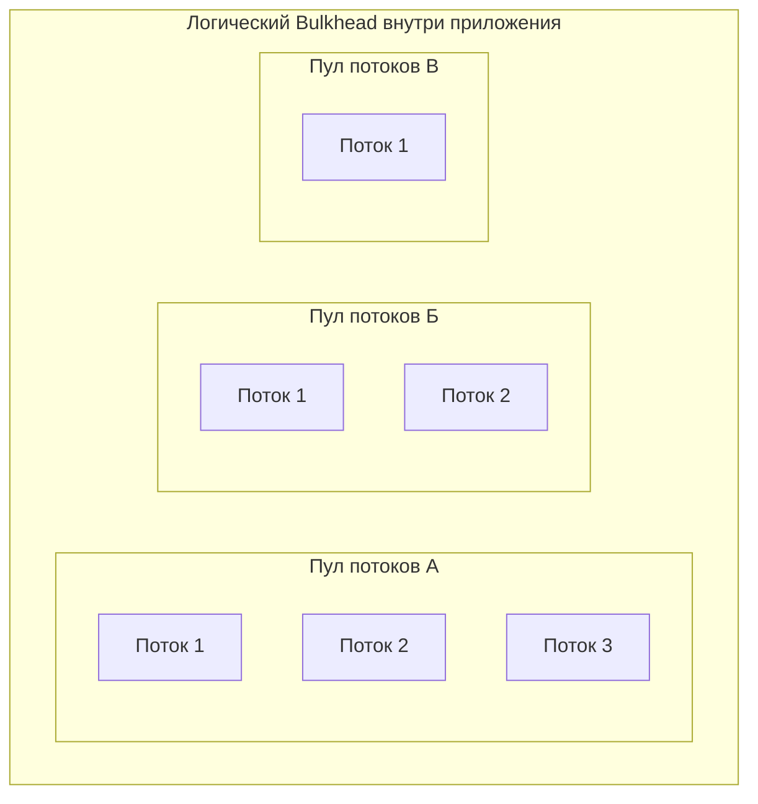

**Bulkhead на уровне соединений.** Отдельные пулы соединений для разных сервисов (база данных, внешние API). Если один сервис начинает тормозить, его пул соединений заполняется, но другие пулы остаются свободными.

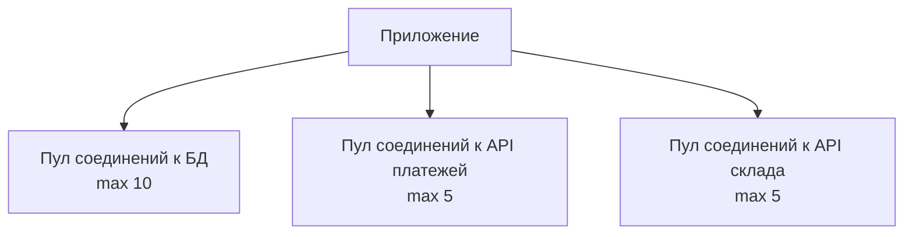

## Пример: Веб-приложение с разными типами запросов

Представьте веб-приложение, которое обрабатывает два типа запросов:

- **CRUD-операции** (быстрые, 10 мс, мало ресурсов)
- **Отчеты** (медленные, 5 секунд, много CPU)

Если у вас один общий пул потоков, один медленный отчет может занять все потоки. CRUD-запросы будут ждать, пока освободится поток. Пользователи увидят задержки.

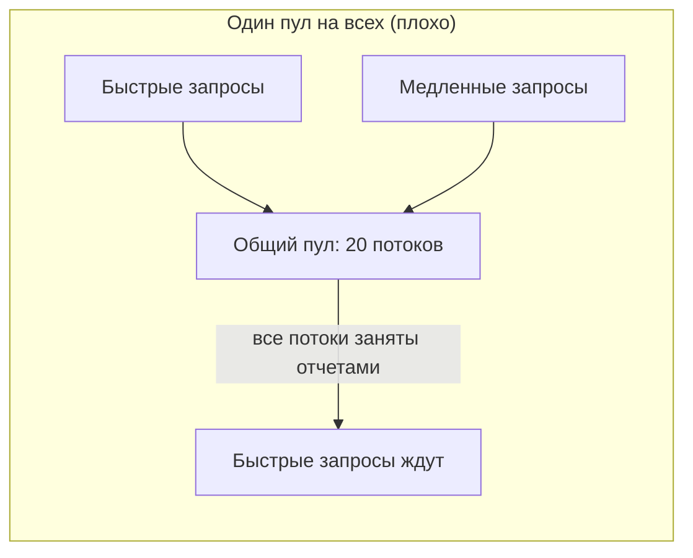

Решение: выделить разные пулы для разных типов запросов.

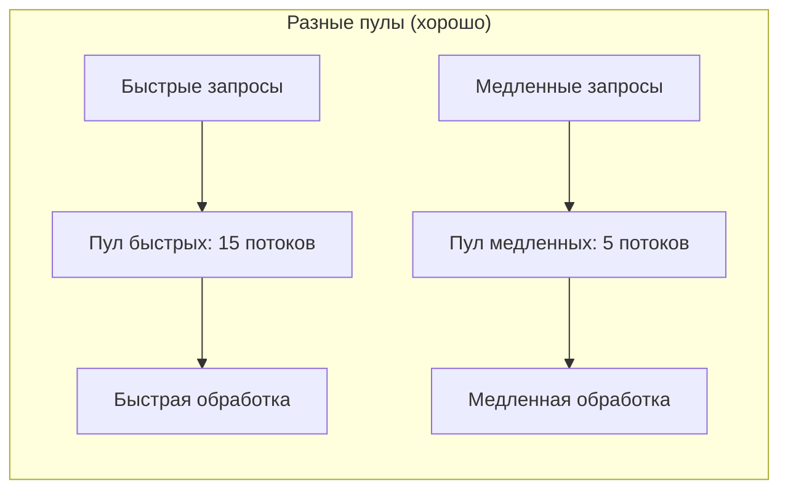

Медленные отчеты могут занять все 5 потоков своего пула, но быстрые CRUD-операции продолжают работать в своем пуле из 15 потоков.

## Пример: Микросервисы и внешние зависимости

Микросервис вызывает несколько внешних API:

- API платежей (надежный, быстрый)
- API доставки (медленный, часто тормозит)
- API погоды (внешний, ненадежный)

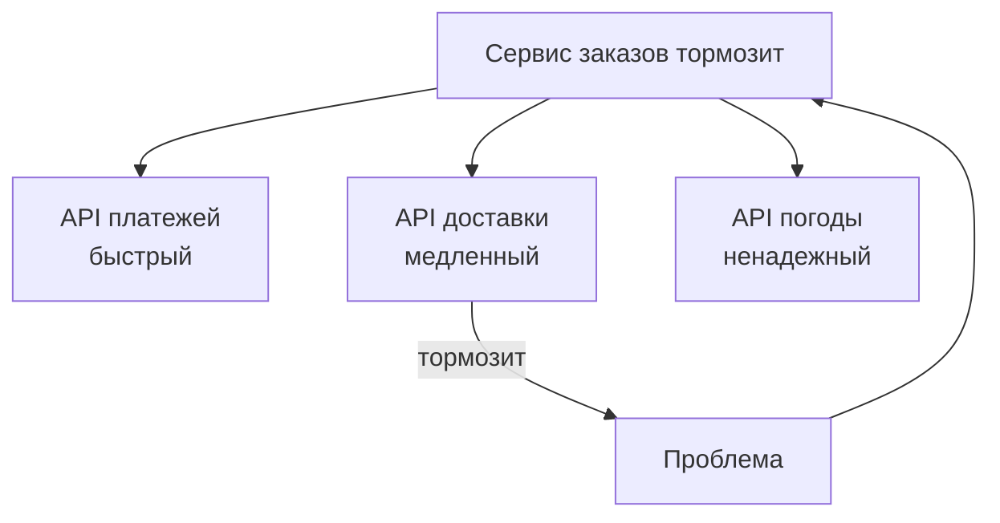

Если API доставки начинает тормозить (ответ через 30 секунд), он может занять все соединения в общем пуле. Запросы к API платежей (которые могли бы отработать быстро) будут ждать, пока освободится соединение.

Решение: выделить отдельные пулы соединений для каждого внешнего API.

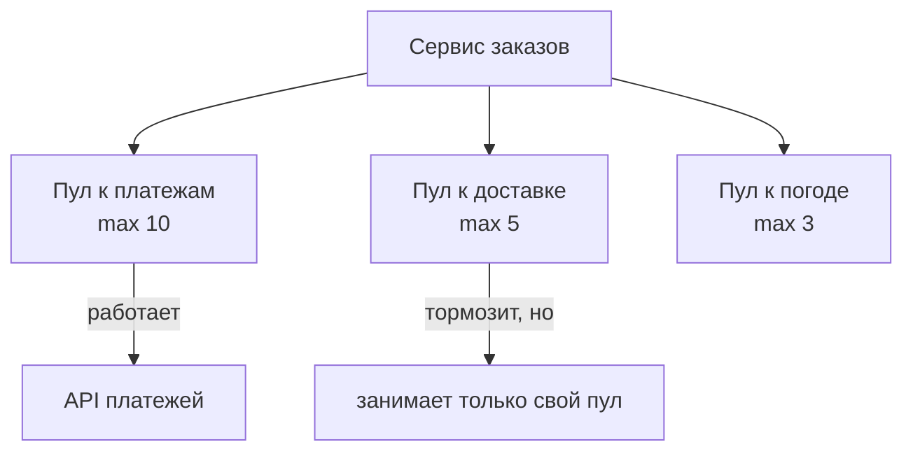

API доставки может занять все 5 соединений своего пула, но API платежей продолжает работать через свой пул из 10 соединений.

## Реализация Bulkhead на практике

### На уровне потоков (Thread pool bulkhead)

В приложениях на Java (Spring) можно настроить отдельные пулы потоков для разных задач.

```java
// Пример на Spring с @Async
@Configuration
public class ThreadPoolConfig {
    
    @Bean(name = "fastPool")
    public Executor fastPool() {
        return Executors.newFixedThreadPool(15);
    }
    
    @Bean(name = "slowPool")
    public Executor slowPool() {
        return Executors.newFixedThreadPool(5);
    }
}

@Service
public class OrderService {
    
    @Async("fastPool")
    public CompletableFuture<Order> getOrder(Long id) {
        // быстрый CRUD
    }
    
    @Async("slowPool")
    public CompletableFuture<Report> generateReport() {
        // медленный отчет
    }
}
```

### На уровне пулов соединений (Connection pool bulkhead)

В приложениях, работающих с базами данных или внешними API, настраиваются отдельные пулы соединений.

```yaml
# Настройка HikariCP (Java)
datasource:
  primary:
    maximum-pool-size: 20  # пул для основной БД
  reporting:
    maximum-pool-size: 5   # пул для БД отчетов (медленные запросы)
  cache:
    maximum-pool-size: 10  # пул для кэша (Redis)
```

### На уровне процессов (Process bulkhead)

В микросервисной архитектуре разные сервисы работают в разных контейнерах/серверах с выделенными ресурсами (CPU, память). Это самый сильный вид изоляции.

```yaml
# Kubernetes: лимиты ресурсов для разных сервисов
apiVersion: v1
kind: Pod
spec:
  containers:
  - name: orders-service
    resources:
      requests:
        memory: "512Mi"
        cpu: "500m"
      limits:
        memory: "1Gi"
        cpu: "1000m"
  - name: reports-service
    resources:
      requests:
        memory: "256Mi"
        cpu: "250m"
      limits:
        memory: "512Mi"
        cpu: "500m"
```

### На уровне очередей (Queue-based bulkhead)

Использование отдельных очередей для разных типов задач. Если одна очередь переполняется, другие продолжают работать.

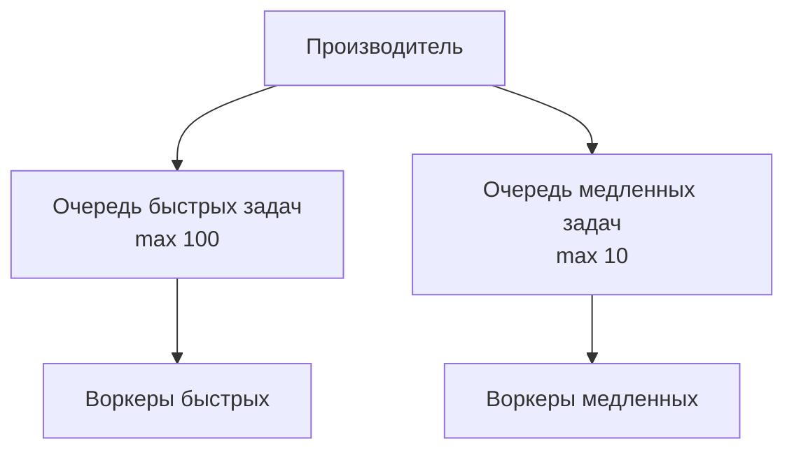

## Bulkhead vs Circuit Breaker

Эти паттерны часто путают, но они решают разные проблемы.

| Аспект | Bulkhead | Circuit Breaker |
| :--- | :--- | :--- |
| **Что делает** | Изолирует ресурсы, чтобы перегрузка одного компонента не влияла на другие | Останавливает вызовы к проблемному компоненту, чтобы дать ему время восстановиться |
| **Когда срабатывает** | Всегда (ресурсы выделены заранее) | При обнаружении ошибок (таймауты, отказы) |
| **Механизм** | Разделение пулов потоков/соединений | Отслеживание ошибок, размыкание цепи |
| **Цель** | Предотвратить "шумного соседа" | Предотвратить каскадные отказы |

Эти паттерны часто используют вместе. Bulkhead изолирует ресурсы для разных вызовов. Circuit Breaker останавливает вызовы к проблемному сервису.

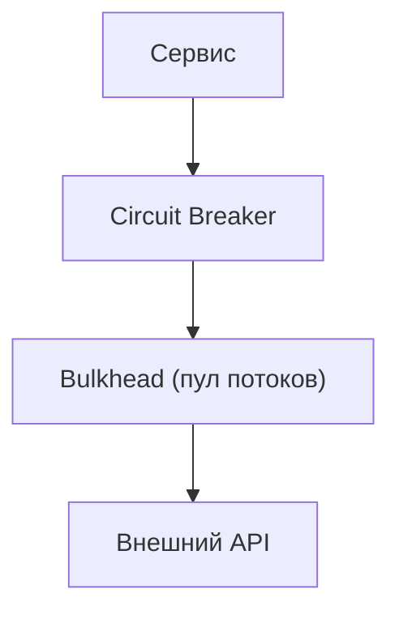

## Преимущества Bulkhead

**Изоляция отказов.** Если один компонент падает или перегружается, другие компоненты продолжают работать. Система деградирует gracefully.

**Предсказуемость.** Зная, сколько ресурсов выделено каждому компоненту, можно предсказать, как система будет вести себя под нагрузкой.

**Защита от "шумного соседа".** Один арендатор (клиент, компонент) не может забрать все ресурсы.

**Улучшенная отказоустойчивость.** Система может продолжать работу даже при частичных отказах.

## Недостатки и сложности Bulkhead

**Сложность конфигурации.** Нужно определить, сколько ресурсов выделить каждому компоненту. Слишком мало — компонент будет тормозить даже при нормальной нагрузке. Слишком много — ресурсы простаивают.

**Неэффективное использование ресурсов.** Если одни компоненты недогружены, а другие перегружены, вы не можете "перекинуть" ресурсы. Потоки из пула А не могут помочь пулу Б.

**Дополнительная сложность кода.** Настройка отдельных пулов, мониторинг, алерты — все это добавляет complexity.

**Трудно определить границы.** Что считать "компонентом"? Где провести границы изоляции? Неправильный выбор может сделать паттерн бесполезным.

## Когда Bulkhead — правильный выбор

- **Разные типы запросов с разными характеристиками.** Быстрые и медленные, легкие и тяжелые. Вы не хотите, чтобы тяжелые запросы "убивали" быстрые.

- **Разные внешние сервисы с разной надежностью.** Один сервис может тормозить или падать. Вы не хотите, чтобы его проблемы влияли на другие интеграции.

- **Мультитенантные системы.** Разные клиенты (арендаторы) используют одну систему. Вы не хотите, чтобы один "шумный" клиент забирал все ресурсы.

- **Критичные и некритичные функции.** Аутентификация (критична) и аналитика (не критична) должны быть изолированы. Если аналитика перегружена, аутентификация должна работать.

- **Системы с гарантиями SLA.** Вы обещали клиентам определенную производительность. Bulkhead помогает изолировать ресурсы и выполнить обещания.

## Когда Bulkhead не нужен

- **Простая система с одним типом запросов.** Если у вас один тип нагрузки, изоляция не нужна.

- **Система с очень низкой нагрузкой.** Ресурсов с запасом, проблемы "шумного соседа" не возникают.

- **Монолит с предсказуемой нагрузкой.** Если вы точно знаете профиль нагрузки, можно просто выделить достаточно ресурсов.

- **Команда не имеет опыта.** Неправильная настройка bulkhead может сделать систему хуже, чем была.

## Реальный пример: Платформа для онлайн-обучения

Представьте платформу с тремя типами пользователей:

- **Студенты** смотрят видео, проходят тесты (тысячи одновременных пользователей, легкие запросы)
- **Преподаватели** загружают материалы, проверяют работы (сотни пользователей, средняя нагрузка)
- **Администраторы** генерируют отчеты, управляют пользователями (единицы пользователей, но тяжелые запросы)

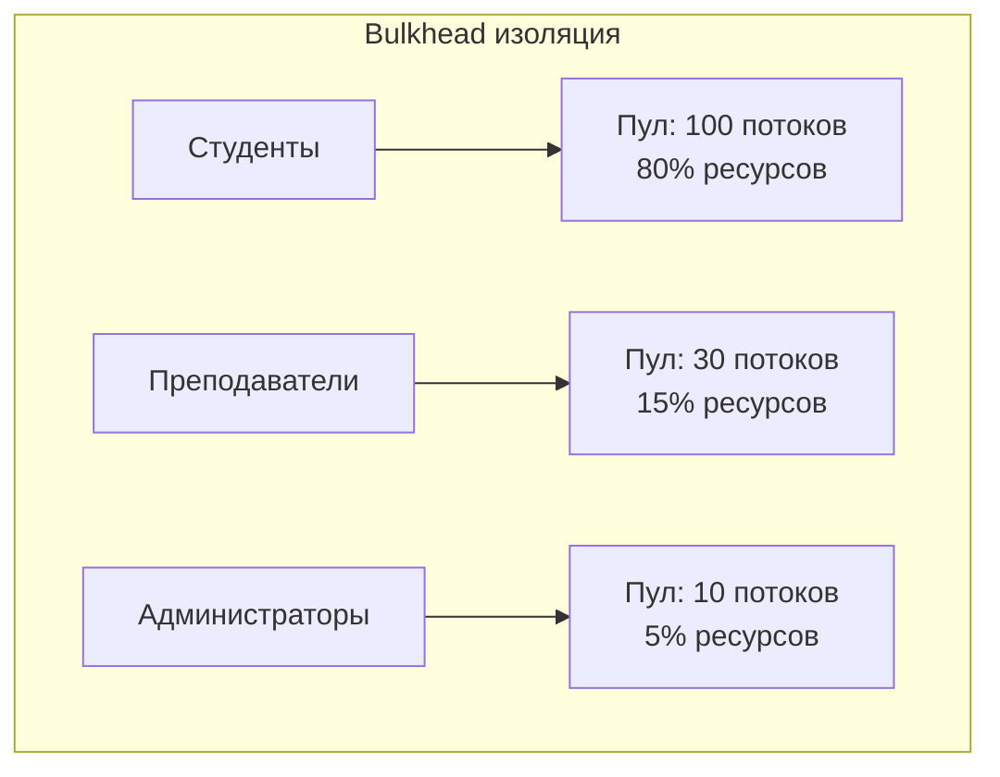

Администратор может запустить тяжелый отчет, который займет все 10 потоков своего пула. Но студенты и преподаватели не пострадают — у них свои пулы.

## Bulkhead и микросервисы

В микросервисной архитектуре bulkhead применяется на нескольких уровнях:

**Уровень сервисов.** Каждый микросервис работает в своем контейнере с выделенными CPU/памятью (физический bulkhead). Падение одного сервиса не убивает другие.

**Уровень вызовов.** Внутри сервиса вызовы к разным внешним сервисам имеют разные пулы соединений (логический bulkhead).

**Уровень клиентов.** Если сервис обслуживает разных клиентов (мобильное приложение, веб-приложение, API для партнеров), можно выделить им разные пулы.

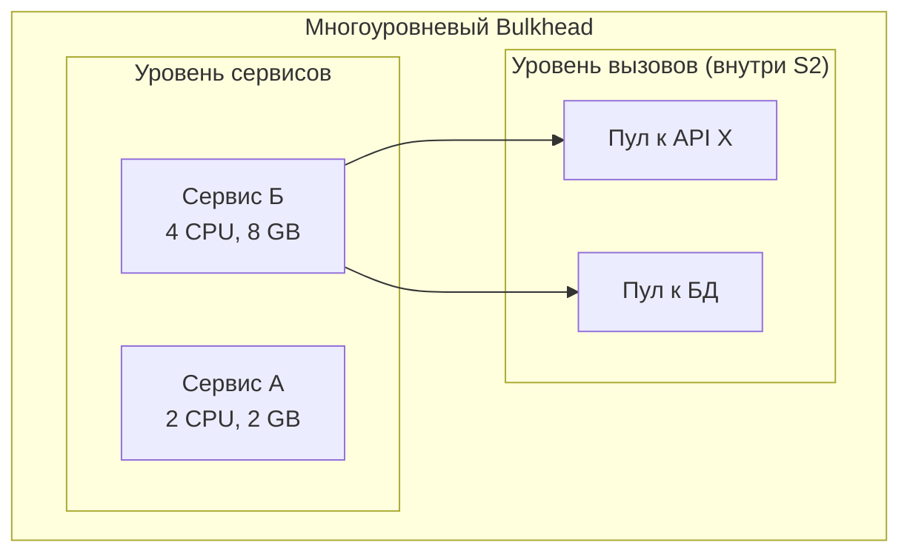

## Резюме

Bulkhead Pattern — это паттерн изоляции ресурсов, который предотвращает каскадные отказы и защищает систему от "шумных соседей".

**Как работает:**

- Разделение ресурсов (пулы потоков, соединений, память, CPU) между компонентами
- Каждый компонент имеет свои выделенные ресурсы
- Перегрузка одного компонента не влияет на другие

**Формы реализации:**

- **Физический bulkhead** — разные серверы/контейнеры с разными ресурсами
- **Логический bulkhead** — разные пулы потоков внутри одного приложения
- **Connection pool bulkhead** — разные пулы соединений для разных внешних сервисов
- **Queue-based bulkhead** — разные очереди для разных типов задач

**Преимущества:**

- Изоляция отказов (один компонент падает — другие работают)
- Защита от "шумного соседа"
- Предсказуемость поведения под нагрузкой

**Недостатки:**

- Сложность конфигурации (сколько ресурсов выделить?)
- Неэффективное использование ресурсов (простаивающие ресурсы нельзя перекинуть)
- Дополнительная сложность кода

**Когда использовать:**

- Разные типы запросов (быстрые и медленные, легкие и тяжелые)
- Разные внешние сервисы с разной надежностью
- Мультитенантные системы (несколько клиентов)
- Критичные и некритичные функции в одной системе
- Системы с гарантиями SLA

Bulkhead — это не панацея, а инструмент. Он добавляет сложность, но спасает от каскадных отказов в распределенных системах. Используйте его там, где изоляция критична (разные типы нагрузки, разные клиенты, разные внешние сервисы). Для простых систем с однородной нагрузкой bulkhead может быть избыточным.

Часто bulkhead используют вместе с Circuit Breaker: первый изолирует ресурсы, второй останавливает вызовы к проблемным компонентам. Вместе они создают надежную, отказоустойчивую систему.