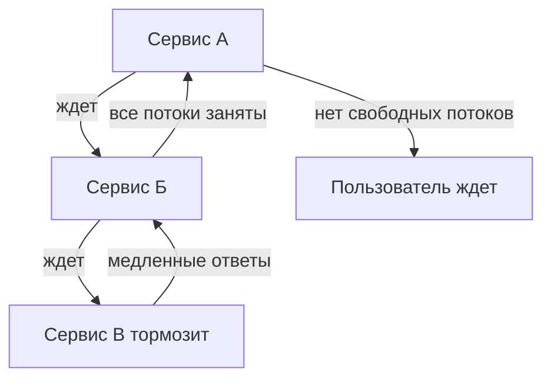
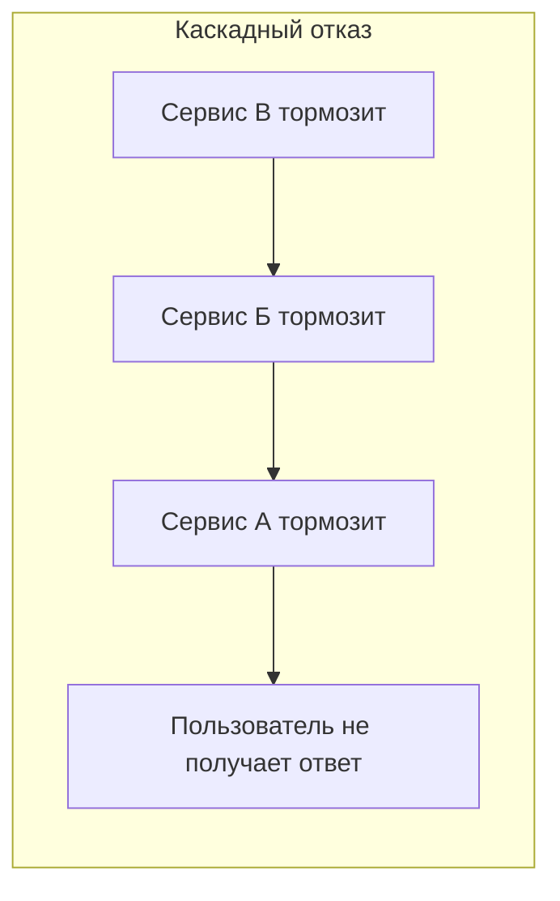
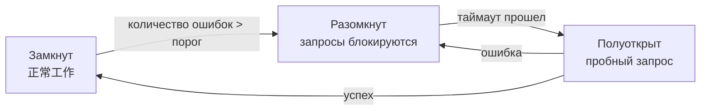
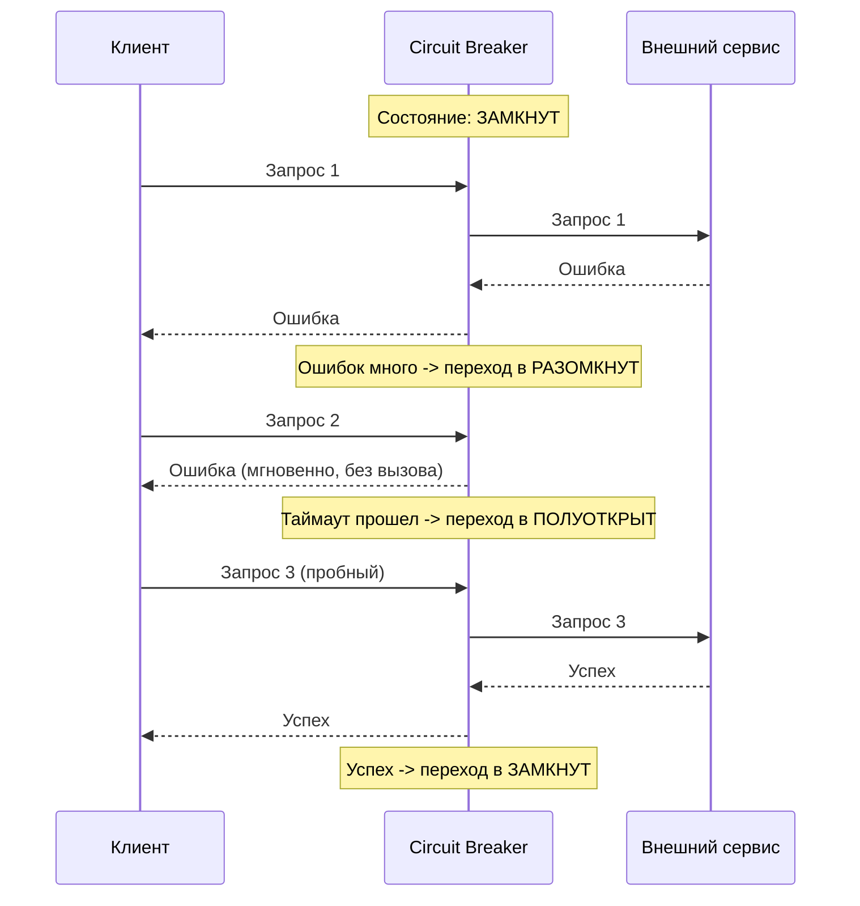
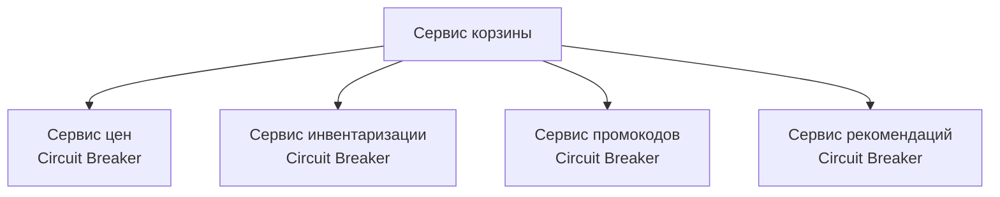
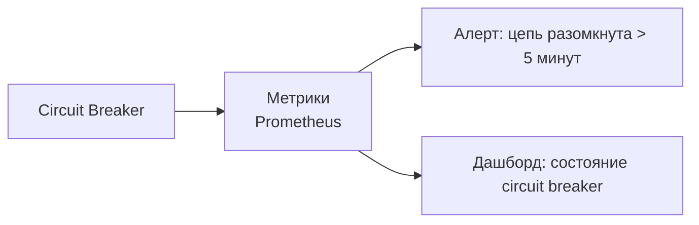

## Введение: Предохранитель в электрической цепи

Представьте электрическую цепь в доме. Если ток становится слишком сильным, предохранитель "выбивает" — размыкает цепь, чтобы проводка не сгорела и дом не загорелся. Через некоторое время вы можете включить предохранитель обратно, и если проблема устранена, все работает.

**Circuit Breaker Pattern** (паттерн "Предохранитель") делает то же самое в программной архитектуре. Если вызовы к внешнему сервису начинают часто падать или слишком долго выполняться, circuit breaker "размыкает цепь" — перестает отправлять запросы к проблемному сервису. Вместо этого он сразу возвращает ошибку (или fallback-ответ), давая сервису время восстановиться. Через некоторое время circuit breaker пробует снова отправить запрос, и если сервис заработал — "замыкает цепь" обратно.

Circuit Breaker — это критически важный паттерн для распределенных систем (микросервисы). Он предотвращает каскадные отказы, когда один медленный или падающий сервис "тянет за собой" все сервисы, которые от него зависят. Без circuit breaker система может "упасть" полностью из-за одной проблемы в одном компоненте.

## Проблема, которую решает Circuit Breaker

В распределенной системе сервисы вызывают друг друга. Сервис А вызывает Б, Б вызывает В. Что происходит, если сервис В начинает тормозить (отвечает через 30 секунд вместо 100 мс)?



**Каскадный отказ (cascading failure):**

1. Сервис В начинает тормозить. Его запросы занимают 30 секунд вместо 100 мс.
2. В сервисе Б пул потоков, выделенный для вызовов к В, заполняется ожидающими запросами. Новые запросы от А начинают ждать или падать по таймауту.
3. Сервис А тоже начинает тормозить, потому что его вызовы к Б ждут.
4. Вся система становится медленной или полностью недоступной из-за проблемы в одном сервисе В.



Без circuit breaker проблема распространяется как пожар. С circuit breaker — "пожар" локализуется.

## Как работает Circuit Breaker

Circuit Breaker имеет три состояния:



### Состояние "Замкнут" (Closed)

Нормальное состояние. Все запросы к сервису проходят. Circuit Breaker отслеживает ошибки и таймауты. Если количество ошибок за определенный период превышает порог (например, 5 ошибок за 10 секунд), circuit breaker переходит в состояние "Разомкнут".

### Состояние "Разомкнут" (Open)

Circuit Breaker не отправляет запросы к проблемному сервису. Вместо этого он сразу возвращает ошибку (или fallback-ответ). Это дает сервису время восстановиться без потока запросов, которые продолжают его нагружать. В этом состоянии circuit breaker находится определенное время (например, 30 секунд), после чего переходит в состояние "Полуоткрыт".

### Состояние "Полуоткрыт" (Half-Open)

Circuit Breaker отправляет один пробный запрос (или ограниченное количество) к сервису, чтобы проверить, восстановился ли он.

- Если пробный запрос успешен → circuit breaker переходит в состояние "Замкнут", и все запросы снова идут к сервису.
- Если пробный запрос → circuit breaker возвращается в состояние "Разомкнут" и ждет еще некоторое время.



## Ключевые параметры Circuit Breaker

**Порог ошибок (failure threshold).** Количество ошибок за период, после которого цепь размыкается. Например, 5 ошибок. Или процент: 50% ошибок за последние 10 секунд.

**Период оценки (time window).** Интервал времени, за который считаются ошибки. Например, 10 секунд.

**Таймаут размыкания (open timeout).** Сколько времени circuit breaker находится в состоянии "Разомкнут" перед переходом в "Полуоткрыт". Например, 30 секунд. Это время, которое дается проблемному сервису на восстановление.

**Порог успехов в полуоткрытом состоянии (half-open success threshold).** Количество успешных пробных запросов, необходимых для перехода в "Замкнут". Например, 3 успешных запроса подряд.

## Пример: Circuit Breaker для внешнего API

Представьте сервис, который вызывает внешний API погоды. API погоды иногда падает или сильно тормозит.

```python
# Псевдокод: Circuit Breaker для API погоды
class WeatherCircuitBreaker:
    def __init__(self):
        self.state = "CLOSED"
        self.failure_count = 0
        self.failure_threshold = 5
        self.open_timeout = 30  # секунд
        self.last_failure_time = None
    
    def call_weather_api(self):
        if self.state == "OPEN":
            if time.now() - self.last_failure_time > self.open_timeout:
                self.state = "HALF_OPEN"
            else:
                return fallback_weather()  # Не вызываем API
        
        try:
            result = weather_api.get_temperature()
            if self.state == "HALF_OPEN":
                self.state = "CLOSED"
                self.failure_count = 0
            return result
            
        except Exception as e:
            self.failure_count += 1
            self.last_failure_time = time.now()
            
            if self.failure_count >= self.failure_threshold:
                self.state = "OPEN"
            
            return fallback_weather()  # default value
```

Без circuit breaker: API погоды падает, все вызовы к нему висят и ждут таймаута (30 секунд), пул потоков заполняется, сервис тормозит.

С circuit breaker: после 5 ошибок цепь размыкается, все вызовы к API погоды мгновенно возвращают fallback-значение (например, "20 градусов по умолчанию"). Через 30 секунд — пробный вызов.

## Circuit Breaker и Retry: не путайте

Retry и Circuit Breaker часто используют вместе, но это разные паттерны.

| Аспект | Retry | Circuit Breaker |
| :--- | :--- | :--- |
| **Что делает** | Повторяет неудачный запрос несколько раз | Прекращает отправлять запросы при большом количестве ошибок |
| **Когда используется** | При временных сбоях (сеть моргнула, сервис перезагружается) | При устойчивых сбоях (сервис мертв, сильно тормозит) |
| **Механизм** | Повторные попытки с задержкой | Отслеживание ошибок, размыкание цепи |
| **Риск** | Может усугубить проблему (если сервис и так перегружен) | Дает сервису время восстановиться |


Типичная комбинация: Retry для временных сбоев (повторить 3 раза с задержкой). Circuit Breaker для устойчивых сбоев (если после retry все равно ошибка, считать ее и при достижении порога разомкнуть цепь).

## Реализации Circuit Breaker

### Hystrix (Netflix, устарел, но концепция важна)

Netflix Hystrix — одна из первых реализаций circuit breaker для Java. Сейчас в режиме поддержки, но его идеи живут в других библиотеках.

```java
@HystrixCommand(fallbackMethod = "getDefaultProduct",
    commandProperties = {
        @HystrixProperty(name = "circuitBreaker.requestVolumeThreshold", value = "20"),
        @HystrixProperty(name = "circuitBreaker.errorThresholdPercentage", value = "50"),
        @HystrixProperty(name = "circuitBreaker.sleepWindowInMilliseconds", value = "5000")
    })
public Product getProduct(String id) {
    return productService.getProduct(id);
}

public Product getDefaultProduct(String id) {
    return new Product(id, "Default Product", 0.0);
}
```

### Resilience4j (современная замена Hystrix)

Resilience4j — легковесная библиотека для Java, активно развивается.

```java
// Настройка Circuit Breaker
CircuitBreakerConfig config = CircuitBreakerConfig.custom()
    .failureRateThreshold(50)                    // 50% ошибок
    .slidingWindowSize(10)                       // из последних 10 вызовов
    .waitDurationInOpenState(Duration.ofSeconds(30)) // 30 сек в OPEN
    .build();

CircuitBreaker breaker = CircuitBreaker.of("weather", config);

// Использование
Supplier<String> decorated = CircuitBreaker
    .decorateSupplier(breaker, () -> weatherApi.getTemperature());

String result = Try.ofSupplier(decorated)
    .recover(throwable -> "20°C (fallback)")
    .get();
```

### Платформенные решения

**Istio (Service Mesh).** На уровне инфраструктуры можно настроить circuit breaker для всех вызовов между сервистами, без изменения кода.

```yaml
# Istio DestinationRule с circuit breaker
apiVersion: networking.istio.io/v1beta1
kind: DestinationRule
metadata:
  name: weather-api
spec:
  host: weather-service
  trafficPolicy:
    connectionPool:
      http:
        http1MaxPendingRequests: 1
        maxRequestsPerConnection: 1
    outlierDetection:
      consecutive5xxErrors: 5
      interval: 10s
      baseEjectionTime: 30s
```

**Envoy Proxy.** Circuit breaker на уровне прокси.

## Преимущества Circuit Breaker

**Предотвращение каскадных отказов.** Самое главное. Один падающий сервис не "убивает" всю систему.

**Быстрый отказ (fail fast).** В состоянии "Разомкнут" ответ приходит мгновенно, без ожидания таймаута. Клиент не ждет 30 секунд.

**Дает сервису время восстановиться.** Пока circuit breaker разомкнут, проблемный сервис не получает запросов и может восстановиться.

**Улучшает UX.** Пользователь получает fallback-ответ (например, "сервис временно недоступен, попробуйте позже") вместо бесконечной загрузки.

**Автоматическое восстановление.** Circuit breaker сам проверяет, когда сервис восстановился, и замыкает цепь. Не нужно ручного вмешательства.

## Недостатки и сложности

**Сложность конфигурации.** Нужно правильно подобрать пороги и таймауты. Слишком низкий порог — цепь будет размыкаться при редких сбоях. Слишком высокий — не защитит от проблем. Слишком долгий таймаут размыкания — сервис будет долго недоступен. Слишком короткий — не даст сервису восстановиться.

**Нужны fallback-механизмы.** Что возвращать, когда цепь разомкнута? Fallback-значение? Кэшированные данные? Ошибку? Это нужно проектировать.

**Не для всех случаев.** Circuit breaker не помогает при проблемах, которые не проявляются как ошибки (например, медленные ответы без ошибок — нужно отдельно настраивать slow call detection).

**Дополнительная сложность.** Еще один компонент в системе, еще одна конфигурация, еще один мониторинг.

## Circuit Breaker и другие паттерны

**Circuit Breaker + Retry.** Retry для временных сбоев (повторить 3 раза). Если после retry все равно ошибка, считать ее и увеличивать счетчик circuit breaker.

**Circuit Breaker + Bulkhead.** Bulkhead изолирует ресурсы (пулы потоков для разных сервисов), Circuit Breaker останавливает вызовы к проблемным сервисам. Вместе дают сильную отказоустойчивость.

**Circuit Breaker + Timeout.** Таймаут — первая линия защиты. Если запрос не уложился в таймаут — это ошибка для circuit breaker.

**Circuit Breaker + Fallback.** Fallback — что делать, когда запрос не может быть выполнен (вернуть значение по умолчанию, кэшированные данные, ошибку).

## Когда Circuit Breaker — правильный выбор

- **Вызовы внешних сервисов (особенно не под вашим контролем).** Вы не контролируете их надежность. API погоды, API платежей, API соцсетей — все это может падать.

- **Вызовы между микросервисами.** Если один микросервис падает, другие должны продолжать работать (хотя бы частично).

- **Вызовы к базам данных и очередям.** Да, и они могут тормозить или падать.

- **Системы, где важна отказоустойчивость.** Пользователи должны получать ответ (хотя бы fallback), а не бесконечную загрузку.

- **Системы, где недопустимы каскадные отказы.** Финансовые системы, e-commerce, критичные сервисы.

## Когда Circuit Breaker не нужен

- **Внутренние вызовы в монолите.** Нет сети, нет риска каскадных отказов в том же смысле. Но circuit breaker может быть полезен для вызовов к внешним API внутри монолита.

- **Системы, где fallback невозможен.** Если нет значения по умолчанию, нет кэша, и ошибка всегда должна доходить до пользователя — circuit breaker не добавит ценности.

- **Очень простая система с одним внешним вызовом.** Если ваш сервис делает один вызов к одному внешнему API, circuit breaker может быть избыточен.

- **Команда не имеет опыта.** Неправильно настроенный circuit breaker может размыкаться слишком часто или слишком редко.

## Реальный пример: E-commerce корзина

Представьте сервис корзины в интернет-магазине. При отображении корзины нужно:

- Получить список товаров в корзине (своя БД)
- Получить актуальные цены (сервис цен)
- Получить наличие на складе (сервис инвентаризации)
- Получить скидки (сервис промокодов)
- Получить рекомендации (сервис рекомендаций)



Что происходит при падении сервиса рекомендаций:

**Без circuit breaker:** Вызов к сервису рекомендаций висит 30 секунд (таймаут). Все потоки сервиса корзины заняты ожиданием. Новые запросы от пользователей не могут быть обработаны. Корзина не показывается. Весь интернет-магазин падает.

**С circuit breaker:** После 5 ошибок цепь для сервиса рекомендаций размыкается. Сервис корзины перестает вызывать рекомендации. Вместо этого он возвращает корзину без блока "вам также может понравиться". Пользователь видит корзину (может оформить заказ). Через 30 секунд circuit breaker пробует вызвать рекомендации снова. Если они восстановились — блок рекомендаций снова появляется.

## Мониторинг Circuit Breaker

Circuit Breaker должен быть наблюдаемым (observability). Нужно знать:

- В каком состоянии находится circuit breaker сейчас
- Сколько ошибок произошло за период
- Сколько раз цепь размыкалась
- Сколько времени сервис был недоступен



В Prometheus можно выставлять метрики:

```
circuit_breaker_state{service="weather-api"} 1  # 1=CLOSED, 2=OPEN, 3=HALF_OPEN
circuit_breaker_failures_total{service="weather-api"} 42
circuit_breaker_successes_total{service="weather-api"} 158
```

Алерт: если circuit breaker в состоянии OPEN больше 5 минут — что-то серьезное с сервисом, нужно вмешательство.

## Резюме

Circuit Breaker Pattern — это паттерн отказоустойчивости, который предотвращает каскадные отказы в распределенных системах. Он "размыкает цепь" при большом количестве ошибок, переставая отправлять запросы к проблемному сервису, и "замыкает" ее обратно, когда сервис восстанавливается.

**Три состояния:**

- **Замкнут (Closed)** — нормальная работа, запросы идут, ошибки считаются
- **Разомкнут (Open)** — запросы не идут, сразу возвращается fallback/ошибка
- **Полуоткрыт (Half-Open)** — пробный запрос, чтобы проверить восстановление

**Ключевые параметры:**

- Порог ошибок (failure threshold)
- Период оценки (time window)
- Таймаут размыкания (open timeout)
- Порог успехов в полуоткрытом состоянии

**Преимущества:**

- Предотвращает каскадные отказы
- Обеспечивает быстрый отказ (fail fast)
- Дает сервису время на восстановление
- Автоматическое восстановление

**Недостатки:**

- Сложность конфигурации
- Нужны fallback-механизмы
- Дополнительная сложность

**Когда использовать:**

- Вызовы внешних сервисов (не под вашим контролем)
- Вызовы между микросервисами
- Системы, где критична отказоустойчивость

Circuit Breaker — это не панацея, а важный инструмент в арсенале построения надежных распределенных систем. Он не нужен в простых монолитах с одним внешним вызовом, но становится критически важным в микросервисной архитектуре с множеством зависимостей. Часто используется вместе с Retry (для временных сбоев) и Bulkhead (для изоляции ресурсов), создавая многоуровневую защиту от отказов.