## Введение: Одна модель для записи, другая для чтения

Представьте библиотеку. Читатели приходят, чтобы найти книги. Библиотекари добавляют новые книги, удаляют старые, меняют их местоположение. В обычной библиотеке и читатели, и библиотекари работают с одними и теми же полками. Если библиотекарь переставляет книги, читатель может временно не найти нужную книгу. Если читателей много, они мешают библиотекарям работать.

А теперь представьте другую библиотеку. Есть отдельное помещение для хранения книг (склад), куда имеют доступ только библиотекари. И есть отдельное читательское пространство с удобными каталогами, где книги уже расставлены в нужном порядке. Библиотекари пополняют склад, а затем специальная система обновляет читательские каталоги. Читатели никогда не заходят на склад, библиотекари не мешают читателям.

**CQRS (Command Query Responsibility Segregation)** — это паттерн, который разделяет операции изменения данных (команды) и операции чтения данных (запросы) на разные модели. Вместо одной модели (например, таблиц в реляционной базе), которая используется и для записи, и для чтения, CQRS предлагает две отдельные модели: command model (для записи) и query model (для чтения).

CQRS решает проблемы, возникающие, когда у вас сложная бизнес-логика записи и много разных требований к чтению (разные представления данных, сложные запросы, высокая нагрузка на чтение). Разделение позволяет оптимизировать каждую модель независимо и масштабировать их по отдельности.

## Проблема, которую решает CQRS

В традиционных системах (CRUD) используется одна модель данных для всего. Одна база данных, одни таблицы, одни индексы. И команды (INSERT, UPDATE, DELETE), и запросы (SELECT) работают с одной и той же схемой.

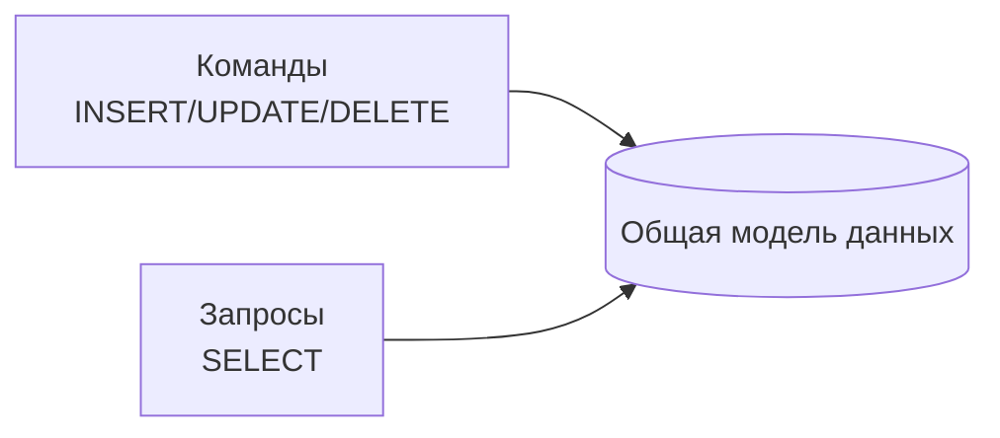

Проблемы такого подхода:

**Разные требования к оптимизации.** Запись требует нормализации (чтобы избежать дублирования и обеспечить консистентность). Чтение часто требует денормализации (чтобы не делать много JOIN). Одна модель не может быть оптимальной для обоих.

**Сложность бизнес-логики записи.** В сложных доменах (финансы, бронирование) валидация, правила, инварианты требуют много кода. CRUD-модель не справляется.

**Разная нагрузка.** Часто чтения на порядки больше, чем записи. Но в одной модели вы масштабируете все вместе.

**Множество представлений.** Одни и те же данные нужны в разных форматах: для мобильного приложения, для веб-страницы, для отчета, для API партнера. Поддержка всех представлений в одной модели сложна.

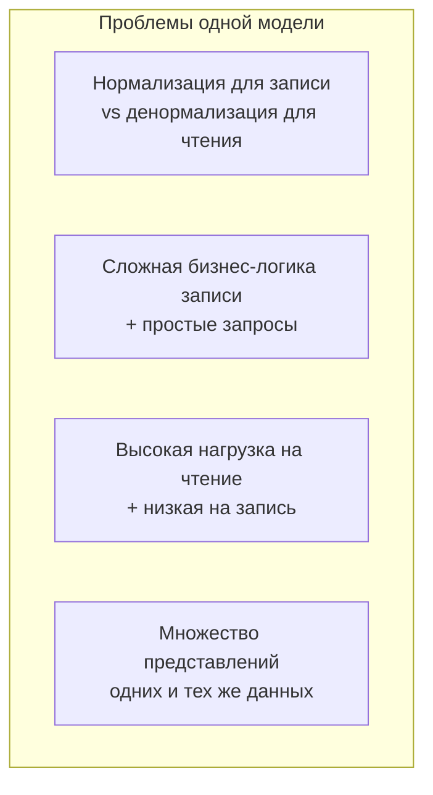

CQRS решает эти проблемы, разделяя модели.

## Основная идея CQRS

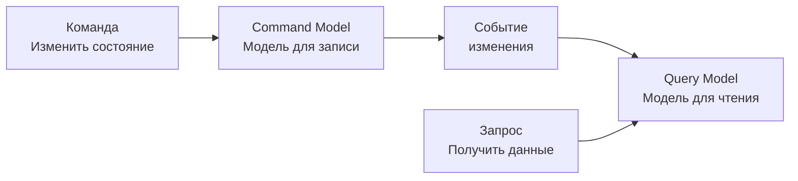

**Command Model (модель для команд).** Отвечает за валидацию, бизнес-правила, инварианты. Принимает команды (например, "забронировать билет"), проверяет, можно ли это сделать, обновляет свое состояние и публикует события. Обычно хорошо нормализована, следует принципам Domain-Driven Design. Оптимизирована для записи, не для чтения.

**Query Model (модель для запросов).** Отвечает за предоставление данных для чтения. Получает события от command model и обновляет свои представления. Может быть сильно денормализована, содержать готовые "срезы" данных для конкретных экранов. Оптимизирована для чтения, не для записи.

**События (Events).** Связующее звено между моделями. Когда command model меняет состояние, она публикует событие ("BookingCreated", "SeatReserved"). Query model подписывается на эти события и обновляет свои read-модели.

## Простой пример: Бронирование билетов

**Без CQRS (обычная CRUD).** Одна таблица "bookings". При бронировании: проверка, что место свободно (SELECT), затем INSERT. При отображении списка бронирований: SELECT с JOIN на пользователей, фильтрами, сортировкой.

Проблемы: сложная логика бронирования (проверки, блокировки) смешана с простыми SELECT. При высокой нагрузке на чтение страдают бронирования.

**С CQRS.**

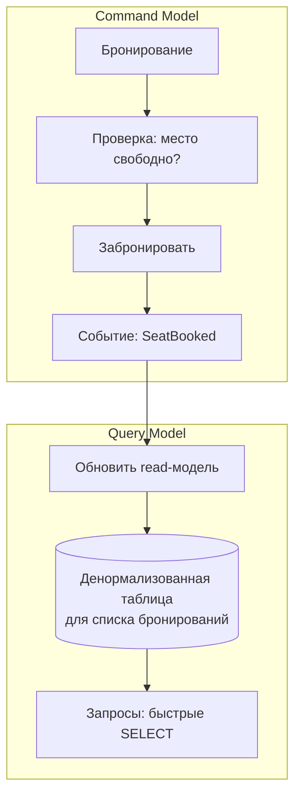

**Command model:** Сложная бизнес-логика. Проверки, блокировки, транзакции. Может использовать event sourcing. Оптимизирована для записи.

**Query model:** Простые, быстрые запросы. Денормализованные таблицы, готовые для конкретных экранов. Может использовать другую базу данных (например, Elasticsearch для поиска). Оптимизирована для чтения.

## Уровни CQRS

CQRS может быть реализован на разных уровнях "глубины".

### Логическое разделение (минимальный CQRS)

В коде разделены объекты команд и запросов, но физически используется одна база данных.

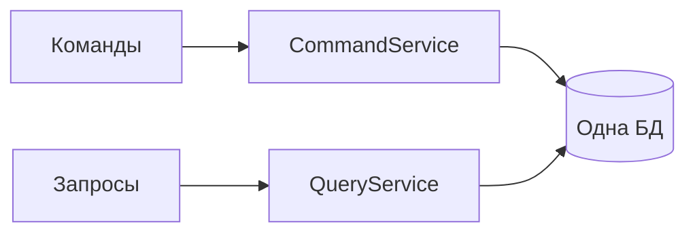

Плюсы: просто, нет eventual consistency. Минусы: не решает проблему разной оптимизации.

### Физическое разделение моделей (классический CQRS)

Разные модели данных, возможно, разные базы данных. Command model обновляется, публикует события, query model подписывается.

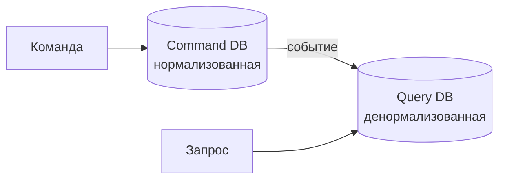

Плюсы: полная независимость, можно оптимизировать каждую модель. Минусы: eventual consistency, сложность.

### CQRS + Event Sourcing (максимальный CQRS)

Command model хранит не текущее состояние, а события (историю). Текущее состояние вычисляется путем переигрывания событий. Query model обновляется из событий.

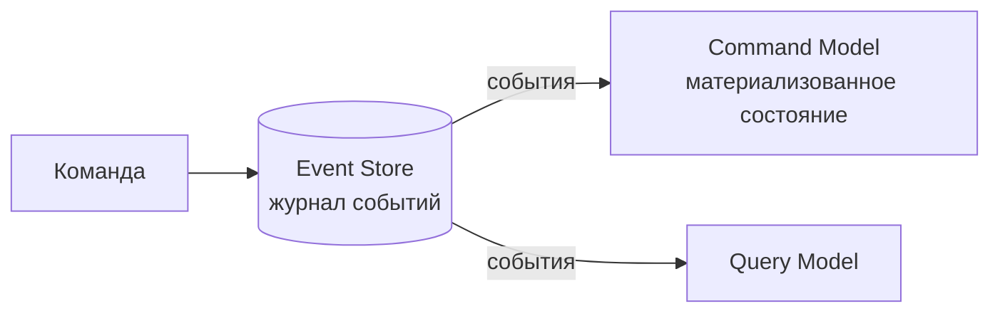

Плюсы: полный аудит, возможность "отката" времени, мощная трассировка. Минусы: сложность, другая ментальная модель.

## CQRS и разделение команд и запросов на уровне API

Даже если вы не используете CQRS на уровне данных, полезно разделить команды и запросы на уровне API.

```yaml
# Плохо: один эндпоинт и для чтения, и для записи
POST /api/orders  # иногда создает, иногда обновляет

# Хорошо: разделение
POST   /api/orders        # команда: создать заказ
PUT    /api/orders/{id}   # команда: обновить заказ
DELETE /api/orders/{id}   # команда: удалить заказ
GET    /api/orders/{id}   # запрос: получить заказ
GET    /api/orders        # запрос: список заказов
```

Это минимальная форма CQRS — разделение на уровне интерфейса.

## Преимущества CQRS

**Независимая оптимизация.** Command model может быть нормализована, использовать ACID-транзакции, сложные бизнес-правила. Query model может быть денормализована, использовать индексы под конкретные запросы, даже другую базу данных (Elasticsearch, Redis).

**Независимое масштабирование.** Если чтений в 100 раз больше, чем записей, вы можете масштабировать query model горизонтально (много реплик read-модели), оставив command model с меньшим количеством реплик.

**Разные модели для разных читателей.** У вас может быть несколько query models: одна для веб-интерфейса (быстрые запросы), другая для отчетов (сложные агрегации), третья для поиска (Elasticsearch). Command model одна.

**Упрощение сложной бизнес-логики.** Command model может быть богатой, объектно-ориентированной, реализующей сложные правила, не отвлекаясь на проблемы запросов.

**Безопасность.** Можно разрешить запросы к query model всем, а команды — только авторизованным пользователям. Разные модели могут иметь разные права.

**Событийная архитектура.** CQRS естественно ведет к событийно-ориентированной архитектуре (EDA), что дает слабую связанность.

## Недостатки и сложности CQRS

**Сложность.** CQRS значительно сложнее CRUD. Вместо одной модели у вас две (или больше). Нужно синхронизировать query model из событий.

**Eventual consistency (согласованность в конечном счете).** Между обновлением command model и обновлением query model есть задержка. Пользователь может создать заказ, но не увидеть его в списке мгновенно.

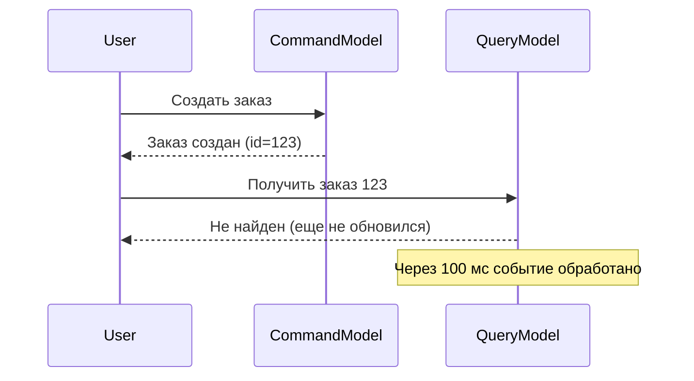

Для многих систем это приемлемо, но не для всех.

**Нет единого источника истины (в классическом CQRS).** Истина — в command model, но query model содержит копии. Нужно следить за синхронизацией.

**Дублирование кода.** Логика валидации может дублироваться? (Нет, она только в command model). Но код для работы с разными моделями — да.

**Сложность миграции.** Переход с CRUD на CQRS требует серьезной перестройки архитектуры.

**Не для простых систем.** Если ваша система — простой CRUD, CQRS — оверинжиниринг.

## CQRS vs CRUD

| Аспект | CRUD | CQRS |
| :--- | :--- | :--- |
| Моделей данных | 1 | 2+ |
| Оптимизация | Компромиссная | Независимая |
| Масштабирование | Одна модель | Независимое |
| Сложность | Низкая | Высокая |
| Консистентность | Строгая (ACID) | Eventual (обычно) |
| Когда использовать | Простые системы | Сложные домены, высокая нагрузка на чтение |

## CQRS и Event Sourcing: не одно и то же

CQRS и Event Sourcing часто используют вместе, но это разные паттерны.

**CQRS** — разделение моделей команд и запросов. **Event Sourcing** — хранение состояния как последовательности событий.

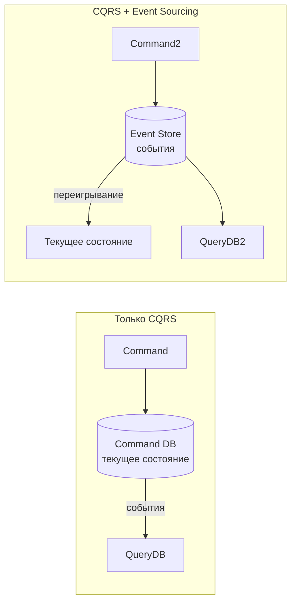

Можно использовать CQRS без Event Sourcing (command model хранит текущее состояние в реляционной БД и публикует события для обновления query model). Можно использовать Event Sourcing без CQRS (одна модель, но хранится как события). Но вместе они особенно сильны.

## Когда CQRS — правильный выбор

- **Сложная бизнес-логика записи.** Валидации, правила, инварианты требуют богатой доменной модели. CQRS позволяет изолировать эту сложность в command model.

- **Высокая нагрузка на чтение.** Чтений на порядки больше, чем записей. CQRS позволяет масштабировать query model независимо.

- **Разные требования к чтению.** Одни и те же данные нужны в разных форматах: веб-страница, мобильное приложение, отчет, API, поиск. CQRS позволяет создать несколько query models.

- **Команда знакома с Domain-Driven Design (DDD).** CQRS и DDD хорошо сочетаются. Command model становится агрегатами.

- **Система с естественными событиями.** Бизнес-процесс легко описывается как последовательность событий. CQRS + Event Sourcing дает аудит и трассировку.

- **Распределенная система (микросервисы).** CQRS помогает разделить ответственность между сервисами.

## Когда CQRS не нужен

- **Простой CRUD.** Если ваша система — это в основном создание, чтение, обновление, удаление записей без сложной логики, CQRS — оверинжиниринг.

- **Маленькая команда без опыта.** CQRS требует понимания DDD, событийной архитектуры, eventual consistency. Без опыта вы утонете в сложности.

- **Требования к строгой консистентности.** Если пользователь должен видеть свои изменения мгновенно (read-your-writes consistency), CQRS с eventual consistency может не подойти (хотя можно реализовать "свои" запросы к command model).

- **Небольшой проект.** Простой монолит на CRUD будет быстрее и дешевле.

## Реальный пример: Система бронирования авиабилетов

**Без CQRS:** Одна база данных. При бронировании: сложные проверки (место свободно? не заблокировано? не истекло время блокировки?). При просмотре расписания: много JOIN, фильтров, сортировок. При пиковой нагрузке (пятница вечером) SELECT-запросы замедляют бронирование.

**С CQRS:**

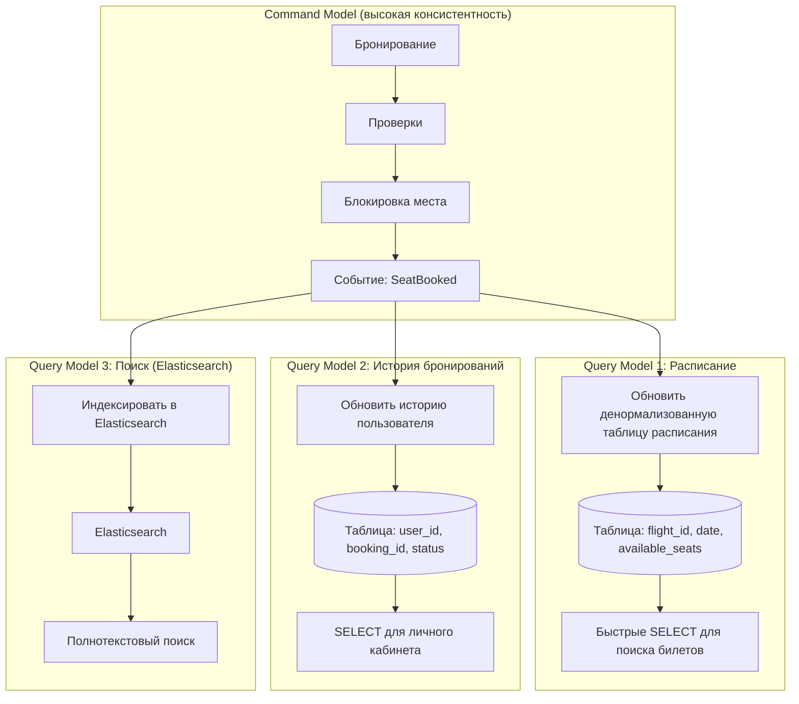

Command model — одна, небольшая, оптимизированная для бронирований (высокая консистентность, блокировки).

Query models — три разных, каждая оптимизирована под свой сценарий чтения. Масштабируются независимо. Если расписание смотрят миллионы пользователей, можно добавить реплик query model 1.

Eventual consistency: после бронирования место может отображаться как занятое не мгновенно, а через 100-500 мс. Для авиабилетов это приемлемо.

## CQRS и микросервисы

CQRS и микросервисы хорошо сочетаются:

- Каждый микросервис может использовать CQRS внутри себя.
- Query model одного сервиса может быть денормализованной копией данных из другого сервиса (через события).

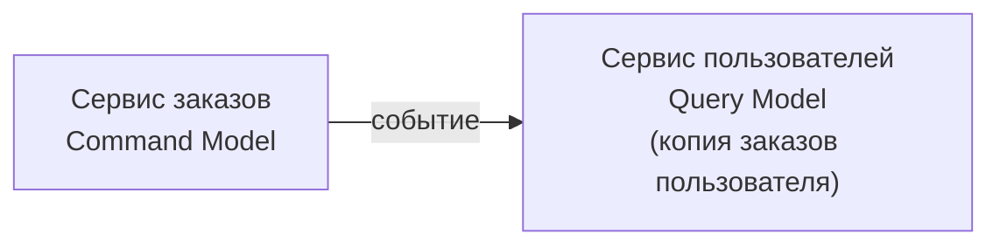

Это снижает связанность между сервисами.

## Резюме

CQRS (Command Query Responsibility Segregation) — это паттерн, разделяющий операции изменения данных (команды) и чтения данных (запросы) на разные модели.

**Основная идея:**

- **Command model** — для записи, сложная бизнес-логика, валидация, инварианты. Публикует события.
- **Query model** — для чтения, денормализованная, оптимизированная под конкретные запросы. Подписывается на события.

**Уровни CQRS:**

- Логическое разделение (один код, одна БД)
- Физическое разделение (разные БД, eventual consistency)
- CQRS + Event Sourcing (хранение событий)

**Преимущества:**

- Независимая оптимизация записи и чтения
- Независимое масштабирование
- Несколько query models для разных нужд
- Упрощение сложной бизнес-логики
- Естественная событийная архитектура

**Недостатки:**

- Сложность (в 2-3 раза выше CRUD)
- Eventual consistency (не для всех систем)
- Дублирование кода (работа с разными моделями)
- Сложность миграции с CRUD

**Когда использовать:**

- Сложная бизнес-логика записи (DDD)
- Высокая нагрузка на чтение
- Разные требования к чтению
- Распределенные системы (микросервисы)
- Естественно событийные домены

**Когда не использовать:**

- Простой CRUD
- Маленькая команда без опыта
- Требования к строгой консистентности (read-your-writes)
- Небольшой проект

CQRS — мощный паттерн для сложных систем, но это не бесплатная магия. Он добавляет значительную сложность и требует понимания eventual consistency, событийной архитектуры, Domain-Driven Design. Начинайте с CRUD. Если (и когда) CRUD перестанет справляться — рассмотрите CQRS. Но не начинайте с CQRS на пустом месте.