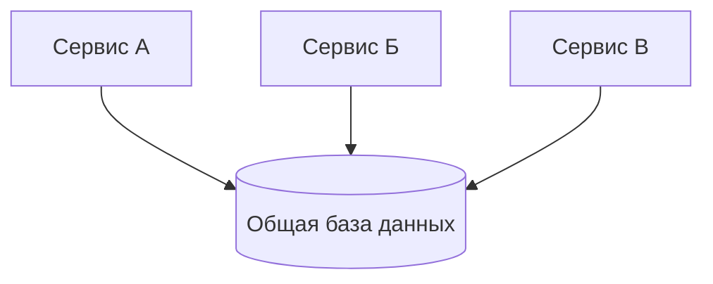
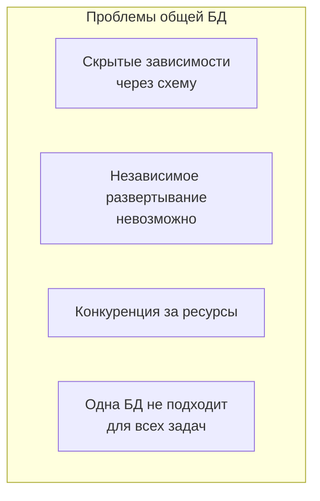
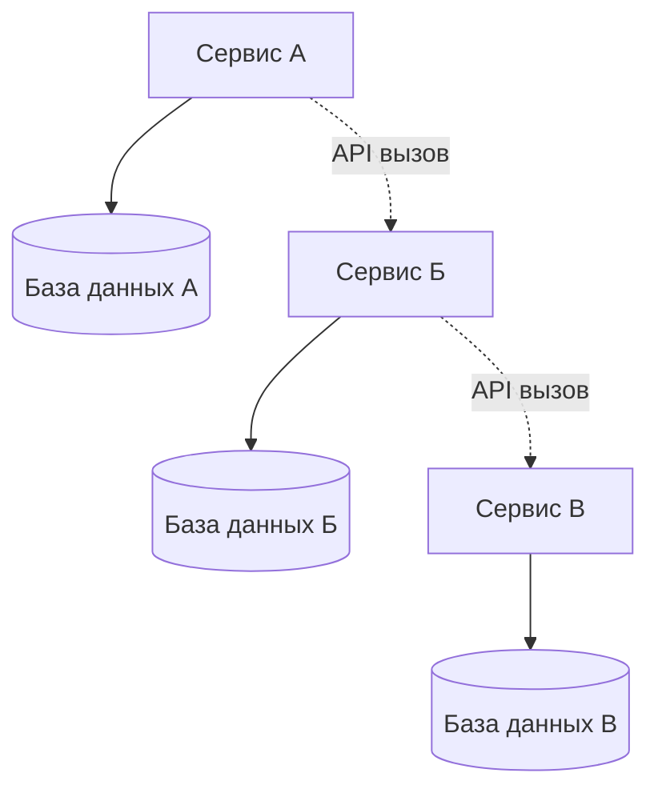
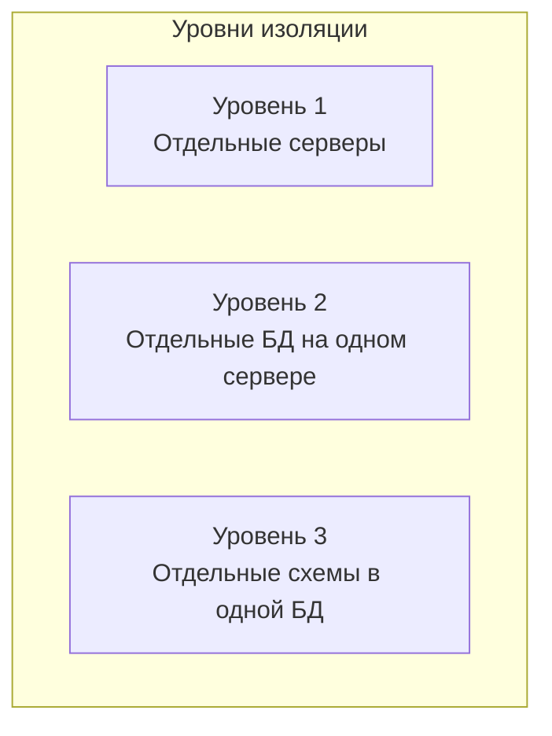
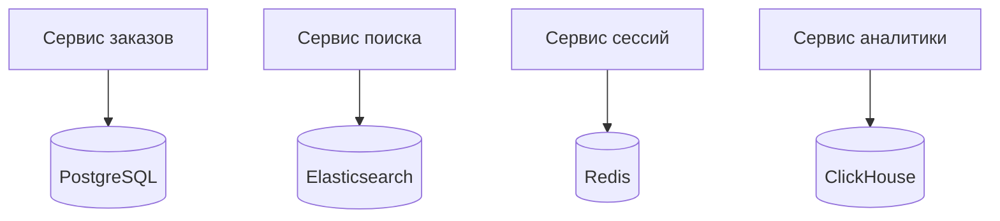
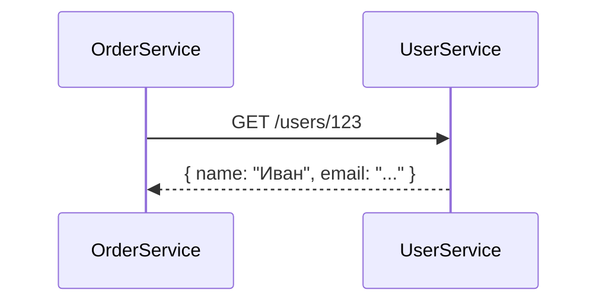
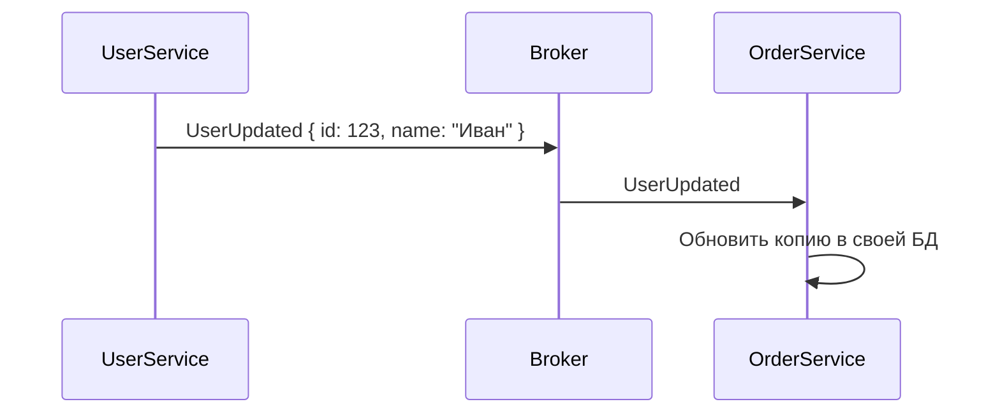
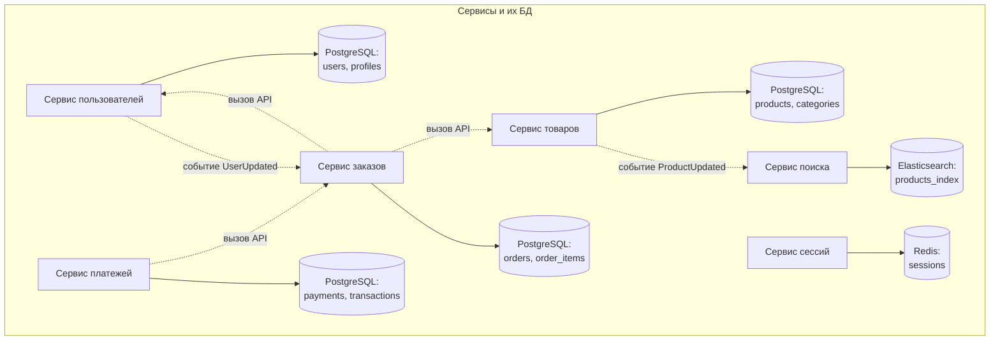
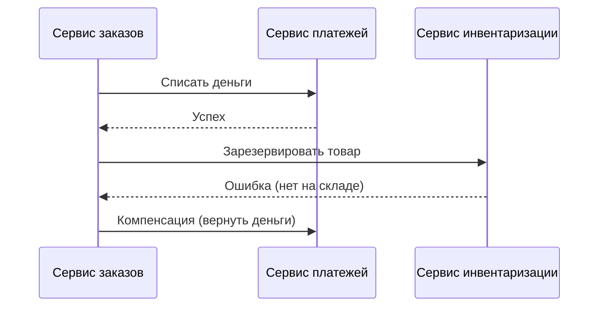

## Введение: Каждый сервис — своя база данных

Вернемся к аналогии с поселком из отдельных домов. В монолите все жили в одном большом доме и пользовались одной общей кухней, одной кладовкой, одним подвалом. В микросервисном поселке у каждого дома своя кухня, свой подвал, свои запасы. Вы не заходите в чужой дом, чтобы взять муку, — вы просите соседа дать вам муку через забор.

**Database per Service** — это паттерн микросервисной архитектуры, при котором каждый микросервис владеет своей собственной базой данных. Никакие два сервиса не имеют доступа к одной базе данных. Сервисы не читают и не пишут в чужие базы данных напрямую. Если сервису А нужны данные из сервиса Б, он вызывает API сервиса Б, а не читает его базу.

Этот паттерн — фундаментальный принцип микросервисной архитектуры. Без него микросервисы теряют главное преимущество — независимость. Общая база данных — это быстрый путь к распределенному монолиту, где сервисы формально разделены, но фактически связаны через схему данных.

## Проблема, которую решает Database per Service

В монолите одна база данных на все приложение. Это удобно: JOIN между любыми таблицами, ACID-транзакции, простота. Но при переходе к микросервисам общая база данных становится проблемой.

Что происходит, когда несколько сервисов используют одну базу данных:



**Проблема 1: Скрытые зависимости.** Сервис А читает таблицу, которую обновляет сервис Б. Сервис Б меняет схему этой таблицы (добавляет поле, меняет тип). Сервис А падает, потому что его запросы больше не работают. Вы не знали, что сервис А зависит от этой таблицы. Скрытая связь.

**Проблема 2: Невозможность независимого развертывания.** Вы хотите развернуть новую версию сервиса Б. Но в новой версии изменилась схема таблицы. Сервис А, который еще не обновлен, может сломаться. Вы не можете развернуть Б независимо от А.

**Проблема 3: Конкуренция за ресурсы.** Сервис А делает тяжелые аналитические запросы, блокируя таблицы. Сервис Б не может обновлять свои данные, пользователи видят задержки. Один "шумный" сервис мешает всем остальным.

**Проблема 4: Разные требования к базам данных.** Сервису А нужна реляционная база с ACID. Сервису Б нужна NoSQL для высокой производительности. Сервису В нужен Elasticsearch для полнотекстового поиска. Общая база не может быть всем одновременно.



Database per Service решает эти проблемы, давая каждому сервису свою базу.

## Как работает Database per Service



**Правила:**

1. Сервис владеет своей базой данных. Никто другой не имеет прямого доступа.
2. Сервис может использовать любую базу данных (PostgreSQL, MongoDB, Redis, Elasticsearch), которая лучше всего подходит для его задач.
3. Если сервису нужны данные из другого сервиса, он вызывает его API. Не читает его базу.
4. Изменение схемы базы данных одного сервиса не требует изменений в других сервисах (при условии, что API не меняется).

## Что значит "база данных" в этом паттерне

"Database per Service" не обязательно означает "отдельный сервер базы данных на каждый сервис". Есть разные уровни изоляции:

**Уровень 1: Отдельный сервер.** Каждый сервис имеет свой экземпляр сервера БД (например, отдельный PostgreSQL на своем сервере). Максимальная изоляция, но дорого.

**Уровень 2: Отдельная база данных на общем сервере.** Один сервер PostgreSQL, но разные базы данных (CREATE DATABASE service_a_db, service_b_db). Сервисы подключаются к своим базам. Дешевле, но сервер общий.

**Уровень 3: Отдельная схема в общей базе данных.** Одна база данных, но разные схемы (schema_a, schema_b). Сервисы подключаются к своим схемам. Минимальная изоляция, но лучше, чем общие таблицы.



Даже уровень 3 (общая БД, разные схемы) лучше, чем общие таблицы. Но уровень 2 или 1 предпочтительнее для настоящей независимости.

## Преимущества Database per Service

**Независимость сервисов.** Каждый сервис может менять свою схему данных, не согласовывая с другими. Пока API остается совместимым, другие сервисы не знают и не должны знать об изменениях внутри.

**Независимое масштабирование.** Сервис А может использовать базу данных, которая масштабируется иначе, чем сервис Б. Сервису А нужен мощный PostgreSQL, сервису Б — распределенная Cassandra. Каждый выбирает свое.

**Технологическая гибкость (Polyglot Persistence).** Сервис заказов может использовать PostgreSQL (ACID, транзакции). Сервис поиска — Elasticsearch (полнотекстовый поиск). Сервис сессий — Redis (быстрое key-value). Сервис аналитики — ClickHouse (колоночная БД). Одна база данных не может быть лучшей для всех задач.



**Изоляция отказов.** Если база данных сервиса Б падает, сервис Б становится недоступен, но сервис А продолжает работать (если он не зависит от Б критически). В общей базе данных падение одного сервера убивает все сервисы.

**Безопасность.** Сервис А не может случайно прочитать данные сервиса Б, потому что у него нет доступа к его базе. Атака на один сервис не дает доступа к данным всех сервисов.

## Недостатки и сложности Database per Service

### Сложность распределенных транзакций

В монолите с одной базой данных ACID-транзакции работают "из коробки". В Database per Service операция, затрагивающая несколько сервисов, не может быть атомарной. Нужны паттерны вроде Saga.

Пример: перевод денег между счетами в разных сервисах. В монолите: BEGIN, списать с одного счета, зачислить на другой, COMMIT. В микросервисах: Saga с компенсирующими операциями.

### Сложность JOIN между сервисами

В монолите вы пишете один SQL с JOIN между таблицами. В микросервисах данные разнесены по разным базам. Нельзя сделать JOIN.

Решение: API Composition (вызвать несколько сервисов и собрать данные) или денормализация (хранить копии данных в нескольких сервисах).

### Дублирование данных

Часто для производительности приходится хранить копии данных в нескольких сервисах. Например, сервис заказов хранит копию имени пользователя, чтобы не вызывать сервис пользователей при каждом показе заказа.


Это приводит к eventual consistency и сложности синхронизации.

### Сложность управления миграциями

В монолите одна схема, одна система миграций (например, Flyway, Liquibase). В Database per Service у каждого сервиса свои миграции, свои инструменты, свои процессы.

### Сложность отчетности и аналитики

Отчеты часто требуют данных из нескольких сервисов. Без единой базы данных получить эти данные сложно.

Решение: отдельный сервис отчетности, который собирает данные из других сервисов (через события) и строит свою денормализованную read-модель.

## Database per Service и микросервисы: это обязательно?

**Является ли Database per Service обязательным для микросервисов?** Да, если вы хотите настоящих микросервисов со всеми преимуществами. Без этого вы получаете распределенный монолит.

**Можно ли иметь общую базу данных и все еще называть это микросервисами?** Технически — да, но практически — нет. Вы потеряете независимость развертывания, независимость масштабирования, технологическую гибкость.

**Исключения:** В некоторых случаях допустима общая база данных для очень тесно связанных сервисов (например, два сервиса, которые всегда развертываются вместе). Но тогда, возможно, это не два сервиса, а один.

## Реализация Database per Service

### Вариант 1: Физически отдельные базы данных

Каждый сервис имеет свой экземпляр БД (свой сервер или контейнер).

```yaml
# docker-compose.yml
services:
  postgres-orders:
    image: postgres
    environment:
      POSTGRES_DB: orders_db
  postgres-users:
    image: postgres
    environment:
      POSTGRES_DB: users_db
  mongodb-payments:
    image: mongo
```

Плюсы: полная изоляция, можно использовать разные типы БД. Минусы: больше ресурсов, сложнее управлять.

### Вариант 2: Логически отдельные базы на общем сервере

Один сервер PostgreSQL, но разные базы данных.

```sql
CREATE DATABASE orders_db;
CREATE DATABASE users_db;
CREATE DATABASE payments_db;
```

Плюсы: экономия ресурсов. Минусы: общий сервер — риск "шумного соседа", нельзя использовать разные типы БД.

### Вариант 3: Отдельные схемы в одной базе

Одна база данных, разные схемы.

```sql
CREATE SCHEMA orders;
CREATE SCHEMA users;
CREATE SCHEMA payments;
```

Плюсы: максимальная экономия, легче управлять. Минусы: минимальная изоляция, все еще общий сервер, риск скрытых зависимостей.

Рекомендация: начинайте с варианта 2 или 3, если ресурсы ограничены. При росте переходите к варианту 1.

## Как сервисы обмениваются данными

Поскольку сервисы не могут читать чужие базы данных напрямую, им нужны другие способы получения данных.

**Синхронный: API вызовы.** Сервис А вызывает API сервиса Б, чтобы получить данные.



**Асинхронный: события.** Сервис Б публикует событие "UserUpdated". Сервис А подписывается и обновляет свою локальную копию данных пользователя.



**CQRS / read models.** Сервис А строит свою read-модель из событий от сервиса Б.

## Пример: Интернет-магазин с Database per Service



- **Сервис пользователей** — PostgreSQL. Хранит пользователей.
- **Сервис товаров** — PostgreSQL. Хранит товары, категории.
- **Сервис заказов** — PostgreSQL. Хранит заказы, но не хранит пользователей и товары — вызывает API.
- **Сервис платежей** — PostgreSQL. Хранит платежи, вызывает API заказов.
- **Сервис поиска** — Elasticsearch. Получает события от сервиса товаров, строит индекс.
- **Сервис сессий** — Redis. Быстрое key-value хранилище для сессий.

Каждый сервис выбрал БД, которая лучше всего подходит для его задач. Никто не лезет в чужую БД.

## Database per Service и транзакции

Одна из главных проблем. Как обеспечить консистентность данных при операциях, затрагивающих несколько сервисов?

**Saga (хореография или оркестрация).** Операция разбивается на последовательность локальных транзакций. Если что-то пошло не так, запускаются компенсирующие действия.

Пример: оформление заказа.



**Eventual consistency.** Принять, что данные будут согласованы не мгновенно, а через некоторое время. Для многих систем это приемлемо.

**Двухфазный коммит (2PC).** Технически возможен, но не рекомендуется в микросервисах (блокировки, снижение производительности).

## Database per Service в облаке

Облачные провайдеры предлагают managed-сервисы, которые упрощают реализацию паттерна.

**AWS:**

- Сервис А: RDS PostgreSQL
- Сервис Б: DynamoDB (NoSQL)
- Сервис В: ElastiCache Redis
- Сервис Г: OpenSearch (Elasticsearch)

Каждый сервис использует свой managed-сервис. Провайдер управляет бэкапами, репликацией, масштабированием.

## Когда Database per Service — правильный выбор

- **Вы строите микросервисную архитектуру.** Это фундаментальный паттерн. Без него у вас не микросервисы, а распределенный монолит.

- **Разные сервисы имеют разные требования к данным.** Одному нужна ACID, другому — высокая производительность, третьему — полнотекстовый поиск.

- **Разные сервисы разрабатываются разными командами.** Команды не должны зависеть от изменений схемы БД друг друга.

- **Сервисы должны масштабироваться независимо.** Один сервис может использовать БД, которая масштабируется иначе, чем другой.

- **Вы готовы к eventual consistency и сложности распределенных транзакций.** Если ваш бизнес требует строгой ACID между сервисами, возможно, микросервисы — неправильный выбор.

## Когда Database per Service не нужен

- **Монолит.** У вас одно приложение, одна БД. Database per Service не нужен.

- **Небольшой проект с 2-3 сервисами.** Overhead может быть выше выгоды. Рассмотрите общую БД с отдельными схемами.

- **Строгая консистентность между сервисами критична.** Если вам нужны ACID-транзакции между сервисами, Database per Service сделает это очень сложным.

- **Команда не имеет опыта.** Паттерн требует понимания распределенных транзакций, eventual consistency, событийной архитектуры.

## Резюме

Database per Service — это паттерн микросервисной архитектуры, при котором каждый микросервис владеет своей собственной базой данных. Никакие два сервиса не имеют прямого доступа к одной базе данных.

**Ключевые принципы:**

- Каждый сервис владеет своей БД
- Сервисы не читают чужие БД напрямую
- Для получения данных из другого сервиса — вызывать API
- Каждый сервис может использовать свой тип БД

**Преимущества:**

- Независимость сервисов (меняйте схему без согласования)
- Независимое масштабирование
- Технологическая гибкость (Polyglot Persistence)
- Изоляция отказов
- Безопасность

**Недостатки и сложности:**

- Сложность распределенных транзакций (нужна Saga)
- Сложность JOIN между сервисами (нужна API Composition)
- Дублирование данных (и eventual consistency)
- Сложность управления миграциями
- Сложность отчетности и аналитики

**Уровни изоляции:**

1. Отдельные серверы БД (максимальная изоляция)
2. Отдельные базы данных на общем сервере
3. Отдельные схемы в общей базе (минимальная изоляция)

Database per Service — это не бесплатная магия. Он добавляет значительную сложность, особенно в области транзакций и запросов, требующих данных из нескольких сервисов. Но для настоящей микросервисной архитектуры с независимыми командами, независимым масштабированием и технологической гибкостью этот паттерн необходим. Без него вы получите распределенный монолит — худшее из двух миров.