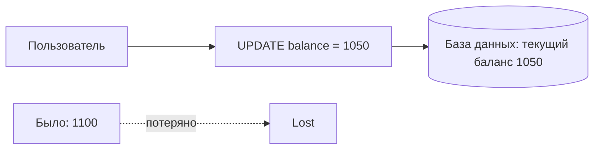
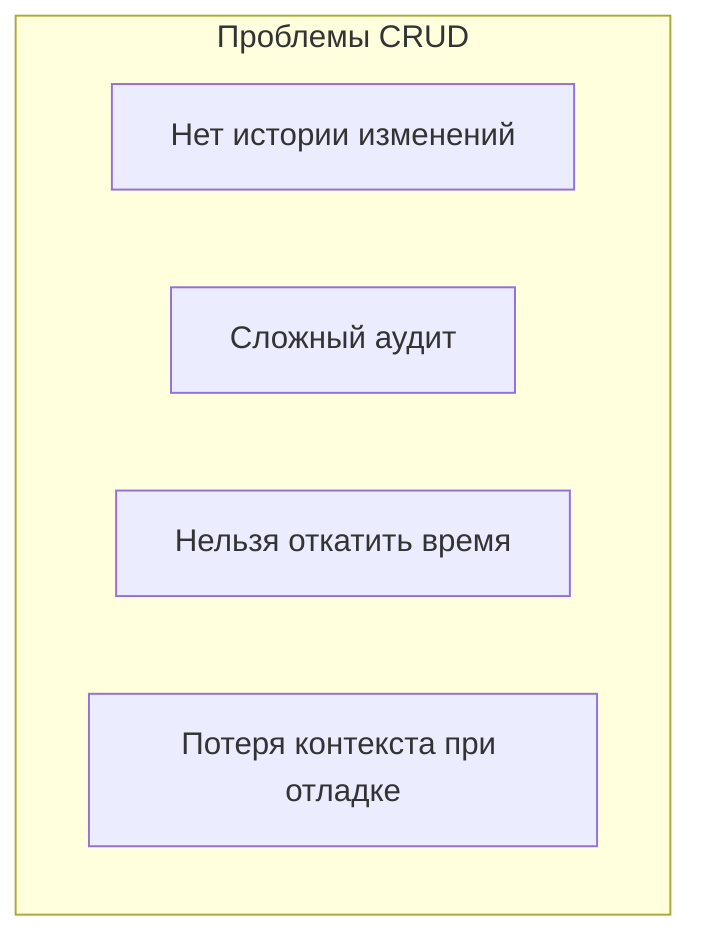
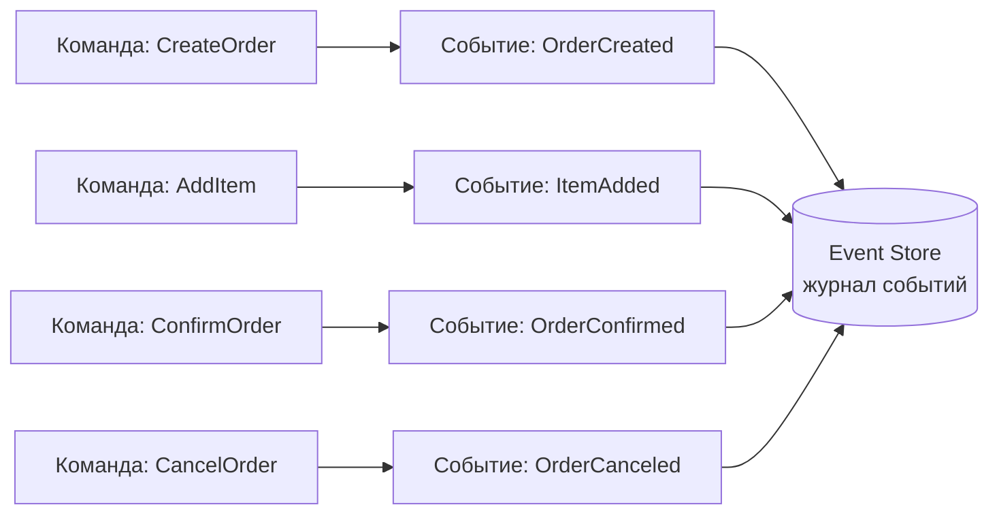
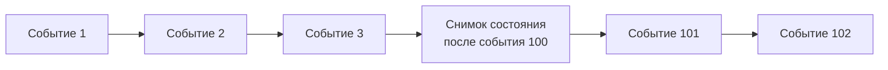
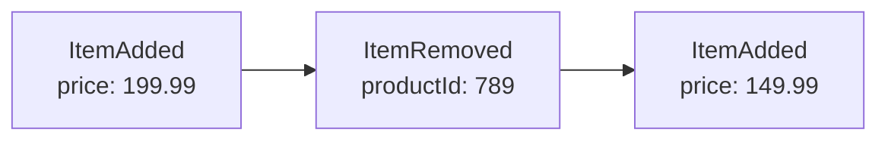
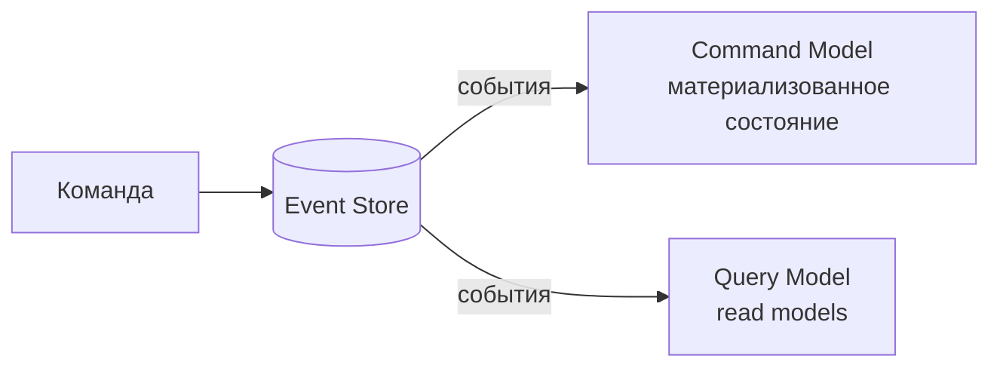
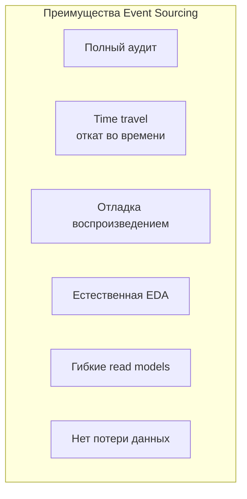
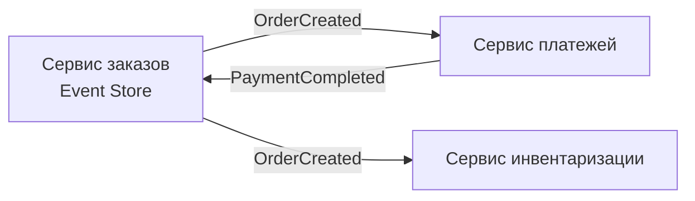
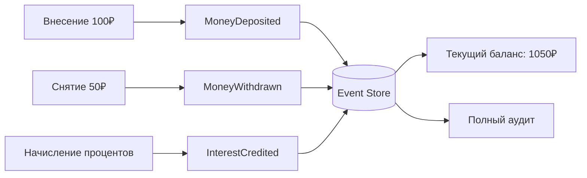

## Введение: Храните не состояние, а историю изменений

Представьте, что вы ведете банковский счет. Традиционный подход: вы храните текущий баланс. Пришло 100 рублей — баланс стал 1100. Ушли 50 рублей — баланс стал 1050. Вы знаете только текущее состояние, но не помните, как вы к нему пришли.

Другой подход: вы храните не баланс, а журнал всех операций. "Пополнение на 100 рублей", "Снятие 50 рублей". Текущий баланс вы можете вычислить, сложив все операции. Но кроме баланса, у вас есть полная история: когда, сколько, откуда, куда.

**Event Sourcing** — это паттерн, при котором вы храните не текущее состояние сущности, а последовательность событий, которые привели к этому состоянию. Каждое изменение состояния записывается как новое событие (неизменяемое, добавляемое только в конец журнала). Текущее состояние вычисляется путем "переигрывания" всех событий с начала.

Event Sourcing дает полный аудит, возможность "отмотать" время, восстановить состояние на любой момент, отлаживать проблемы, воспроизводя события. Но плата за это — сложность, eventual consistency (если используются read-модели), и другой способ мышления.

## Проблема, которую решает Event Sourcing

В традиционных приложениях (CRUD) вы храните текущее состояние в реляционной базе данных. UPDATE перезаписывает старое значение новым. Старая информация теряется (если нет аудита).



Проблемы такого подхода:

**Нет истории.** Вы не знаете, как сущность пришла к текущему состоянию. Что происходило с заказом? Был ли он отменен и восстановлен? Непонятно.

**Сложный аудит.** Чтобы ответить на вопрос "кто и когда изменил поле X", нужно строить отдельные аудит-таблицы, триггеры, логи.

**Невозможность отката.** Если вы обнаружили ошибку в логике, которая работала последний час, вы не можете "откатить" изменения. Нужно писать компенсирующие операции.

**Потеря контекста при отладке.** Произошла ошибка в заказе. Вы видите его текущий статус "отменен". Но почему он отменен? Кто отменил? Когда? Без аудита — гадание.



Event Sourcing решает эти проблемы, храня каждое изменение как событие.

## Как работает Event Sourcing

Вместо таблицы "orders" с полями status, total, user_id, вы храните таблицу (или stream) событий.



**События.** Неизменяемые факты, которые произошли. "Заказ создан", "Товар добавлен", "Заказ подтвержден". События всегда в прошедшем времени. Они никогда не удаляются и не изменяются — только добавляются в конец журнала.

**Event Store (журнал событий).** Специальное хранилище, которое сохраняет события в порядке их возникновения. Каждое событие имеет ID, тип, данные, timestamp, ID сущности (aggregate ID).

**Снимки (snapshots).** Поскольку переигрывать все события с начала может быть долго, периодически сохраняется снимок состояния. При загрузке сущности вы берете последний снимок и применяете события после него.

## Простой пример: Заказ

**Без Event Sourcing (CRUD).** Одна запись в таблице orders. UPDATE при каждом изменении.

```sql
-- Текущее состояние заказа 123
SELECT status, total, items FROM orders WHERE id = 123;
-- Результат: status = 'confirmed', total = 299.99
-- История потеряна
```

**С Event Sourcing.** Журнал событий для заказа 123:

| ID | Тип события | Данные | Время |
|----|-------------|--------|-------|
| 1 | OrderCreated | { userId: 456, total: 0 } | 10:00:00 |
| 2 | ItemAdded | { productId: 789, price: 199.99 } | 10:00:05 |
| 3 | ItemAdded | { productId: 790, price: 100.00 } | 10:00:10 |
| 4 | OrderConfirmed | { confirmedBy: "user" } | 10:00:15 |
| 5 | OrderCanceled | { reason: "changed mind" } | 10:01:00 |

Текущее состояние заказа вычисляется переигрыванием событий 1-5. Итог: статус = canceled, total = 299.99.

Вы можете ответить на вопросы: когда был создан заказ? (10:00:00). Когда добавлен каждый товар? (10:00:05, 10:00:10). Кто подтвердил? (user). Почему отменен? (changed mind). Все это есть в событиях.

## Материализация состояния (State Materialization)

Текущее состояние не хранится в event store. Оно вычисляется при каждом запросе путем переигрывания событий. Это называется "материализация".

```python
class Order:
    def __init__(self):
        self.status = "new"
        self.items = []
        self.total = 0
    
    def apply_event(self, event):
        if event.type == "OrderCreated":
            self.user_id = event.data.user_id
        elif event.type == "ItemAdded":
            self.items.append(event.data.product_id)
            self.total += event.data.price
        elif event.type == "OrderConfirmed":
            self.status = "confirmed"
        elif event.type == "OrderCanceled":
            self.status = "canceled"
    
    @staticmethod
    def load_from_events(events):
        order = Order()
        for event in events:
            order.apply_event(event)
        return order
```

При каждом запросе заказа вы загружаете все события заказа и применяете их. Для оптимизации используются снимки (snapshots).

## Снимки (Snapshots)

Переигрывание 1000 событий для каждого запроса может быть медленным. Решение — снимки.



**Снимок** — это сохраненное текущее состояние сущности на определенный момент. При загрузке вы берете последний снимок и применяете только события после него.

Например, после каждых 100 событий вы сохраняете снимок. При загрузке заказа с 250 событиями: загрузить снимок после события 200, применить события 201-250. Вместо 250 применений — только 50.

## Event Sourcing и неизменяемость

События неизменяемы (immutable). Вы никогда не удаляете и не изменяете событие. Если была ошибка, вы не редактируете событие, а публикуете новое компенсирующее событие.

Пример: ошиблись при добавлении товара. Не удаляете событие ItemAdded, а добавляете событие ItemRemoved.



Почему это важно: неизменяемость дает полный аудит. Вы всегда можете восстановить точную историю, даже если были ошибки. Ничего не теряется.

## Event Sourcing и CQRS

Event Sourcing и CQRS часто используют вместе, но это разные паттерны.

**CQRS** — разделение моделей команд и запросов. **Event Sourcing** — хранение состояния как последовательности событий.



Связка особенно сильна:

- Command model (запись) хранит события в event store
- События публикуются в брокер
- Query models (чтение) подписываются на события и обновляют свои денормализованные таблицы

Это дает: полный аудит (event store), независимые read models, слабую связанность.

## Преимущества Event Sourcing

**Полный аудит.** Вы знаете все, что произошло с каждой сущностью: когда, кто, какие данные. Это требование многих регуляторов (финансы, медицина, госуслуги).

**Возможность отката во времени (time travel).** Вы можете восстановить состояние системы на любой момент в прошлом. Переиграть события до нужного timestamp. Это бесценно при отладке: "покажи состояние заказа на 15:32:10".

**Отладка по событиям.** Произошла ошибка. Вы можете воспроизвести события в тестовой среде и увидеть, как система пришла к ошибке. Не гадать — переиграть.

**Event-driven архитектура естественно.** События уже есть, их можно публиковать в брокер для других сервисов. Нет необходимости проектировать события отдельно.

**Гибкость read models.** Вы можете построить несколько read models (для разных экранов, для отчетов, для поиска) на основе одних и тех же событий. Добавить новую read model — просто подписаться на события.

**Нет потери данных при ошибках.** Ошиблись? Не перезаписывайте данные, добавьте компенсирующее событие. История сохраняется.



## Недостатки и сложности Event Sourcing

**Сложность.** Event Sourcing значительно сложнее CRUD. Нужно проектировать события, обработчики, материализацию состояния, снимки, версионирование событий.

**Другой способ мышления.** Разработчики привыкли к "сохранить текущее состояние". Event Sourcing требует мыслить в терминах "что произошло". Это требует обучения.

**Eventual consistency (обычно).** Если вы используете Event Sourcing с CQRS и отдельными read models, между записью события и обновлением read model есть задержка. Пользователь может не увидеть свои изменения мгновенно.

**Сложность миграции событий.** События неизменяемы. Если вы изменили структуру события (добавили поле), старые события не содержат этого поля. Нужны стратегии миграции (upcasters).

**Хранилище растет бесконечно.** События накапливаются. Для сущности с миллионом событий переигрывание может быть медленным (хотя снимки помогают). Нужно периодически создавать снимки и, возможно, архивировать старые события.

**Нет стандартных инструментов.** CRUD с PostgreSQL — стандарт. Event Sourcing требует специальных хранилищ (EventStoreDB, Kafka как event store, или поверх реляционной БД). Инструментарий беднее.

**Сложность удаления данных (GDPR).** Event Sourcing хранит все события. Если пользователь требует удалить свои данные (GDPR "право на забвение"), это проблема. Нужны механизмы шифрования, псевдонимизации или отдельные хранилища для персональных данных.

## Event Sourcing vs традиционное CRUD

| Аспект | CRUD | Event Sourcing |
| :--- | :--- | :--- |
| Хранение | Текущее состояние | Журнал событий |
| UPDATE | Перезаписывает данные | Добавляет новое событие |
| История | Теряется (или требует аудит-таблиц) | Полная, всегда доступна |
| Time travel | Нет | Да (переиграть события до момента) |
| Аудит | Сложный, отдельная реализация | Встроенный (сами события) |
| Сложность | Низкая | Высокая |
| Производительность записи | Высокая (одна операция) | Высокая (append only) |
| Производительность чтения | Высокая (прямое чтение) | Требует материализации (снимки) |
| Размер хранилища | Минимальный | Растет со временем |

## Реализации Event Store

**EventStoreDB (бывший Greg Young's Event Store).** Специализированная база данных для event sourcing. Поддерживает append-only streams, проекции, подписки.

**Kafka как event store.** Apache Kafka может хранить события вечно. Каждый partition — stream событий для одного агрегата. Хорошо для больших масштабов.

**Реляционная база данных (PostgreSQL).** Можно реализовать event sourcing поверх реляционной БД. Таблица events с полями aggregate_id, sequence_number, event_type, event_data (JSON).

```sql
CREATE TABLE events (
    id SERIAL PRIMARY KEY,
    aggregate_id UUID NOT NULL,
    sequence_number INT NOT NULL,
    event_type VARCHAR(255) NOT NULL,
    event_data JSONB NOT NULL,
    created_at TIMESTAMP DEFAULT NOW()
);

CREATE UNIQUE INDEX ON events (aggregate_id, sequence_number);
```

**DynamoDB (AWS).** Можно использовать как event store, но сложнее с последовательностью событий (нужны conditional updates).

## Версионирование событий

События неизменяемы, но бизнес-требования меняются. Что делать, если нужно добавить поле в событие?

**Upcasting.** При загрузке событий старые события "апгрейдятся" до новой версии через upcaster.

```python
def upcast_event(event):
    if event.version == 1 and event.type == "OrderCreated":
        # В v1 не было поля payment_method
        event.data["payment_method"] = "default"
        event.version = 2
    return event
```

**Хранение нескольких версий.** Храните события в исходной версии, преобразуйте при загрузке. Старые события не меняются в хранилище.

**Избегайте удаления полей.** Лучше добавлять поля с дефолтными значениями, чем удалять. Удаленные поля ломают старые события.

## Event Sourcing и микросервисы

Event Sourcing и микросервисы хорошо сочетаются:

- **События как интеграционный механизм.** Event store может быть источником событий для других сервисов. Другие сервисы подписываются на события и строят свои read models.

- **Слабая связанность.** Сервис-источник не знает, кто подписан на его события.

- **Аудит распределенных операций.** Saga (распределенная транзакция) может быть реализована через события, и event sourcing дает полный аудит Saga.



## Когда Event Sourcing — правильный выбор

- **Требуется полный аудит.** Финансовые системы, медицинские записи, системы с регуляторными требованиями. Вы должны знать, кто, когда, что изменил.

- **Сложная бизнес-логика с частыми изменениями.** Возможность отката во времени и воспроизведения событий помогает отлаживать и тестировать.

- **Event-driven архитектура (EDA).** Вы уже используете события для интеграции. Event Sourcing дает вам события "бесплатно".

- **Необходимость восстановления состояния на любой момент.** "Покажи, как выглядел заказ вчера в 15:32". Event Sourcing делает это тривиальным.

- **Высокая нагрузка на запись.** Append-only (только добавление) очень быстро. Нет UPDATE, нет блокировок.

- **Команда готова к сложности.** У команды есть опыт DDD, CQRS, событийной архитектуры.

## Когда Event Sourcing не нужен

- **Простой CRUD.** Если вам не нужен аудит, time travel, сложная логика — Event Sourcing оверинжиниринг.

- **Маленькая команда без опыта.** Event Sourcing требует значительного обучения. Без опыта вы утонете в сложности.

- **Строгие требования к удалению данных (GDPR).** Если пользователи могут требовать полного удаления своих данных, Event Sourcing проблематичен (события нельзя удалить).

- **Очень большой объем событий без возможности снапшотов.** Если у сущности миллионы событий и их нельзя скомпрессировать в снимки, производительность может быть проблемой.

- **Простая предметная область.** Если бизнес-логика тривиальна, CRUD проще.

## Реальный пример: Банковский счет

**Без Event Sourcing.** Таблица accounts с полями balance, last_transaction_date. UPDATE при каждой операции. Нет истории. Аудит — отдельная таблица transactions, но она не интегрирована с основной логикой.

**С Event Sourcing.**



События: MoneyDeposited (100₽), MoneyWithdrawn (50₽), InterestCredited (0.5₽). Текущий баланс = 100 - 50 + 0.5 = 50.5₽.

Преимущества:

- Аудит: все операции записаны
- Time travel: баланс на любой момент
- Отладка: воспроизвести события, если ошибка в начислении процентов
- Естественные события для других сервисов (уведомления, отчеты)

## Резюме

Event Sourcing — это паттерн, при котором вы храните не текущее состояние сущности, а последовательность событий, которые привели к этому состоянию.

**Как работает:**

- Каждое изменение — новое событие, добавляемое в event store
- Текущее состояние вычисляется переигрыванием событий
- Снимки (snapshots) ускоряют загрузку
- События неизменяемы (append-only)

**Преимущества:**

- Полный аудит (все изменения записаны)
- Time travel (восстановление состояния на любой момент)
- Отладка воспроизведением событий
- Естественная событийная архитектура
- Гибкие read models (через CQRS)
- Высокая производительность записи (append-only)

**Недостатки:**

- Сложность (выше CRUD в разы)
- Другой способ мышления (требует обучения)
- Eventual consistency (обычно)
- Сложность миграции событий (версионирование)
- Хранилище растет бесконечно (нужны снимки)
- Сложность удаления данных (GDPR)
- Меньше инструментов и стандартов

**Когда использовать:**

- Требуется полный аудит (финансы, медицина, госуслуги)
- Сложная бизнес-логика с частыми изменениями
- Нужен time travel (восстановление состояния на момент)
- Вы уже используете event-driven архитектуру
- Команда готова к сложности (опыт DDD, CQRS, EDA)

**Когда не использовать:**

- Простой CRUD
- Маленькая команда без опыта
- Строгие требования к удалению данных (GDPR)
- Простая предметная область

Event Sourcing — мощный паттерн, но это не бесплатная магия. Он добавляет значительную сложность и требует другой ментальной модели. Начинайте с CRUD. Если (и когда) вам понадобятся аудит, time travel, event-driven архитектура — рассмотрите Event Sourcing. Но не начинайте с него на пустом месте. И часто Event Sourcing используют вместе с CQRS, разделяя запись (события) и чтение (read models). Это лучшая комбинация для сложных, аудитируемых систем.