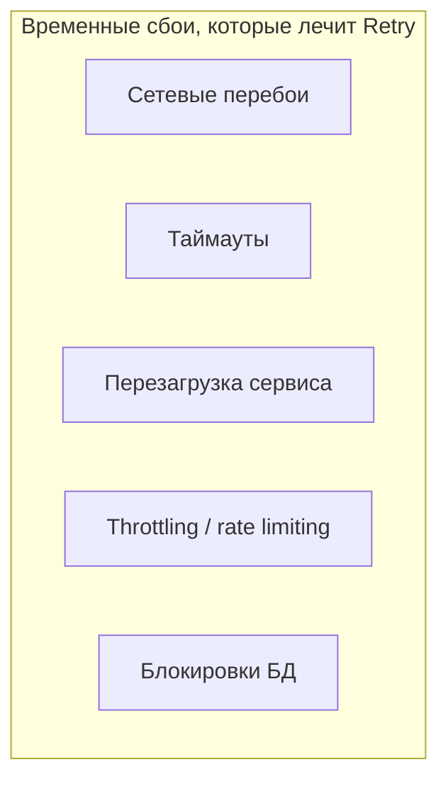
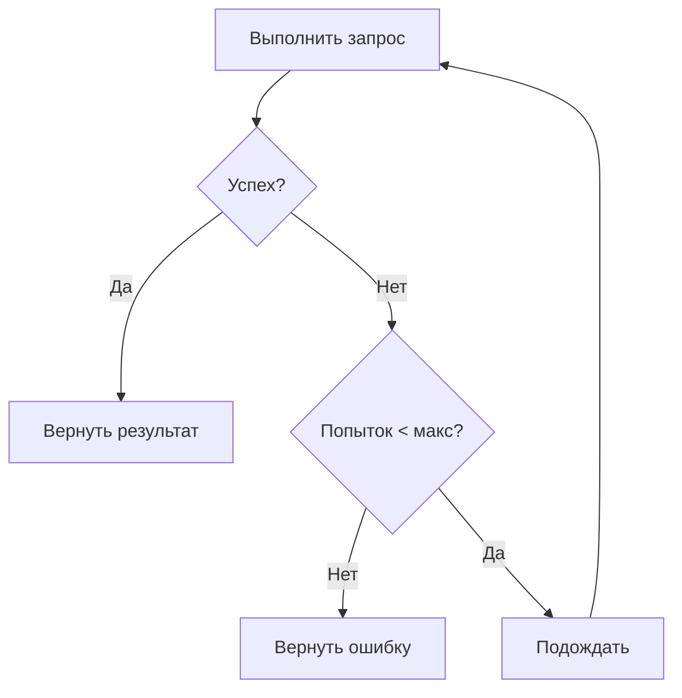
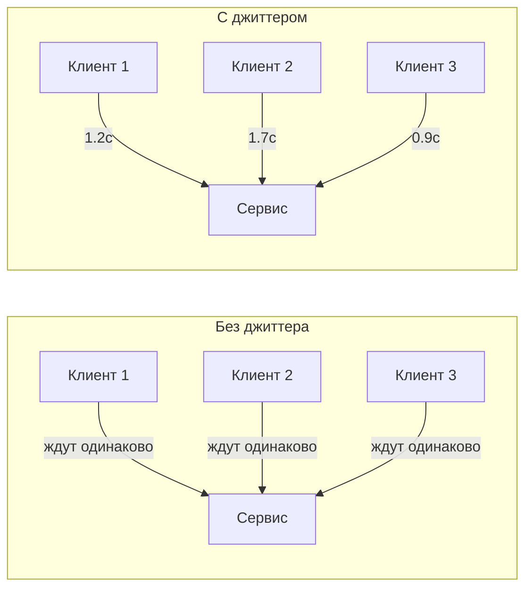
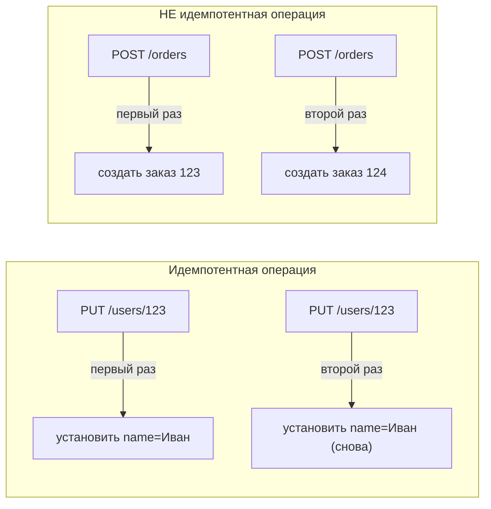
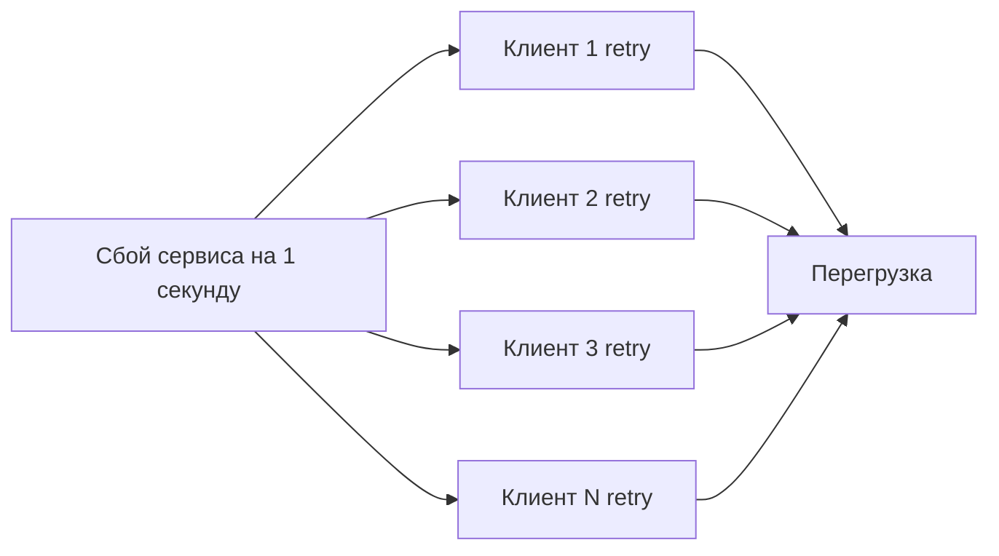
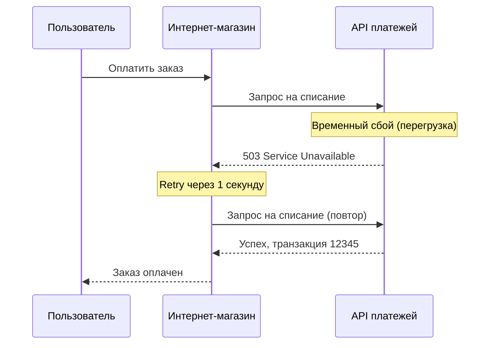

## Введение: Если не получилось — попробуй еще раз

Представьте, что вы звоните другу. Первый звонок — не дозвонились (линия занята). Что вы делаете? Скорее всего, перезваниваете через минуту. Второй раз — снова занято. Перезваниваете еще через две минуты. На третий раз — дозвонились.

**Retry Pattern** делает то же самое в программной архитектуре. Если запрос к внешнему сервису, базе данных, сети завершился ошибкой, вы повторяете его снова. Не сразу, а с задержкой (или без). И не бесконечно, а ограниченное количество раз.

Retry — это один из самых простых и эффективных паттернов для повышения надежности системы. Многие сбои носят временный характер: сеть "моргнула", сервис перезагружался, соединение с базой данных упало и восстановилось. В таких случаях повтор запроса с высокой вероятностью будет успешным.

Однако retry может навредить, если используется неправильно. Повтор запроса к уже перегруженному сервису может усугубить проблему. Retry идемпотентных операций безопасен, а неидемпотентных — может привести к дублированию данных.

## Проблема, которую решает Retry

В распределенных системах сбои неизбежны. Сеть может потерять пакет. Сервис может перезагружаться. База данных может временно стать недоступной. Соединение может разорваться.


Без retry каждая такая проблема приводит к ошибке. Пользователь видит "сервис недоступен". Разработчик получает алерт. Хотя через секунду все уже работает.

Примеры временных сбоев:

- **Сетевые перебои.** Пакет потерялся, TCP соединение разорвалось. Повторный запрос пройдет.
- **Таймауты.** Запрос не уложился в таймаут, но сервис обработал его успешно (или обработает при повторе).
- **Перезагрузка сервиса.** Сервис перезапускается 2 секунды. Повтор через 3 секунды попадет на работающий сервис.
- **Throttling (ограничение частоты запросов).** Сервис сказал "слишком много запросов, подождите". Повтор с задержкой пройдет.
- **Блокировки в базе данных.** Запрос не прошел из-за временной блокировки. Повтор — успешен.



Retry превращает временные сбои в незаметные для пользователя задержки, а не в ошибки.

## Как работает Retry



**Параметры retry:**

- **Максимальное количество попыток (max attempts).** Сколько раз повторять (обычно 3-5). Больше — рискуете надолго задержать ответ.
- **Задержка между попытками (delay).** Фиксированная (1 секунда) или увеличивающаяся.
- **Какие ошибки повторять.** Не все ошибки стоит повторять. "Сервис не найден" (404) повторять бессмысленно. "Таймаут" (504) — имеет смысл.
- **Типы повторяемых операций.** Только идемпотентные операции (повторный вызов не создает побочных эффектов).

## Стратегии задержки

**Фиксированная задержка (Fixed delay).** Одинаковый интервал между попытками.

```yaml
Попытка 1: ошибка → ждем 1 секунду
Попытка 2: ошибка → ждем 1 секунду
Попытка 3: ошибка → ждем 1 секунду
Попытка 4: успех
```

Плюсы: просто. Минусы: если сервис перегружен, фиксированные повторы могут усугубить проблему (все клиенты стучатся одновременно).

**Экспоненциальная задержка (Exponential backoff).** Задержка растет экспоненциально: 1с, 2с, 4с, 8с.

```yaml
Попытка 1: ошибка → ждем 1 секунду
Попытка 2: ошибка → ждем 2 секунды
Попытка 3: ошибка → ждем 4 секунды
Попытка 4: успех
```

Плюсы: дает сервису время восстановиться, снижает нагрузку на проблемный сервис. Минусы: дольше общее время.

**Экспоненциальная задержка с джиттером (Exponential backoff with jitter).** Добавляется случайное отклонение, чтобы клиенты не синхронизировались.

```yaml
Попытка 1: ошибка → ждем 1с + случайное(0-0.5с)
Попытка 2: ошибка → ждем 2с + случайное(0-0.5с)
Попытка 3: ошибка → ждем 4с + случайное(0-0.5с)
```

Плюсы: предотвращает "эффект стада" (все клиенты стучатся одновременно). Это стандарт в крупных распределенных системах (AWS, Google).



## Какие ошибки стоит повторять

**Стоит повторять (временные сбои):**

- Таймауты (408 Request Timeout, 504 Gateway Timeout)
- Сетевые ошибки (connection refused, connection reset, DNS ошибки)
- HTTP 429 Too Many Requests (rate limiting)
- HTTP 500 Internal Server Error (может быть временным)
- HTTP 502 Bad Gateway, 503 Service Unavailable
- Блокировки в базе данных

**Не стоит повторять (постоянные ошибки):**

- HTTP 400 Bad Request (ошибка в запросе — повтор не поможет)
- HTTP 401 Unauthorized, 403 Forbidden (нет прав)
- HTTP 404 Not Found (ресурс не существует)
- HTTP 409 Conflict (конфликт версий — повторить можно, но осторожно)
- Ошибки валидации (неправильные данные)

```python
# Псевдокод: логика retry
def is_retryable_error(error):
    if error.type == "NetworkError":
        return True
    if error.type == "Timeout":
        return True
    if error.http_status in [429, 500, 502, 503, 504]:
        return True
    if error.http_status in [400, 401, 403, 404]:
        return False
    return False
```

## Идемпотентность и Retry

**Идемпотентность** — свойство операции: повторный вызов с теми же параметрами дает тот же результат и не создает побочных эффектов.

Примеры:

- **GET /users/123** — идемпотентен. Повторный вызов вернет того же пользователя.
- **PUT /users/123** с полными данными — идемпотентен. Второй раз установит те же значения.
- **POST /orders** (создание заказа) — НЕ идемпотентен. Второй раз создаст второй заказ.
- **DELETE /users/123** — идемпотентен. Второй раз пользователя уже нет, но эффект тот же.



**Retry для неидемпотентных операций опасен.** Если первый запрос дошел до сервера, но ответ потерялся, клиент повторит запрос и создаст дубликат.

Решение:

- Использовать идемпотентные операции где возможно (PUT вместо POST, DELETE)
- Вводить идемпотентность через специальный ключ (idempotency key)

**Idempotency key:** клиент генерирует уникальный ключ для операции и передает его в заголовке. Сервер запоминает ключ и при повторном запросе с тем же ключом возвращает результат первого вызова, не выполняя операцию заново.

```http
POST /orders
Idempotency-Key: 550e8400-e29b-41d4-a716-446655440000
```

## Retry и Circuit Breaker

Retry и Circuit Breaker часто используют вместе, но они решают разные проблемы.

| Аспект | Retry | Circuit Breaker |
| :--- | :--- | :--- |
| **Что делает** | Повторяет запрос при ошибке | Останавливает запросы при большом количестве ошибок |
| **Цель** | Преодолеть временные сбои | Дать сервису восстановиться, предотвратить каскадные отказы |
| **Когда срабатывает** | При каждой ошибке (до лимита попыток) | При превышении порога ошибок за период |
| **Действие** | Повтор запроса (с задержкой) | Быстрый отказ (без вызова) |


Типичная комбинация: retry для временных сбоев (3 попытки, экспоненциальная задержка). Если после retry все равно ошибка, circuit breaker считает это в свой счет. При достижении порога — размыкает цепь.

## Реализации Retry

### В коде (библиотеки)

**Resilience4j (Java):**

```java
RetryConfig config = RetryConfig.custom()
    .maxAttempts(3)
    .waitDuration(Duration.ofSeconds(1))
    .retryOnResult(response -> response.getStatus() == 500)
    .retryOnException(e -> e instanceof IOException)
    .build();

Retry retry = Retry.of("weather-api", config);

Supplier<String> retryable = Retry.decorateSupplier(retry, () -> weatherApi.getTemperature());
String result = retryable.get();
```

**Tenacity (Python):**

```python
from tenacity import retry, stop_after_attempt, wait_exponential

@retry(stop=stop_after_attempt(3), wait=wait_exponential(multiplier=1, min=1, max=10))
def call_weather_api():
    response = requests.get('https://api.weather.com/temp')
    response.raise_for_status()
    return response.json()
```

**Polly (.NET):**

```csharp
var retryPolicy = Policy
    .Handle<HttpRequestException>()
    .Or<TimeoutException>()
    .WaitAndRetryAsync(3, retryAttempt => 
        TimeSpan.FromSeconds(Math.Pow(2, retryAttempt)));

var result = await retryPolicy.ExecuteAsync(() => client.GetAsync(url));
```

### На уровне инфраструктуры

**Kubernetes:** можно настроить retry на уровне Ingress или Service Mesh.

```yaml
# Istio VirtualService с retry
apiVersion: networking.istio.io/v1beta1
kind: VirtualService
spec:
  http:
  - route:
    - destination:
        host: weather-service
    retries:
      attempts: 3
      perTryTimeout: 2s
      retryOn: "5xx,gateway-error,connect-failure"
```

**API Gateway (Kong, NGINX, AWS API Gateway):** многие gateway имеют встроенный retry.

## Retry и бэкпрешур (backpressure)

Проблема: если много клиентов одновременно начинают retry (например, после сбоя), они могут создать лавину запросов, которая добьет сервис.



Решения:

- **Экспоненциальная задержка с джиттером.** Клиенты не синхронизируются.
- **Ограничение общего количества retry в системе.** Через circuit breaker или rate limiter.
- **Retry только для небольшого процента запросов.** Не для всех.

## Retry и пользовательский опыт

Retry влияет на задержку ответа для пользователя. Если запрос повторится 3 раза с задержкой 1с, 2с, 4с, пользователь будет ждать 7+ секунд.


**Рекомендации:**

- Для пользовательских запросов используйте небольшое количество retry (2-3) и короткие задержки (сотни миллисекунд).
- Для фоновых задач (обработка очередей) можно больше retry и дольше задержки.
- Рассмотрите асинхронную обработку: пользователь получает "запрос принят", а результат приходит позже через уведомление. Тогда retry в фоне не влияет на пользователя.

## Преимущества Retry

**Простота.** Retry — один из самых простых паттернов. Легко понять, легко реализовать, легко добавить в существующий код.

**Эффективность.** Многие сбои временные. Retry превращает их в успешные запросы с небольшой задержкой, а не в ошибки.

**Прозрачность для клиента.** Клиент (пользователь, другой сервис) не знает о retry. Он просто получает успешный ответ (возможно, чуть позже).

**Комбинируется с другими паттернами.** Retry + Circuit Breaker, Retry + Timeout, Retry + Idempotency Key — стандартная комбинация в надежных системах.

## Недостатки и риски Retry

**Увеличение задержки.** Повторные попытки увеличивают время ответа. Пользователь может ждать секунды.

**Риск усугубления проблемы.** Если сервис перегружен, retry добавляют еще больше запросов, делая перегрузку хуже. Экспоненциальная задержка и circuit breaker снижают этот риск.

**Неидемпотентные операции.** Retry может создать дубликаты (два заказа, два платежа). Нужны идемпотентность или idempotency key.

**Бесконечные retry.** Если не ограничить количество попыток, retry могут продолжаться вечно. Всегда устанавливайте максимум.

**Ложное чувство безопасности.** Retry не решает постоянные сбои. Нужен circuit breaker для их обнаружения.

## Когда Retry — правильный выбор

- **Вызовы внешних API.** Вы не контролируете их надежность. Сетевые перебои, таймауты, rate limiting — обычное дело.
- **Вызовы между микросервисами.** Сеть ненадежна. Сервисы перезагружаются. Retry повышает надежность.
- **Запросы к базам данных.** Временные блокировки, перезагрузки, сбои соединения.
- **Фоновая обработка (очереди, воркеры).** У вас больше времени, можно делать много retry с большими задержками.
- **Идемпотентные операции.** GET, PUT, DELETE безопасно повторять.

## Когда Retry не нужен или опасен

- **Неидемпотентные операции без idempotency key.** POST /orders без идемпотентности повторять нельзя.
- **Постоянные ошибки.** HTTP 400, 401, 403, 404 — повтор не поможет.
- **Системы с очень низкой задержкой.** Каждая миллисекунда на счету. Retry добавляет задержку.
- **Высоконагруженные системы без circuit breaker.** Retry могут убить перегруженный сервис.
- **Операции с большим объемом данных.** Повторная загрузка большого файла дорога.

## Реальный пример: E-commerce и API платежей

Представьте интернет-магазин, который вызывает API платежного шлюза.



Без retry: пользователь увидел бы ошибку. С retry (1 повтор через 1 секунду) — все прошло успешно.

Однако важно: операция списания денег НЕ идемпотентна. Если бы первый запрос дошел до API платежей, но ответ потерялся, повтор создал бы двойное списание. Поэтому API платежей должен поддерживать idempotency key.

```http
POST /v1/payments
Idempotency-Key: order-123-2024-01-15
```

## Резюме

Retry Pattern — это повтор неудачного запроса ограниченное количество раз для преодоления временных сбоев.

**Как работает:**

- При ошибке (не все ошибки, только временные) — повторить запрос
- Не более N раз (обычно 3-5)
- С задержкой между попытками (фиксированной, экспоненциальной, с джиттером)

**Стратегии задержки:**

- Фиксированная — просто, но может усугубить перегрузку
- Экспоненциальная — дает сервису время восстановиться
- Экспоненциальная с джиттером — предотвращает "эффект стада"

**Какие ошибки повторять:**

- Таймауты, сетевые ошибки, HTTP 429, 500, 502, 503, 504
- НЕ повторять: 400, 401, 403, 404, ошибки валидации

**Идемпотентность:**

- GET, PUT, DELETE — безопасно повторять
- POST — опасно без idempotency key
- Idempotency key — уникальный ключ операции, сервер запоминает его

**Retry + Circuit Breaker:**

- Retry для временных сбоев
- Circuit Breaker для устойчивых сбоев (после многих ошибок)
- Комбинация — стандарт в надежных системах

**Преимущества:**

- Простота
- Превращает временные сбои в успешные операции
- Прозрачен для клиента

**Недостатки:**

- Увеличивает задержку
- Риск усугубить перегрузку (без экспоненциальной задержки)
- Опасен для неидемпотентных операций

**Когда использовать:**

- Вызовы внешних API
- Вызовы между микросервисами
- Запросы к базам данных
- Фоновая обработка
- Идемпотентные операции

**Когда не использовать:**

- Неидемпотентные операции без idempotency key
- Постоянные ошибки (400, 404)
- Системы с жесткими требованиями к задержке

Retry — это первый уровень защиты от сбоев в распределенных системах. Он простой, эффективный и решает большую часть проблем. Но он не панацея. Используйте его с умом: с экспоненциальной задержкой, с ограничением количества попыток, только для идемпотентных операций или с idempotency key. И всегда комбинируйте с Circuit Breaker для защиты от устойчивых сбоев.