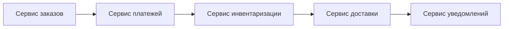
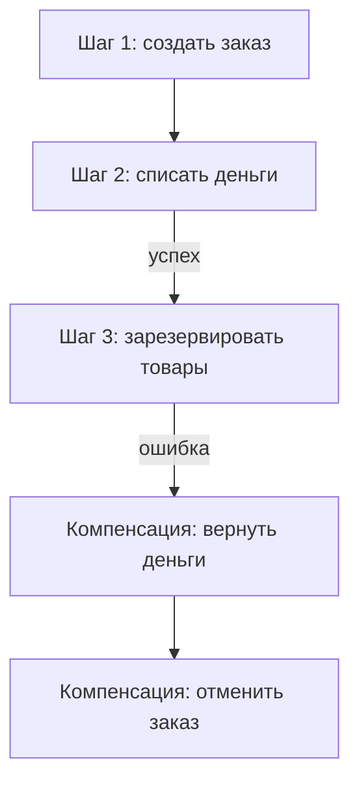
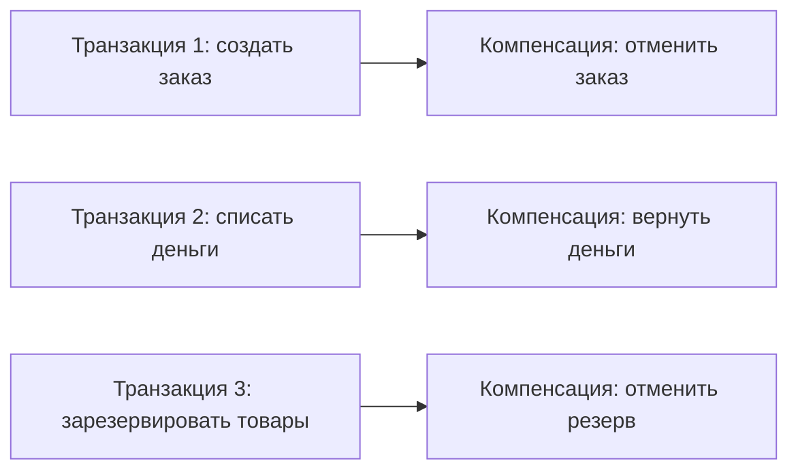
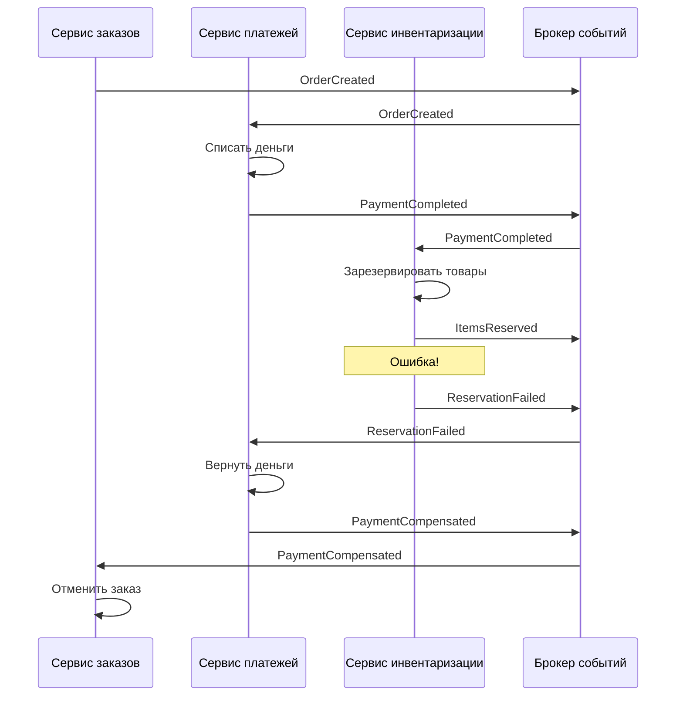
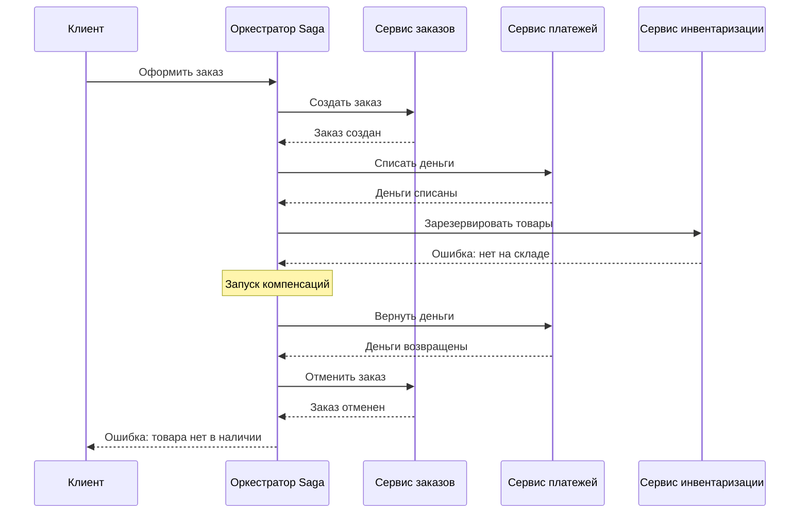
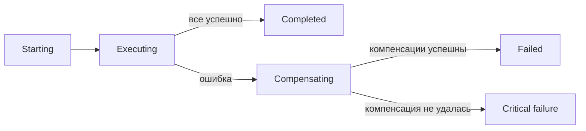
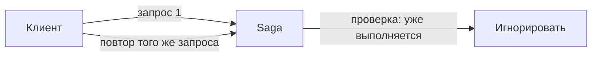
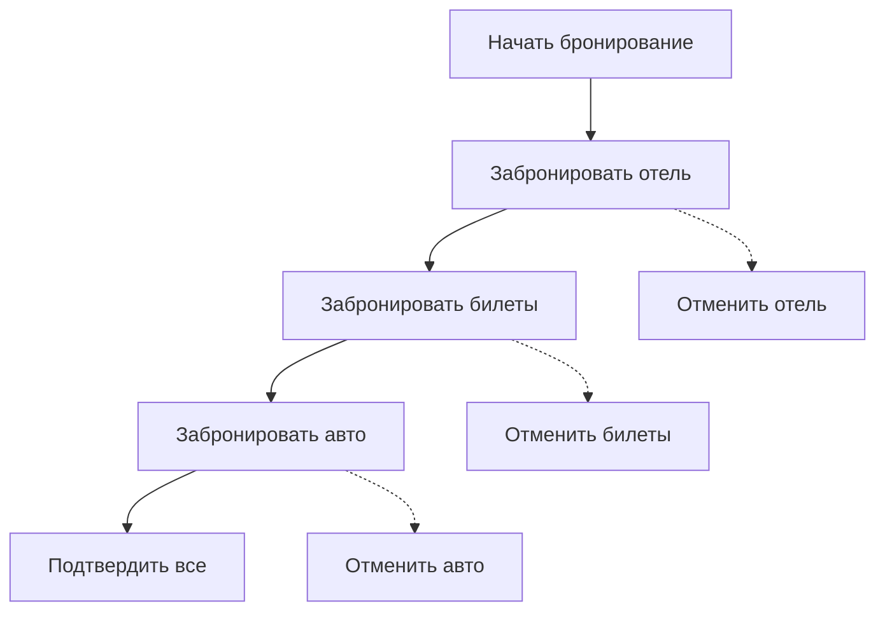

## Введение: Длинная транзакция как серия маленьких шагов

В монолите с одной базой данных ACID-транзакции работают "из коробки". Вы обновляете несколько таблиц в одной транзакции. База данных гарантирует: либо все изменения применятся, либо ни одного. Все просто и надежно.

В микросервисной архитектуре с паттерном Database per Service такой возможности нет. Каждый сервис имеет свою базу данных. Операция, затрагивающая несколько сервисов (например, оформление заказа в интернет-магазине), не может быть атомарной. Нельзя сделать "BEGIN TRANSACTION" через три сервиса.

**Saga** — это паттерн, который решает проблему распределенных транзакций. Saga разбивает длинную операцию на последовательность локальных транзакций. Каждая локальная транзакция обновляет данные в одном сервисе. Если что-то пошло не так, Saga запускает компенсирующие транзакции, которые отменяют уже сделанное.

Saga не дает ACID-гарантий (атомарности в классическом смысле), но обеспечивает eventual consistency (согласованность в конечном счете). Это лучший компромисс для распределенных систем.

## Проблема, которую решает Saga

Представьте интернет-магазин. Оформление заказа требует действий в нескольких сервисах:

1. Сервис заказов: создать заказ со статусом "pending"
2. Сервис платежей: списать деньги с карты пользователя
3. Сервис инвентаризации: зарезервировать товары на складе
4. Сервис доставки: создать заказ на доставку
5. Сервис уведомлений: отправить письмо пользователю



В монолите это одна транзакция: если что-то упало на шаге 3, шаги 1-2 откатываются автоматически. В микросервисах такого нет.

Что произойдет, если сервис платежей списал деньги, а сервис инвентаризации упал? Заказ не создан, но деньги списаны. Пользователь недоволен. Нужен механизм отката — компенсирующая транзакция (вернуть деньги).



Saga определяет, как выполнить эту последовательность и как откатить изменения при ошибке.

## Основная идея Saga

Saga — это последовательность локальных транзакций. У каждой локальной транзакции есть компенсирующая транзакция, которая отменяет ее эффект.



**Нормальное выполнение:**

T1 → T2 → T3 → T4 → ... → успех

**Выполнение с откатом (компенсацией):**

T1 → T2 → T3 (ошибка) → C2 → C1

Важно: компенсации выполняются в обратном порядке. Сначала отменяется последняя успешная транзакция, потом предпоследняя и так далее.

## Два способа реализации Saga

### Хореография (Choreography)

Нет центрального координатора. Сервисы общаются через события. Каждый сервис знает, на какие события реагировать и какие компенсации запускать.



**Плюсы хореографии:**

- Слабая связанность (сервисы не знают друг о друге)
- Нет единой точки отказа (координатора)
- Легко добавлять новые сервисы

**Минусы хореографии:**

- Сложно понять полный поток (логика размазана по сервисам)
- Риск циклических зависимостей (события могут зациклиться)
- Сложность отладки и мониторинга

### Оркестрация (Orchestration)

Есть центральный компонент — **оркестратор** (saga coordinator). Он управляет процессом: решает, какую транзакцию выполнить следующей, и запускает компенсации при ошибках.



**Плюсы оркестрации:**

- Логика процесса в одном месте (легко понять, отлаживать, менять)
- Проще управлять состоянием Saga
- Легче мониторить (оркестратор знает статус каждой Saga)

**Минусы оркестрации:**

- Оркестратор — единая точка отказа (нужна отказоустойчивость)
- Оркестратор может стать "толстым" (слишком много логики)
- Более высокая связанность (сервисы вызываются оркестратором напрямую)

**Что выбрать?**

- **Хореография** — для простых Saga с небольшим количеством сервисов, когда важна слабая связанность.
- **Оркестрация** — для сложных Saga с ветвлениями, когда важна наблюдаемость и простота понимания.

На практике оркестрация используется чаще, особенно в сложных системах.

## Компенсирующие транзакции

Компенсация — это операция, которая отменяет эффект предыдущей локальной транзакции. Она должна быть идемпотентной (повторный вызов не навредит) и коммутативной (порядок выполнения не важен).

Примеры:

| Транзакция | Компенсация |
| :--- | :--- |
| Создать заказ (статус pending) | Отменить заказ (статус cancelled) |
| Списать деньги с карты | Вернуть деньги на карту |
| Зарезервировать товар | Отменить резерв товара |
| Отправить email | Не требуется (или отправить другой email с извинениями) |
| Забронировать отель | Отменить бронь |

**Важные свойства компенсаций:**

- **Идемпотентность.** Если компенсация вызвана дважды (из-за сетевого сбоя), второй вызов не должен навредить. "Вернуть деньги" второй раз не должно вернуть их снова.
- **Компенсируемость.** Не все операции можно компенсировать. Отправку email нельзя "отменить". В таких случаях компенсация может быть отправкой другого email ("извините, произошла ошибка").
- **Длительность.** Компенсация может выполняться долго (например, возврат денег занимает несколько дней). Saga должна учитывать это.

## Состояния Saga

У каждой Saga есть состояние:

- **Starting** — начато
- **Executing** — выполняется (какая-то транзакция в процессе)
- **Compensating** — выполняется компенсация (после ошибки)
- **Completed** — успешно завершена
- **Failed** — завершена с ошибкой (компенсации не помогли)



## Хранение состояния Saga

Оркестратор (или сервисы при хореографии) должны хранить состояние каждой Saga. Это нужно для восстановления после сбоев.

Варианты хранения:

- **В памяти** (только для прототипов, не для production). При падении оркестратора все Saga теряются.
- **В реляционной базе данных.** Таблица saga с полями id, status, current_step, context.
- **В event store.** Saga как последовательность событий (подход Event Sourcing).

```sql
CREATE TABLE sagas (
    id UUID PRIMARY KEY,
    status VARCHAR(50) NOT NULL, -- EXECUTING, COMPLETED, COMPENSATING, FAILED
    current_step INT NOT NULL,
    context JSONB NOT NULL, -- данные, передаваемые между шагами
    created_at TIMESTAMP,
    updated_at TIMESTAMP
);
```

## Пример: Оформление заказа (оркестрация)

**Saga для оформления заказа:**

1. Создать заказ (Order Service)
2. Списать деньги (Payment Service)
3. Зарезервировать товары (Inventory Service)
4. Создать доставку (Delivery Service)
5. Отправить уведомление (Notification Service)

**Компенсации:**

1. (если упали после шага 2) → вернуть деньги
2. (если упали после шага 1) → отменить заказ
3. (если упали после шага 3) → отменить резерв, вернуть деньги, отменить заказ
4. (если упали после шага 4) → отменить доставку, отменить резерв, вернуть деньги, отменить заказ

```python
# Псевдокод: оркестратор Saga
class OrderSaga:
    def execute(self, order_data):
        try:
            # Шаг 1
            order = order_service.create_order(order_data)
            self.save_step("order_created", order.id)
            
            # Шаг 2
            payment = payment_service.charge(order.total, order.user_id)
            self.save_step("payment_charged", payment.id)
            
            # Шаг 3
            inventory = inventory_service.reserve_items(order.items)
            self.save_step("items_reserved", inventory.id)
            
            # Шаг 4
            delivery = delivery_service.create_delivery(order.id)
            self.save_step("delivery_created", delivery.id)
            
            # Шаг 5
            notification_service.send_confirmation(order.user_email)
            
            return {"status": "success", "order_id": order.id}
            
        except Exception as e:
            # Компенсации в обратном порядке
            self.compensate(e)
            return {"status": "failed", "error": str(e)}
    
    def compensate(self, error):
        steps = self.get_completed_steps()
        for step in reversed(steps):
            if step == "delivery_created":
                delivery_service.cancel_delivery(step.data.id)
            elif step == "items_reserved":
                inventory_service.release_items(step.data.id)
            elif step == "payment_charged":
                payment_service.refund(step.data.id)
            elif step == "order_created":
                order_service.cancel_order(step.data.id)
```

## Saga и идемпотентность

В распределенной системе запросы могут дублироваться. Сеть может потерять ответ, и клиент повторит запрос. Saga должна быть идемпотентной.

**Правила:**

- Каждая локальная транзакция должна быть идемпотентной (или использовать idempotency key)
- Компенсации должны быть идемпотентными
- Оркестратор должен уметь восстанавливаться после сбоев и продолжать Saga с того же места



## Saga и ACID: что мы теряем

| ACID свойство | В монолите | В Saga |
| :--- | :--- | :--- |
| **Атомарность (Atomicity)** | Все или ничего | "В конце концов" все или ничего (через компенсации) |
| **Согласованность (Consistency)** | Данные всегда согласованы | Во время выполнения могут быть несогласованы (eventual consistency) |
| **Изоляция (Isolation)** | Изменения не видны до коммита | Промежуточные изменения видны другим транзакциям |
| **Долговечность (Durability)** | Данные сохраняются | Данные сохраняются |

Самая большая проблема — **изоляция**. В Saga промежуточные изменения видны другим транзакциям.

Пример: пользователь оформляет заказ. Saga создала заказ (статус pending) и списала деньги, но еще не зарезервировала товары. В этот момент другой пользователь видит, что товар в наличии (еще не зарезервирован) и пытается его купить. Возникает конфликт.

**Решения проблемы изоляции:**

- **Семантические блокировки.** Устанавливать флаг "временнозарезервировано" на уровне бизнес-логики.
- **Перестановка шагов.** Выполнять сначала операции с высоким риском конфликта.
- **Ограничение видимости.** Скрывать промежуточные состояния от пользователей.

## Преимущества Saga

**ACID не нужен.** Saga позволяет обойтись без распределенных транзакций (2PC, XA), которые имеют проблемы с производительностью и доступностью.

**Масштабируемость.** Каждый сервис обрабатывает только свои локальные транзакции. Saga не требует глобальных блокировок.

**Отказоустойчивость.** Если один сервис упал, Saga может продолжить позже или запустить компенсации.

**Слабая связанность.** При хореографии сервисы общаются через события и не знают друг о друге.

**Поддержка долгих операций.** Saga может выполняться минуты, часы, дни. В отличие от ACID-транзакций, которые должны быть короткими.

## Недостатки и сложности Saga

**Сложность.** Saga значительно сложнее ACID-транзакций. Нужно проектировать компенсации, обрабатывать частичные отказы, хранить состояние.

**Отсутствие изоляции.** Промежуточные изменения видны другим. Нужны дополнительные механизмы (семантические блокировки).

**Сложность отладки.** Трассировка Saga, проходящей через 5 сервисов, сложна. Нужны распределенные трассировка и логирование.

**Риск незавершенных Saga.** Если оркестратор упал, Saga может остаться в промежуточном состоянии. Нужны механизмы восстановления.

**Компенсации не всегда возможны.** Некоторые операции нельзя отменить (отправка email, запись в лог). Для них нужно проектировать идемпотентность или принимать последствия.

## Saga и другие паттерны

**Saga + CQRS.** Команды (запись) идут через Saga, запросы (чтение) — через read models, которые строятся из событий Saga.

**Saga + Event Sourcing.** Состояние Saga хранится как последовательность событий. Это дает аудит и возможность восстановления.

**Saga + Retry.** При временных сбоях Retry может повторить локальную транзакцию, а не запускать компенсацию.

**Saga + Circuit Breaker.** Если сервис постоянно падает, circuit breaker размыкает цепь, и Saga быстро переходит к компенсациям.

## Когда Saga — правильный выбор

- **Микросервисная архитектура с Database per Service.** Это основной кейс. Без Saga вы не можете обеспечить согласованность данных между сервисами.

- **Долгие операции (секунды, минуты, часы).** ACID-транзакции не могут быть долгими (блокировки). Saga может.

- **Операции, затрагивающие несколько сервисов.** Оформление заказа, перевод денег, бронирование билетов.

- **Системы, готовые к eventual consistency.** Saga не дает строгой консистентности. Бизнес должен принимать, что данные могут быть временно несогласованы.

- **Высокая доступность важнее строгой консистентности.** Saga не использует глобальные блокировки и не создает единых точек отказа.

## Когда Saga не подходит

- **Операции, требующие строгой изоляции.** Если промежуточные изменения не должны быть видны другим, Saga проблематична.

- **Операции без компенсаций.** Если операцию нельзя отменить (или отмена очень дорога), Saga не подходит.

- **Очень короткие операции (миллисекунды).** Overhead Saga может быть выше выгоды. Возможно, стоит использовать распределенные транзакции (2PC), если они допустимы.

- **Монолит с одной базой данных.** Saga не нужна. Используйте ACID-транзакции.

## Реальный пример: Бронирование отеля, билетов и аренды авто

Представьте туристический сервис, который бронирует отель, билеты на самолет и аренду авто в одной транзакции.



**Saga (оркестрация):**

1. Оркестратор вызывает сервис отелей: забронировать номер
2. Оркестратор вызывает сервис авиакомпании: забронировать билеты
3. Оркестратор вызывает сервис аренды: забронировать авто
4. Все успешно → оркестратор возвращает успех

**Если сервис авиакомпании вернул ошибку (билетов нет):**

1. Оркестратор запускает компенсацию для отеля: отменить бронь
2. Оркестратор возвращает ошибку пользователю

**Что, если компенсация отеля не удалась?** Сложная ситуация. Оркестратор должен повторять компенсацию (retry) или перевести Saga в состояние "требуется ручное вмешательство".

## Резюме

Saga — это паттерн для управления распределенными транзакциями в микросервисной архитектуре. Saga разбивает длинную операцию на последовательность локальных транзакций, каждая из которых имеет компенсирующую транзакцию для отката.

**Две реализации:**

- **Хореография** — без центрального координатора, через события. Слабая связанность, но сложнее понимать поток.
- **Оркестрация** — с центральным оркестратором. Проще управлять, но оркестратор — точка отказа.

**Компенсирующие транзакции** отменяют эффект предыдущих шагов. Должны быть идемпотентными.

**Проблема изоляции:** промежуточные изменения видны другим транзакциям. Решения — семантические блокировки, перестановка шагов.

**Преимущества:**

- ACID не нужен
- Масштабируемость
- Отказоустойчивость
- Слабая связанность (при хореографии)
- Поддержка долгих операций

**Недостатки:**

- Сложность
- Отсутствие изоляции
- Сложность отладки
- Риск незавершенных Saga
- Компенсации не всегда возможны

**Когда использовать:**

- Микросервисная архитектура с Database per Service
- Долгие операции
- Операции, затрагивающие несколько сервисов
- Системы, готовые к eventual consistency

**Когда не использовать:**

- Нужна строгая изоляция
- Операции без компенсаций
- Очень короткие операции
- Монолит с одной БД

Saga — это не бесплатная замена ACID. Она требует другого способа мышления, проектирования компенсаций и принятия eventual consistency. Но в микросервисной архитектуре без Saga невозможно обеспечить согласованность данных между сервисами. Это один из фундаментальных паттернов распределенных систем.