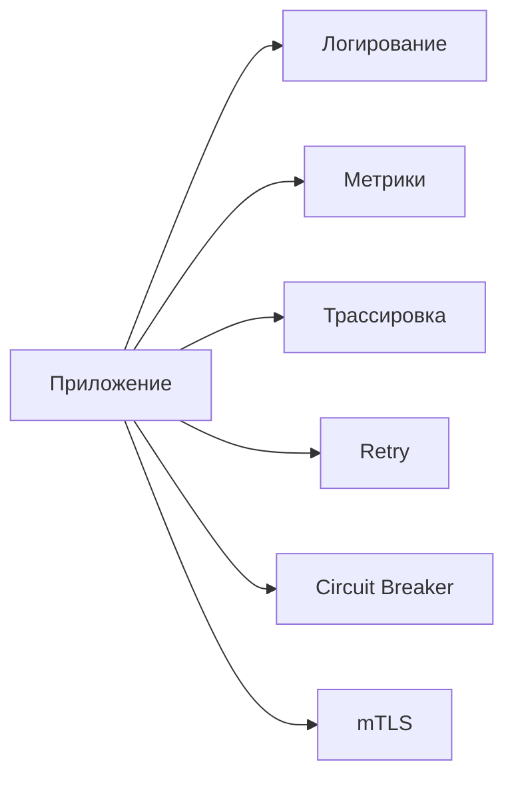
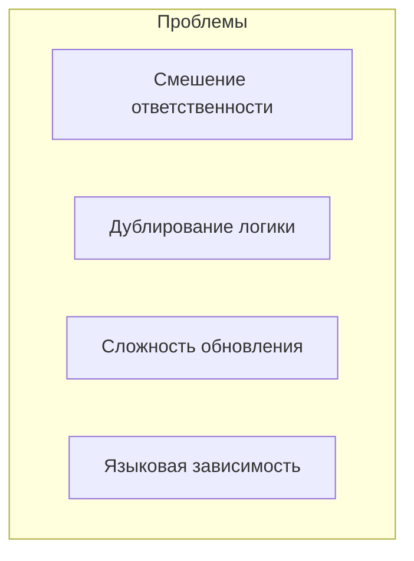
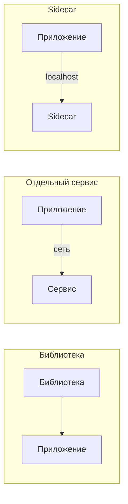
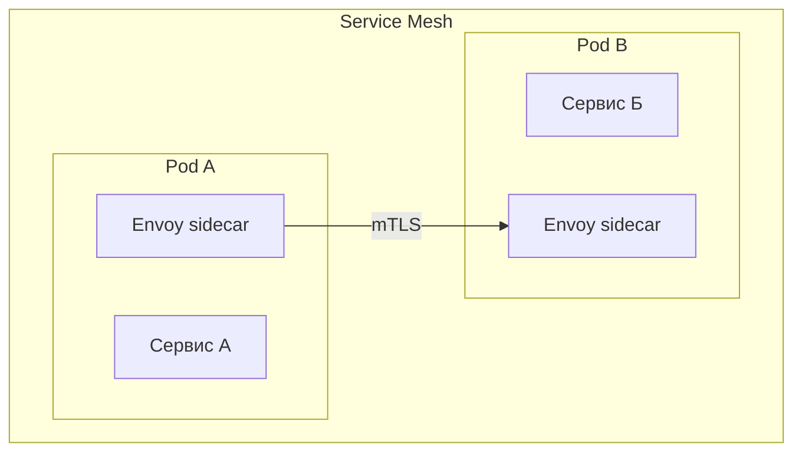
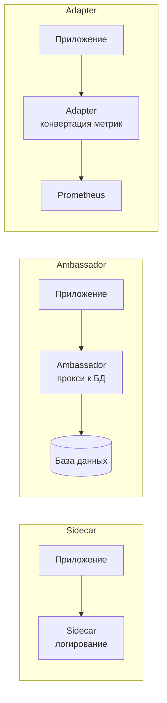

## Введение: Мотоцикл с коляской

Представьте мотоцикл. Он сам по себе — полноценное транспортное средство. Но к нему можно прицепить коляску (sidecar), которая не имеет собственного двигателя, но использует движение мотоцикла, чтобы перемещаться. Коляска может нести дополнительный груз, обеспечивать устойчивость, давать пассажиру отдельное место. Мотоцикл при этом не меняет свою основную функцию — он все так же едет.

**Sidecar Pattern** делает то же самое в программной архитектуре. К основному контейнеру (или процессу) "прицепляется" дополнительный контейнер — sidecar. Они разделяют жизненный цикл (запускаются и останавливаются вместе), разделяют сеть (могут общаться через localhost), но выполняют разные функции. Основной контейнер занимается бизнес-логикой, sidecar — вспомогательными задачами: логирование, мониторинг, конфигурация, сетевая безопасность, service mesh.

Sidecar — это паттерн, который позволяет добавить к существующему приложению новую функциональность без изменения его кода. Вы просто запускаете рядом дополнительный процесс, который перехватывает сетевой трафик, собирает метрики, логирует запросы. Это особенно популярно в мире Kubernetes и service mesh (например, Istio).

## Проблема, которую решает Sidecar

В традиционной архитектуре каждое приложение само отвечает за вспомогательные задачи: логирование, метрики, retry, circuit breaker, безопасность (mTLS), сбор трассировок.



Проблемы:

- **Смешение ответственности.** Код бизнес-логики перемешан с инфраструктурным кодом.
- **Дублирование.** Каждое приложение на разных языках должно реализовывать одно и то же (retry, circuit breaker).
- **Сложность обновления.** Чтобы обновить библиотеку логирования, нужно пересобрать и переразвернуть все приложения.
- **Языковая зависимость.** Библиотека логирования для Java не поможет приложению на Python.



Sidecar решает эти проблемы, вынося вспомогательные функции в отдельный процесс (контейнер), который работает рядом и перехватывает трафик приложения.

## Как работает Sidecar


**Ключевые характеристики:**

- **Общий жизненный цикл.** Sidecar запускается и останавливается вместе с основным приложением.
- **Общая сеть.** Контейнеры в одном Pod имеют общий сетевой namespace. Основное приложение может обращаться к sidecar через localhost.
- **Разделение ответственности.** Основной контейнер занимается только бизнес-логикой. Sidecar занимается инфраструктурой.
- **Прозрачность.** Основное приложение часто не знает о существовании sidecar. Особенно если sidecar работает как прокси, через который проходит весь трафик.

## Типовые задачи для Sidecar

**Логирование и агрегация логов.** Приложение пишет логи в stdout или в файл. Sidecar читает логи, добавляет метаданные (pod id, namespace), отправляет в централизованную систему (ELK, Loki).


**Метрики и мониторинг.** Приложение экспортирует метрики на localhost:9090/metrics. Sidecar (Prometheus exporter) забирает метрики и отдает их системе мониторинга.

**Сетевой прокси (service mesh).** Самый популярный пример — Istio. Sidecar-прокси (Envoy) перехватывает весь входящий и исходящий трафик приложения. Он обеспечивает:

- mTLS (шифрование между сервисами)
- Retry и circuit breaker
- Балансировку нагрузки
- Распределенную трассировку
- Rate limiting


**Конфигурация и обнаружение секретов.** Sidecar может подтягивать конфигурацию из внешнего источника (Consul, etcd) и обновлять конфигурацию приложения без его перезапуска (например, через shared volume или API).

**Кэширование.** Sidecar может кэшировать ответы внешних сервисов, снижая нагрузку на основное приложение.

**Протокольный мост.** Приложение говорит на одном протоколе (например, gRPC), а sidecar конвертирует его в другой (HTTP/JSON) для внешнего мира.

## Sidecar vs библиотека vs отдельный сервис

| Аспект | Библиотека в приложении | Отдельный сервис | Sidecar |
| :--- | :--- | :--- | :--- |
| **Расположение** | Внутри приложения | Отдельный процесс, отдельный сервер | Отдельный процесс, тот же сервер |
| **Языковая зависимость** | Да (нужна библиотека под каждый язык) | Нет (единый сервис) | Нет (sidecar на любом языке) |
| **Задержка** | Минимальная (вызов функции) | Высокая (сетевой вызов) | Низкая (localhost, shared memory) |
| **Изоляция** | Нет (ошибка в библиотеке убивает приложение) | Высокая | Средняя (отдельный процесс, но общий сервер) |
| **Прозрачность** | Нужно менять код | Прозрачно (через API) | Полностью прозрачно (через прокси) |
| **Обновление** | Нужно пересобрать приложение | Независимо | Независимо |



## Sidecar в Kubernetes

В Kubernetes sidecar — это второй контейнер в одном Pod. Pod — минимальная единица развертывания, все контейнеры в Pod разделяют сеть и хранилище.

```yaml
apiVersion: v1
kind: Pod
metadata:
  name: my-app-with-sidecar
spec:
  containers:
  - name: main-app
    image: my-app:latest
    ports:
    - containerPort: 8080
    
  - name: log-sidecar
    image: fluentd:latest
    volumeMounts:
    - name: logs
      mountPath: /var/log/my-app
```

**Преимущества sidecar в Kubernetes:**

- Общий lifecycle (Pod управляет обоими контейнерами)
- Общая сеть (localhost)
- Общие volumes (shared volumes для обмена файлами)
- Автоматическое масштабирование (масштабируется Pod целиком)

## Service Mesh и Sidecar

Service mesh (например, Istio, Linkerd, Consul Connect) — это самый известный пример использования sidecar. В service mesh к каждому микросервису добавляется sidecar-прокси (обычно Envoy).



**Что дает service mesh через sidecar:**

- **mTLS.** Шифрование и аутентификация между сервисами без изменения кода.
- **Retry и timeout.** Настройка retry для конкретных вызовов.
- **Circuit breaker.** Защита от каскадных отказов.
- **Трассировка.** Автоматическое добавление заголовков трассировки.
- **Метрики.** Сбор метрик (запросы/сек, задержки, ошибки) без изменения кода.
- **Балансировка нагрузки.** Между экземплярами сервиса.
- **Canary deployments.** Постепенный перенос трафика на новую версию.

```yaml
# Istio VirtualService с retry
apiVersion: networking.istio.io/v1beta1
kind: VirtualService
spec:
  http:
  - route:
    - destination:
        host: weather-service
    retries:
      attempts: 3
      perTryTimeout: 2s
```

## Преимущества Sidecar

**Разделение ответственности.** Основное приложение занимается только бизнес-логикой. Инфраструктурные задачи вынесены в sidecar. Код становится чище.

**Независимость от языка.** Sidecar может быть написан на любом языке. Приложение на Python может использовать sidecar на Go (Envoy) или Java.

**Прозрачность.** Приложение часто не знает о sidecar. Особенно если sidecar работает как прозрачный прокси (перехватывает трафик через iptables).

**Независимое обновление.** Можно обновить sidecar (добавить новый функционал, исправить баг), не пересобирая и не переразвертывая основное приложение.

**Переиспользование.** Один и тот же sidecar можно использовать с разными приложениями (например, стандартный sidecar для логирования во всей компании).

**Добавление функциональности без изменения кода.** Нужен circuit breaker? Не меняйте код приложения — добавьте sidecar-прокси.

## Недостатки и сложности Sidecar

**Дополнительное потребление ресурсов.** Каждый sidecar потребляет CPU, память, диски. При большом количестве Pod overhead может быть значительным. В Istio sidecar потребляет около 0.5 vCPU и 100-200 MB памяти.

**Сложность отладки.** Трафик идет через sidecar. При проблемах сложно понять: проблема в приложении, в sidecar или в сети между sidecar. Нужны хорошие инструменты observability.

**Дополнительная задержка.** Запрос проходит через sidecar (а иногда через два: на стороне клиента и сервера). Это добавляет миллисекунды к задержке.

**Управление конфигурацией.** Нужно настраивать sidecar. В service mesh конфигурация может быть сложной (VirtualService, DestinationRule, Gateway).

**Совместимость.** Не все приложения прозрачно работают через прокси. Некоторые протоколы (например, gRPC streaming, WebSocket) могут требовать специальной настройки.

**Жизненный цикл.** Sidecar разделяет жизненный цикл с основным контейнером. Если sidecar падает, Pod может быть перезапущен, даже если основное приложение работает.

## Sidecar vs Ambassador vs Adapter

В Kubernetes есть похожие паттерны:

- **Sidecar.** Живет рядом с основным контейнером, расширяет его функциональность. Пример: fluentd для логов, envoy для прокси.

- **Ambassador.** Специализированный sidecar для проксирования запросов к внешнему миру. Запускается вместе с приложением, но работает как "посол" к внешним сервисам.

- **Adapter.** Трансформирует интерфейс приложения для внешнего мира. Например, приложение отдает метрики в одном формате, adapter конвертирует их в формат Prometheus.



## Пример: Sidecar для логирования

Представьте приложение, которое пишет логи в файл /var/log/app.log. Sidecar на Fluentd читает этот файл и отправляет логи в Elasticsearch.

```yaml
apiVersion: v1
kind: Pod
metadata:
  name: app-with-logging-sidecar
spec:
  containers:
  - name: main-app
    image: my-app
    volumeMounts:
    - name: logs
      mountPath: /var/log
  
  - name: fluentd
    image: fluent/fluentd
    volumeMounts:
    - name: logs
      mountPath: /var/log
    env:
    - name: FLUENT_ELASTICSEARCH_HOST
      value: "elasticsearch.default.svc.cluster.local"
  
  volumes:
  - name: logs
    emptyDir: {}
```

Приложение ничего не знает о Fluentd. Оно просто пишет логи в /var/log/app.log. Fluentd забирает их и отправляет. Чтобы добавить логирование в новое приложение, не нужно менять его код — достаточно добавить sidecar.

## Пример: Service Mesh (Istio) как sidecar

В Istio sidecar-прокси (Envoy) внедряется в каждый Pod автоматически (через admission webhook). Приложение не знает о прокси.


**Что приложение получает бесплатно (без изменения кода):**

- mTLS между сервисами
- Retry и timeout
- Circuit breaker
- Метрики (Prometheus)
- Трассировка (Jaeger)

## Когда Sidecar — правильный выбор

- **Инфраструктурные сквозные задачи.** Логирование, метрики, трассировка, безопасность (mTLS), retry, circuit breaker — все это идеально для sidecar.

- **Гетерогенные окружения.** У вас есть приложения на разных языках (Java, Python, Go, Node.js). Sidecar на одном языке может обслуживать все.

- **Не хотите менять существующий код.** У вас есть legacy приложение, которое нельзя легко изменить. Sidecar позволяет добавить функциональность без переписывания.

- **Service mesh.** Это классический пример sidecar. Если вам нужны продвинутые сетевые возможности (mTLS, canary deployments, circuit breaker), service mesh на sidecar — стандарт.

- **Крупные системы с множеством микросервисов.** Overhead sidecar оправдан, если у вас десятки или сотни сервисов. Переиспользование единого sidecar снижает дублирование.

## Когда Sidecar не нужен

- **Небольшой проект (3-5 микросервисов).** Overhead sidecar может быть выше выгоды. Проще использовать библиотеки.

- **Приложения с очень низкими требованиями к задержке (миллисекунды).** Каждый дополнительный прыжок через sidecar добавляет задержку.

- **Ограниченные ресурсы.** Если у вас мало памяти/CPU на узлах, sidecar могут создать проблему.

- **Все приложения на одном языке.** Если все сервисы на Java, можно использовать общую библиотеку, а не sidecar.

- **Простая архитектура без сетевых сложностей.** Если вам не нужны mTLS, retry, circuit breaker, canary, sidecar может быть избыточен.

## Резюме

Sidecar Pattern — это паттерн, при котором к основному приложению (контейнеру) добавляется дополнительный процесс (контейнер), разделяющий с ним жизненный цикл и сеть. Sidecar выполняет вспомогательные функции: логирование, метрики, сетевой прокси, безопасность.

**Как работает:**

- Sidecar запускается вместе с основным приложением (в одном Pod в Kubernetes)
- Разделяет сеть (доступ через localhost)
- Разделяет хранилище (shared volumes)
- Может быть прозрачным (перехват трафика)

**Типовые задачи:**

- Логирование и агрегация логов (Fluentd, Logstash)
- Метрики и мониторинг (Prometheus exporters)
- Service mesh (Envoy, Linkerd) — mTLS, retry, circuit breaker, трассировка
- Конфигурация и секреты
- Кэширование
- Протокольные мосты

**Преимущества:**

- Разделение ответственности (бизнес-логика vs инфраструктура)
- Независимость от языка
- Прозрачность (не нужно менять код приложения)
- Независимое обновление
- Переиспользование

**Недостатки:**

- Дополнительное потребление ресурсов (CPU, память)
- Дополнительная задержка (сетевые прыжки)
- Сложность отладки
- Управление конфигурацией
- Жизненный цикл (при падении sidecar падает Pod)

**Когда использовать:**

- Инфраструктурные сквозные задачи (логи, метрики, безопасность)
- Гетерогенные окружения (разные языки)
- Legacy приложения, которые нельзя легко изменить
- Service mesh для сетевых функций
- Крупные системы с множеством микросервисов

**Когда не использовать:**

- Небольшие проекты
- Системы с экстремально низкой задержкой
- Ограниченные ресурсы
- Все приложения на одном языке (можно библиотекой)
- Простая архитектура без сложных сетевых требований

Sidecar — это мощный паттерн, особенно в экосистеме Kubernetes. Он позволяет отделить инфраструктурные задачи от бизнес-логики, добавить функциональность без изменения кода и унифицировать подход к сквозным задачам в гетерогенных окружениях. Самый известный пример — service mesh (Istio, Linkerd), где sidecar-прокси дают mTLS, retry, circuit breaker, трассировку и canary deployments бесплатно для приложений на любом языке.

Однако sidecar не бесплатен. Он потребляет ресурсы и добавляет задержку. Для небольших проектов или систем с экстремально низкой задержкой sidecar может быть избыточным. Но для крупных распределенных систем с множеством микросервисов на разных языках sidecar — это стандарт де-факто.