## Введение: Как дерево душит старый дом

В тропических лесах есть фиговое дерево-душитель (strangler fig). Оно начинает расти рядом с другим деревом, пуская корни в землю. Затем его ветви обвивают ствол дерева-хозяина. Постепенно фиговое дерево растет, переплетается с хозяином, а дерево-хозяин со временем отмирает. В итоге остается только фиговое дерево, которое держит форму своего предшественника.

**Strangler Fig Pattern** делает то же самое с программным обеспечением. Когда вам нужно заменить старую систему (монолит) на новую (микросервисы), вы не переписываете все сразу. Это слишком рискованно и долго. Вместо этого вы постепенно:

1. Создаете новый компонент (микросервис) рядом со старым
2. Настраиваете маршрутизацию так, чтобы часть запросов шла в новый компонент, а часть — в старый
3. Со временем перенаправляете все больше запросов в новый компонент
4. Когда старый компонент больше не используется — удаляете его

Strangler Fig — это паттерн для постепенной замены legacy-систем без "большого взрыва" (big bang rewrite). Он позволяет сохранять систему работающей в процессе миграции, снижать риски и получать обратную связь на ранних этапах.

## Проблема, которую решает Strangler Fig

У вас есть старый монолит, который работает годами. Он приносит деньги. Он содержит критическую бизнес-логику. Но он уже не справляется: сборка долгая, разработка медленная, технологии устарели.

Вы хотите перейти на новую архитектуру (микросервисы, современный стек). У вас есть два варианта:

**Вариант 1: Big Bang Rewrite.** Останавливаете разработку в старом монолите. Пишете новую систему с нуля. Когда новая система готова — выключаете старую и включаете новую.

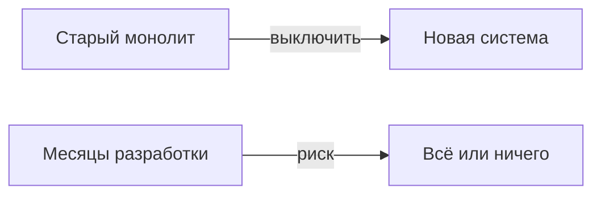

Риски:

- **Долго.** Переписывание большого монолита может занять годы.
- **Рискованно.** Если в новой системе есть баги, бизнес остановится.
- **Нет обратной связи.** Вы не узнаете о проблемах, пока не включите систему целиком.
- **Бизнес не ждет.** Пока вы переписываете, конкуренты уже выпустили новые фичи.

**Вариант 2: Strangler Fig.** Постепенно заменяете части старой системы на новые. Система продолжает работать в процессе миграции.

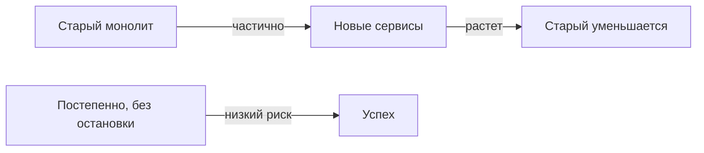

## Как работает Strangler Fig

### Шаг 1: Создание маршрутизатора (Facade)

Сначала вы создаете маршрутизатор (API Gateway, Reverse Proxy, Load Balancer), который будет направлять запросы либо в старую систему, либо в новую.

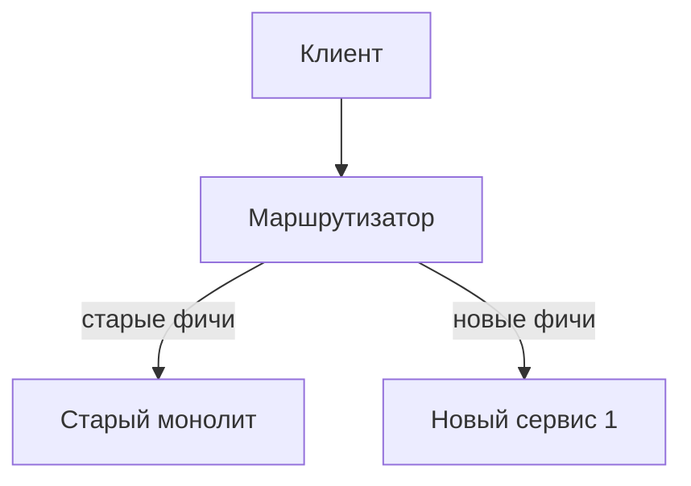

### Шаг 2: Постепенное вытеснение

Вы выбираете одну функцию (например, "управление пользователями") и реализуете ее в новом микросервисе. Настраиваете маршрутизатор так, чтобы запросы к этой функции шли в новый сервис. Остальные запросы идут в старый монолит.

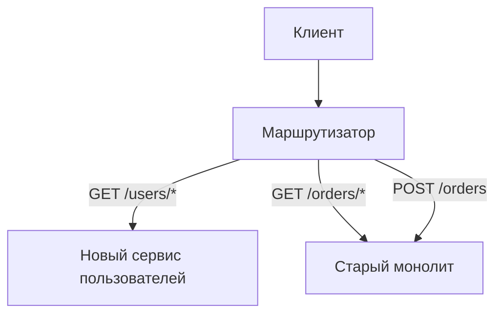

### Шаг 3: Итерации

Повторяете для следующей функции. Реализуете ее в новом сервисе, перенаправляете трафик. Постепенно старый монолит теряет функциональность.

```mermaid
graph TD
    Client[Клиент] --> Router[Маршрутизатор]
    Router -->|GET /users/*| NewUsers
    Router -->|GET /orders/*| NewOrders[Новый сервис заказов]
    Router -->|POST /orders| NewOrders
    Router -->|GET /payments/*| Old[Старый монолит (только платежи)]
```

### Шаг 4: Удаление старого

Когда все функции перенесены, старый монолит больше не получает запросов. Вы можете его выключить и удалить.

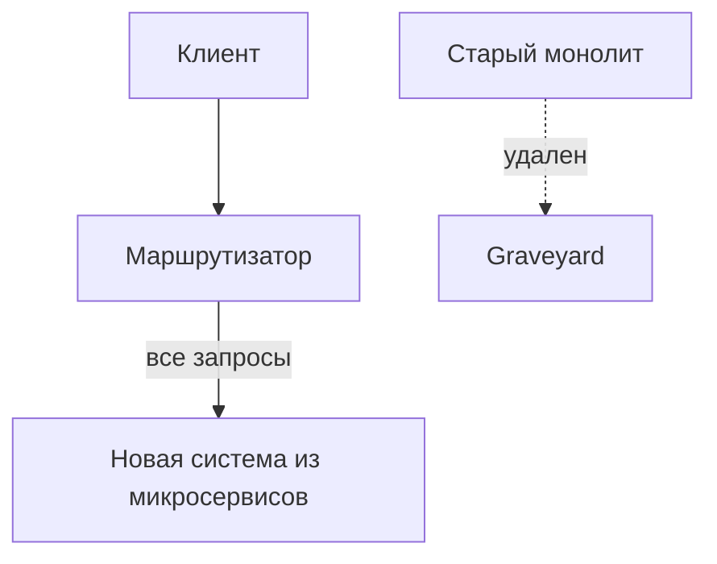

## Стратегии маршрутизации

### Маршрутизация по URL (API Gateway)

Разные URL идут в разные сервисы.

```
/users/*     → новый сервис пользователей
/orders/*    → новый сервис заказов
/payments/*  → старый монолит (еще не перенесли)
```

### Маршрутизация по заголовкам (canary / feature flags)

Одни и те же URL, но разные заголовки. Например, пользователи из группы "beta" идут в новый сервис.

```
Header: X-Canary: v2 → новый сервис
Header: X-Canary: v1 → старый монолит
```

### Маршрутизация по проценту трафика (canary)

Постепенно увеличиваете процент трафика, идущего в новый сервис.

```
5% трафика → новый сервис
95% трафика → старый монолит
... через неделю ...
50% → новый, 50% → старый
... через месяц ...
100% → новый
```

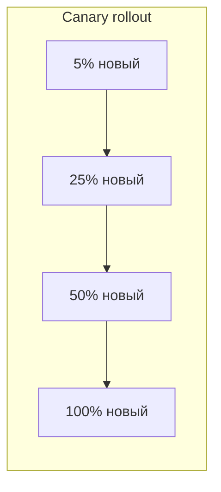

### Маршрутизация по пользователям (user-based)

Сначала переводите на новую систему только определенных пользователей (например, сотрудников компании, бета-тестеров).

```
user_id in [1,2,3] → новый сервис
user_id not in [1,2,3] → старый монолит
```

## Стратегии миграции данных

Одна из самых сложных частей — миграция данных. Старый монолит хранит данные в своей базе. Новые сервисы имеют свои базы (Database per Service).

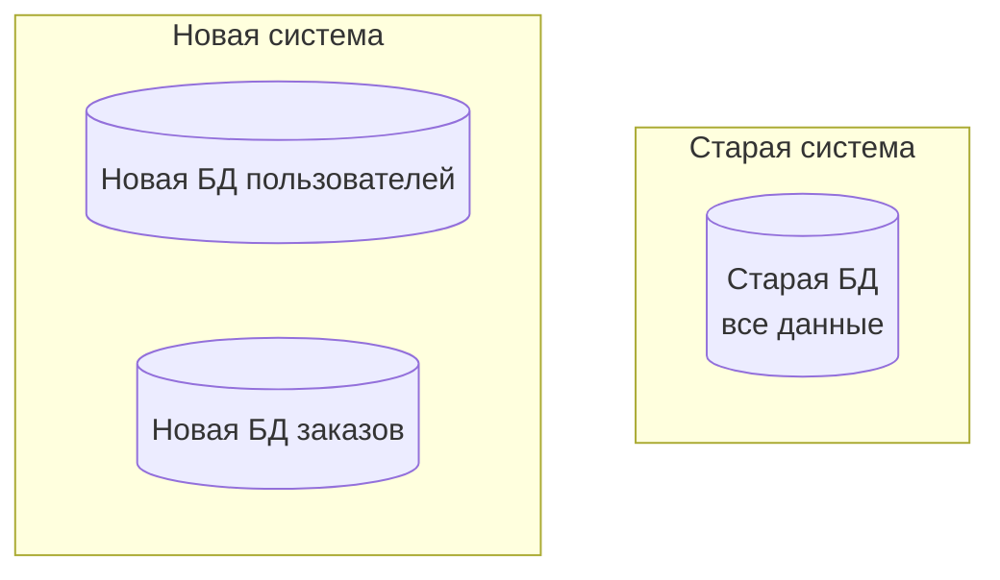

### Стратегия 1: Общая база данных на время миграции

Новые сервисы читают и пишут в старую базу данных. Это временное решение, которое позволяет мигрировать постепенно.

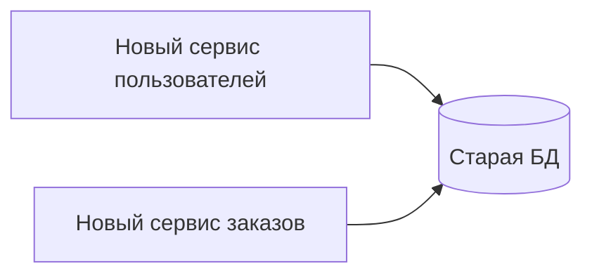

Плюсы: просто. Минусы: новые сервисы зависят от старой схемы БД.

### Стратегия 2: Двойная запись (dual-write)

Новые сервисы пишут и в свою новую БД, и в старую. Читают из новой (или из старой, в зависимости от этапа).

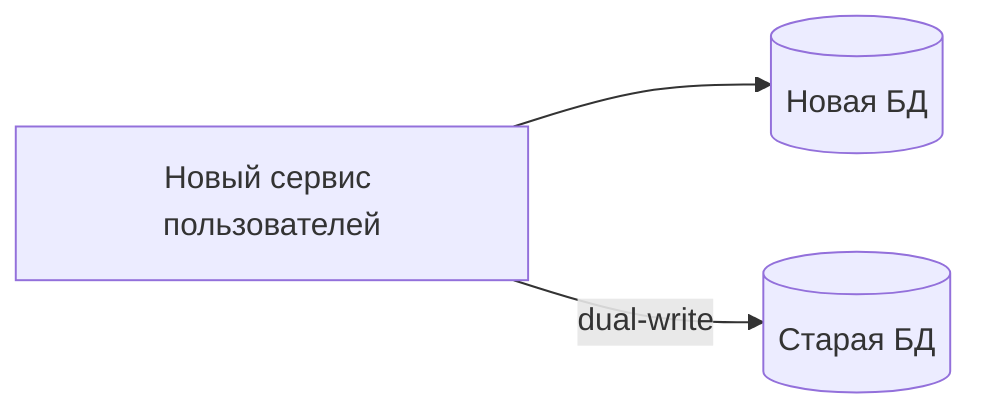

### Стратегия 3: Миграция данных через события

Старая система публикует события об изменениях данных. Новые сервисы подписываются и наполняют свои БД.

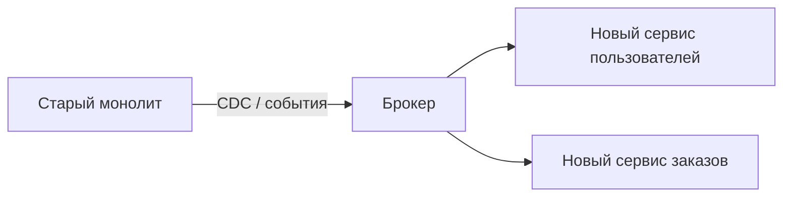

Это чистое решение, но требует изменений в старом монолите (или использования CDC, например, Debezium).

## Пример: Миграция интернет-магазина с монолита на микросервисы

**Исходное состояние:** Монолит на Java + PostgreSQL. Одна база данных. Функции: пользователи, заказы, платежи, инвентаризация, поиск, рекомендации.

**Проблемы:** Долгая сборка (40 минут), релизы раз в неделю, конфликты в команде из 20 разработчиков.

**Решение: Strangler Fig миграция.**

**Месяц 1: Подготовка.** Создаем API Gateway (Kong) перед монолитом. Все запросы идут в монолит. Ничего не изменилось для пользователей.

**Месяц 2: Первый сервис — пользователи.** Выделяем сервис пользователей (Node.js + PostgreSQL). API Gateway настраиваем: GET /users/* → новый сервис, все остальное → монолит. Мигрируем данные пользователей из старой БД в новую (однократная миграция + синхронизация через события).

**Месяц 3: Второй сервис — заказы.** Выделяем сервис заказов (Go + PostgreSQL). API Gateway: GET /orders/*, POST /orders → новый сервис. Остальное → монолит (платежи, инвентаризация).

**Месяц 4: Третий сервис — поиск.** Выделяем сервис поиска (Elasticsearch). API Gateway: GET /search → новый сервис.

**Месяц 5: Четвертый сервис — платежи.** Выделяем сервис платежей (Java + PostgreSQL). API Gateway: /payments/* → новый сервис.

**Месяц 6: Инвентаризация и рекомендации.** Выделяем оставшиеся функции.

**Месяц 7:** Монолит больше не получает запросов. Выключаем его. Удаляем старый код. Успех!

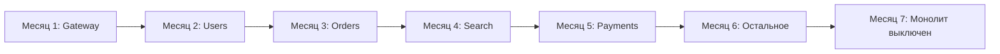

## Преимущества Strangler Fig

**Низкий риск.** Система продолжает работать в процессе миграции. Если что-то пошло не так, вы всегда можете вернуть трафик на старый монолит.

**Ранняя обратная связь.** Вы начинаете получать пользу от новой архитектуры раньше. Уже после первого выделенного сервиса вы можете развертывать его независимо.

**Бизнес не останавливается.** Пока вы мигрируете, вы продолжаете выпускать новые фичи (или хотя бы не ломаете существующие).

**Обучение команды.** Команда постепенно осваивает новые технологии и паттерны на небольших, изолированных сервисах, а не на всем монолите сразу.

**Приоритизация.** Вы можете сначала выделить самые проблемные части монолита (те, которые часто меняются, тормозят, создают конфликты).

**Возможность остановиться.** Вы не обязаны мигрировать все. Можно выделить несколько сервисов, а остальное оставить в монолите. Гибридная архитектура — тоже успех.

## Недостатки и сложности Strangler Fig

**Сложность маршрутизации.** API Gateway должен правильно маршрутизировать запросы. При сложной логике (например, запросы, которые должны идти в оба места) это нетривиально.

**Распределенные транзакции.** Операции, затрагивающие и старый монолит, и новый сервис, становятся сложными. Нужны Saga или eventual consistency.

**Миграция данных.** Самая сложная часть. Нужно синхронизировать данные между старой БД и новыми. Dual-write, CDC, события — все это добавляет сложность.

**Временное дублирование кода.** На время миграции некоторые функции существуют и в старом монолите, и в новых сервисах. Нужно поддерживать их согласованность.

**Длительность.** Миграция может занять годы. Нужно планировать, приоритезировать, поддерживать мотивацию команды.

**Дополнительная инфраструктура.** API Gateway, service discovery, мониторинг, трассировка — все это нужно для работы гибридной системы.

## Strangler Fig и другие паттерны

**Strangler Fig + API Gateway.** API Gateway — естественный маршрутизатор для Strangler Fig. Именно он направляет запросы в старую или новую систему.

**Strangler Fig + Feature Flags.** Можно использовать feature flags для включения нового функционала для определенных пользователей.

**Strangler Fig + Canary Deployments.** Постепенное увеличение процента трафика на новые сервисы.

**Strangler Fig + Database per Service.** Новая архитектура, к которой вы идете, должна иметь Database per Service. Миграция данных — ключевая задача.

**Strangler Fig + Event Sourcing.** События от старой системы (через CDC) могут наполнять новые сервисы данными.

## Когда Strangler Fig — правильный выбор

- **Большой, критический монолит.** Система приносит деньги, ее нельзя выключить на время переписывания.

- **Медленная разработка.** Монолит уже тормозит, но бизнес требует новых фич. Strangler Fig позволяет постепенно ускорять разработку.

- **Команда выросла.** В монолите работают 20+ разработчиков, конфликты стали нормой. Strangler Fig помогает разделить их по сервисам.

- **Технологии устарели.** Монолит написан на древних версиях Java/Python/Ruby, обновить которые невозможно без переписывания.

- **Устаревшая архитектура.** Монолит не позволяет масштабироваться, использовать современные паттерны (CQRS, Event Sourcing, микросервисы).

- **Нет времени на полную переписку.** Big bang rewrite займет годы, а бизнес не может ждать.

## Когда Strangler Fig не нужен

- **Небольшой монолит.** Если система небольшая, проще переписать ее за месяц.

- **Нет проблем.** Если монолит работает нормально, разработка быстрая, команда маленькая — не трогайте.

- **Стартап.** Если вы еще не нашли product-market fit, не тратьте время на миграцию. Пишите новый код с нуля.

- **Нет ресурсов.** Strangler Fig требует инвестиций в инфраструктуру (API Gateway, мониторинг, трассировка) и времени команды.

- **Система на грани жизни.** Если монолит уже еле дышит, может быть, проще переписать с нуля, чем пытаться его "душить".

## Реальный пример: Netflix

Netflix — классический пример Strangler Fig. Они начинали с монолита на Java (в дата-центрах). Затем начали постепенно выносить функции в микросервисы в AWS.

- **Шаг 1:** API Gateway перед монолитом.
- **Шаг 2:** Вынесли сервис кодирования видео.
- **Шаг 3:** Вынесли сервис рекомендаций.
- **Шаг 4:** Вынесли сервис пользователей.
- **Шаг 5:** ... и так несколько лет.

В конце концов монолит был полностью заменен тысячами микросервисов. Никто не выключал Netflix на время миграции. Пользователи ничего не заметили.

## Резюме

Strangler Fig Pattern — это паттерн для постепенной замены legacy-систем на новые. Вместо рискованного big bang rewrite, вы постепенно "душите" старую систему, вынося функциональность в новые компоненты.

**Как работает:**

1. Создаете маршрутизатор (API Gateway) перед старой системой
2. Выделяете одну функцию в новый сервис
3. Перенаправляете запросы к этой функции на новый сервис
4. Повторяете для других функций
5. Когда старый монолит больше не получает запросов — удаляете его

**Стратегии маршрутизации:**

- По URL (разные пути)
- По заголовкам (canary, feature flags)
- По проценту трафика (canary rollout)
- По пользователям (beta-тестеры)

**Миграция данных (самое сложное):**

- Общая БД на время миграции
- Двойная запись (dual-write)
- События / CDC из старой системы

**Преимущества:**

- Низкий риск (можно откатить)
- Ранняя обратная связь
- Бизнес не останавливается
- Обучение команды
- Приоритизация (сначала самые больные места)
- Возможность остановиться (гибридная архитектура)

**Недостатки:**

- Сложность маршрутизации
- Распределенные транзакции
- Миграция данных
- Временное дублирование кода
- Длительность (месяцы или годы)
- Дополнительная инфраструктура

**Когда использовать:**

- Большой, критический монолит
- Медленная разработка
- Команда выросла
- Технологии устарели
- Нет времени на полную переписку

**Когда не использовать:**

- Небольшой монолит
- Нет проблем
- Стартап (еще не нашли product-market fit)
- Нет ресурсов на инфраструктуру

Strangler Fig — это стандартный способ миграции с монолита на микросервисы в индустрии. Netflix, Amazon, Uber, многие банки использовали этот паттерн. Он не быстрый, но безопасный. Вместо "взрыва" старой системы и постройки новой на пепелище, вы постепенно "душите" монолит, сохраняя систему работающей. Это требует терпения и дисциплины, но результат того стоит.