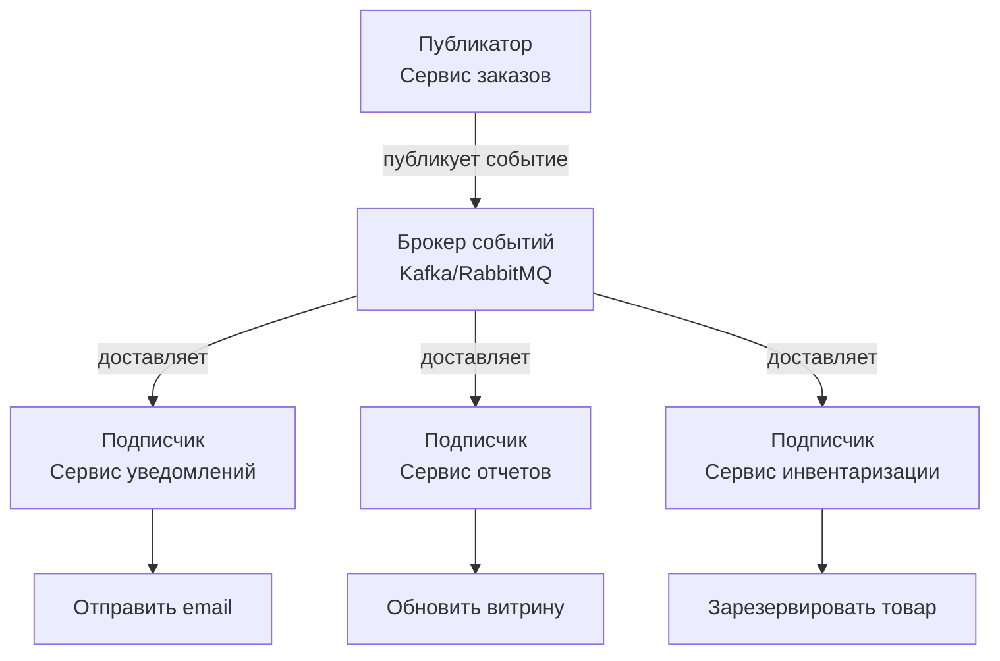
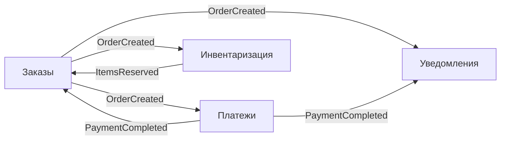
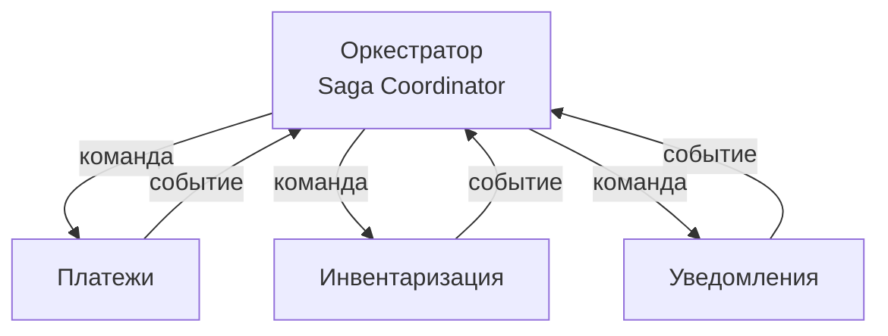
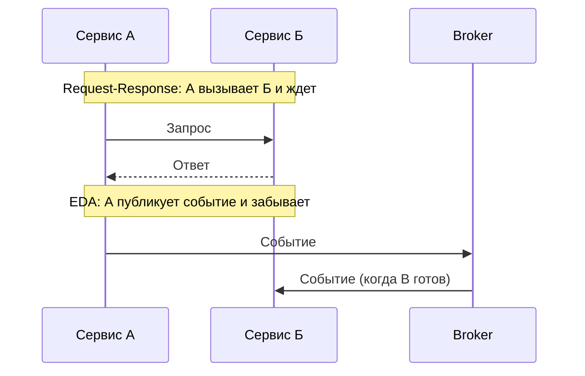
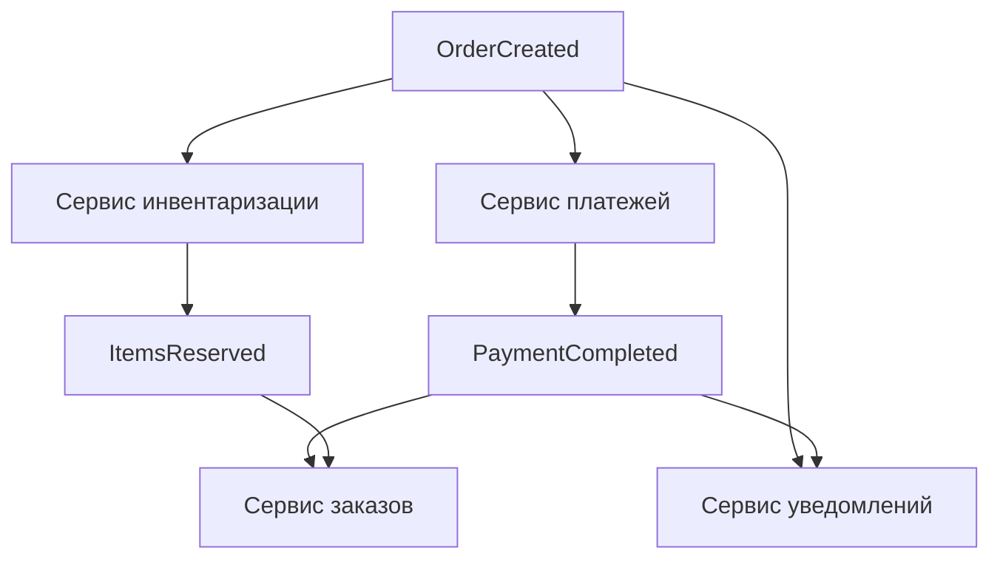
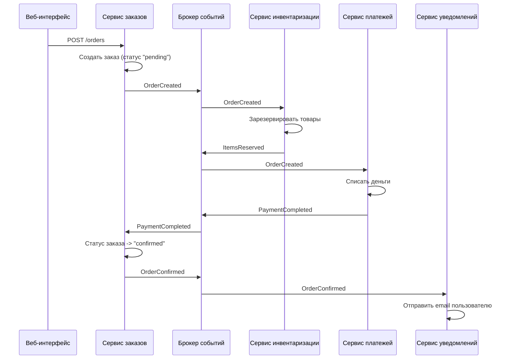

## Введение: Когда важнее не команда, а известие

Представьте, что вы управляете складом. Приехала машина с товаром. Что делать? В монолитной архитектуре вы бы написали: "разгрузить машину, потом обновить базу данных, потом отправить уведомление в бухгалтерию, потом обновить витрину на сайте" — все это одна большая процедура.

А теперь представьте другой подход. Вы просто кричите: "Приехала машина с товаром!" И все, кому это важно, реагируют сами. Кладовщик слышит и идет разгружать. Бухгалтер слышит и готовит документы. Отдел продаж слышит и обновляет витрину. Вы не управляете их действиями. Вы просто сообщаете факт.

**Событийно-ориентированная архитектура (Event-Driven Architecture, EDA)** — это подход, при котором компоненты системы общаются не напрямую, а через события. Один компонент публикует событие ("заказ создан", "пользователь зарегистрирован", "платеж прошел"). Другие компоненты, которым это интересно, подписываются на эти события и реагируют на них. Отправитель события не знает, кто его получит. Получатель не знает, кто его отправил. Важен только факт: "что-то произошло".

EDA радикально отличается от привычного request-response (запрос-ответ), где один компонент вызывает другой и ждет ответа. В EDA системы становятся слабо связанными, асинхронными и более устойчивыми к отказам. Но плата за это — сложность понимания потока данных и eventual consistency.

## Что такое событие

**Событие** — это факт, который произошел в системе. Событие неизменяемо (его нельзя "отменить" или "изменить", можно только опубликовать новое событие). Событие описывает то, что случилось, в прошедшем времени.

Примеры событий:

- "Заказ создан" (OrderCreated)
- "Платеж выполнен" (PaymentCompleted)
- "Пользователь зарегистрирован" (UserRegistered)
- "Товар добавлен в корзину" (ItemAddedToCart)
- "Доставка назначена" (DeliveryScheduled)

Событие обычно содержит информацию о том, что произошло: тип события, идентификатор сущности, время, данные, которые могут быть полезны подписчикам.

```json
{
  "eventType": "OrderCreated",
  "orderId": "ORD-12345",
  "userId": "USR-789",
  "totalAmount": 299.99,
  "timestamp": "2024-01-15T10:30:00Z",
  "items": [
    {"productId": "PRD-1", "quantity": 2},
    {"productId": "PRD-2", "quantity": 1}
  ]
}
```

Важное свойство события: оно описывает факт, который уже произошел. Никто не может "отменить" событие. Можно только опубликовать новое событие "Заказ отменен". Это делает систему аудитируемой — всегда можно восстановить последовательность событий.

## Как работает EDA: Брокер событий

В центре EDA находится **брокер событий (event broker)** — специальный сервис, который принимает события и доставляет их подписчикам. Популярные брокеры: Apache Kafka, RabbitMQ, Amazon SNS/SQS, Redis Pub/Sub.



Процесс выглядит так:

1. **Публикация.** Сервис А создает событие и отправляет его в брокер. Сервис А не ждет ответа. Он не знает, кто получит событие и что с ним сделают.

2. **Хранение (опционально).** Некоторые брокеры (Kafka) хранят события долго. Это позволяет новым подписчикам прочитать историю событий.

3. **Доставка.** Брокер доставляет событие всем подписчикам, которые заявили, что им интересны события этого типа.

4. **Обработка.** Каждый подписчик обрабатывает событие независимо. Если один подписчик упал, другие все равно получат событие.

## Два стиля EDA

### Хореография (Choreography)

Это "чистый" EDA. Нет центрального координатора. Каждый сервис сам решает, на какие события реагировать и какие события публиковать.



**Плюсы:** очень слабая связанность, легко добавлять новых подписчиков. **Минусы:** сложно понять полную картину, нет единого места, где видна вся логика.

**Пример.** Сервис заказов публикует "OrderCreated". Сервис платежей подписан — он пытается списать деньги. Если успешно, публикует "PaymentCompleted". Сервис заказов подписан на "PaymentCompleted" и меняет статус заказа. Сервис уведомлений подписан на оба события и отправляет письма. Нет никого, кто бы всем управлял. Каждый делает свое дело.

### Оркестрация (Orchestration)

Это гибрид. Есть центральный компонент — **оркестратор**, который управляет процессом. Он посылает команды другим сервисам и ждет ответов. События используются для уведомления об изменениях состояния, но логика централизована.



**Плюсы:** логика процесса в одном месте, легче понимать и отлаживать. **Минусы:** оркестратор становится потенциальным узким местом и точкой отказа.

**Пример.** Оркестратор оформления заказа посылает команду сервису инвентаризации: "зарезервируй товары". Получив подтверждение, посылает команду сервису платежей: "спиши деньги". Получив подтверждение, посылает команду сервису уведомлений: "отправь письмо". Если что-то пошло не так, оркестратор запускает компенсацию.

На практике многие системы используют смесь: хореография для простых, независимых процессов, оркестрация для сложных, где важна последовательность.

## EDA vs Request-Response

Главное отличие EDA от традиционного request-response — асинхронность и отсутствие прямых связей.

| Аспект | Request-Response (REST, gRPC) | EDA (события) |
| :--- | :--- | :--- |
| Связанность | Высокая (А знает о Б) | Низкая (А не знает о подписчиках) |
| Ожидание ответа | Синхронное, блокирующее | Асинхронное, неблокирующее |
| Отказоустойчивость | Каскадные отказы | Изоляция, очереди |
| Масштабирование | Каждый сервис под свою нагрузку | Подписчики масштабируются независимо |
| Консистентность | Строгая (если база одна) | Eventual |
| Понимание потока | Просто (видно вызовы) | Сложно (события разлетаются) |



## Типы событий

События бывают разных типов, и понимание этого важно для проектирования.

**Domain events (события домена)** — описывают что-то, что случилось в бизнес-логике. "OrderCreated", "PaymentReceived". Это события, которые имеют смысл для бизнеса.

**Event Carried State Transfer** — событие, которое несет не только факт, но и все необходимые данные. Например, событие "UserUpdated" может содержать полный профиль пользователя. Это позволяет подписчикам не делать дополнительный запрос к сервису-источнику.

**Notification events (события-уведомления)** — сообщают, что что-то произошло, но не несут данных. Подписчик, получив такое событие, должен сам запросить данные. "UserUpdated" без данных — подписчик идет в сервис пользователей за актуальной информацией.

**Plain events (простые события)** — несут минимум данных: тип события и идентификатор сущности.

Выбор типа события — компромисс между связанностью и объемом данных. Event Carried State Transfer уменьшает количество вызовов между сервисами, но создает дублирование данных.

## Преимущества EDA

### Слабая связанность

Сервис, публикующий событие, не знает, кто его получит. Вы можете добавить нового подписчика (например, новый сервис аналитики) без изменения существующего кода. Это идеал для эволюционирующих систем.

### Асинхронность и масштабируемость

Публикатор не ждет ответа. Он может обработать тысячи запросов в секунду, быстро отправив события в брокер. Подписчики могут обрабатывать события в своем темпе, масштабироваться независимо.

### Отказоустойчивость

Если подписчик временно недоступен, брокер сохраняет события и доставит их позже. Падение одного подписчика не влияет на публикатора и других подписчиков.

### Естественная поддержка распределенных систем

Микросервисы часто общаются асинхронно. EDA — естественный паттерн для них. События позволяют изолировать сервисы и избежать распределенного монолита.

### Аудитируемость и воспроизведение

Все события сохраняются (в Kafka — долго). Вы можете восстановить состояние системы, переиграв события. Вы можете ответить на вопрос "что произошло в 15:32?".

## Недостатки и сложности EDA

### Сложность понимания потока

В request-response вы видите цепочку вызовов: А → Б → В. В EDA события разлетаются. Чтобы понять, что произойдет после "OrderCreated", нужно знать всех подписчиков. А подписчики могут публиковать свои события.



Картина может стать очень сложной. Без хороших инструментов (трассировка, визуализация) трудно понять, как работает система.

### Eventual consistency (согласованность в конечном счете)

В EDA нет мгновенной консистентности. После того как событие опубликовано, подписчики обработают его с задержкой. Пользователь может увидеть, что заказ создан, но письмо придет через 5 секунд. Или отчет покажет неактуальные данные.

Для многих систем это приемлемо. Но для финансовых операций или бронирования билетов eventual consistency может быть проблемой.

### Дублирование событий

Брокеры сообщений обычно гарантируют "at-least-once" (хотя бы одна доставка). Это означает, что событие может быть доставлено дважды (при сбоях, перезапусках). Подписчики должны быть идемпотентными — обрабатывать одно и то же событие несколько раз без побочных эффектов.

### Сложность отладки

Ошибка в EDA-системе может проявиться через несколько минут после события. Причина может быть в любом подписчике. Без распределенной трассировки (Jaeger, Zipkin) отладка очень сложна.

### Нет транзакций между публикацией и локальными изменениями

Классическая проблема: вы обновили базу данных и хотите опубликовать событие. Что если событие опубликовано, а база данных не обновилась? Или наоборот? Нужны паттерны вроде Transactional Outbox или Change Data Capture (CDC).

## EDA и микросервисы: родственные, но разные

EDA и микросервисы часто идут рука об руку, но это разные концепции. Микросервисы — о независимости и изоляции сервисов. EDA — о способе коммуникации.

Можно иметь:

- **Микросервисы с синхронным общением (HTTP/gRPC).** Сервисы независимы, но общаются напрямую. Это часто приводит к распределенному монолиту, если не осторожно.

- **Монолит с EDA.** Внутри одного монолита модули общаются через события. Это дает слабую связанность внутри монолита.

- **Микросервисы с EDA.** Лучшая комбинация: сервисы независимы и слабо связаны через события.

- **Монолит с синхронными вызовами.** Классический монолит.

EDA особенно хороша для микросервисов, потому что решает главную проблему: как сервисам общаться, не создавая жестких связей. Но EDA можно использовать и внутри монолита для улучшения модульности.

## Реальный пример: Интернет-магазин на EDA

Вот как может выглядеть оформление заказа в EDA без центрального оркестратора (чистая хореография).



Обратите внимание:

- Никто никого не вызывает напрямую. Все общаются через брокер.
- Сервис заказов не знает о существовании сервиса платежей. Он просто публикует "OrderCreated".
- Сервис платежей не знает, кто создал заказ. Он просто обрабатывает события "OrderCreated".
- Если сервис уведомлений упал, заказ все равно оформится. Письмо придет, когда сервис восстановится.

## Когда EDA — правильный выбор

- **Слабо связанные подсистемы.** Разные части системы не должны зависеть друг от друга напрямую.
- **Асинхронные процессы.** Многие бизнес-процессы естественно асинхронны: "заказ создан, потом платеж, потом доставка".
- **Высокая масштабируемость.** Публикаторы и подписчики масштабируются независимо.
- **Отказоустойчивость.** Система должна продолжать работать, если некоторые компоненты упали.
- **Аудитируемость.** Нужно знать, что произошло и когда. События — естественный журнал.

## Когда EDA — плохой выбор

- **Простая система с низкой нагрузкой.** EDA добавит сложности без выгоды.
- **Строгая консистентность.** Если вам нужны ACID-транзакции и мгновенная согласованность, EDA не подходит.
- **Маленькая команда без опыта.** EDA требует навыков работы с брокерами, идемпотентности, трассировки.
- **Тесная связанность в домене.** Если бизнес-процессы и так жестко связаны, EDA не сделает их слабее.

## Резюме

Событийно-ориентированная архитектура (EDA) — это подход, при котором компоненты общаются через события, публикуя их в брокер и подписываясь на события других.

Ключевые понятия:

- **Событие** — неизменяемый факт, который произошел ("заказ создан")
- **Брокер событий** — центральный сервис (Kafka, RabbitMQ), который принимает и доставляет события
- **Хореография** — стиль без центрального координатора, чистая EDA
- **Оркестрация** — гибрид с центральным управляющим процессом

Преимущества EDA:

- Слабая связанность (публикатор не знает подписчиков)
- Асинхронность и масштабируемость
- Отказоустойчивость (очереди спасают от падений)
- Аудитируемость (журнал событий)

Недостатки EDA:

- Сложность понимания потока (кто на что подписан?)
- Eventual consistency (нет мгновенной согласованности)
- Дублирование событий (нужна идемпотентность)
- Сложность отладки

EDA особенно хорошо сочетается с микросервисами, решая проблему связанности. Но EDA можно использовать и внутри монолита, и даже в гетерогенных системах, где части написаны на разных языках.

Выбирайте EDA, если вам нужна слабая связанность, асинхронность и масштабируемость, и вы готовы платить за это сложностью понимания и eventual consistency. Для простых систем и строгой консистентности EDA будет оверинжинирингом.