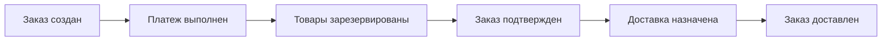
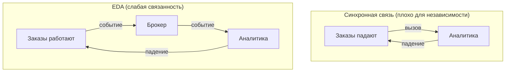
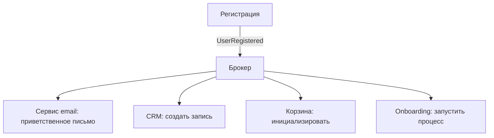
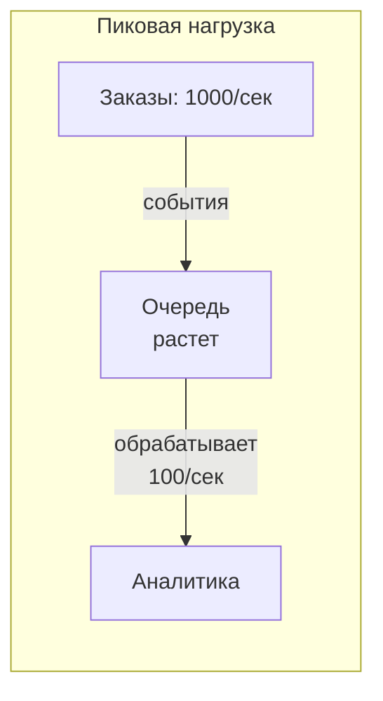
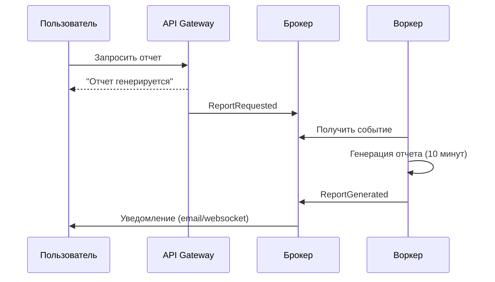
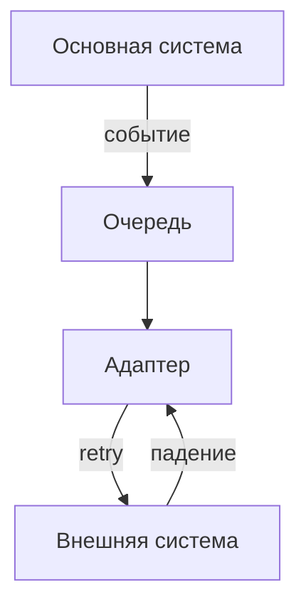
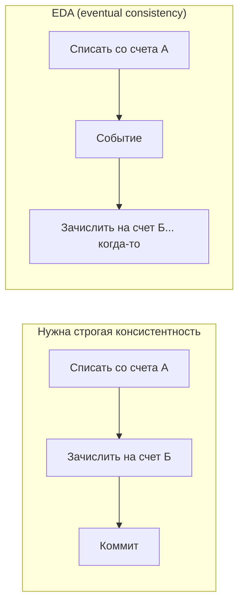
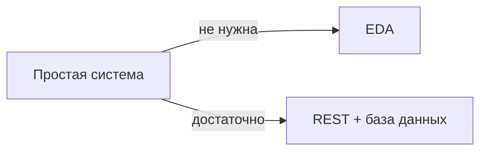
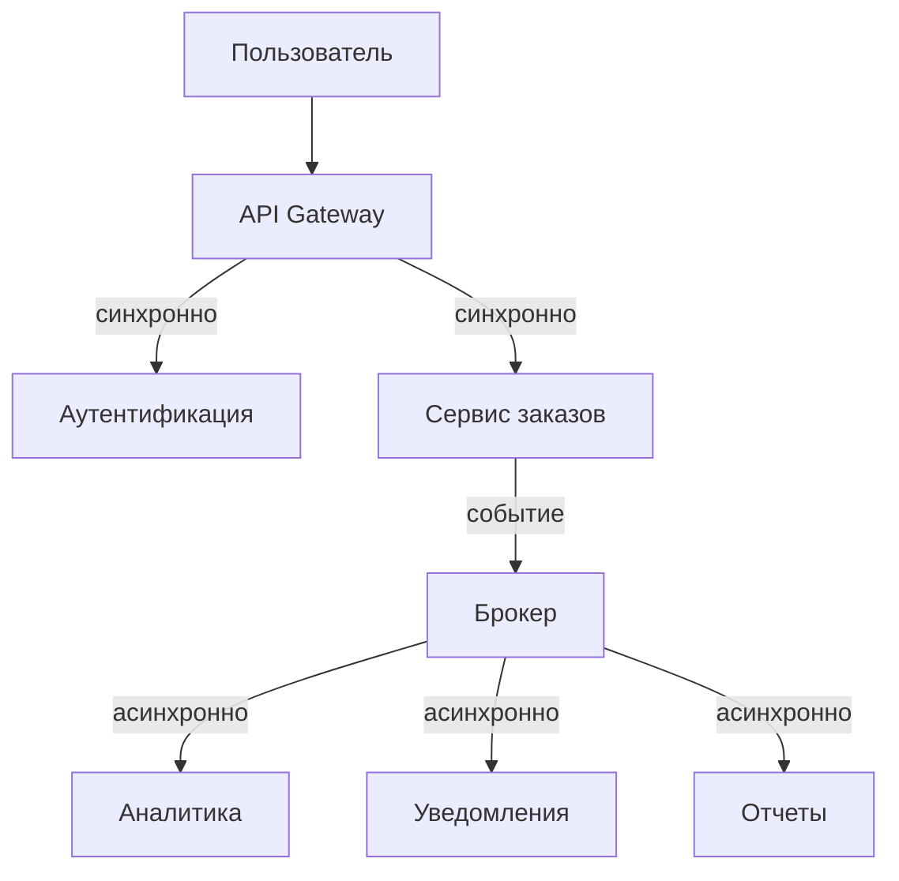
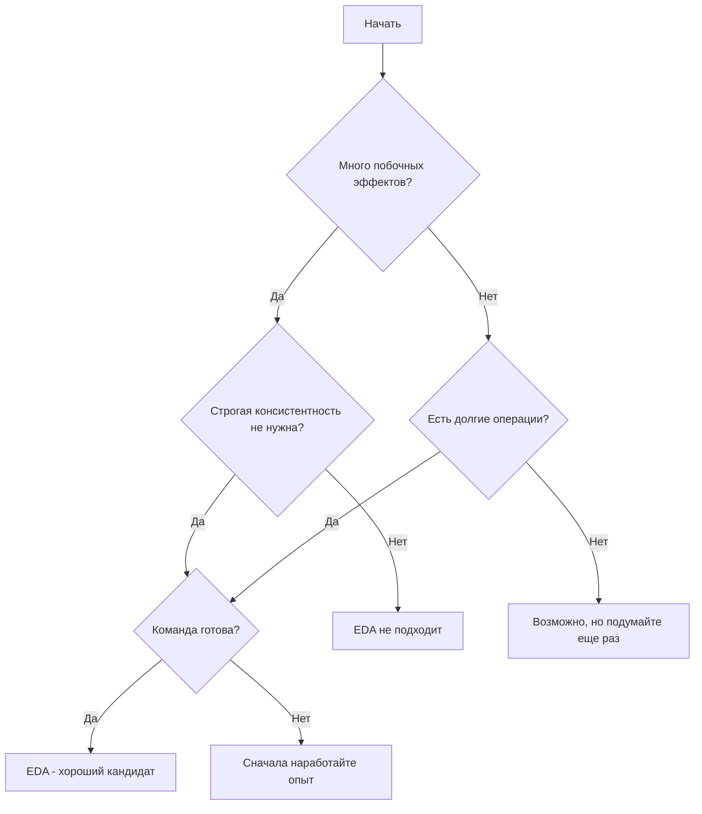

## Введение: Инструмент для правильных задач

EDA — это как микроскоп. Это мощный инструмент, но вы не будете использовать его, чтобы забить гвоздь. Точно так же EDA великолепна для одних задач и совершенно неуместна для других.

Выбор EDA — это не вопрос "модно или нет". Это вопрос: "Соответствует ли способ мышления EDA тому, как работает мой бизнес?" Если ваш бизнес естественным образом событийный (а большинство бизнесов именно такие), EDA может быть отличным выбором. Если ваш бизнес требует строгой синхронности и мгновенной консистентности, EDA принесет больше проблем, чем пользы.

Важно понимать: EDA — это не альтернатива REST или gRPC. Это дополнительный инструмент. В одной системе могут быть и синхронные вызовы (там, где нужен мгновенный ответ), и асинхронные события (там, где можно подождать). Вопрос не в том, "EDA или не EDA", а в том, "какую часть системы строить на событиях, а какую — на синхронных вызовах".

## Когда EDA — естественный выбор

### Бизнес-процессы естественно событийны

Большинство реальных бизнес-процессов устроены как последовательность событий. Заказ создан → Платеж выполнен → Товары зарезервированы → Заказ подтвержден → Доставка назначена → Заказ доставлен. Каждый шаг — это событие, которое запускает следующий.

Если ваш бизнес-процесс легко описать в виде цепочки событий, EDA будет естественным отражением этого процесса в коде. Вы не будете бороться с архитектурой — вы будете следовать за бизнесом.

**Признак:** Вы можете нарисовать бизнес-процесс как последовательность шагов, где каждый шаг происходит "когда-то после" предыдущего, а не "немедленно". Между шагами есть временные зазоры (секунды, минуты, часы). Это естественный кандидат на EDA.

### Разные подсистемы должны быть слабо связаны

В большой системе часто есть подсистемы, которые логически независимы. Например, система заказов и система аналитики. Заказы должны работать быстро и надежно. Аналитика может быть чуть медленнее и может падать без критических последствий.

В синхронной архитектуре система заказов вызывала бы систему аналитики при каждом заказе. Если аналитика упала, заказы тоже падают. Это плохо.

В EDA система заказов просто публикует событие "OrderCreated". Аналитика подписывается и обрабатывает в своем темпе. Если аналитика упала — заказы продолжают работать. Связанность минимальна.

**Признак:** У вас есть подсистемы, которые не должны зависеть друг от друга. Падение одной не должно влиять на другую. Разные подсистемы могут быть написаны разными командами и развертываться по разным графикам.

### Нужно, чтобы несколько систем реагировали на одно и то же

Часто одно событие должно вызывать несколько действий в разных системах. Пользователь зарегистрировался — нужно отправить приветственное письмо, создать запись в CRM, инициализировать корзину, запустить процесс onboarding.

В синхронной архитектуре сервис регистрации должен вызывать все эти сервисы последовательно (или параллельно, но с координацией). Код становится сложным, а связанность — высокой.

В EDA сервис регистрации публикует одно событие "UserRegistered". Все, кому нужно, подписываются. Добавить нового подписчика (например, новый сервис рекомендаций) — просто: подписываетесь на событие, и все работает. Никаких изменений в сервисе регистрации.

**Признак:** Одно и то же действие в системе должно приводить к нескольким побочным эффектам. Список этих эффектов может меняться со временем (добавляются новые, удаляются старые). Вам не хочется менять основной код при каждом добавлении нового эффекта.

### Высокая масштабируемость и пиковые нагрузки

В синхронной системе вы должны масштабировать сервис под пиковую нагрузку. Если в 18:00 происходит всплеск заказов, все сервисы должны быть готовы обработать этот пик. Это дорого.

В EDA публикатор (сервис заказов) может принять пик, быстро записав события в брокер. Подписчики могут обрабатывать события в своем темпе, с очередью. Если подписчик медленный, события накапливаются в брокере, но заказы не теряются.

Это называется "сглаживание пиков" (peak smoothing). EDA позволяет принимать нагрузку, не требуя от всех компонентов одинаковой пропускной способности.

**Признак:** У вас есть пики нагрузки, которые многократно превышают среднюю. Разные компоненты имеют разную пропускную способность. Вы не хотите масштабировать все компоненты под пик.

### Долгие операции и фоновые процессы

Некоторые операции не могут быть выполнены мгновенно. Отправка email может занять секунду. Генерация отчета — минуту. Обработка видео — час.

В синхронной архитектуре пользователь ждал бы ответа все это время. Это неприемлемо.

В EDA пользователь получает ответ "запрос принят в обработку" мгновенно. Фоновая операция выполняется асинхронно. Когда она завершается, пользователю приходит уведомление (через событие).

**Признак:** В системе есть операции, которые занимают заметное время (секунды, минуты, часы). Пользователь не может ждать синхронно. Или есть операции, которые должны выполняться в фоне, не блокируя основной поток.

### Интеграция с внешними системами

Внешние системы ненадежны. Они могут тормозить, падать, менять API. Интеграция с ними через синхронные вызовы делает вашу систему уязвимой.

В EDA вы отделяете свою систему от внешней через очередь. Вы публикуете событие "нужно отправить данные в систему X". Адаптер читает из очереди и отправляет. Если внешняя система упала, адаптер повторит попытку позже. Ваша основная система не страдает.

**Признак:** Вы интегрируетесь с внешними системами, которые не находятся под вашим контролем. Они могут быть медленными или недоступными. Вы не хотите, чтобы их проблемы влияли на вашу основную систему.

### Аудит и воспроизведение состояния

Иногда нужно знать, что происходило в системе. Кто, когда, что сделал? Как система пришла к текущему состоянию?

Если вы храните все события, вы можете воспроизвести историю. Вы можете ответить на вопрос: "Что случилось с заказом ORD-123 в 15:32?" Вы можете восстановить состояние системы на любой момент времени, переиграв события.

Это основа event sourcing (хранения событий), но даже без полного event sourcing хранение событий дает аудит.

**Признак:** У вас есть регуляторные требования к аудиту. Или вам важно понимать, как система пришла к текущему состоянию. Или вы хотите иметь возможность "откатить" систему, переиграв события заново.

### CQRS (Command Query Responsibility Segregation)

CQRS — это паттерн, который разделяет команды (изменение данных) и запросы (чтение данных). Часто команды обрабатываются через события, а запросы идут в отдельные read-модели.

Если вы уже используете CQRS, EDA — естественный способ реализации command-стороны. Команда → событие → обновление read-модели.

**Признак:** Вы используете (или планируете) CQRS. Чтение и запись имеют разные модели данных и разную архитектуру.

## Когда EDA НЕ подходит

### Нужна строгая консистентность и ACID-транзакции

EDA дает eventual consistency. Это означает, что между событием и реакцией на него есть задержка. Данные могут быть временно неконсистентными.

Если ваша система требует, чтобы данные были согласованы всегда (например, списание денег с одного счета и зачисление на другой должны произойти атомарно), EDA — плохой выбор. Вам нужны ACID-транзакции, которые есть в монолите с одной базой данных.

**Признак:** Бизнес требует, чтобы операция либо выполнилась полностью, либо не выполнилась вообще, без промежуточных состояний. Между шагами не может быть временного разрыва.

### Простая система с низкой нагрузкой

EDA добавляет сложность: брокер сообщений, обработка дубликатов, идемпотентность, eventual consistency, сложность отладки. Если у вас простой CRUD-сервис с несколькими пользователями, EDA — это оверинжиниринг.

**Признак:** У вас 1-2 разработчика, простая предметная область, нагрузка низкая. Вы не испытываете проблем, которые решает EDA.

### Маленькая команда без опыта

EDA требует новых навыков: работа с брокерами, обработка дубликатов, идемпотентность, распределенная трассировка, eventual consistency. Если команда маленькая и не имеет этого опыта, EDA может привести к катастрофе.

Лучше начать с простой архитектуры (монолит, синхронные вызовы), наработать опыт, а потом, если потребуется, добавлять события.

**Признак:** Команда никогда не работала с Kafka или RabbitMQ. Никто не знает, что такое идемпотентность. Концепция "eventual consistency" вызывает страх.

### Системы с реальным временем (hard real-time)

EDA не гарантирует время доставки события. Событие может задержаться из-за сетевых проблем, переполнения очереди, падения подписчика.

Если ваша система требует гарантированного ответа за 1 миллисекунду (например, управление промышленным оборудованием), EDA не подходит. Нужны специализированные протоколы и архитектуры.

**Признак:** Задержки в миллисекундах критичны. Вы не можете допустить ситуации, когда событие обрабатывается "когда-то потом".

## Компромисс: Гибридная архитектура

EDA не должна быть "все или ничего". В реальных системах часто сочетают синхронные вызовы и асинхронные события.

**Что делать синхронно:** операции, от которых пользователь ждет мгновенного ответа. Создание заказа — синхронно (пользователь хочет знать, что заказ принят). Аутентификация — синхронно.

**Что делать асинхронно:** побочные эффекты, которые не влияют на основной опыт. Отправка письма, обновление аналитики, генерация отчетов.

**Признак правильного гибрида:** Пользователь получает быстрый ответ. Фоновая работа выполняется в фоне. Система остается отзывчивой.

## Процесс принятия решения

Вот вопросы, которые помогут понять, подходит ли EDA для вашей задачи.

**Вопросы о бизнес-процессе:**
- Процесс состоит из нескольких шагов, которые могут выполняться с задержкой?
- Одно действие влечет множество побочных эффектов в разных системах?
- Бизнесу важно знать, что произошло (аудит)?

**Вопросы о технических требованиях:**
- Разные компоненты должны быть слабо связаны?
- Есть пиковые нагрузки, которые нужно сгладить?
- Есть долгие операции (секунды и более)?
- Вы интегрируетесь с ненадежными внешними системами?
- Вам нужно воспроизводить историю изменений?

**Вопросы о готовности команды:**
- У команды есть опыт с брокерами сообщений?
- Команда понимает eventual consistency?
- Есть инструменты для трассировки и отладки распределенных систем?

**Вопросы об ограничениях:**
- Нужна ли строгая консистентность (ACID)?
- Критичны ли миллисекундные задержки?
- Система маленькая и простая?

## Примеры из практики

### Пример 1: Интернет-магазин

**Ситуация:** Заказы, платежи, инвентаризация, уведомления, аналитика. Пиковая нагрузка в часы распродаж.

**Решение:** Гибрид. Оформление заказа — синхронно (пользователь ждет подтверждения). Платежи, инвентаризация, уведомления — асинхронно через события. Аналитика — асинхронно.

**Почему EDA подходит:** Много побочных эффектов. Пиковые нагрузки. Разные системы могут падать независимо.

### Пример 2: Банковская система перевода средств

**Ситуация:** Перевод денег между счетами. Требуется строгая консистентность. Никаких "почти списали, но не точно".

**Решение:** Не EDA. Классический монолит с ACID-транзакциями или распределенная транзакция (Saga, но очень осторожно).

**Почему EDA не подходит:** Нужна строгая консистентность. Eventual consistency неприемлема.

### Пример 3: Система обработки заказов на маркетплейсе

**Ситуация:** Продавец создал заказ. Нужно: зарезервировать товар на складе продавца, уведомить продавца, обновить аналитику, возможно, запустить процесс доставки.

**Решение:** EDA. Событие "OrderCreated" обрабатывается разными подсистемами. Склад продавца может быть внешней системой с задержками.

**Почему EDA подходит:** Много подписчиков. Внешние системы ненадежны. Нет строгой консистентности (продавец может подтвердить заказ позже).

### Пример 4: Внутренний инструмент для HR

**Ситуация:** Учет сотрудников, отпусков, больничных. 100 пользователей. Простые CRUD-операции.

**Решение:** Не EDA. Простой монолит на любимом фреймворке. База данных. REST API.

**Почему EDA не подходит:** Система слишком проста. EDA добавит сложности без выгоды.

## Резюме

EDA — мощный инструмент, но он подходит не для всех задач.

**Используйте EDA, когда:**

- Бизнес-процесс естественно событийный
- Одно действие вызывает много побочных эффектов в разных системах
- Нужна слабая связанность между компонентами
- Есть пиковые нагрузки (сглаживание через очереди)
- Есть долгие фоновые операции
- Вы интегрируетесь с ненадежными внешними системами
- Нужен аудит и возможность воспроизведения истории
- Вы используете CQRS

**Не используйте EDA, когда:**

- Нужна строгая консистентность (ACID-транзакции)
- Требуются гарантированные миллисекундные задержки
- Система простая, с низкой нагрузкой
- Команда маленькая и не имеет опыта

**Оптимальный подход — гибридный:**

- Синхронные вызовы (REST/gRPC) для операций, где нужен мгновенный ответ и строгая консистентность
- Асинхронные события (EDA) для побочных эффектов, фоновых задач, слабо связанных компонентов

EDA — это не замена REST или gRPC. Это дополнение. Используйте каждый инструмент для тех задач, где он силен. Синхронные вызовы — для мгновенных ответов и строгой консистентности. События — для слабой связанности, масштабируемости и фоновой обработки. Вместе они дают гибкую, масштабируемую и устойчивую систему.