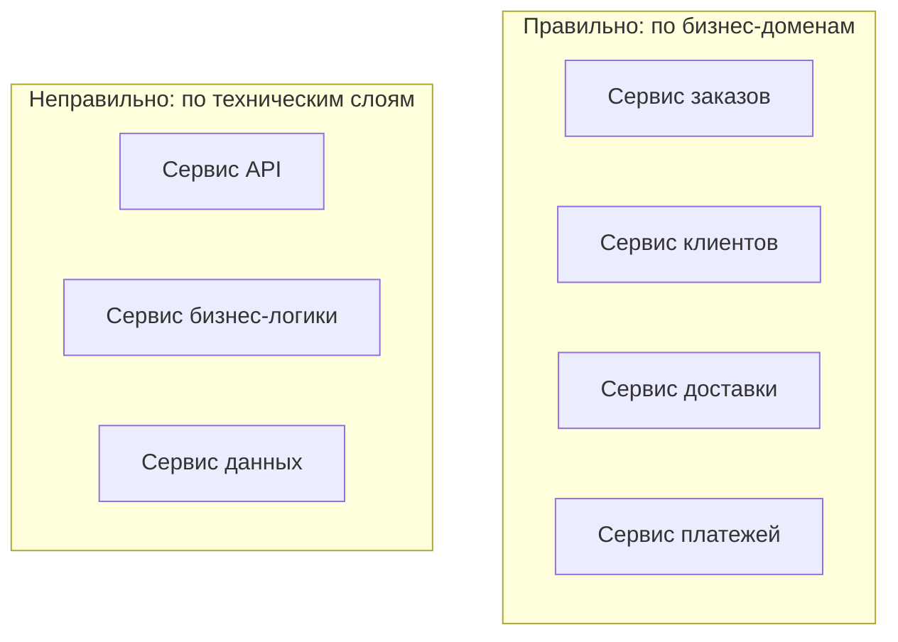
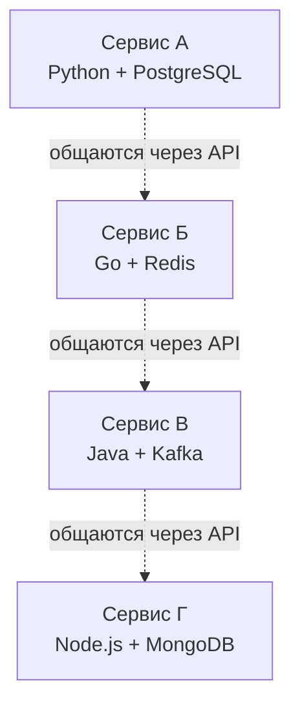
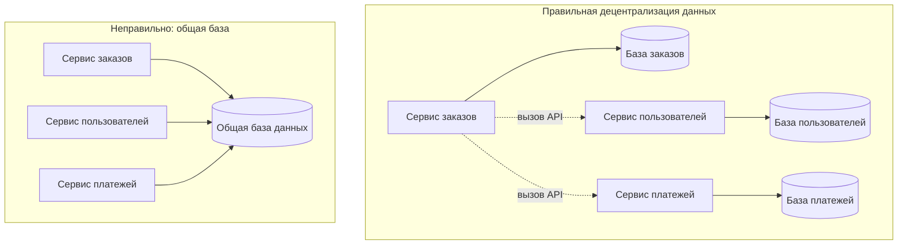
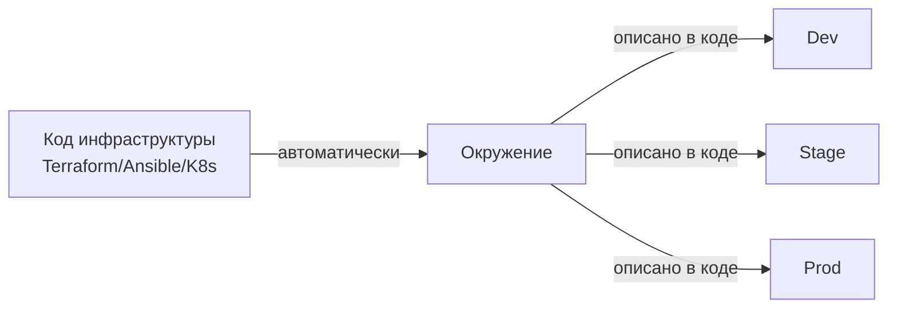
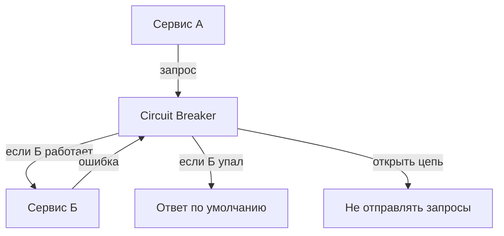
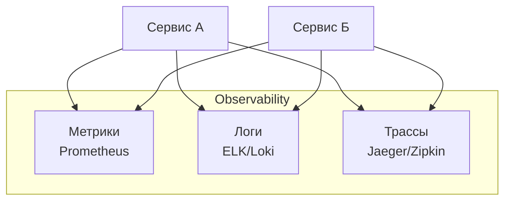
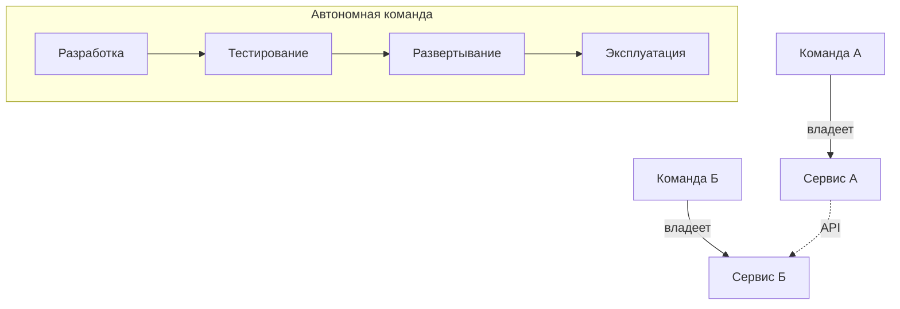
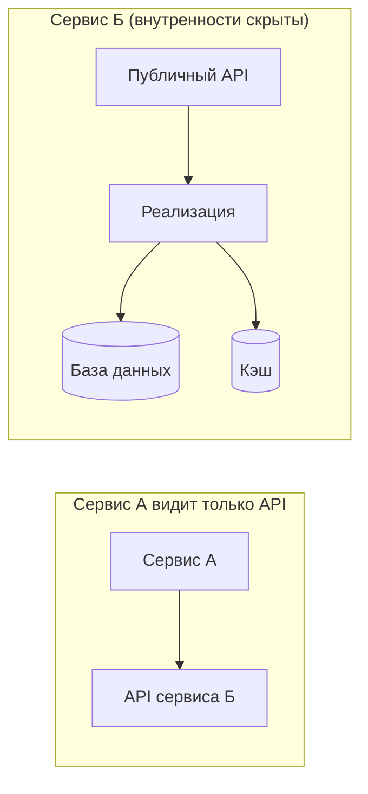
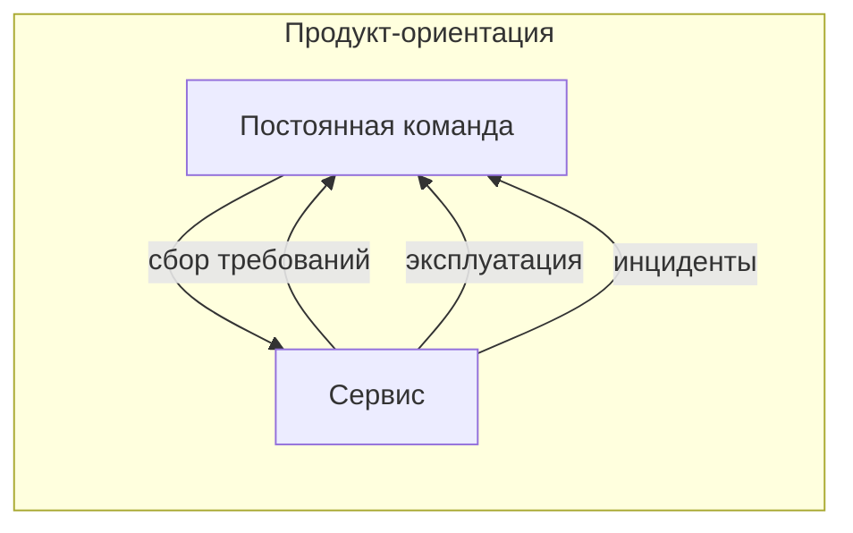
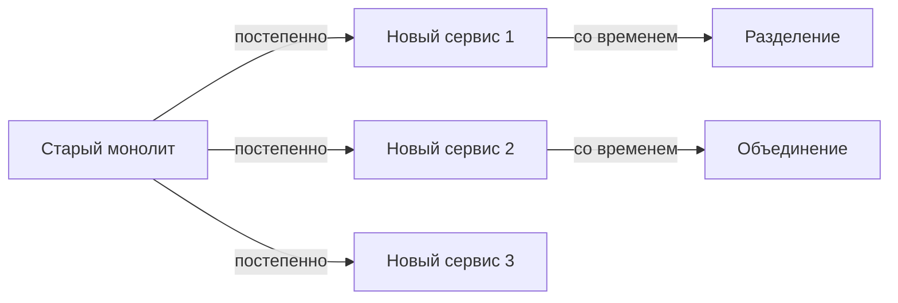

## Введение: Правила жизни в поселке микросервисов

Микросервисы — это не просто "нарезать монолит на маленькие кусочки". Если просто взять старый монолит и механически разделить его на части, получится распределенный монолит — худшее из двух миров. Микросервисы требуют соблюдения определенных принципов. Это как правила жизни в поселке: если каждый живет сам по себе, но при этом постоянно лезет к соседям, пользуется их вещами без спроса, то поселок превращается в зону хаоса.

**Принципы микросервисной архитектуры** — это набор правил и рекомендаций, которые отличают "хорошие" микросервисы от "плохих". Они описывают, как должны быть устроены сервисы, как они должны общаться, как владеть данными, как развертываться. Соблюдение этих принципов дает преимущества микросервисов: независимость, масштабируемость, гибкость. Нарушение — приводит к распределенному монолиту со всеми его проблемами.

Для понимания этих принципов важно помнить: микросервисная архитектура родилась из практического опыта больших компаний (Netflix, Amazon, Uber), которые столкнулись с ограничениями монолитов и выработали эти правила, чтобы выжить и расти.

## Принцип первый: Моделирование вокруг бизнес-доменов

Микросервисы должны отражать структуру бизнеса, а не технические детали. Границы между сервисами проводятся там, где проходят границы между бизнес-доменами.

Что это означает. Вместо того чтобы создавать сервисы по техническому признаку ("сервис для работы с базами данных", "сервис для отправки HTTP-запросов", "сервис для валидации данных"), вы создаете сервисы по бизнес-признаку. "Сервис заказов", "Сервис клиентов", "Сервис доставки", "Сервис платежей".

Почему это важно. Бизнес-домены меняются медленнее, чем технические детали. Способ оформления заказа может меняться, но сам факт того, что "заказы" — это отдельная сущность, остается стабильным. Если границы сервисов совпадают с границами бизнес-доменов, то изменения в бизнес-процессах затрагивают один или несколько сервисов предсказуемым образом.

Как определить границы доменов. Это задача domain-driven design (DDD). Нужно найти в бизнесе "ограниченные контексты" (bounded contexts) — области, внутри которых термины имеют четкое значение и за пределами которых они могут означать другое. Например, в интернет-магазине "заказ" для отдела продаж и "заказ" для склада — это похожие, но разные понятия. У них разные атрибуты, разное поведение, разные жизненные циклы. Это может быть границей между сервисами.

## Принцип второй: Децентрализация всех решений

В монолите обычно есть централизованные решения: одна база данных, один фреймворк, один язык, один способ деплоя. В микросервисах каждый сервис может принимать собственные решения.

Что это означает. Команда, которая владеет сервисом, может выбрать любой язык программирования, любую базу данных, любой фреймворк, любой способ деплоя, который лучше всего подходит для их задачи. Сервису аналитики нужна колоночная база данных и Python — пожалуйста. Сервису обработки платежей нужна строгая согласованность и Java — отлично.

Почему это важно. Нет одного "лучшего" инструмента на все случаи жизни. Для одних задач лучше подходит Python (быстрая разработка), для других — Go (высокая производительность), для третьих — Java (надежность и экосистема). Децентрализация позволяет каждой команде использовать лучший инструмент для своей задачи.

Ограничения. Полная децентрализация — это идеал, которого трудно достичь на практике. Нужны общие стандарты для общения (например, все сервисы должны поддерживать HTTP/gRPC и JSON/Protobuf). Нужны общие инструменты для мониторинга, логирования, трассирования. Нужны общие подходы к безопасности. Поэтому чаще всего говорят о "разумной децентрализации": свобода в пределах разумных границ.

## Принцип третий: Децентрализация данных

Каждый сервис владеет своими данными. Никаких общих баз данных между сервисами.

Что это означает. Сервис заказов имеет свою базу данных (или свои таблицы в общей БД, к которым никто другой не имеет прямого доступа). Сервис пользователей — свою. Если сервису заказов нужны данные о пользователе, он вызывает API сервиса пользователей, а не читает его базу напрямую.

Почему это важно. Общая база данных — это главная причина распределенного монолита. Как только сервисы начинают читать чужие таблицы напрямую, они становятся связаны через схему данных. Изменить структуру таблицы в одном сервисе становится невозможно без согласования со всеми, кто эту таблицу читает. Вы теряете независимость развертывания и масштабирования.

Что делать, если данные нужны многим сервисам. Есть несколько паттернов. Первый — сервис-владелец предоставляет API для доступа к данным. Второй — сервис публикует события об изменениях, а другие сервисы подписываются и хранят свою копию данных (CQRS/Event Sourcing). Третий — создается отдельный сервис для "чтения" (read model), который агрегирует данные из разных источников. Прямой доступ к чужой базе данных — это всегда антипаттерн.

## Принцип четвертый: Инфраструктура как автоматизация

В микросервисной архитектуре количество движущихся частей велико. Ручное управление невозможно. Вся инфраструктура должна быть автоматизирована и храниться в коде (Infrastructure as Code).

Что это означает. Вы не заходите на сервер по SSH и не выполняете команды вручную. Вместо этого вы описываете желаемое состояние инфраструктуры в конфигурационных файлах. Эти файлы хранятся в репозитории, проходят code review, версионируются. Автоматизация разворачивает серверы, устанавливает зависимости, настраивает сети, запускает сервисы.

Почему это важно. В монолите у вас один сервер (или несколько копий). Вы можете позволить себе настраивать их вручную. В микросервисах у вас десятки сервисов, сотни экземпляров. Ручная настройка каждого приведет к ошибкам, несоответствиям между окружениями, невозможности воспроизвести проблему.

Что входит в автоматизацию. CI/CD пайплайн (автоматическая сборка, тестирование, развертывание). Оркестрация контейнеров (Kubernetes, Nomad). Управление конфигурацией (Ansible, Chef, Puppet). Провижининг инфраструктуры (Terraform, CloudFormation). Мониторинг и алертинг (Prometheus, Grafana). Логирование (ELK, Loki). Все это должно быть описано в коде.

## Принцип пятый: Проектирование для отказов

В распределенной системе отказы неизбежны. Сеть может быть нестабильной. Сервер может упасть. Сервис может тормозить. Микросервисы должны быть спроектированы так, чтобы справляться с отказами и не падать целиком.

Что это означает. Вы предполагаете, что любой вызов к другому сервису может завершиться ошибкой. Вы проектируете таймауты (сколько ждать ответа), ретраи (сколько раз повторять), circuit breakers (отключение вызовов к проблемному сервису). Вы используете паттерны вроде Bulkhead (изоляция ресурсов между разными клиентами) и Backpressure (управление нагрузкой).

Почему это важно. В монолите либо все работает, либо все падает. В микросервисах возможны частичные отказы. Если сервис платежей временно недоступен, сервис заказов не должен падать целиком. Он может сказать пользователю: "Платежи временно не работают, попробуйте позже". Или отложить заказ и повторить попытку. Или предложить другой способ оплаты.

Что нужно для проектирования для отказов. Таймауты (не ждать ответа вечно). Ретраи с экспоненциальной задержкой (не забивать проблемный сервис повторными запросами). Circuit breaker (прекратить отправлять запросы, если сервис явно не работает). Bulkhead (изолировать пулы соединений для разных клиентов). Graceful degradation (система продолжает работать, пусть и с ограниченной функциональностью).

## Принцип шестой: Высокая наблюдаемость (Observability)

В монолите вы можете отладить проблему, подключившись к серверу и посмотрев логи. В микросервисах запрос может пройти через 5-10 сервисов. Понять, где произошла ошибка, без специальных инструментов невозможно.

Что это означает. Система должна быть инструментирована так, чтобы можно было понять ее внутреннее состояние, не заходя внутрь. Три столпа observability: метрики (счетчики, гистограммы), логи (структурированные сообщения о событиях), трассы (идентификаторы запросов, проходящих через сервисы).

Почему это важно. Когда пользователь жалуется, что "заказ не оформился", вам нужно понять, что произошло. Был ли запрос? Дошел ли он до сервиса заказов? Вызвал ли сервис заказов сервис платежей? Платежный сервис ответил ошибкой? Таймаут? Без трассировки вы будете гадать и смотреть логи каждого сервиса по отдельности.

Что нужно для observability. Единый формат логов (JSON,结构化). Correlation ID — идентификатор, который передается через все вызовы и позволяет связать логи одного запроса. Экспорт метрик (количество запросов, задержки, ошибки) в систему мониторинга. Автоматическая трассировка (библиотеки, которые добавляют заголовки в HTTP-вызовы и отправляют данные в collector).

## Принцип седьмой: Автономность команд

Микросервисы эффективны только в сочетании с автономными командами. Команда, которая разрабатывает сервис, должна иметь возможность развертывать его без согласования с другими командами.

Что это означает. У команды есть полный контроль над своим сервисом: от требований до продакшена. Команда сама решает, когда развертывать новую версию. Ей не нужно ждать, пока другие команды закончат свои изменения. Ей не нужно согласовывать окно релиза.

Почему это важно. Если команды не автономны, то преимущества независимого развертывания теряются. Вы не можете выпустить новую версию своего сервиса, потому что это "сломает API" для другого сервиса, а его команда еще не готова. Вы ждете, координируете, синхронизируете — возвращаясь к проблемам монолита, но с распределенной сложностью.

Что нужно для автономности. Стабильные API с версионированием (можно добавить новую версию, не ломая старую). Контрактное тестирование (тесты проверяют, что сервис А все еще работает с API сервиса Б). Децентрализованное управление (нет "совета архитекторов", который утверждает все изменения). Культура "вы разбили — вы и чините" (you build it, you run it).

## Принцип восьмой: Изолированность и независимость

Сервисы не должны знать о внутреннем устройстве друг друга. Единственное, что их связывает — публичный API.

Что это означает. Сервис А не должен знать, как сервис Б хранит данные, на каком языке написан, сколько у него копий. Он знает только: чтобы получить данные пользователя, нужно отправить GET /users/{id}. Все остальное скрыто. Это позволяет сервису Б менять свою внутреннюю реализацию, не затрагивая сервис А.

Почему это важно. Изолированность — это то, что дает слабую связанность. Если сервисы знают слишком много друг о друге, изменение в одном с большой вероятностью сломает другой. Вы теряете независимость развертывания.

Как проверить изолированность. Задайте вопрос: "Могу ли я полностью переписать сервис Б на другом языке, изменить его базу данных и способ деплоя, не меняя при этом сервис А?" Если ответ "да" — изолированность хорошая. Если "нет" — границы размыты.

## Принцип девятый: Ориентация на продукты, а не на проекты

В монолитной культуре часто есть понятие "проект": команда собирается, делает фичу, проект заканчивается, команда распускается. В микросервисном мире сервисы живут годами. Команда владеет сервисом как продуктом, постоянно его улучшая.

Что это означает. У сервиса есть долгосрочная команда. Команда отвечает не только за написание кода, но и за эксплуатацию, мониторинг, исправление ошибок, ответы на инциденты. Команда сама принимает решения о развитии сервиса.

Почему это важно. Если команда не владеет сервисом, она не будет вкладывать усилия в его надежность, наблюдаемость, документацию. Будет соблазн "сделать быстро и бросить". Но в микросервисной архитектуре все сервисы важны, и каждый должен быть надежным.

Что это означает на практике. Команда имеет он-call ротацию (кто-то всегда готов ответить на инцидент). Команда сама настраивает мониторинг и алерты. Команда сама приоритезирует технический долг наравне с новыми фичами. Команда имеет право сказать "нет" новому требованию, если оно противоречит архитектуре сервиса.

## Принцип десятый: Эволюционный дизайн

Микросервисная архитектура никогда не бывает "завершенной". Система постоянно эволюционирует: добавляются новые сервисы, старые разделяются на части, некоторые объединяются.

Что это означает. Вы не проектируете идеальную систему на 5 лет вперед. Вы проектируете систему, которую можно менять. Вы создаете абстракции и API, которые позволяют заменять реализации. Вы используете паттерн Strangler Fig, чтобы постепенно заменять старые сервисы новыми.

Почему это важно. Требования меняются. Бизнес-домены эволюционируют. Технологии устаревают. Если архитектура не эволюционирует, она становится обузой. Микросервисы дают гибкость для эволюции, но только если вы сознательно проектируете для изменений.

Что нужно для эволюционного дизайна. Версионирование API (возможность поддерживать старую и новую версию одновременно). Feature toggles (возможность включить новую функциональность для части пользователей). Депрекация (процесс объявления API устаревшим и его удаления). Автоматические тесты, которые проверяют, что старые клиенты все еще работают.

## Резюме

Принципы микросервисной архитектуры — это правила, которые превращают "набор сервисов" в работающую микросервисную систему.

Главные принципы:

1. **Моделирование вокруг бизнес-доменов** — границы сервисов там, где границы бизнеса
2. **Децентрализация решений** — каждый сервис выбирает свой стек технологий
3. **Децентрализация данных** — каждый сервис владеет своими данными, нет общих БД
4. **Инфраструктура как автоматизация** — все описывается в коде, никаких ручных действий
5. **Проектирование для отказов** — система должна работать, даже когда части падают
6. **Высокая наблюдаемость** — метрики, логи, трассы для понимания состояния системы
7. **Автономность команд** — команда сама решает, когда и что развертывать
8. **Изолированность** — сервисы знают только API друг друга, не внутренности
9. **Ориентация на продукты, а не на проекты** — команда владеет сервисом как продуктом
10. **Эволюционный дизайн** — система проектируется для постоянных изменений

Соблюдение этих принципов — это идеал. На практике многие проекты нарушают некоторые из них. Но важно понимать: каждое нарушение имеет цену. Общая база данных — цена в виде связанности. Отсутствие автоматизации — цена в виде медленных и страшных релизов. Отсутствие observability — цена в виде ночных дежурств, когда непонятно, что сломалось.

Чем больше принципов вы соблюдаете, тем больше получаете преимуществ микросервисов. Чем больше нарушаете, тем ближе вы к распределенному монолиту. А это — худшее место, где можно оказаться.