## Введение: Цена свободы

Микросервисы часто продают как панацею от всех проблем монолита. "Перейдете на микросервисы — и все станет хорошо: команды станут независимыми, масштабирование — легким, а развертывание — быстрым". Это правда, но только наполовину.

Микросервисы решают одни проблемы, но создают другие. Они не делают систему проще — они делают сложность другого рода. Если монолит сложен внутренне (много связанного кода), то микросервисы сложны внешне (много взаимодействующих частей). И эта внешняя сложность требует новых инструментов, новых навыков, новой дисциплины.

Представьте, что вы переезжаете из одной большой квартиры, где все комнаты соединены дверями, в поселок из маленьких домиков. В квартире было тесно и шумно, но вы могли крикнуть соседу через стену. В поселке у каждого свой дом, но чтобы что-то сказать соседу, нужно выйти на улицу (а это время), нужно, чтобы дорога была чистой (а она может быть перекрыта), и сосед может быть не дома. И вам теперь нужна дорожная инфраструктура, почта, службы доставки. В квартире всего этого не требовалось.

Понимание проблем микросервисов важно не для того, чтобы отказаться от них. А для того, чтобы принимать осознанное решение: готовы ли вы платить эту цену за свободу, которую они дают? И если да, то как смягчить эти проблемы?

## Проблема первая: Распределенная сложность

Это корневая проблема, из которой вырастают многие другие. В монолите все работает в одном процессе. Вызов функции занимает наносекунды. Ошибка в одном месте не мешает другому, потому что все в одном процессе — либо все работает, либо все падает.

В микросервисах все распределено по сети. Вызов сервиса через HTTP занимает миллисекунды или даже десятки миллисекунд — в тысячи раз медленнее вызова функции. Сеть ненадежна: пакеты могут теряться, задерживаться, приходить не в том порядке. Сервисы могут быть недоступны.

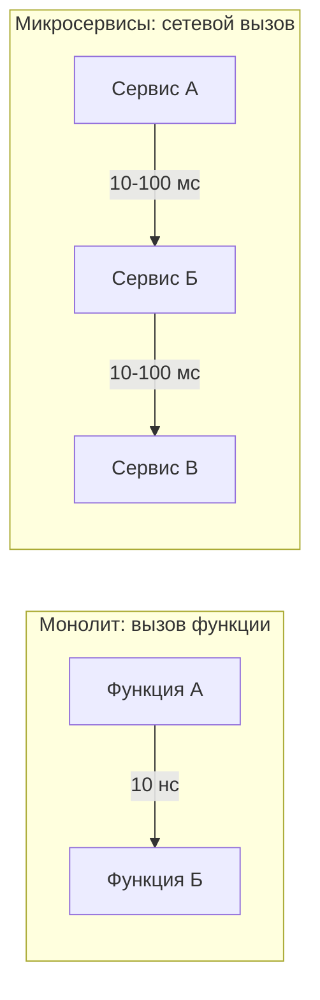

Эта распределенная сложность проявляется во всем:

- **Задержки.** Пользовательский запрос может проходить через 5-10 сервисов. Каждый добавляет задержку. В итоге 50 мс превращаются в 500 мс — пользователь замечает.
- **Частичные отказы.** Сервис А вызывает Б, Б вызывает В. В упал. Что делать А? Ждать? Падать? Использовать кэш? Каждый вариант имеет последствия.
- **Отсутствие глобального состояния.** Нет единого места, где можно посмотреть "что сейчас происходит". Логи разбросаны по серверам. Чтобы понять один запрос, нужно собрать логи из пяти сервисов.
- **Сложность тестирования.** Протестировать один сервис изолированно легко. Протестировать их всех вместе — сложно. Нужно поднимать всю инфраструктуру.

## Проблема вторая: Сетевые проблемы и задержки

Сеть — это самый ненадежный компонент распределенной системы. Она может вести себя непредсказуемо.

Что может случиться с сетевым вызовом:

- **Задержка.** Ответ пришел, но через 5 секунд вместо 50 мс. Сервис А ждет. Если таймаут маленький, он решит, что сервис Б умер. Если большой — потоки ожидания накапливаются.
- **Потеря пакета.** Запрос ушел, но не дошел. Сервис А не получил ответ. Он не знает: запрос не дошел? Или дошел, но ответ потерялся? Или сервис Б обрабатывает, но медленно?
- **Переупорядочивание.** Пакеты могут прийти в другом порядке. Для HTTP это редко, но для UDP (например, в DNS) — обычное дело.
- **Разрыв соединения.** Соединение, которое работало секунду назад, внезапно разорвано. Причина может быть в любой точке: от программы до обрыва кабеля.

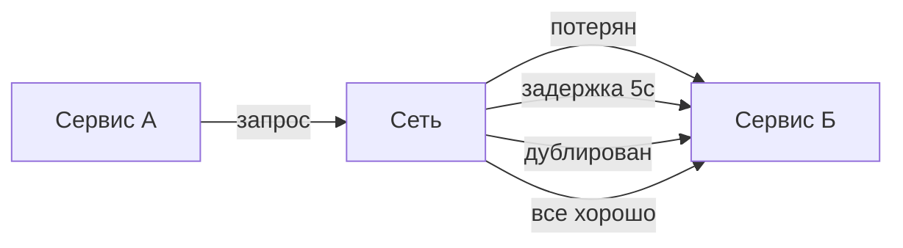

Для разработчика в монолите сетевых проблем не существует. Для разработчика микросервисов сеть — это главная головная боль. Нужно проектировать таймауты, ретраи, circuit breaker, bulkhead. И все равно в реальном мире сеть будет преподносить сюрпризы.

## Проблема третья: Распределенные транзакции и консистентность данных

В монолите с одной базой данных ACID-транзакции работают "из коробки". Вы обновляете несколько таблиц в одной транзакции. База данных гарантирует: либо все изменения применятся, либо ни одного.

В микросервисах такой возможности нет. Каждый сервис имеет свою базу данных. Операция, затрагивающая несколько сервисов, не может быть атомарной.

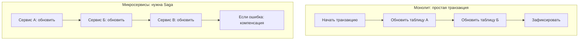

Пример: оформление заказа в интернет-магазине. Нужно: зарезервировать товар (сервис остатков), списать деньги (сервис платежей), создать заказ (сервис заказов), отправить уведомление (сервис уведомлений). В монолите это одна транзакция. В микросервисах — Saga.

Saga — это последовательность локальных транзакций. Если на шаге 3 что-то пошло не так, нужно отменить шаги 1 и 2 (компенсирующие действия). Saga сложна в реализации и отладке. Нужно обеспечивать идемпотентность (повторная отправка того же запроса не должна навредить). Нужно хранить состояние Saga. Нужно обрабатывать частичные отказы.

Результат: в микросервисах сложно обеспечить строгую консистентность. Чаще всего используют eventual consistency (согласованность в конечном счете). Для многих систем это приемлемо, но не для всех. Финансовые системы, системы бронирования могут требовать строгой консистентности.

## Проблема четвертая: Сложность отладки и мониторинга

В монолите вы видите весь код. Если что-то пошло не так, вы смотрите логи одного сервера, ставите breakpoint в IDE, запускаете отладчик. Проблема обычно локализована.

В микросервисах запрос может проходить через десяток сервисов. Ошибка может произойти в любом из них. Логи разбросаны по разным серверам. Без специальных инструментов вы не сможете восстановить картину.

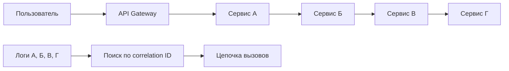

Что нужно для отладки микросервисов:

- **Централизованное логирование.** Все логи собираются в одном месте (ELK, Loki). Каждое сообщение имеет correlation ID — уникальный идентификатор запроса.
- **Распределенное трассирование.** Система вроде Jaeger или Zipkin показывает, сколько времени занял каждый вызов, где произошла ошибка.
- **Метрики.** Prometheus собирает метрики со всех сервисов: количество запросов, задержки, ошибки.
- **Дашборды.** Grafana визуализирует метрики, чтобы можно было увидеть аномалии.

Без всего этого отладка микросервисов превращается в ад. Вы будете вручную заходить на каждый сервер, смотреть логи, гадать, что произошло.

## Проблема пятая: Сложность развертывания и инфраструктуры

Монолит развернуть просто: скопировали файл, перезапустили процесс. Инфраструктура: один сервер (или несколько копий за балансировщиком).

Микросервисы требуют целой инфраструктурной экосистемы:

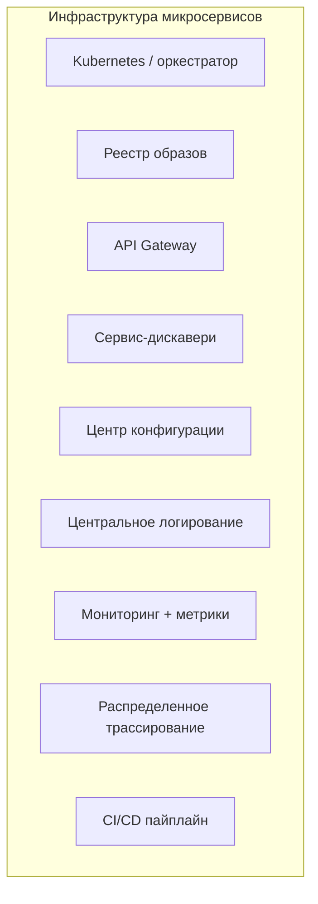

Каждый из этих компонентов нужно настраивать, поддерживать, обновлять. Это требует времени и экспертизы. Небольшая команда может просто не справиться.

Конкретные сложности:

- **Оркестрация.** Kubernetes (самый популярный оркестратор) сложен в освоении. Его настройка требует месяцев практики.
- **Сеть.** В Kubernetes своя сетевая модель. Нужно понимать Ingress, Services, Network Policies.
- **Хранение состояний.** Базы данных в Kubernetes — отдельная боль. StatefulSet, persistent volumes, бэкапы — все нетривиально.
- **CI/CD.** Нужно автоматизировать сборку, тестирование, развертывание десятков сервисов. Простой Jenkins-джоб уже не подходит.
- **Секреты.** Как хранить пароли, токены, ключи? В монолите — в файле конфигурации. В микросервисах — нужен менеджер секретов (HashiCorp Vault или встроенный в K8s).

## Проблема шестая: Версионирование API и обратная совместимость

В монолите нет проблемы "версий API". Вы меняете код, перезапускаете приложение — все клиенты используют новую версию.

В микросервисах сервисы обновляются независимо. Сервис А может использовать API сервиса Б. Вы обновили сервис Б, изменили API. Сервис А все еще использует старую версию. Он сломается.

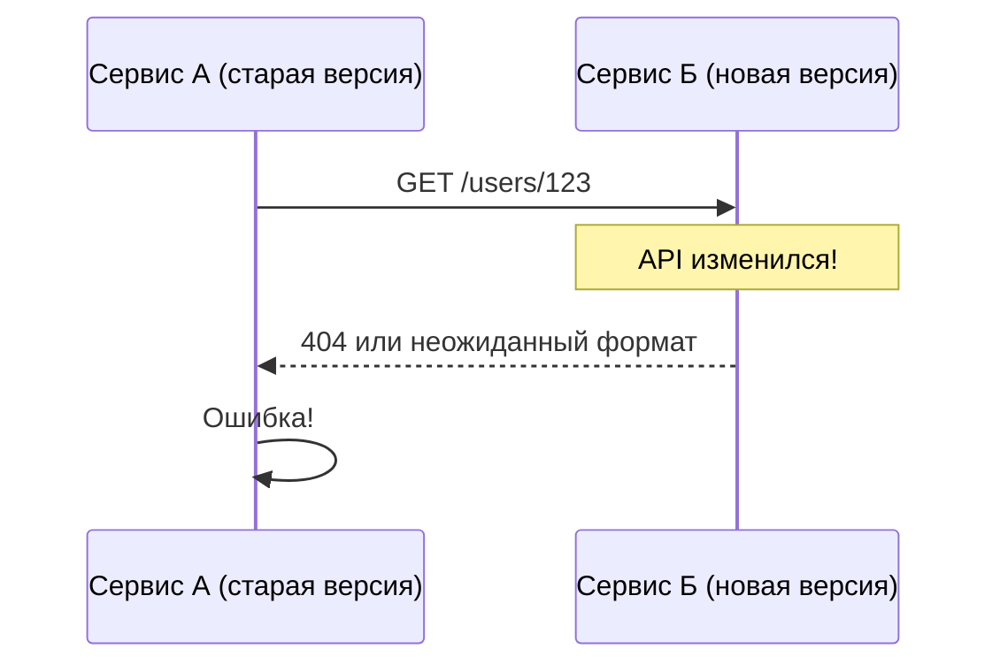

Что делать:

- **Версионирование API.** Включить версию в URL (/v1/users, /v2/users). Поддерживать старые версии, пока все клиенты не обновятся.
- **Совместимые изменения.** Добавлять поля, но не удалять и не менять существующие. Использовать необязательные поля.
- **Депрекация.** Объявлять API устаревшим, давать время клиентам перейти на новую версию, потом удалять старую.
- **Контрактное тестирование.** Тесты, которые проверяют, что сервис А все еще работает с API сервиса Б.

Версионирование добавляет сложности. Вы поддерживаете несколько версий API одновременно. Вы храните старый код. Вы мигрируете клиентов постепенно. Это работа, которой в монолите просто нет.

## Проблема седьмая: Транзакционность в распределенной среде

В монолите с одной базой данных транзакции просты. В микросервисах каждая операция, затрагивающая несколько сервисов, требует особого подхода.

Проблема: как обеспечить, чтобы данные оставались консистентными при частичных отказах?

Пример: пользователь переводит деньги со счета на счет. В монолите: BEGIN TRANSACTION, списать с одного счета, зачислить на другой, COMMIT. Все или ничего.

В микросервисах: сервис А (списание) и сервис Б (зачисление) — разные сервисы, разные базы данных. ACID-транзакции невозможны.

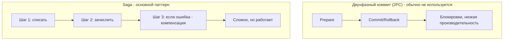

Возможные подходы:

- **Saga (координация через оркестратор или хореографию).** Сложно, требует компенсирующих операций.
- **Eventual consistency.** Принять, что данные будут согласованы не сразу, а через некоторое время. Для многих систем приемлемо.
- **Отказ от распределенных операций.** Перепроектировать границы сервисов так, чтобы операции, требующие атомарности, не пересекали границы сервисов.

Выбор подхода зависит от требований бизнеса. Для финансовых систем eventual consistency может быть неприемлема. Тогда, возможно, микросервисы — неправильный выбор.

## Проблема восьмая: Нагрузка на сеть и латентность

Каждый межсервисный вызов добавляет задержку. Если цепочка вызовов длинная, общая задержка может стать неприемлемой.

Пример: API Gateway -> Сервис А (50 мс) -> Сервис Б (50 мс) -> Сервис В (50 мс) -> ответ. Итого 150 мс плюс сетевые задержки между ними. Пользовательский запрос может занять 200-300 мс. Это уже заметно.

В монолите тот же запрос был бы за 10-20 мс (вызовы функций, одна база данных).

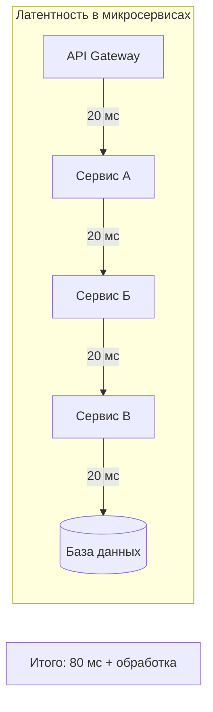

Как уменьшить проблему:

- **Сократить цепочки вызовов.** Перепроектировать, чтобы запрос требовал меньше вызовов.
- **Асинхронность.** Там, где можно не ждать ответа, использовать очереди.
- **Кэширование.** Держать копии данных ближе к клиенту.
- **Batch-запросы.** Получать несколько данных за один вызов.
- **Выбор протокола.** gRPC быстрее HTTP/JSON, но сложнее.

Но полностью убрать сетевые задержки нельзя. Это плата за распределенность.

## Проблема девятая: Безопасность

В монолите безопасность проще: одно приложение, одна граница. Аутентификация и авторизация в одном месте. Все внутренние вызовы считаются безопасными.

В микросервисах внешняя граница (API Gateway) — только начало. Сервисы вызывают друг друга. Нужно обеспечить безопасность и для внутренних вызовов.

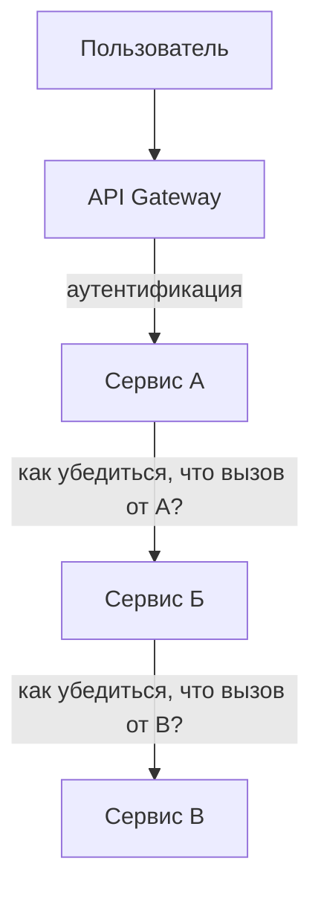

Вопросы безопасности:

- **Аутентификация между сервисами.** Как сервис Б узнает, что вызов от сервиса А легитимен? Решения: mTLS (взаимный TLS), JWT с ограниченным сроком жизни, service mesh (например, Istio).
- **Авторизация.** Даже если вызов от А, имеет ли А право делать эту операцию? Нужна централизованная политика или делегирование.
- **Безопасность данных в транзите.** Все внутренние вызовы должны идти по TLS. Даже внутри одного дата-центра.
- **Управление секретами.** Токены, пароли, ключи нужно хранить безопасно и доставлять сервисам без ручного вмешательства.

## Проблема десятая: Зрелость команды и организации

Это, возможно, самая большая проблема. Микросервисы требуют зрелой DevOps-культуры. Если команда не готова, микросервисы приведут к хаосу.

Что нужно для успеха:

- **Автономные команды.** Команда должна иметь возможность развертывать свой сервис без согласования. Если в организации каждый релиз требует approval от "комитета по изменениям" — микросервисы не взлетят.
- **You build it, you run it.** Команда отвечает за свой сервис в продакшене. Если есть отдельная команда эксплуатации, которая "не пускает" разработчиков — будут проблемы.
- **Инфраструктура как код.** Все должно быть описано в коде. Если сервера настраиваются вручную — микросервисы умрут от ручного труда.
- **Автоматизация.** CI/CD, автоматическое тестирование, автоматическое развертывание. Без этого микросервисы будут развертываться раз в месяц со страхом и молитвами.
- **Наблюдаемость.** Команда должна уметь ответить на вопрос "что происходит в системе". Без метрик, логов, трасс — ночные дежурства станут адом.

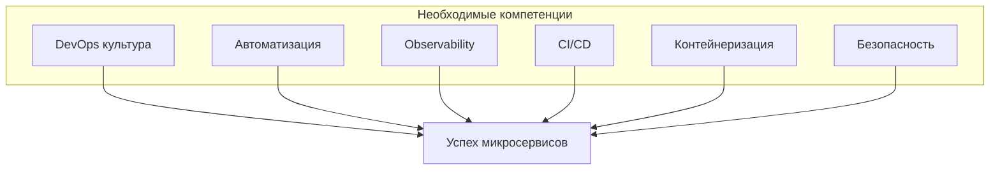

Если ваша организация не обладает этими компетенциями, начинать с микросервисов — плохая идея. Лучше начать с монолита, а по мере роста команды и компетенций — эволюционировать.

## Проблема одиннадцатая: Сложность онбординга новых разработчиков

В монолит новый разработчик может разобраться за несколько недель. Код в одном месте, можно поставить брейкпоинт, пройтись от начала до конца.

В микросервисах новый разработчик должен понять:

- Как работают 10-20 сервисов (названия, ответственность)
- Как они общаются (синхронно, асинхронно)
- Где лежат логи каждого сервиса
- Как поднять всю систему локально (часто невозможно — нужно много ресурсов)
- Как отлаживать запрос, проходящий через несколько сервисов

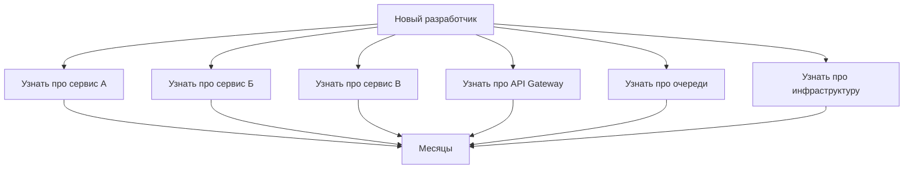

Онбординг в микросервисной системе может занимать месяцы. Нужны хорошая документация, схемы, тестовые окружения. И все равно это сложнее, чем в монолите.

## Резюме

Микросервисы решают проблемы монолитов, но создают новые, часто не менее серьезные.

Главные проблемы микросервисов:

1. **Распределенная сложность** — сетевые задержки, частичные отказы, отсутствие глобального состояния
2. **Сетевые проблемы** — потеря пакетов, задержки, разрывы соединений
3. **Распределенные транзакции** — сложность обеспечения консистентности, нужны Saga или eventual consistency
4. **Сложность отладки** — логи разбросаны, нужны correlation ID, трассировка, централизованное логирование
5. **Сложность инфраструктуры** — оркестрация, сервис-дискавери, API Gateway, конфигурация, секреты
6. **Версионирование API** — поддержка старых версий, обратная совместимость, депрекация
7. **Латентность** — каждый сетевой вызов добавляет задержку
8. **Безопасность** — аутентификация между сервисами, mTLS, управление секретами
9. **Зрелость команды** — нужна DevOps-культура, автоматизация, наблюдаемость
10. **Сложность онбординга** — новые разработчики входят в проект месяцами

Важно: эти проблемы не означают, что микросервисы — плохой выбор. Они означают, что микросервисы — это инструмент для решения конкретных проблем (масштабируемость, независимость команд, скорость развертывания). И за его использование нужно платить — решать все перечисленные проблемы.

Если ваш проект маленький, команда небольшая, нагрузки нет — плата за микросервисы будет выше, чем выгода. Вы получите все проблемы распределенной системы, не получив преимуществ. Это путь к распределенному монолиту — худшему из миров.

Если же проект большой, команда большая, монолит уже начал трещать по швам — микросервисы могут быть единственным способом сохранить темп разработки. Но будьте готовы инвестировать в инфраструктуру, автоматизацию, наблюдаемость и культуру. Без этого микросервисы принесут больше боли, чем пользы.