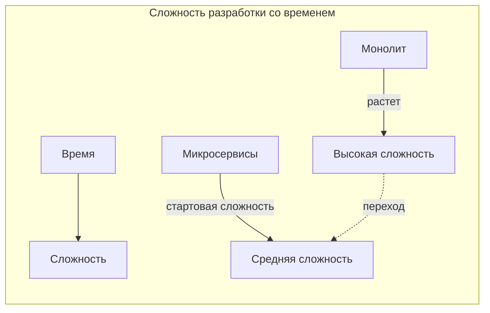
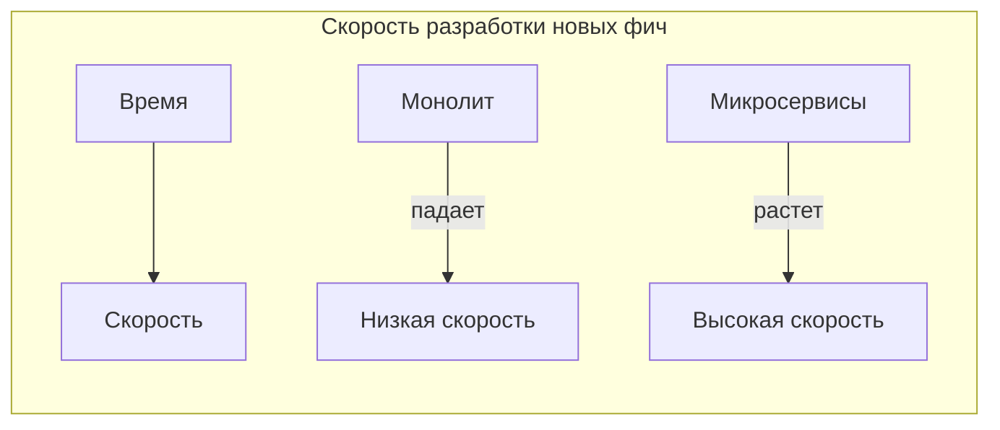
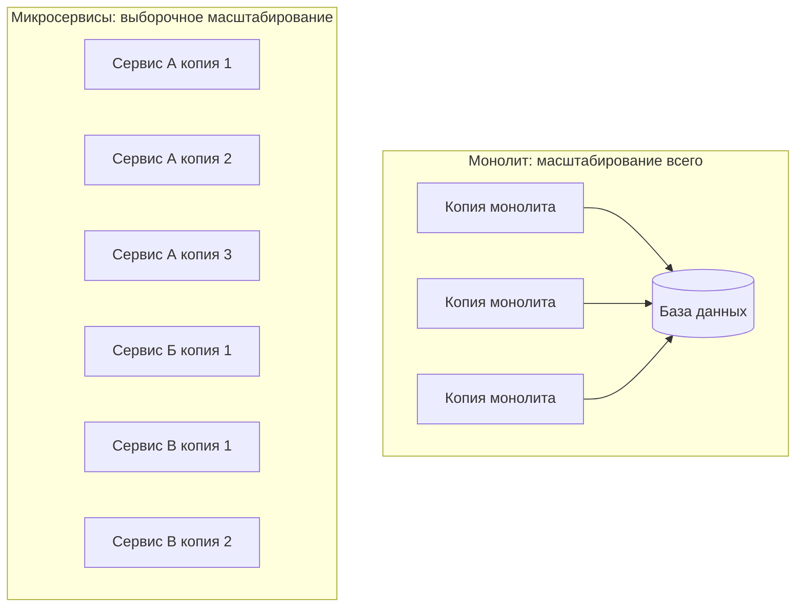
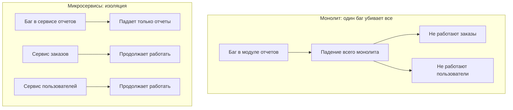
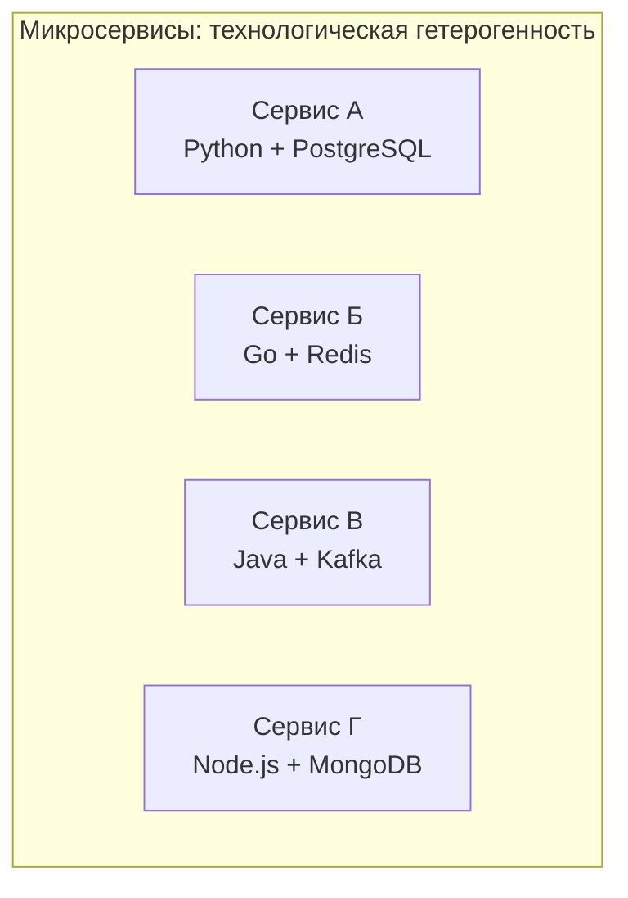
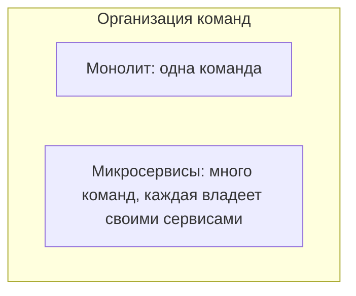
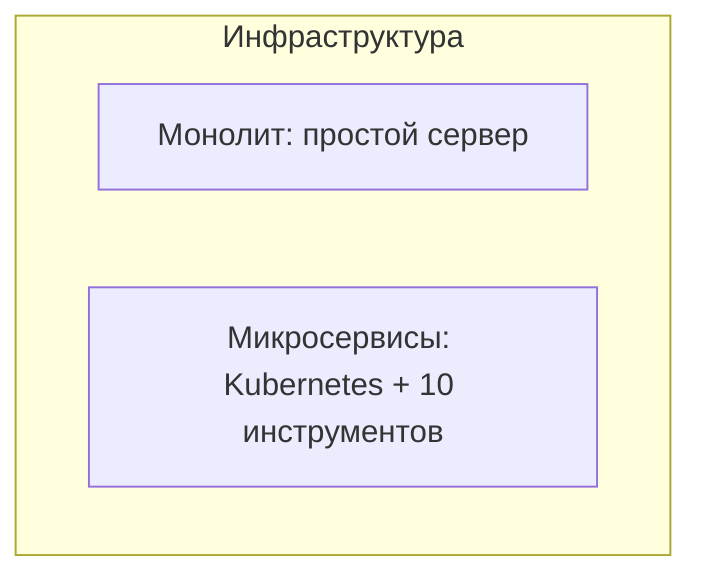

## Введение: Дом или поселок

Сравнение монолита и микросервисов — это не битва "хорошего" и "плохого". Это выбор между двумя разными подходами к организации системы, у каждого из которых есть свои сильные и слабые стороны. Как в аналогии с домом и поселком: в большом доме все рядом, но тесно и шумно. В поселке просторно и тихо, но чтобы попасть к соседу, нужно идти по улице, и если дорога разбита — вы не пройдете.

Важно понимать: нет универсального ответа "монолит лучше" или "микросервисы лучше". Есть ответ "что лучше для вашего конкретного проекта, вашей команды, вашего бизнеса". И этот ответ может меняться со временем. То, что правильно для стартапа с тремя разработчиками, неправильно для Google. И то, что правильно для Google, убьет стартап.

Это сравнение поможет вам понять компромиссы и принять осознанное решение. Не потому что "микросервисы модные", а потому что вы понимаете, какую проблему решаете и какую цену платите.

## Сравнение по ключевым измерениям

### Сложность разработки

**Монолит:** Прост в начале. Вы пишете код в одном репозитории, вызываете функции напрямую, используете отладчик. Не нужно думать о сети, сериализации, версионировании API. Но по мере роста сложность внутренних связей растет. Код становится запутанным, изменения в одном месте ломают другие.

**Микросервисы:** Сложны в начале. Нужно проектировать API, настраивать сеть, обрабатывать таймауты и ретраи. Нужна инфраструктура: оркестрация, сервис-дискавери, логирование. Но после того как инфраструктура настроена, каждый отдельный сервис остается простым. Сложность перемещается из кода в инфраструктуру.

**Вердикт:** Для коротких проектов и маленьких команд монолит проще. Для долгоживущих систем с большой командой микросервисы могут быть проще в поддержке, несмотря на стартовую сложность.

### Скорость разработки новых фич

**Монолит:** В начале — очень быстро. Нет накладных расходов на координацию. Но со временем скорость падает. Любое изменение требует сборки и тестирования всего приложения. Конфликты при слиянии кода замедляют работу.

**Микросервисы:** В начале — медленно, потому что нужно настроить инфраструктуру и договориться об API. Но после этого разные команды могут работать параллельно над разными сервисами. Изменения в одном сервисе не требуют пересборки других.

**Вердикт:** Монолит выигрывает на старте. Микросервисы выигрывают в масштабе, когда команда большая и система сложная.

### Масштабирование

**Монолит:** Масштабируется только целиком. Если один модуль требует больше ресурсов, вы масштабируете все приложение. Это неэффективно. Горизонтальное масштабирование упирается в базу данных — общую для всех копий.

**Микросервисы:** Каждый сервис масштабируется независимо. Только те сервисы, которые действительно нагружены. Можно использовать разные стратегии масштабирования для разных сервисов: один сервис — много копий, другой — большой сервер, третий — serverless.

**Вердикт:** Микросервисы дают более эффективное и гибкое масштабирование. Монолит проще, но дороже в больших масштабах.

### Развертывание и релизы

**Монолит:** Развертывание единое. Любое изменение, даже исправление одной строчки, требует пересборки и перезапуска всего приложения. Это означает простой (или сложный zero-downtime деплой). Релизы редкие, потому что каждое развертывание — событие.

**Микросервисы:** Каждый сервис развертывается независимо. Можно выпускать изменения по одному сервису несколько раз в день. Риск меньше: если что-то пошло не так, падает только один сервис, а не все приложение.

**Вердикт:** Микросервисы позволяют выпускать изменения быстрее и с меньшим риском. Это критично для бизнеса, которому нужна быстрая реакция на рынок.

### Надежность и отказоустойчивость

**Монолит:** Либо все работает, либо все падает. Ошибка в любом модуле (даже не самом важном) может уронить все приложение. Нет изоляции отказов.

**Микросервисы:** Отказ одного сервиса не убивает всю систему. Если сервис платежей упал, пользователи все еще могут смотреть товары и добавлять их в корзину. Если правильно спроектировано, система деградирует gracefully (часть функций недоступна, но остальные работают).

**Вердикт:** Микросервисы потенциально надежнее за счет изоляции. Но это требует правильного проектирования — иначе распределенный монолит будет даже менее надежен.

### Консистентность данных

**Монолит:** ACID-транзакции работают "из коробки". Вы можете обновить несколько таблиц атомарно. Данные всегда консистентны.

**Микросервисы:** ACID-транзакции невозможны между сервисами. Нужны Saga, eventual consistency, компенсирующие операции. Это сложно. Для некоторых систем (финансы, бронирование) это может быть неприемлемо.

**Вердикт:** Монолит выигрывает, если нужна строгая консистентность. Микросервисы требуют принятия eventual consistency, что подходит не для всех доменов.

### Производительность и задержки

**Монолит:** Внутренние вызовы — это вызовы функций (наносекунды). Нет накладных расходов на сеть. Запросы обрабатываются быстро.

**Микросервисы:** Каждый вызов между сервисами идет по сети (миллисекунды или десятки миллисекунд). Длинные цепочки вызовов накапливают задержку. Сериализация/десериализация данных добавляет overhead.

**Вердикт:** Монолит быстрее. Если вам нужны микросекундные задержки, микросервисы не подходят.

### Технологическая гибкость

**Монолит:** Ограничен одним стеком технологий. Если вы начали на Java, вы на Java и остаетесь. Сменить базу данных — сложно, потому что вся система завязана на одной БД.

**Микросервисы:** Каждый сервис может использовать свой язык, свой фреймворк, свою базу данных. Можно выбрать лучший инструмент для каждой задачи. Можно пробовать новые технологии на одном сервисе, не переписывая все.

**Вердикт:** Микросервисы дают свободу выбора. Монолит ограничивает, но упрощает.

### Размер команды и организация

**Монолит:** Хорошо работает с командами до 10-15 человек. Больше — начинаются конфликты при слиянии, сложность координации. Требует синхронизации релизов.

**Микросервисы:** Позволяют масштабировать команду. Разные команды могут владеть разными сервисами, работать независимо, развертываться по своему графику. Естественно подходит для модели "вы строите — вы это поддерживаете".

**Вердикт:** Для больших организаций (50+ разработчиков) микросервисы практически необходимы. Для маленьких команд монолит проще.

### Инфраструктура и эксплуатация

**Монолит:** Прост в эксплуатации. Один сервер (или несколько копий). Одна база данных. Логи на одном месте. Мониторинг простой.

**Микросервисы:** Требуют сложной инфраструктуры. Оркестрация (Kubernetes), сервис-дискавери, API Gateway, централизованное логирование, распределенное трассирование, мониторинг десятков сервисов. Требуют DevOps-культуры.

**Вердикт:** Монолит намного проще в эксплуатации. Микросервисы требуют серьезных инвестиций в инфраструктуру и команду.

## Сравнительная таблица

| Аспект | Монолит | Микросервисы |
| :--- | :--- | :--- |
| Сложность разработки (начало) | Низкая | Высокая |
| Сложность разработки (масштаб) | Высокая (связи) | Средняя (инфраструктура) |
| Скорость разработки (начало) | Высокая | Низкая |
| Скорость разработки (масштаб) | Низкая | Высокая |
| Масштабирование | Целиком, неэффективно | Выборочно, эффективно |
| Развертывание | Единое, редкое | Независимое, частое |
| Надежность | Все или ничего | Изоляция отказов |
| Консистентность данных | ACID, строгая | Eventual, сложно |
| Производительность | Высокая (вызовы функций) | Низкая (сетевые вызовы) |
| Технологическая гибкость | Низкая | Высокая |
| Размер команды | До 10-15 человек | Любой (с ростом сложности) |
| Инфраструктура | Простая | Сложная |
| Онбординг новых разработчиков | Недели | Месяцы |
| Стоимость инфраструктуры (масштаб) | Растет неэффективно | Растет линейно |

## Когда монолит лучше микросервисов

Монолит — правильный выбор, когда:

- **Команда маленькая** (до 10 человек). Микросервисы добавят сложности без выгоды.
- **Проект на старте.** Вы еще не знаете, какие части будут нагружены. Монолит позволяет быстро менять архитектуру.
- **Нагрузка невысокая** (< 1000 запросов/сек). Монолит справится отлично.
- **Нужна строгая консистентность.** ACID-транзакции критичны (финансы, бронирование).
- **Нет DevOps-культуры.** Если вы не готовы к автоматизации и "you build it, you run it", микросервисы приведут к хаосу.
- **Ограниченный бюджет.** Микросервисы требуют больше серверов и инструментов.
- **Простая предметная область.** Если система не имеет естественных границ, микросервисы будут искусственными.

## Когда микросервисы лучше монолита

Микросервисы — правильный выбор, когда:

- **Команда большая** (20+ разработчиков). Монолит станет узким местом из-за конфликтов и долгой сборки.
- **Система сложная** с четкими бизнес-границами. Разные домены могут быть разными сервисами.
- **Разные части имеют разные требования к масштабированию.** Один сервис требует много CPU, другой — много памяти, третий — много диска.
- **Нужно часто выпускать изменения.** Бизнесу важна скорость реакции. Микросервисы позволяют релизы каждый час.
- **Разные команды работают над разными частями.** Микросервисы дают независимость.
- **Вы готовы инвестировать в инфраструктуру.** У вас есть DevOps-инженеры, вы используете Kubernetes, у вас есть CI/CD, мониторинг, трассировка.
- **Вы готовы к eventual consistency.** Бизнес может жить с тем, что данные согласованы не мгновенно.

## Стратегия: Начинать с монолита, эволюционировать к микросервисам

Самый безопасный путь — начать с монолита, но спроектировать его как модульный монолит с четкими границами между модулями. Это дает лучшее из двух миров: простоту монолита и потенциальную возможность вынести модули в отдельные сервисы, когда это понадобится.

Почему это разумно:

- Вы не усложняете архитектуру преждевременно
- Вы можете быстро двигаться на старте
- Вы накапливаете понимание домена и границ
- Когда монолит начнет мешать, у вас уже будет модульная структура, готовую к выделению
- Вы избегаете распределенного монолита

## Реальные примеры

**Компания А (стартап, 5 разработчиков):** Начали с монолита на Ruby on Rails. Через год выросли до 15 разработчиков. Монолит стал медленно собираться. Выделили сервис платежей и сервис уведомлений в отдельные микросервисы. Остальное осталось в монолите. Сейчас гибридная архитектура работает отлично.

**Компания Б (корпоративный портал, 10 разработчиков):** Решили сразу делать микросервисы "чтобы было современно". Потратили 6 месяцев на настройку Kubernetes, API Gateway, сервис-дискавери. К тому моменту бизнес-требования изменились, и половина "сервисов" оказалась не нужна. Команда выгорела. Проект закрыли.

**Компания В (интернет-магазин, 100 разработчиков):** Монолит на Java рос 5 лет. Сборка занимала 40 минут, релизы раз в неделю с риском. Команда устала. Постепенно начали вырезать сервисы: сначала поиск (Elasticsearch), потом корзину (Redis), потом рекомендации (отдельный сервис на Python). Через год получили работающую микросервисную архитектуру. Релизы — каждый день, время сборки каждого сервиса — 5 минут.

## Резюме

Монолит и микросервисы — это не "хорошо" и "плохо". Это инструменты для разных ситуаций.

**Монолит лучше, когда:**
- Команда маленькая
- Проект на старте
- Нагрузка невысокая
- Нужна строгая консистентность
- Бюджет ограничен
- Нет DevOps-культуры

**Микросервисы лучше, когда:**
- Команда большая
- Система сложная с четкими границами
- Разные части масштабируются по-разному
- Нужно часто выпускать изменения
- Есть инвестиции в инфраструктуру
- Бизнес готов к eventual consistency

Самый безопасный путь: **начинайте с модульного монолита**. Проектируйте четкие границы между модулями, даже если они пока внутри одного процесса. Когда (и если) монолит начнет мешать, вы сможете вынести модули в отдельные сервисы. Это дешевле, чем сразу строить микросервисы, и менее рискованно, чем оставаться в монолите, который уже трещит по швам.

Помните: переход от монолита к микросервисам — это не бинарный выбор. Это спектр. Вы можете иметь гибридную архитектуру: ядро в монолите, а вокруг — несколько микросервисов для критичных функций. И это часто лучшее решение для многих компаний.