## Введение: От одного дома к поселку

Вернемся к аналогии с домом. Монолит — это один большой особняк, где все сотрудники находятся под одной крышей. Микросервисы — это поселок из маленьких домиков. В каждом домике живет одна семья (один сервис), у каждого домика свой вход, своя кухня, свой санузел. Между домиками проложены дороги (сети), и чтобы что-то передать соседу, нужно выйти на улицу и дойти до него.

**Микросервисная архитектура** — это подход, при котором приложение строится как набор небольших независимых сервисов. Каждый сервис работает в своем собственном процессе, общается с другими по сети (обычно через HTTP или асинхронные сообщения), развертывается и масштабируется независимо.

Это звучит сложно. И это действительно сложнее, чем монолит. Но эта сложность окупается, когда система вырастает до определенного размера. Микросервисы позволяют разным командам работать независимо, масштабировать только те части, которые действительно нагружены, и использовать разные технологии для разных задач.

Важно понимать: микросервисы — это не "серебряная пуля". Они не делают систему автоматически хорошей. Они дают возможности, но требуют дисциплины, инфраструктуры и опыта. Для маленького проекта микросервисы будут только мешать. Для большого — могут быть единственным способом сохранить темп разработки.

## Что такое "сервис" в контексте микросервисов

Прежде чем говорить о микросервисной архитектуре, нужно понять, что такое "сервис" как архитектурная единица.

Сервис — это самостоятельная программа, которая делает одну конкретную вещь и делает ее хорошо. У сервиса есть четкая граница: он предоставляет API (интерфейс) для взаимодействия, скрывая свою внутреннюю реализацию.

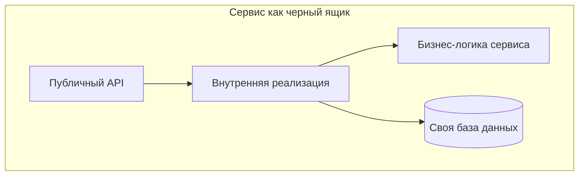

Примеры сервисов в интернет-магазине:

- **Сервис пользователей** — регистрация, авторизация, профили. Его API: "создать пользователя", "найти пользователя по id", "обновить профиль".
- **Сервис заказов** — создание заказов, статусы, история. Его API: "создать заказ", "получить статус заказа", "отменить заказ".
- **Сервис платежей** — обработка платежей, возвраты. Его API: "списать средства", "возврат", "проверить статус платежа".
- **Сервис уведомлений** — отправка email, SMS, push. Его API: "отправить уведомление".

Каждый из этих сервисов живет своей жизнью. У сервиса пользователей может быть своя база данных (например, PostgreSQL), у сервиса заказов — своя (MongoDB), у сервиса уведомлений — своя (Redis для очередей). Сервисы не залезают в базы данных друг друга. Если сервису заказов нужна информация о пользователе, он не читает таблицу пользователей напрямую. Он вызывает API сервиса пользователей: "дай мне данные пользователя с id=123".

## Ключевые характеристики микросервисов

### Независимое развертывание

Это, пожалуй, самое важное свойство микросервисов. Каждый сервис можно развернуть отдельно от всех остальных.

Что это означает на практике. Вы меняете код в сервисе платежей. Вы собираете только этот сервис, прогоняете только его тесты, развертываете только его. Сервис пользователей, сервис заказов, сервис уведомлений продолжают работать без изменений. Если что-то пошло не так, вы откатываете только сервис платежей, не трогая остальные.

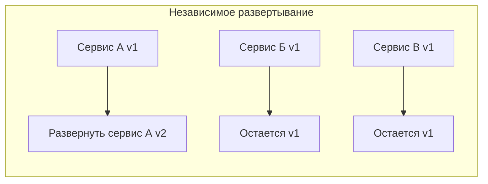

Для бизнеса это означает, что фичи можно выпускать быстрее и с меньшим риском. Если один сервис часто меняется, его можно обновлять хоть каждый час. Сервисы, которые меняются редко, можно обновлять раз в месяц. Нет необходимости синхронизировать релизы.

### Независимое масштабирование

В монолите вы масштабируете все приложение целиком. Даже если только один модуль создает нагрузку, вы добавляете целые копии монолита.

В микросервисах вы масштабируете только те сервисы, которые в этом нуждаются. Если сервис заказов обрабатывает 10 000 запросов в секунду, а сервис пользователей — только 100, вы запускаете 10 копий сервиса заказов и одну копию сервиса пользователей.

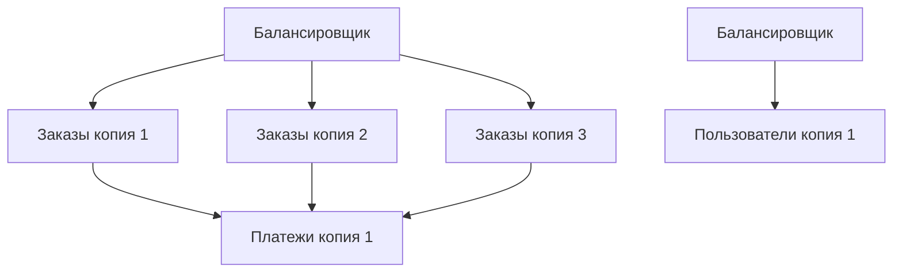

Это эффективнее с точки зрения затрат на инфраструктуру. Вы не платите за лишние ресурсы. И вы можете точно настроить количество ресурсов для каждого сервиса: сервису заказов нужно много CPU, сервису пользователей — много памяти, сервису отчетов — быстрые диски.

### Слабая связанность

Сервисы должны быть слабо связаны. Это означает, что изменение в одном сервисе не требует изменений в других.

Как это достигается. Сервисы общаются через четко определенные API. Если сервис А меняет свою внутреннюю реализацию, но сохраняет API, сервис Б ничего не замечает. Только когда API меняется, другие сервисы должны адаптироваться. Но даже тогда можно использовать версионирование API: старая версия продолжает работать для старых клиентов, новая — для новых.

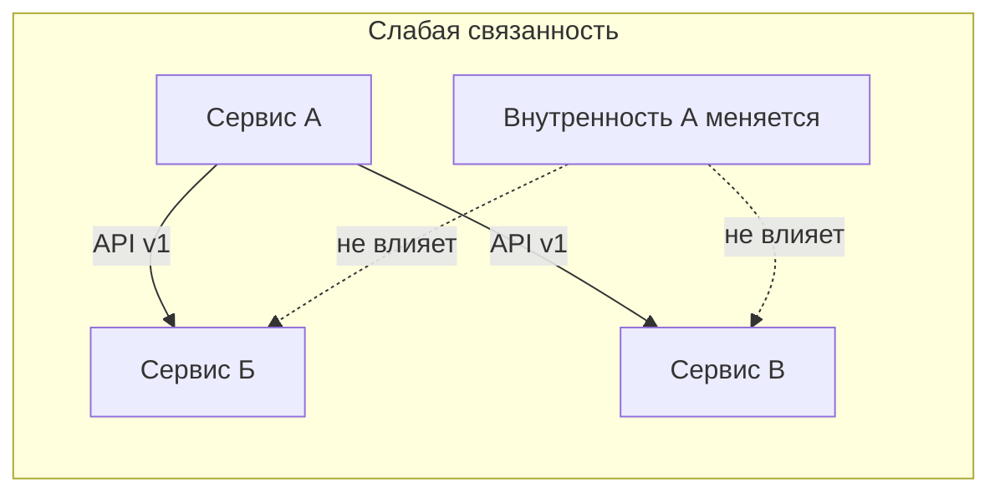

Слабая связанность — это цель, а не данность. Ее нужно проектировать. Если сервисы слишком сильно зависят друг от друга (синхронные вызовы в длинных цепочках, общие базы данных, общие модели данных), то это уже не микросервисы, а распределенный монолит.

### Технологическая гетерогенность

Микросервисы позволяют использовать разные технологии для разных задач. Один сервис можно написать на Python (если ему нужна быстрая разработка и богатые библиотеки), другой — на Go (если нужна высокая производительность), третий — на Java (если нужна надежность и большая экосистема).

То же самое с базами данных. Сервису пользователей подходит PostgreSQL с его надежностью и транзакциями. Сервису поиска — Elasticsearch с его полнотекстовым поиском. Сервису сессий — Redis с его скоростью. Сервису аналитики — ClickHouse с его колоночным хранением.

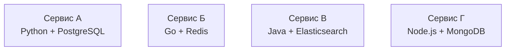

Это называется "полиглотность" (polyglot persistence для баз данных, polyglot programming для языков). В монолите вы привязаны к одному стеку. В микросервисах каждый сервис может выбрать лучший инструмент для своей задачи.

## Как сервисы общаются друг с другом

В микросервисной архитектуре общение между сервисами — это отдельная сложная тема. Есть два основных подхода: синхронный и асинхронный.

**Синхронное общение** — сервис А отправляет запрос сервису Б и ждет ответа. Чаще всего используется HTTP/REST (JSON over HTTP) или gRPC (бинарный протокол, быстрее). Пример: сервис заказов вызывает сервис пользователей, чтобы получить данные пользователя.

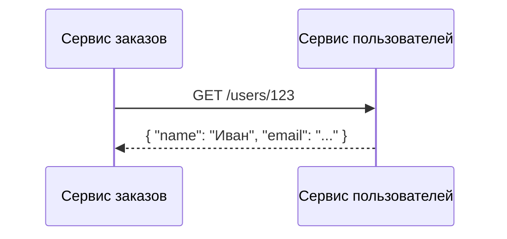

Плюсы синхронного общения: простота понимания, легко отлаживать, привычно для разработчиков. Минусы: задержки (сервис А ждет сервис Б), каскадные отказы (если Б упал, А тоже падает), блокирующие вызовы.

**Асинхронное общение** — сервис А отправляет сообщение в очередь или брокер событий и не ждет ответа. Сервис Б читает сообщение, когда будет готов. Чаще всего используются брокеры сообщений: RabbitMQ, Kafka, AWS SQS.

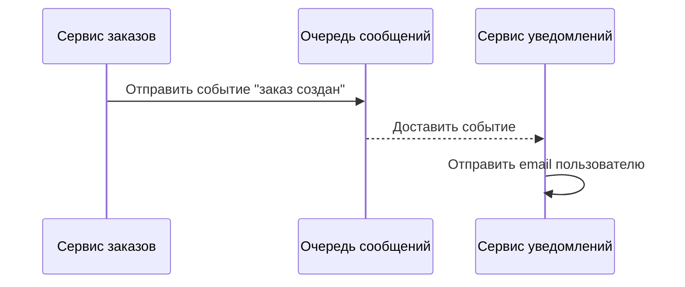

Плюсы асинхронного общения: слабая связанность, отказоустойчивость (очередь хранит сообщения, если сервис Б временно недоступен), лучшая масштабируемость. Минусы: сложность (нужно управлять очередями, обрабатывать дубликаты, обеспечивать идемпотентность), eventual consistency (данные могут быть не свежими).

В реальных системах используют оба подхода. Синхронный — для операций, где нужен мгновенный ответ. Асинхронный — для фоновых задач и для распространения событий.

## Что такое API Gateway

Когда у вас много микросервисов, клиенту (веб-приложению или мобильному приложению) становится сложно общаться с каждым сервисом напрямую. Клиенту нужно знать адреса всех сервисов, обрабатывать ошибки, собирать данные из разных сервисов.

API Gateway — это специальный сервис, который является "входной дверью" в систему. Все запросы от клиентов идут сначала на API Gateway, а он уже перенаправляет их к нужным микросервисам.

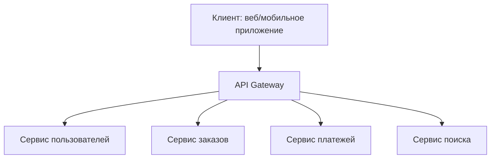

Что может делать API Gateway:

- **Маршрутизация** — направить запрос /users/* в сервис пользователей, /orders/* в сервис заказов
- **Аутентификация и авторизация** — проверить токен, определить, имеет ли пользователь доступ
- **Агрегация** — собрать данные из нескольких сервисов в один ответ (например, запросить данные пользователя и его последние заказы и объединить)
- **Лимитирование** — ограничить количество запросов от одного клиента
- **Логирование и мониторинг** — собирать метрики по всем запросам
- **Кэширование** — кэшировать ответы сервисов, чтобы снизить нагрузку

API Gateway — это общий паттерн для микросервисов. Он добавляет еще один компонент в систему, но сильно упрощает жизнь клиентам и централизует сквозную функциональность.

## Микросервисы и данные

Одно из самых важных правил микросервисной архитектуры: **каждый сервис владеет своими данными**. Никаких общих баз данных между сервисами.

Если сервису А нужны данные из сервиса Б, он не читает базу данных Б напрямую. Он вызывает API сервиса Б. Это правило — основа слабой связанности. Как только вы допускаете общую базу данных, вы теряете независимость: изменение схемы таблицы в Б может сломать А, даже если API Б не менялся.

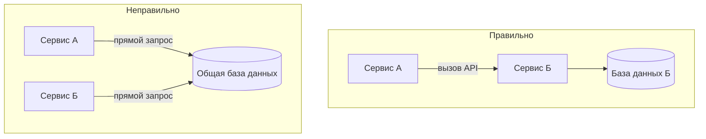

Что делать, если сервису А часто нужны данные из сервиса Б, и каждый раз вызывать API накладно? Есть несколько паттернов:

- **Кэширование** — сервис А кэширует данные, которые получает от Б, и обновляет кэш периодически или по событиям
- **Репликация событий** — сервис Б публикует события об изменениях, сервис А слушает их и обновляет свою локальную копию данных (CQRS/Event Sourcing)
- **API Composition** — сервис-посредник (например, API Gateway) собирает данные из А и Б

Но прямой доступ к чужой базе данных — это антипаттерн для микросервисов.

## Микросервисы и транзакции

В монолите с одной базой данных ACID-транзакции работают "из коробки". Вы обновляете несколько таблиц, и база данных гарантирует атомарность (все или ничего).

В микросервисах такого нет. Если операция затрагивает несколько сервисов, нужен специальный паттерн — Saga. Saga разбивает операцию на последовательность локальных транзакций. Каждая локальная транзакция обновляет данные в одном сервисе. Если что-то пошло не так, запускаются компенсирующие действия (отмена уже сделанного).

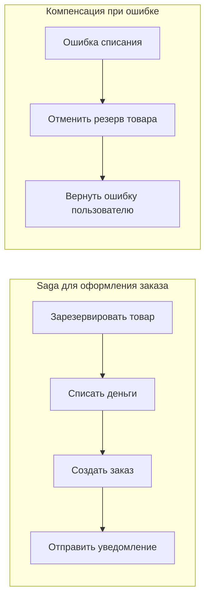

Saga сложнее, чем ACID-транзакция. Нужно проектировать компенсирующие действия, обрабатывать частичные отказы, обеспечивать идемпотентность (повторная отправка того же запроса не должна навредить). Это одна из главных сложностей микросервисной архитектуры.

## Микросервисы и команды

Микросервисная архитектура хорошо сочетается с организацией команд по принципу "вы строите это, вы это поддерживаете". Каждая команда владеет одним или несколькими сервисами и полностью отвечает за их разработку, развертывание, мониторинг, масштабирование.

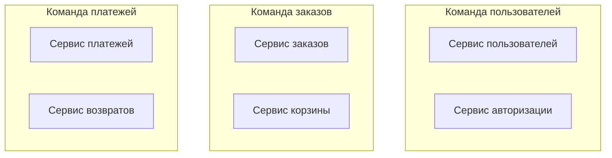

Это называется "Team Topologies" или "организация по продуктам". Команда может работать независимо: выбирать технологии, устанавливать свои процессы, развертывать по своему графику. Единственное, что нужно согласовывать — API между сервисами.

Для больших организаций (сотни разработчиков) микросервисы — это единственный способ избежать хаоса. В монолите с сотней разработчиков конфликты при слиянии кода, долгая сборка, сложность онбординга делают разработку почти невозможной.

## Микросервисы и DevOps

Микросервисы требуют зрелого DevOps. Если у вас нет автоматизированного CI/CD, нет контейнеризации (Docker), нет оркестрации (Kubernetes), нет мониторинга и логирования — микросервисы будут адом.

Вот минимальный набор инфраструктуры для микросервисов:

- **Контейнеризация** (Docker) — чтобы упаковывать каждый сервис с его зависимостями
- **Оркестрация** (Kubernetes, Docker Swarm, Nomad) — чтобы управлять запуском, масштабированием, сетью для контейнеров
- **CI/CD** (GitLab CI, Jenkins, GitHub Actions) — чтобы автоматически собирать, тестировать и развертывать сервисы
- **Сервис-дискавери** (Consul, etcd, Kubernetes DNS) — чтобы сервисы могли находить друг друга
- **API Gateway** (Kong, Traefik, NGINX) — как единая точка входа
- **Мониторинг** (Prometheus, Grafana) — чтобы знать, что происходит
- **Логирование** (ELK stack, Loki) — чтобы искать ошибки
- **Распределенное трассирование** (Jaeger, Zipkin) — чтобы отслеживать запрос, проходящий через несколько сервисов

Без этого всего микросервисы будут нестабильными, а отладка — кошмаром.

## Простой пример: интернет-магазин на микросервисах

Вот как может выглядеть интернет-магазин, построенный на микросервисах.

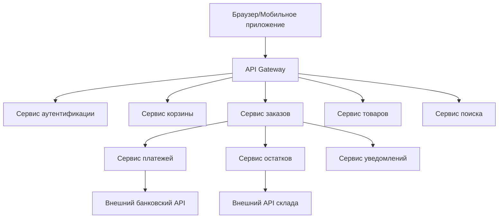

Что происходит, когда пользователь оформляет заказ:

1. Клиент отправляет запрос на API Gateway: POST /orders
2. API Gateway проверяет аутентификацию (вызов сервиса аутентификации)
3. API Gateway перенаправляет запрос в сервис заказов
4. Сервис заказов вызывает сервис корзины, чтобы получить состав корзины
5. Сервис заказов вызывает сервис остатков, чтобы зарезервировать товары
6. Сервис заказов вызывает сервис платежей, чтобы списать деньги
7. Сервис заказов создает заказ в своей базе данных
8. Сервис заказов отправляет асинхронное событие "заказ создан"
9. Сервис уведомлений получает событие и отправляет email пользователю

Ни один сервис не знает внутренностей других. Каждый отвечает за свою часть. Если сервис платежей временно недоступен, сервис заказов может вернуть ошибку "платежи временно не работают" — или отложить заказ и повторить попытку позже.

## Когда микросервисы — это избыточно

Микросервисы — мощный инструмент, но он требует затрат. Вот признаки того, что микросервисы — это оверинжиниринг для вашего проекта:

- Команда меньше 10 человек
- Нагрузка меньше 1000 запросов в секунду
- Данные помещаются на один сервер
- Нет необходимости в независимом масштабировании разных частей
- Все части системы меняются примерно с одинаковой частотой
- У команды нет опыта с контейнерами и оркестрацией

Если вы видите эти признаки, начинайте с монолита. Монолит можно разбить на микросервисы потом, когда это действительно понадобится. А начинать с микросервисов, когда они не нужны — это создавать себе проблемы на пустом месте.

## Резюме

Микросервисная архитектура — это подход, при котором приложение строится как набор небольших независимых сервисов.

Ключевые характеристики микросервисов:

- **Независимое развертывание** — каждый сервис можно обновить отдельно
- **Независимое масштабирование** — каждый сервис масштабируется под свою нагрузку
- **Слабая связанность** — изменение в одном сервисе не требует изменений в других
- **Технологическая гетерогенность** — разные сервисы могут использовать разные языки и базы данных
- **Децентрализация данных** — каждый сервис владеет своими данными

Основные компоненты экосистемы микросервисов:

- **API Gateway** — единая точка входа для клиентов
- **Сервис-дискавери** — как сервисы находят друг друга
- **Брокер сообщений** — для асинхронного общения
- **Контейнеризация и оркестрация** — для развертывания
- **Мониторинг, логирование, трассирование** — для observability

Микросервисы — это не "серебряная пуля". Они решают проблемы больших монолитов, но создают новые: сложность распределенных систем, необходимость в Saga-транзакциях, дополнительные сетевые задержки, сложность отладки, требования к инфраструктуре и DevOps-культуре.

Выбирать микросервисы стоит, когда монолит уже начал мешать, а команда и инфраструктура готовы к распределенной сложности. Для большинства проектов на начальном этапе монолит — правильный выбор. Но для больших систем с высокими требованиями к масштабируемости и независимости команд микросервисы могут быть единственным разумным решением.