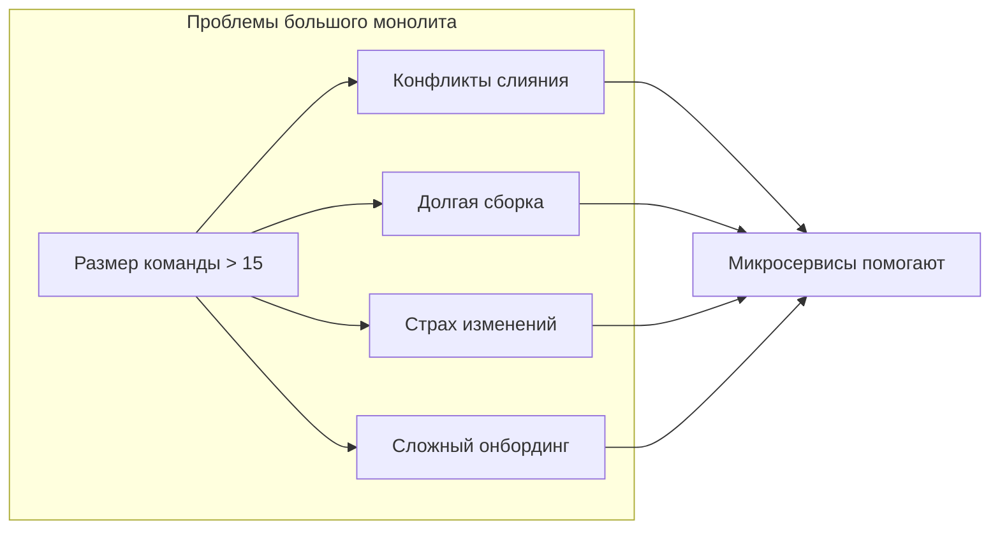
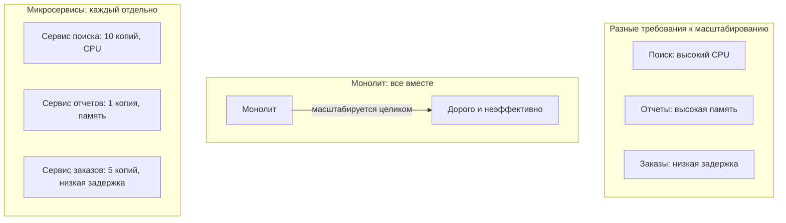
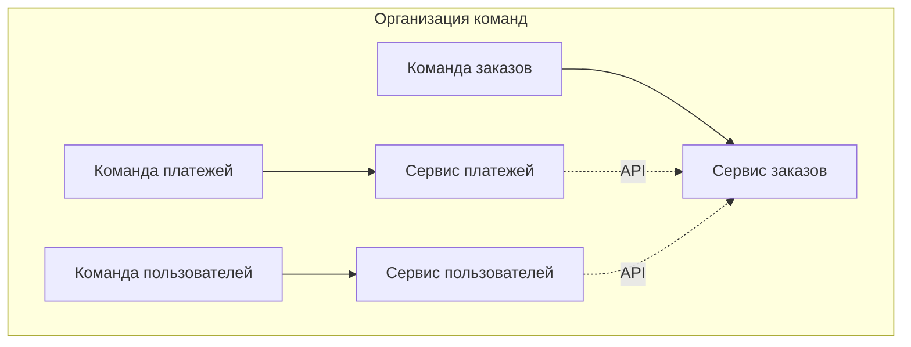
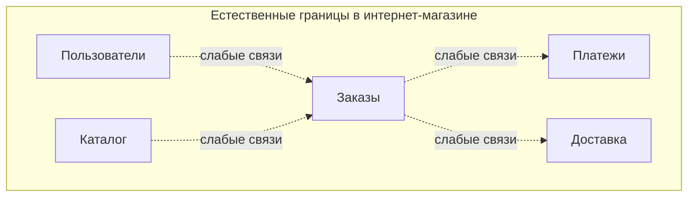
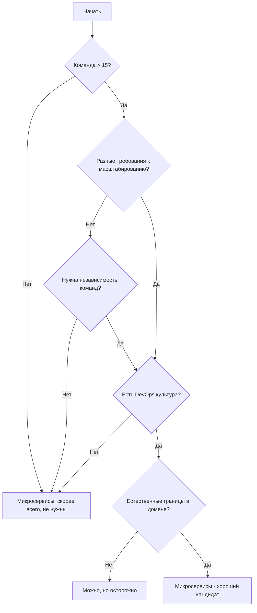

## Введение: Инструмент для масштаба, а не для старта

Микросервисы стали модными. Многие компании хотят их использовать, потому что "так делают в Google и Netflix". Но то, что работает для гигантов с миллиардами пользователей, может быть катастрофой для небольшого стартапа.

Выбор микросервисной архитектуры — это не техническое решение в вакууме. Это стратегическое решение, которое зависит от размера команды, сложности системы, требований к масштабированию, организационной структуры и даже культуры компании. Микросервисы решают реальные проблемы, но только если эти проблемы у вас действительно есть.

Прежде чем выбирать микросервисы, задайте себе вопрос: "Какие проблемы монолита я пытаюсь решить?" Если этих проблем нет, микросервисы только добавят сложности. Если проблемы есть и они достаточно серьезные, микросервисы могут быть правильным ответом.

## Когда микросервисы действительно нужны

### Команда выросла за пределы эффективной работы в монолите

Это самая частая причина перехода на микросервисы. Монолит удобен, когда над ним работают 5-10 человек. Когда команда вырастает до 20, 50, 100 человек, монолит начинает трещать по швам.

Что происходит в большом монолите с большой командой:

- **Конфликты при слиянии кода.** Два разработчика меняют разные фичи, но затрагивают одни и те же файлы. Каждый merge — это боль.
- **Долгая сборка.** Сборка всего монолита занимает 30-60 минут. Каждый коммит требует ожидания.
- **Страх перед изменениями.** Непонятно, что сломается при изменении. Даже опытные разработчики боятся трогать код.
- **Сложность онбординга.** Новый разработчик не может понять всю систему месяцами.

Микросервисы решают эти проблемы, разбивая систему на части, которыми могут владеть отдельные команды. Команда А работает над сервисом заказов, команда Б — над сервисом пользователей. Они не конфликтуют, потому что работают в разных репозиториях. Сборка каждого сервиса быстрая. Новый разработчик изучает только один сервис, а не всю систему.

**Признак того, что это ваша ситуация:** Ваша команда больше 15 человек, и вы замечаете, что время на координацию и разрешение конфликтов превышает время на написание кода. Релизы случаются все реже, а разработчики жалуются на долгую сборку.

### Разные части системы имеют разные требования к масштабированию

В любой системе есть "горячие" модули, которые создают основную нагрузку, и "холодные", которые используются редко. В монолите вы масштабируете все вместе. Это неэффективно.

Пример: интернет-магазин. Сервис поиска работает постоянно, создавая высокую нагрузку на CPU. Сервис отчетов используется раз в день для генерации отчетов, но при генерации потребляет много памяти. Сервис оформления заказов критичен к задержкам и должен быть всегда доступен.

В монолите вы не можете масштабировать эти части по-разному. Вы либо масштабируете весь монолит под самый нагруженный модуль (дорого), либо терпите проблемы с производительностью.

Микросервисы позволяют масштабировать каждый сервис под его требования. Сервис поиска — 10 копий на мощных CPU. Сервис отчетов — 1 копия с большим объемом памяти. Сервис заказов — 5 копий, оптимизированных на низкую задержку.

**Признак того, что это ваша ситуация:** Вы замечаете, что разные части вашей системы имеют сильно различающиеся паттерны нагрузки. Один модуль требует много CPU, другой — много памяти, третий — много дисковых операций. При этом вы вынуждены масштабировать все вместе, тратя лишние ресурсы.

### Разные команды должны работать независимо

В большой организации разные команды часто отвечают за разные бизнес-домены. Команда платежей, команда пользователей, команда заказов. В монолите эти команды вынуждены координироваться: согласовывать изменения, синхронизировать релизы, разрешать конфликты.

Микросервисы позволяют командам стать по-настоящему независимыми. Каждая команда владеет своими сервисами, выбирает свои технологии, устанавливает свой график релизов. Единственное, что нужно согласовывать — API между сервисами. И это согласование происходит один раз, а не при каждом изменении.

**Признак того, что это ваша ситуация:** У вас в организации уже есть команды, выровненные по бизнес-доменам. Они постоянно конфликтуют в одном репозитории, и координация релизов отнимает много времени. Разные команды хотели бы использовать разные технологии (одна хочет Python, другая — Go), но монолит этого не позволяет.

### Нужно часто и независимо развертывать разные части системы

В современном мире скорость выхода изменений — конкурентное преимущество. Компании, которые могут выпустить фичу за день, а не за месяц, выигрывают.

В монолите любое изменение требует полного развертывания. Если вы исправили опечатку в одном месте, вы все равно пересобираете и перезапускаете весь монолит. Это делает частые релизы дорогими и рискованными.

В микросервисах каждый сервис развертывается независимо. Команда, работающая над сервисом пользователей, может выпускать изменения каждый час, не спрашивая остальных. Сервис заказов может обновляться раз в неделю. Никто никого не блокирует.

**Признак того, что это ваша ситуация:** Бизнес требует быстрой реакции на рынок. Вы хотите выпускать фичи как можно быстрее. Но в текущем монолите релизы редкие и болезненные, потому что нужно собрать изменения от всех команд и провести долгое регрессионное тестирование.

### Естественные границы в бизнес-домене

Некоторые предметные области имеют четкие, слабо связанные границы. Например, в интернет-магазине: управление пользователями, каталог товаров, обработка заказов, доставка, платежи. Эти домены общаются через четкие интерфейсы, но внутри себя сложны.

Если такие естественные границы есть, микросервисы могут пройти по ним, разделяя систему на слабо связанные части. Если же границы искусственные (вы режете монолит просто потому что "хочется микросервисы"), то получится распределенный монолит.

**Признак того, что это ваша ситуация:** Вы можете нарисовать схему системы, где между блоками мало стрелок, а внутри блока — много. Разные блоки имеют разных владельцев в бизнесе (например, отдел продаж отвечает за заказы, а отдел логистики — за доставку). Изменения в одном блоке редко требуют изменений в других.

### Технологическая гетерогенность необходима

Иногда разные части системы лучше решаются разными технологиями. Один сервис требует низкой задержки и должен быть написан на Go или Rust. Другой сервис требует сложной аналитики на Python с его богатыми библиотеками. Третий сервис — простой CRUD, который можно написать на Node.js быстро.

В монолите вы выбираете один язык и один фреймворк на все. Это может быть неоптимально. В микросервисах каждый сервис может использовать свой стек.

**Признак того, что это ваша ситуация:** У вас есть четкое понимание, что разные части системы требуют разных технологических решений. Вы не можете эффективно решить все задачи одним языком или одной базой данных. При этом вы готовы к сложности поддержки нескольких стеков.

## Когда микросервисы НЕ нужны (даже если кажется, что нужны)

### Проект на начальном этапе

Если вы только начинаете, у вас нет пользователей, нет нагрузки, нет понимания домена. Микросервисы убьют вас сложностью. Вы будете тратить время на настройку Kubernetes, API Gateway, сервис-дискавери, вместо того чтобы писать код, который приносит ценность.

**Начинайте с монолита.** Даже если вы уверены, что через год он станет большим. К тому моменту у вас будет понимание, где проходят границы. А пока монолит даст вам скорость.

### Маленькая команда

Если у вас 3-5 разработчиков, микросервисы не нужны. Вы не получите преимуществ независимости команд (потому что команда одна), но получите все проблемы распределенной системы.

Один разработчик может поддерживать один сервис. Но когда сервисов 5, а разработчик один — он тратит время на переключение между контекстами, на поддержку инфраструктуры, на отладку взаимодействий. Это медленнее, чем один монолит.

### Нет DevOps-культуры

Микросервисы требуют зрелой DevOps-культуры. Если у вас есть отдельная команда эксплуатации, которая "не пускает" разработчиков в продакшен, если релизы требуют approval от комитета, если вы не практикуете инфраструктуру как код — микросервисы не взлетят.

Вы получите распределенный монолит: сервисы формально разделены, но из-за отсутствия автоматизации и культуры развертывать их независимо не получается. Все изменения все равно требуют координации. Это худшее из двух миров.

### Нет проблем, которые решают микросервисы

Самая частая ошибка: выбрать микросервисы, потому что "это круто" или "так делают большие компании". Но если у вас нет проблем с масштабированием, нет проблем с размером команды, нет проблем с частотой релизов — вы не получите выгоды. Только сложность.

Перед выбором микросервисов честно ответьте на вопрос: "Какую проблему мы решаем?" Если ответ "никакую" или "может быть, потом пригодится" — не делайте этого.

### Требуется строгая консистентность

Если ваш домен требует ACID-транзакций (финансы, бронирование, инвентаризация с точным учетом), микросервисы будут очень болезненны. Обеспечить строгую консистентность между сервисами сложно и дорого.

В таких случаях лучше остаться в монолите или использовать гибридный подход: ядро с критичными транзакциями в монолите, а вокруг — микросервисы для менее критичных функций.

## Процесс принятия решения

Вот набор вопросов, которые помогут принять решение. Чем больше ответов "да", тем больше микросервисы могут быть оправданы.

**Вопросы о команде и организации:**

- У нас больше 15 разработчиков?
- Разработчики организованы в команды по бизнес-доменам?
- Команды хотят иметь независимые графики релизов?
- У нас есть DevOps-культура (you build it, you run it)?
- Мы готовы инвестировать в инфраструктуру (Kubernetes, CI/CD, мониторинг)?

**Вопросы о системе и нагрузке:**

- Разные части системы имеют разные требования к масштабированию?
- Разные части системы имеют разные паттерны нагрузки (CPU/память/диск)?
- Естественные границы в домене совпадают с потенциальными границами сервисов?
- Нам нужно выпускать изменения часто (несколько раз в день)?
- Монолит уже начал "трещать" (долгая сборка, конфликты, страх изменений)?

**Вопросы о технологиях:**

- Разные части системы лучше решаются разными технологиями?
- Мы хотим иметь возможность пробовать новые технологии на части системы?
- У нас есть экспертиза в контейнеризации и оркестрации?

**Вопросы о консистентности (чем больше "нет", тем лучше для микросервисов):**

- Нам нужны ACID-транзакции между разными частями системы?
- Мы не можем жить с eventual consistency?
- У нас сложные JOIN между данными из разных доменов?

## Примеры из практики

### Пример 1: Мессенджер для крупной компании

**Ситуация:** Компания из 2000 сотрудников хочет внутренний мессенджер. Команда — 5 разработчиков. Нагрузка — небольшая.

**Решение:** Монолит. Микросервисы не нужны. Простой монолит на Python/Django с PostgreSQL справится отлично. Сложность микросервисов не оправдана.

### Пример 2: Платформа для онлайн-курсов

**Ситуация:** Стартап с 10 разработчиками. Система растет. Сейчас монолит, но сборка уже занимает 15 минут. Разработчики жалуются. Нагрузка пока невысокая, но ожидается рост.

**Решение:** Сначала улучшить модульность монолита. Выделить четкие модули, но оставить в одном процессе. Когда станет совсем плохо (команда вырастет до 20, сборка до 30 минут) — начать выносить модули в микросервисы. Сейчас рано.

### Пример 3: Интернет-магазин с 1 млн пользователей

**Ситуация:** 50 разработчиков. Монолит на Java. Сборка — 40 минут. Релизы — раз в неделю с риском. Разные части: поиск (высокий CPU), заказы (критичны к задержке), отчеты (редко, но ресурсоемко). Команды уже выровнены по доменам.

**Решение:** Микросервисы оправданы. Начать с выноса самых проблемных модулей: сначала поиск (отдельный сервис на Elasticsearch), потом отчеты (отдельный сервис), потом, возможно, платежи. Оставить ядро (пользователи, заказы) в монолите до следующей итерации.

### Пример 4: Платежная система

**Ситуация:** Система для обработки платежей. Строгие требования к консистентности. Команда — 20 разработчиков. Нагрузка высокая.

**Решение:** Гибрид. Критическое ядро (списание/зачисление средств) остается в монолите с ACID-транзакциями. Вокруг — микросервисы для отчетности, уведомлений, фрод-мониторинга. Микросервисы не для всего, а только там, где консистентность не критична.

## Стратегия постепенного перехода

Если вы решили, что микросервисы вам нужны, не пытайтесь переписать все сразу. Это почти всегда провал. Используйте паттерн Strangler Fig.

1. Начните с улучшения модульности внутри монолита. Четкие границы, четкие API даже внутри одного процесса.
2. Выберите один модуль, который имеет смысл вынести (например, потому что он требует независимого масштабирования или его разрабатывает другая команда).
3. Вынесите его в отдельный сервис. Оставьте API неизменным — другие модули продолжают вызывать его как раньше, но теперь через сеть.
4. Повторяйте для других модулей, если нужно.
5. В конце у вас может не остаться монолита — или останется ядро, которое не имеет смысла выносить.

## Резюме

Микросервисы — это мощный инструмент, но он предназначен для решения конкретных проблем:

- **Большая команда** (15+ человек) — микросервисы позволяют командам работать независимо
- **Разные требования к масштабированию** — каждый сервис масштабируется под свою нагрузку
- **Частые независимые релизы** — микросервисы позволяют выпускать изменения быстро и с малым риском
- **Естественные бизнес-границы** — сервисы проходят по границам доменов
- **Технологическая гетерогенность** — разные задачи требуют разных инструментов

Микросервисы НЕ нужны, когда:

- **Проект на старте** — вы еще не знаете границы
- **Маленькая команда** — сложность не оправдана
- **Нет DevOps-культуры** — без автоматизации микросервисы превращаются в ад
- **Нет проблем, которые они решают** — не усложняйте просто так
- **Требуется строгая консистентность** — ACID-транзакции между сервисами очень сложны

Самый безопасный путь: **начинайте с модульного монолита**. Когда (и если) он начнет трещать по швам, у вас уже будет модульная структура, готовая к выделению сервисов. Вы получите лучшее из двух миров: простоту на старте и возможность эволюционировать к микросервисам, когда это действительно понадобится.

Помните: переход на микросервисы — это не спринт, а марафон. Многие компании успешно живут с монолитом годами. Другие перешли на микросервисы и выиграли. Третьи перешли и пожалели. Разница в том, были ли у них реальные проблемы, которые решают микросервисы, и были ли они готовы к сложности, которую микросервисы приносят.